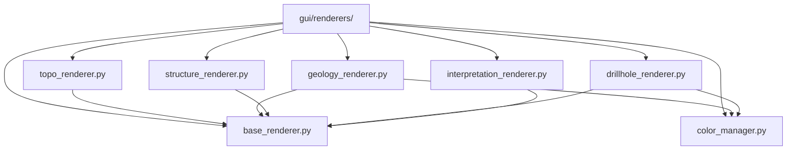

# `gui/renderers/` — Preview Renderers

> [!abstract] One-line summary
> They apply QGIS symbology to preview layers, with one strategy per data type.

**Path**: `gui/renderers/` (8 modules, ~301 lines)
**Layer**: GUI
**Tags**: #secinterp #layer #gui

---

## 🎯 Role of the layer

| Responsibility | Detail |
|----------------|--------|
| Style layers | `apply_style(layer, **kwargs)` on `QgsVectorLayer` |
| Unify color | `ColorManager` assigns a stable color per unit |
| Categorize | Symbols by geological unit or by interpretation |
| Label | `DrillholeRenderer` labels `hole_id` on traces |

> [!important] Layer rules
> GUI = Extract/Present only; no business logic; `QgsTask` for >100ms; never pass live QGIS objects to threads.

## 🧬 Layer / sublayer map

## 🧱 Module inventory

| Module | Role |
|--------|------|
| `__init__.py` | Renderer package |
| `base_renderer.py` → [[renderers]] | `BasePreviewRenderer` (ABC) + `build_categorized_line_style` |
| `color_manager.py` → [[renderers]] | `ColorManager`: stable color per unit name |
| `topo_renderer.py` → [[renderers]] | `TopoRenderer`: graduated elevation polychromy |
| `geology_renderer.py` → [[renderers]] | `GeologyRenderer`: lines categorized by unit |
| `structure_renderer.py` → [[renderers]] | `StructureRenderer`: simple red line for dips |
| `drillhole_renderer.py` → [[renderers]] | `DrillholeRenderer`: trace vs interval + labels |
| `interpretation_renderer.py` → [[renderers]] | `InterpretationRenderer`: fills by interpretation color |

## 🏛️ Design patterns present

| Pattern | Where | Purpose |
|---------|-------|---------|
| **Strategy** | `*Renderer` classes | One styling strategy per data type |
| **Template / ABC** | `BasePreviewRenderer` | Common `apply_style` contract |
| **Factory Method** | `build_categorized_line_style` | Build categorized renderers |
| **Flyweight / cache** | `ColorManager._active_units` | Reuse colors per unit |

## 🔗 Related notes

- [[Index]] — vault index
- [[layer_gui]] — parent layer
- [[renderers]] — package/architecture note
- [[preview_renderer]] — consumer of the styles

---

*Note of the SecInterp Code Walkthrough vault — v3.8.0*
