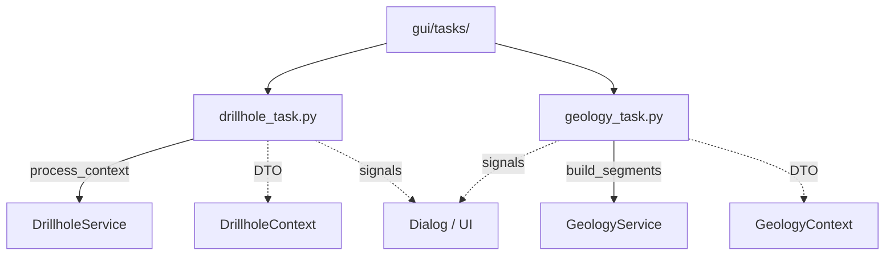

# `gui/tasks/` — Background Tasks

> [!abstract] One-line summary
> `QgsTask`s that run the core services with detached DTOs, emitting progress, result and error signals.

**Path**: `gui/tasks/` (3 modules, ~208 lines)
**Layer**: GUI
**Tags**: #secinterp #layer #gui

---

## 🎯 Role of the layer

| Responsibility | Detail |
|----------------|--------|
| Run in a thread | `run()` calls the service with the `*Context` |
| Stay thread-safe | DTOs only; never live QGIS objects |
| Report progress | `setProgress` re-emits `progress_changed` |
| Deliver result | `finished()` emits a deferred `finished_with_results` |

> [!important] Layer rules
> GUI = Extract/Present only; no business logic; `QgsTask` for >100ms; never pass live QGIS objects to threads.

## 🧬 Layer / sublayer map

## 🧱 Module inventory

| Module | Role |
|--------|------|
| `__init__.py` | Task package |
| `drillhole_task.py` | `DrillholeGenerationTask`: projects and intersects drillholes |
| `geology_task.py` | `GeologyGenerationTask`: builds geological segments |

## 🏛️ Design patterns present

| Pattern | Where | Purpose |
|---------|-------|---------|
| **Command / Task** | `QgsTask` subclasses | Encapsulate cancellable background work |
| **Observer (signals)** | `finished_with_results`, `error_occurred` | Communicate thread → UI |
| **Deferred emission** | `QTimer.singleShot(0, ...)` | Avoid races with rendering |
| **Feedback object** | `feedback=self` | `isCanceled`/`setProgress` to the service |

## 🔗 Related notes

- [[Index]] — vault index
- [[layer_gui]] — parent layer
- [[tasks]] — package/architecture note
- [[preview_service]] — orchestrates task creation

---

*Note of the SecInterp Code Walkthrough vault — v3.8.0*
