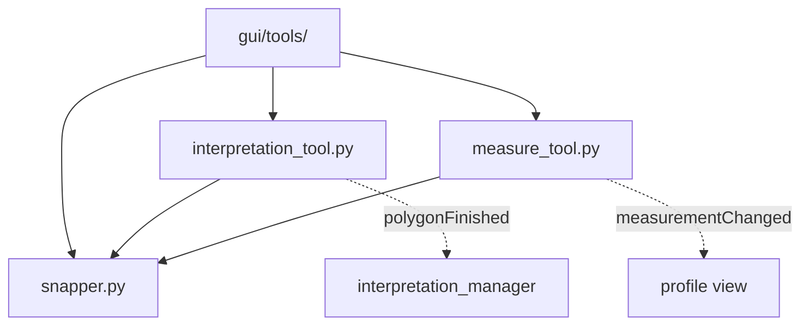

# `gui/tools/` — Interactive Map Tools

> [!abstract] One-line summary
> `QgsMapTool`s for the profile canvas to measure distances and draw interpretation polygons, with shared snapping.

**Path**: `gui/tools/` (4 modules, ~714 lines)
**Layer**: GUI
**Tags**: #secinterp #layer #gui

---

## 🎯 Role of the layer

| Responsibility | Detail |
|----------------|--------|
| Capture events | Clicks, movement and keyboard on the canvas |
| Draw feedback | `QgsRubberBand` + `QgsVertexMarker` |
| Measure | `calculate_polyline_metrics` (core) from extracted points |
| Emit results | Qt signals toward the tool manager |

> [!important] Layer rules
> GUI = Extract/Present only; no business logic; `QgsTask` for >100ms; never pass live QGIS objects to threads.

## 🧬 Layer / sublayer map

## 🧱 Module inventory

| Module | Role |
|--------|------|
| `__init__.py` | Map-tool package |
| `interpretation_tool.py` → [[interpretation_tool]] | `ProfileInterpretationTool`: draws interpretation polygons |
| `measure_tool.py` → [[measure_tool]] | `ProfileMeasureTool`: measures distance, elevation and slope |
| `snapper.py` | `ProfileSnapper`: shared vertex/edge snapping |

## 🏛️ Design patterns present

| Pattern | Where | Purpose |
|---------|-------|---------|
| **MapTool** | `QgsMapToolEmitPoint` subclasses | Integrate with the QGIS canvas |
| **Delegation** | `ProfileSnapper` | Reuse snapping across tools |
| **Observer (signals)** | `measurementChanged`, `polygonFinished` | Notify the manager/UI |
| **State machine** | `finalized` flag | Freeze the measurement once finished |

## 🔗 Related notes

- [[Index]] — vault index
- [[layer_gui]] — parent layer
- [[measure_tool]] — measurement tool
- [[interpretation_tool]] — interpretation tool
- [[tool_manager]] — activates/deactivates and connects signals

---

*Note of the SecInterp Code Walkthrough vault — v3.8.0*
