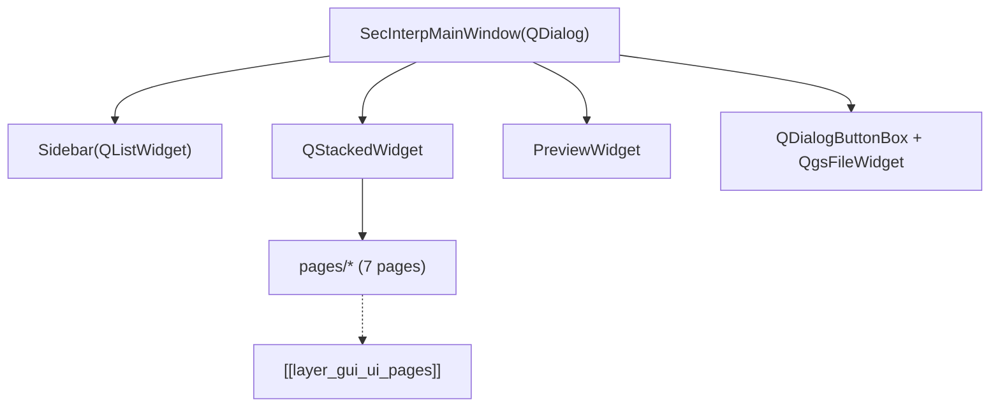

# `gui/ui/` — Programmatic UI

> [!abstract] One-line summary
> Assembles the SecInterp main window (`SecInterpMainWindow`) with sidebar, page stack and preview, all built in code (no `.ui` files).

**Path**: `gui/ui/` (3 modules, ~228 lines)
**Layer**: GUI
**Tags**: #secinterp #layer #gui

---

## 🎯 Layer role

| Aspect | Detail |
|--------|--------|
| Responsibility | Compose the window: `Sidebar` + `QStackedWidget` (7 pages) + `PreviewWidget` |
| Input | QGIS `iface` (optional) and `parent` |
| Output | Ready `QDialog` with `output_widget` (`QgsFileWidget`) and `button_box` |
| Does not | Business logic, file I/O or calls into `core/` |

> [!important] Layer rules
> GUI = Extract/Present only; programmatic UI (no `.ui`); no business logic.

---

## 🧬 Layer / sublayer map

> [!tip] How to read
> Solid arrow = composes/imports; dotted = delegated sublayer.

---

## 🧱 Module inventory

| Module | Role |
|--------|------|
| `__init__.py` (7) | UI package docstring |
| `main_window.py` → [[ui_pages]] (158) | `SecInterpMainWindow`: splitter, stack, preview and buttons |
| `sidebar.py` → [[ui_pages]] (63) | `Sidebar`: navigation with QGIS theme icons via `add_item()` |

---

## 🏛️ Design patterns present

| Pattern | Where | Purpose |
|---------|-------|---------|
| **Programmatic UI** | `main_window.py` | No `.ui`; full control and inline styles |
| **Composition root** | `SecInterpMainWindow.__init__` | Instantiates sidebar, stack, preview and pages |
| **Stacked navigation** | `Sidebar` + `QStackedWidget` | Wizard with one visible page at a time |
| **Observer** | `_connect_signals` | `currentRowChanged → setCurrentIndex` |

---

## 🔗 Related notes

- [[Index]]
- [[layer_gui]] — parent layer
- [[layer_gui_ui_pages]] — pages sublayer
- [[ui_pages]] — page catalog
- [[main_dialog]] — orchestrates this window

---

*Note of the SecInterp Code Walkthrough vault — v3.8.0*
