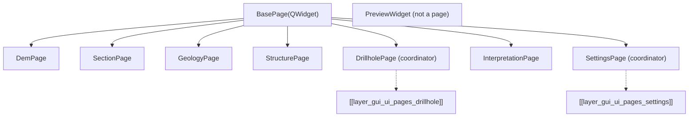

# `gui/ui/pages/` — Configuration Pages

> [!abstract] One-line summary
> `BasePage` contract + 8 form pages that expose `get_data()`/`validate()` and feed the dialog stack.

**Path**: `gui/ui/pages/` (10 modules, ~1483 lines)
**Layer**: GUI
**Tags**: #secinterp #layer #gui

---

## 🎯 Layer role

| Aspect | Detail |
|--------|--------|
| Responsibility | One `QWidget` per domain (DEM, section, geology, structure, drillholes, interpretation, settings) |
| Contract | `get_data()`, `validate()`, `dump()/load()/reset()`, `connect_signals()/disconnect_signals()` |
| Coordinators | `DrillholePage` and `SettingsPage` compose tabs and delegate |
| Exception | `PreviewWidget` does not inherit `BasePage`: it is the side viewer |

> [!important] Layer rules
> GUI = Extract/Present only; programmatic UI (no `.ui`); no business logic.

---

## 🧬 Layer / sublayer map

> [!tip] How to read
> Solid arrow = inheritance/composition; dotted = tab sublayer.

---

## 🧱 Module inventory

| Module | Role |
|--------|------|
| `__init__.py` (7) | Re-exports `SettingsPage` |
| `base_page.py` → [[ui_pages]] (105) | `BasePage` + `set_combo_layer()` helper |
| `dem_page.py` → [[ui_pages]] (222) | `DemPage` — DEM/raster and band |
| `section_page.py` → [[ui_pages]] (117) | `SectionPage` — section line and buffer |
| `geology_page.py` → [[ui_pages]] (120) | `GeologyPage` — contacts/outcrops |
| `structure_page.py` → [[ui_pages]] (166) | `StructurePage` — structural measurements |
| `drillhole_page.py` → [[drillhole_page]] (130) | `DrillholePage` — tab coordinator |
| `interpretation_page.py` → [[ui_pages]] (230) | `InterpretationPage` — interpretation attributes |
| `settings_page.py` → [[settings_page]] (124) | `SettingsPage` — settings coordinator |
| `preview_page.py` → [[ui_pages]] (262) | `PreviewWidget` — canvas, results and LOD |

---

## 🏛️ Design patterns present

| Pattern | Where | Purpose |
|---------|-------|---------|
| **Page Object** | each `*Page` | Encapsulates one domain's form |
| **Template Method** | `BasePage._setup_ui` | Common skeleton; subclasses complete it |
| **Composite / coordinator** | `DrillholePage`, `SettingsPage` | One page owns several tabs |
| **Observer** | `dataChanged` / `changed` | Re-emits changes to the dialog |
| **Persistence protocol** | `dump()/load()/reset()` | Serializable per-page state |

---

## 🔗 Related notes

- [[Index]]
- [[layer_gui]] — parent layer
- [[layer_gui_ui]] — container layer
- [[layer_gui_ui_pages_drillhole]] — drillhole tabs
- [[layer_gui_ui_pages_settings]] — settings tabs
- [[ui_pages]] — page catalog
- [[drillhole_page]] / [[settings_page]] — coordinators

---

*Note of the SecInterp Code Walkthrough vault — v3.8.0*
