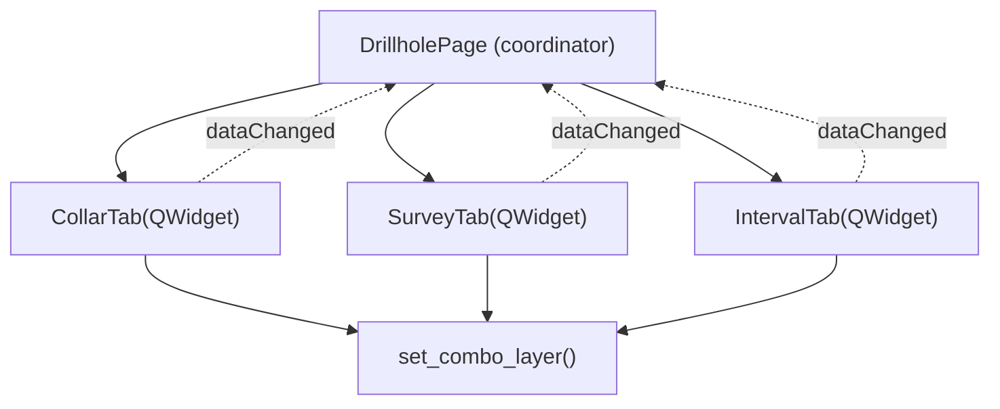

# `gui/ui/pages/drillhole/` — Drillhole Tabs

> [!abstract] One-line summary
> Package of tabs for the drillhole form (`CollarTab`, `SurveyTab`, `IntervalTab`), decomposed on **2026-09-20** from the former `drillhole_page.py`.

**Path**: `gui/ui/pages/drillhole/` (4 modules, ~477 lines)
**Layer**: GUI
**Tags**: #secinterp #layer #gui

---

## 🎯 Layer role

| Aspect | Detail |
|--------|--------|
| Responsibility | One `QWidget` per drillhole form: collar, survey and intervals |
| Input | Layers and fields selected by the user |
| Output | `get_data()` with `collar_*`, `survey_*`, `interval_*` keys |
| Persistence | `dump()/load()/reset()` with `dh_*` keys |
| Signal | `dataChanged` re-emitted to the `DrillholePage` coordinator |

> [!important] Layer rules
> GUI = Extract/Present only; programmatic UI (no `.ui`); no business logic.

---

## 🧬 Layer / sublayer map

> [!tip] How to read
> Solid arrow = composes/imports; dotted = signal re-emitted to the coordinator.

---

## 🧱 Module inventory

| Module | Role |
|--------|------|
| `__init__.py` (9) | Exports `CollarTab`, `IntervalTab`, `SurveyTab` |
| `collar_tab.py` (180) | `CollarTab` — collar layer, ID, X/Y/Z, total depth |
| `survey_tab.py` (144) | `SurveyTab` — survey layer, ID, depth, azimuth, inclination |
| `interval_tab.py` (144) | `IntervalTab` — interval layer, ID, from/to depth, lithology |

---

## 🏛️ Design patterns present

| Pattern | Where | Purpose |
|---------|-------|---------|
| **Widget decomposition / Composite** | `DrillholePage` | One coordinator + 3 tabs |
| **Observer** | `dataChanged` | Each tab re-emits changes to the page |
| **Protocol (dump/load/reset)** | tabs + page | Persistence via dialog persistence |
| **Adapter (compat)** | `setFilters` try/except | Supports modern and legacy filter APIs |

> [!warning] Point of attention
> `_toggle_xy_fields(True)` is called on connect; the initial state disables X/Y when geometry is used.

---

## 🔗 Related notes

- [[Index]]
- [[layer_gui_ui_pages]] — parent layer
- [[drillhole_tabs]] — package note
- [[drillhole_page]] — `DrillholePage` coordinator

---

*Note of the SecInterp Code Walkthrough vault — v3.8.0*
