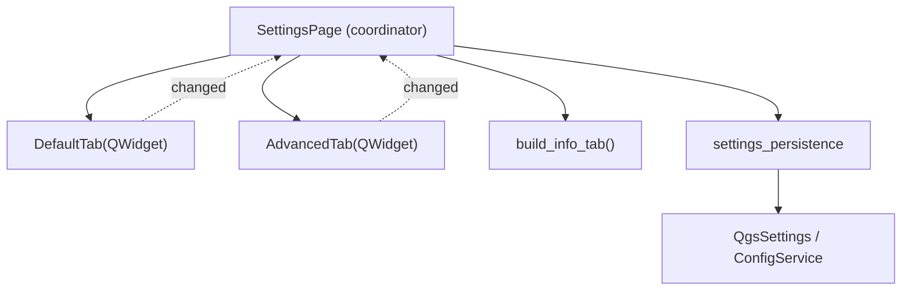

# `gui/ui/pages/settings/` — Settings Tabs

> [!abstract] One-line summary
> Package of settings tabs (`DefaultTab`, `AdvancedTab`, `info_tab`) plus isolated persistence, decomposed on **2026-09-20** from the former `settings_page.py`.

**Path**: `gui/ui/pages/settings/` (5 modules, ~416 lines)
**Layer**: GUI
**Tags**: #secinterp #layer #gui

---

## 🎯 Layer role

| Aspect | Detail |
|--------|--------|
| Responsibility | Export, 3D option and plugin information forms |
| Persistence | `settings_persistence` isolates `QgsSettings` and `ConfigService` |
| Input | User selection in checkboxes, format combo and naming |
| Output | `get_data()` with `exp_*`, `enable_3d`, `drill_3d_*` keys |
| Signal | `changed` re-emitted to the `SettingsPage` coordinator |

> [!important] Layer rules
> GUI = Extract/Present only; programmatic UI (no `.ui`); no business logic.

---

## 🧬 Layer / sublayer map

> [!tip] How to read
> Solid arrow = composes/imports; dotted = `changed` signal re-emitted to the coordinator.

---

## 🧱 Module inventory

| Module | Role |
|--------|------|
| `__init__.py` (9) | Exports `AdvancedTab`, `DefaultTab`, `build_info_tab` |
| `default_tab.py` (178) | `DefaultTab` — export selection + format and naming |
| `advanced_tab.py` (106) | `AdvancedTab` — 3D and drillhole options |
| `info_tab.py` (48) | `build_info_tab()` — read-only metadata |
| `settings_persistence.py` (75) | `load_settings()` / `save_settings()` |

---

## 🏛️ Design patterns present

| Pattern | Where | Purpose |
|---------|-------|---------|
| **Widget decomposition** | `SettingsPage` | Coordinator + 3 tabs |
| **Facade** | `SettingsPage` | Single API over the tabs |
| **Adapter** | `settings_persistence` | Isolates `QgsSettings`/`ConfigService` |
| **Observer** | `changed` | Re-emits changes to the page |
| **Protocol (dump/load/reset)** | tabs | Persistence via dialog persistence |

> [!warning] Point of attention
> The aliases (`self.chk_enable_3d = self.advanced_tab.chk_enable_3d`) duplicate references: keep them in sync when adding widgets.

---

## 🔗 Related notes

- [[Index]]
- [[layer_gui_ui_pages]] — parent layer
- [[settings_tabs]] — package note
- [[settings_page]] — `SettingsPage` coordinator
- [[config]] — persistence `ConfigService`

---

*Note of the SecInterp Code Walkthrough vault — v3.8.0*
