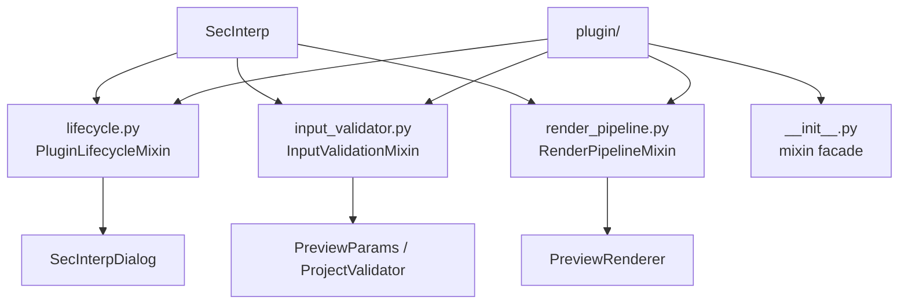

---
tags:
  - secinterp
  - code-walkthrough
  - layer
  - plugin
aliases:
  - plugin/
  - Plugin layer
cssclass: secinterp-layer
---

# `plugin/` — Plugin

> [!abstract] One-line summary
> Set of **mixins** that the `SecInterp` class composes to manage the QGIS lifecycle, validate inputs, and run the render pipeline.

**Path**: `plugin/` (4 modules, ~386 lines)
**Layer**: Plugin
**Tags**: #secinterp #layer #plugin

---

## 🎯 Layer role

| Problem | Solution |
|---------|----------|
| `sec_interp_plugin.py` grew with lifecycle + validation + render | Split into 3 cohesive mixins |
| The QGIS analyzer requires paired `connect`/`disconnect` in the same module | `lifecycle.py` keeps both |
| Heavy imports broke plugin loading | `SafeLoader` defers instantiation |

> [!important] Layer rules
> - ✅ `SecInterp` inherits from `PluginLifecycleMixin`, `InputValidationMixin`, and `RenderPipelineMixin`
> - ✅ Every `connect_*` has its `disconnect_*` in the **same** module (analyzer requirement)
> - ✅ Business logic is delegated to `core/` and the GUI; here it only orchestrates
> - ⚠️ Depends on `qgis.core`, `qgis.PyQt`, and `iface`, so it is not testable like core

---

## 🧬 Layer / sublayer map

---

## 🧱 Module inventory

| Module | Role |
|--------|------|
| `lifecycle.py` | `add_action`, `initGui`, `run`, `unload`, and `disconnect_signals` |
| `input_validator.py` | `_get_and_validate_inputs` builds `PreviewParams` and arms layer notifications |
| `render_pipeline.py` | `draw_preview` filters data by visibility and delegates to `PreviewRenderer` |
| `__init__.py` | Re-exports the three mixins via `__all__` |

---

## 🏛️ Design patterns present

| Pattern | Where | Purpose |
|---------|-------|---------|
| **Mixin / Composition** | `SecInterp` | Combine behavior without a rigid hierarchy |
| **Facade** | `__init__.py` | Single import point for the mixins |
| **Delegation** | `process_data`, `save_profile_line` | Forward to dialog managers |
| **Safe Loading** | `[[safe_loader]]` | Tolerate runtime import failures |

---

## 🔗 Related notes

- [[Index]] — vault index
- [[plugin_mixins]] · [[sec_interp_plugin]] · [[safe_loader]]
- [[main_dialog]] — dialog orchestrated by the lifecycle
- [[preview_renderer]] — render pipeline destination
- [[layer_core]] · [[layer_gui]] — layers it delegates to

---

*Note of the SecInterp Code Walkthrough vault — v3.8.0*
