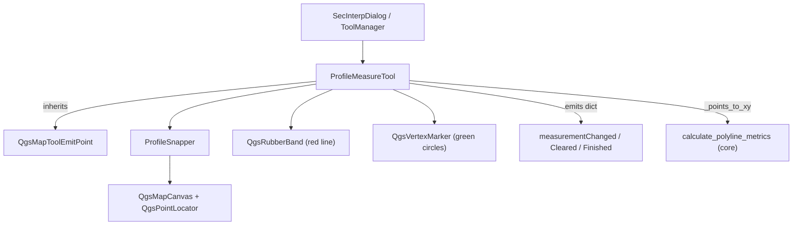

---
tags:
  - secinterp
  - code-walkthrough
  - gui
  - tools
aliases:
  - measure_tool.py
  - ProfileMeasureTool
cssclass: secinterp-note
---

# `gui/tools/measure_tool.py`

> [!abstract] One-line summary
> **Multi-point** measurement `QgsMapTool` for the preview: it accumulates snapped vertices, draws the polyline on a `QgsRubberBand`, and emits metrics computed by core (`calculate_polyline_metrics`).

**Path**: `gui/tools/measure_tool.py` (330 lines)
**Class**: `ProfileMeasureTool(QgsMapToolEmitPoint)`
**Layer**: GUI · Tools
**Tags**: #secinterp #gui #tools

---

## 🎯 Why does this file exist?

| Problem | Solution |
|---------|----------|
| Measuring distances/elevation needs interaction | `QgsMapToolEmitPoint` on the preview canvas |
| Computation must not live in the GUI | `calculate_polyline_metrics` (core, pure math) takes `(x, y)` |
| Snapping is complex and repetitive | Delegated to `ProfileSnapper` |
| Closing the dialog left orphan graphics | `cleanup_finalized()` removes them from the scene |
| After finalizing, the measurement had to stay visible | `finalized` + `finalized_points` freeze the result |

> [!important] Core boundary
> The tool only **extracts** points (`_points_to_xy`) and **presents**; the arithmetic is done by `core/utils/geometry_utils/measurement.py`.

---

## 🧬 Relationship diagram



> [!tip] How to read
> Solid arrow = imports/composes; `SIG` is consumed by the preview. The tool never imports widgets.

---

## 📦 Imports — architectural reading

```python
import contextlib
from qgis.core import QgsPointXY, QgsWkbTypes
from qgis.gui import (
    QgsMapCanvas, QgsMapToolEmitPoint, QgsMapToolPan,
    QgsRubberBand, QgsVertexMarker,
)
from qgis.PyQt.QtCore import Qt, pyqtSignal
from qgis.PyQt.QtGui import QColor

from sec_interp.core.utils.geometry_utils.measurement import calculate_polyline_metrics
from sec_interp.gui.tools.snapper import ProfileSnapper
from sec_interp.logger_config import get_logger
```

| # | Observation |
|---|-------------|
| ① | Full `qgis.gui`: interactive tool, a legitimate GUI layer. |
| ② | The only `core` dependency is the pure metrics function. |
| ③ | `contextlib.suppress` tolerates already-deleted scene items. |
| ④ | `QgsMapToolPan` is instantiated on finalize to freeze the measurement. |

---

## 🧱 Signals, state and lifecycle

```python
class ProfileMeasureTool(QgsMapToolEmitPoint):
    measurementChanged = pyqtSignal(dict)   # live / final metrics
    measurementCleared = pyqtSignal()       # normal reset
    measurementFinished = pyqtSignal()      # measurement finalized

    def __init__(self, canvas: QgsMapCanvas) -> None:
        super().__init__(canvas)
        self.canvas = canvas
        self.points: list[QgsPointXY] = []
        self.finalized: bool = False
        self.finalized_points: list[QgsPointXY] = []
        self.rubber_band: QgsRubberBand | None = None
        self.vertex_markers: list[QgsVertexMarker] = []
        self.cursor = Qt.CursorShape.CrossCursor
        self.snapper = ProfileSnapper(canvas)

    def activate(self) -> None:
        super().activate()
        self.canvas.setCursor(self.cursor)

    def deactivate(self) -> None:
        # reset() is NOT called: the measurement stays visible
        super().deactivate()
```

| Member | Role |
|--------|------|
| `points` | Vertices under construction (cleared on finalize/reset). |
| `finalized` | Blocks `canvasReleaseEvent` and `canvasMoveEvent`. |
| `finalized_points` | Frozen copy used to repaint the final geometry. |
| `snapper` | Delegate for snapping to layer vertices/edges. |

> [!note] `deactivate` does not clear
> Unlike [[interpretation_tool]], `reset()` is not called on deactivate here: the measurement persists until a new one starts or it is cleared.

---

## 🧱 `reset()` — two behaviors based on `finalized`

```python
def reset(self) -> None:
    if self.finalized:
        # Keeps rubber band, markers and results text
        self.points = []
        self.finalized = False
        return
    self.points = []
    self.finalized = False
    self.finalized_points = []
    # removes rubber_band + markers from the scene
    self.measurementCleared.emit()
```

| Branch | Effect |
|--------|--------|
| `finalized == True` | Only clears `points`; keeps the drawing and emits no signal. |
| `finalized == False` | Removes `rubber_band`/markers and emits `measurementCleared`. |

> [!warning] State subtlety
> In the finalized branch, `finalized_points` is not cleared on purpose: those are the points the preview keeps showing.

---

## 🧱 `cleanup_finalized()` — safe dialog shutdown

```python
def cleanup_finalized(self) -> None:
    if self.rubber_band:
        with contextlib.suppress(Exception):
            self.rubber_band.hide()
            if self.canvas.scene():
                self.canvas.scene().removeItem(self.rubber_band)
        self.rubber_band = None
    for marker in self.vertex_markers:
        with contextlib.suppress(Exception):
            marker.hide()
            if self.canvas.scene():
                self.canvas.scene().removeItem(marker)
    self.vertex_markers = []
    self.finalized_points = []
    self.finalized = False
    self.points = []
```

| Detail | Value |
|--------|-------|
| When | The dialog calls it on close, so no orphan graphics remain. |
| Difference vs `reset()` | Here `finalized_points` is emptied and no signal is emitted. |

---

## 🧱 Mouse and keyboard events

```python
def canvasReleaseEvent(self, event: Any) -> None:
    if event.button() == Qt.MouseButton.RightButton:
        self.reset()
        return
    if self.finalized:
        return
    self._add_point(self.snapper.snap(event.pos()))

def canvasMoveEvent(self, event: Any) -> None:
    if self.finalized or not self.points:
        return
    current_point = self.snapper.snap(event.pos())
    self._update_rubber_band(current_point)
    self._calculate_and_emit_preview(current_point)

def keyPressEvent(self, event: Any) -> None:
    if event.key() in (Qt.Key.Key_Return, Qt.Key.Key_Enter):
        if len(self.points) >= 2:          # MIN_MEASURE_POINTS
            self.finalize_measurement()
            event.accept()
        return
    if event.key() == Qt.Key.Key_Escape:
        self.reset()
        event.accept()
        return
    super().keyPressEvent(event)
```

| Input | Action |
|-------|--------|
| Left click | Adds a snapped point (`_add_point`). |
| Right click | `reset()` (cancel). |
| Enter / Return | Finalizes if there are ≥ 2 points. |
| Escape | `reset()`. |

> [!important] Correct event
> The point is added in **`canvasReleaseEvent`**, not in `canvasPressEvent` (a common mistake in old notes).

---

## 🧱 `_add_point`, preview and `finalize_measurement()`

```python
def _add_point(self, point: QgsPointXY) -> None:
    self.points.append(point)
    self._ensure_rubber_band()
    self.rubber_band.addPoint(point, True)
    self._add_vertex_marker(point)
    if len(self.points) >= 2:              # MIN_RELEVANT_POINTS
        metrics = calculate_polyline_metrics(_points_to_xy(self.points))
        self.measurementChanged.emit(metrics)

def finalize_measurement(self) -> None:
    if len(self.points) < 2:               # MIN_RELEVANT_POINTS
        return
    self.finalized_points = self.points.copy()
    self.finalized = True
    metrics = calculate_polyline_metrics(_points_to_xy(self.points))
    self.measurementChanged.emit(metrics)
    if self.rubber_band:
        self.rubber_band.reset(QgsWkbTypes.GeometryType.LineGeometry)
        for point in self.finalized_points:
            self.rubber_band.addPoint(point, False)   # no temporary line
        self.rubber_band.show()
    pan_tool = QgsMapToolPan(self.canvas)
    self.canvas.setMapTool(pan_tool)       # back to pan, preserving the measurement
    self.measurementFinished.emit()
```

| Step | Detail |
|------|--------|
| 1 | `_points_to_xy()` converts `QgsPointXY` into primitives for core. |
| 2 | `finalize_measurement` stores a copy, sets `finalized` and emits metrics. |
| 3 | Repaints the rubber band with the real points only. |
| 4 | Switches to `QgsMapToolPan` and emits `measurementFinished`. |

> [!tip] `_calculate_and_emit_preview`
> Appends the cursor as a temporary point (`[*self.points, target_point]`) and emits live metrics.

---

## 🏛️ Design patterns present

| Pattern | Where | Purpose |
|---------|-------|---------|
| **State** | `finalized` / `finalized_points` | Toggle between "measuring" and "frozen". |
| **Strategy / Delegation** | `ProfileSnapper` | Isolate the snapping algorithm. |
| **Extract-then-Compute** | `_points_to_xy` → core | GUI free of math. |
| **Observer** | 3 `pyqtSignal` | Decouple the tool from the preview. |
| **Fail-safe cleanup** | `contextlib.suppress` | Tolerate an already-destroyed scene. |

---

## 🧾 API summary

| Symbol | Signature / Inherits | Typical use |
|--------|----------------------|-------------|
| `measurementChanged` | `pyqtSignal(dict)` | Live and final metrics. |
| `measurementCleared` | `pyqtSignal()` | Normal reset. |
| `measurementFinished` | `pyqtSignal()` | The dialog turns off measure mode. |
| `ProfileMeasureTool` | `QgsMapToolEmitPoint` | Preview measurement tool. |
| `reset()` | `() -> None` | Cancel / clear (respects finalized). |
| `finalize_measurement()` | `() -> None` | Close measurement from the UI button. |
| `cleanup_finalized()` | `() -> None` | Full cleanup on dialog close. |
| `disconnect_signals()` | `() -> None` | Prevent memory leaks. |

---

## 👀 Observations and notes

> [!success] Strengths
> - Explicit `finalized` state: the measurement stays visible and protected after closing.
> - Delegated snap and core-side computation: the tool is thin and testable.
> - `cleanup_finalized()` guarantees zero orphan graphics on close.

> [!warning] Points of attention
> - `finalize_measurement()` instantiates `QgsMapToolPan` without keeping a reference; the canvas owns it.
> - `_add_vertex_marker` creates one `QgsVertexMarker` per point; long measurements accumulate items.

> [!question] Open questions
> - Should there be a maximum vertex limit to avoid very dense rubber bands?
> - Does the dialog's "Finalize" button call `finalize_measurement()` or only `deactivate()`?

---

## 🔗 Related notes

- [[Index]] — vault index
- [[tool_manager]] — activates/deactivates it based on the preview button
- [[interpretation_tool]] — sibling polygon-digitizing tool
- [[preview_renderer]] — canvas where it measures
- [[layer_gui_tools]] — GUI tools layer

---

*Note of the SecInterp Code Walkthrough vault — v3.8.0*
