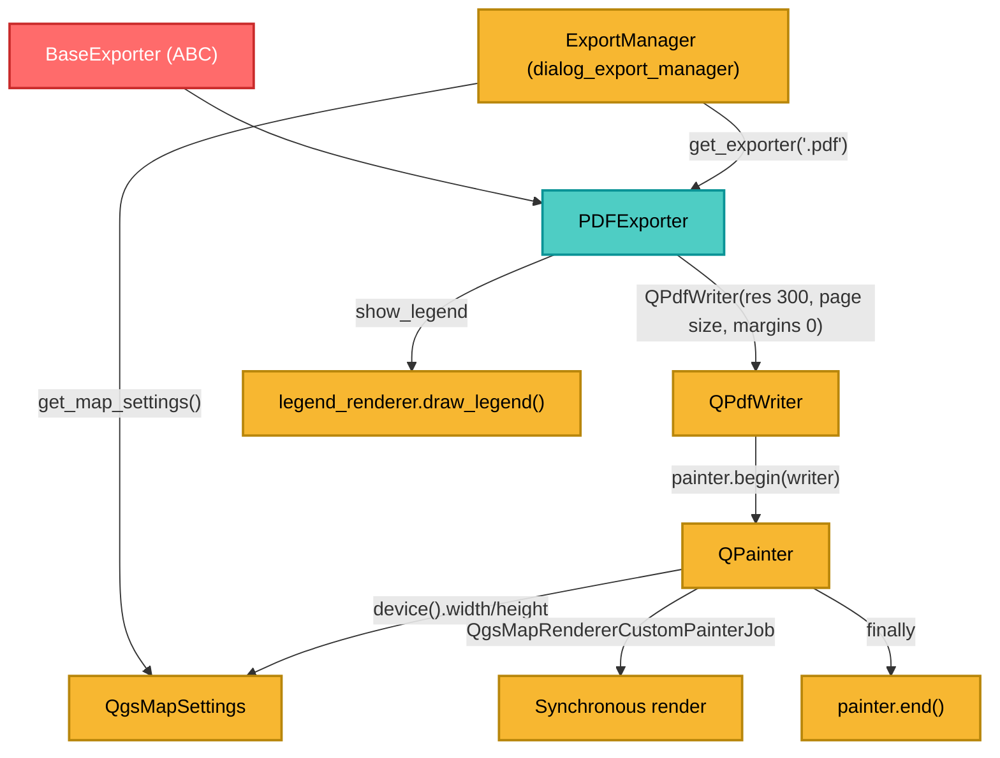

---
tags:
  - secinterp
  - code-walkthrough
  - exporters
  - pdf
  - vector
  - render
  - document
aliases:
  - pdf_exporter.py
  - PDFExporter
cssclass: secinterp-note
---

# `exporters/pdf_exporter.py`

> [!abstract] One-line summary
> Exports a `QgsMapSettings` to **vector PDF** with `QPdfWriter` (300 DPI) + `QgsMapRendererCustomPainterJob`, aligning the map's output size and DPI to the device.

**Path**: `exporters/pdf_exporter.py` (79 lines)
**Class**: `PDFExporter(BaseExporter)`
**Layer**: Exporters (QGIS · Vector document)
**Tags**: #secinterp #exporters #pdf #vector #render #document

---

## 🎯 Why does this file exist?

PDF is the go-to delivery format for geological reports: vector (scalable), with controlled page size and legend. Unlike a raster image, the PDF renders **directly onto the `QPdfWriter` device**.

| Problem | Solution |
|---------|----------|
| Rasterized image loses quality when printed | `QPdfWriter` produces vectors |
| Inconsistent scale/DPI | `writer.setResolution(300)` + `map_settings.setOutputDpi()` |
| Unwanted margins | `writer.setPageMargins(QMarginsF(0, 0, 0, 0))` |
| The painter stays open if something fails | `try/finally: painter.end()` |
| Failure to initialize the painter | `if not painter.begin(writer): return False` with log |

> [!important] Architectural note
> The PDF receives an already-configured `QgsMapSettings` and **mutates it** (`setOutputSize`, `setOutputDpi`) to align it with the PDF device. This is a legitimate case of "adjusting to the destination" before rendering.

---

## 🧬 Relationship diagram



---

## 📦 Imports — architectural reading

```python
from qgis.core import QgsMapRendererCustomPainterJob, QgsMapSettings
from qgis.PyQt.QtCore import QMarginsF, QRectF, QSize, QSizeF
from qgis.PyQt.QtGui import QPageSize, QPainter, QPdfWriter

from sec_interp.logger_config import get_logger
from .base_exporter import BaseExporter
```

| # | Observation |
|---|-------------|
| ① | `QSizeF` + `QPageSize` define the page size in **points** |
| ② | `QMarginsF` allows fractional margins (zero here) |
| ③ | `QgsMapRendererCustomPainterJob` is the same job used by image and SVG |
| ④ | `QgsMapSettings` is imported only for the type annotation |

---

## 🧱 `export()` — writing to the PDF device

```python
def export(self, output_path: Path, map_settings: QgsMapSettings) -> bool:
    try:
        width = self.get_setting("width", 800)
        height = self.get_setting("height", 600)

        writer = QPdfWriter(str(output_path))
        writer.setResolution(300)  # Set DPI
        writer.setPageSize(QPageSize(QSizeF(width, height), QPageSize.Unit.Point))
        writer.setPageMargins(QMarginsF(0, 0, 0, 0))

        painter = QPainter()
        if not painter.begin(writer):
            logger.error(f"Failed to begin painting for PDF export to {output_path}")
            return False
        try:
            painter.setRenderHint(QPainter.RenderHint.Antialiasing)

            # Update map settings with actual writer device dimensions and DPI
            dev = painter.device()
            map_settings.setOutputSize(QSize(dev.width(), dev.height()))
            map_settings.setOutputDpi(writer.resolution())

            job = QgsMapRendererCustomPainterJob(map_settings, painter)
            job.start()
            job.waitForFinished()

            show_legend = self.get_setting("show_legend", True)
            legend_renderer = self.get_setting("legend_renderer")
            if legend_renderer and show_legend:
                legend_renderer.draw_legend(painter, QRectF(0, 0, dev.width(), dev.height()))
        finally:
            painter.end()
    except Exception:
        logger.exception(f"PDF export failed for {output_path}")
        return False
    else:
        return True
```

| Setting | Default | Role |
|---------|---------|------|
| `width` / `height` | `800` / `600` | Page size in points |
| `show_legend` | `True` | Enable/disable the legend |
| `legend_renderer` | `None` | Object with `draw_legend(painter, rect)` |

Fixed constants: `setResolution(300)` (print quality) and `setPageMargins(0,0,0,0)` (no margins).

> [!important] Map ↔ device synchronization
> The PDF in points produces an N×M px device at 300 DPI. If `map_settings` is not updated with `setOutputSize(dev.width(), dev.height())` and `setOutputDpi(writer.resolution())`, QGIS renders with the canvas dimensions/DPI and the map comes out cropped or blurry.

> [!tip] `try/finally` guarantees `painter.end()`
> Even if the render job raises, the painter is closed. This is the key difference from [[image_exporter]]. Return flow: failed `begin()` → `logger.error` + `False`; success → the `else` returns `True`; exception → `logger.exception` + `False`.

---

## 🏛️ Design patterns present

| Pattern | Where | Purpose |
|---------|-------|---------|
| **Template Method** | `BaseExporter` | Contract and settings |
| **Strategy** | `PDFExporter` | Concrete PDF strategy |
| **Job / Command** | `QgsMapRendererCustomPainterJob` | Encapsulated synchronous render |
| **RAII / try-finally** | `painter.end()` | Release the resource no matter what |
| **Fail-safe** | `try/except` + `logger.exception` | Does not propagate failures |

---

## 🧾 API summary

| Symbol | Signature / Inherits | Typical use |
|--------|----------------------|-------------|
| `PDFExporter` | `class PDFExporter(BaseExporter)` | PDF exporter |
| `get_supported_extensions()` | `-> [".pdf"]` | Extension validation |
| `export(output_path, map_settings)` | `-> bool` | Writes the PDF |
| `get_setting(key, default)` | inherited | Access to settings |

> [!warning] Signature inconsistent with the base contract
> Like [[image_exporter]] and [[svg_exporter]], `export` omits `layer_name`. It works through duck typing, but does not strictly honor the abstract signature of `BaseExporter.export`.

---

## 👀 Observations and notes

> [!success] Strengths
> - **Print quality**: 300 DPI and vector render.
> - **Guaranteed cleanup** of the painter with `try/finally`.
> - **Explicit handling** of `painter.begin()` failure and **optional legend**.

> [!warning] Points of attention
> - **Mutates the received `map_settings`**: if reused for another export, it carries `outputSize`/`outputDpi` over.
> - Broad `except Exception` that silences programming errors by returning `False`.
> - **Synchronous** render (`waitForFinished`): it blocks the calling thread.
> - `legend_renderer` couples the exporter to the GUI.
> - Width/height are interpreted in points; values inherited from a pixel flow give unexpected pages.

> [!question] Open questions
> - Should `map_settings` be copied before mutating it to avoid side effects?
> - Should resolution/page be configurable via settings instead of fixed constants?

---

## 🔗 Related notes

- [[Index]] — vault index
- [[base_exporter]] — abstract contract
- [[image_exporter]] / [[svg_exporter]] — same render job, different destination
- [[dialog_export_manager]] — builds `QgsMapSettings` and calls `export()`
- [[export_package]] — `ExportService.get_map_settings()`
- [[controller]] — preview data flow

---

*Note of the SecInterp Code Walkthrough vault — v3.8.0*
