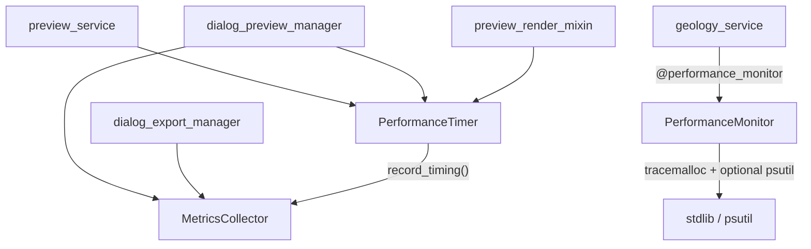

---
tags:
  - secinterp
  - code-walkthrough
  - core
  - performance
aliases:
  - performance_metrics.py
  - MetricsCollector
cssclass: secinterp-note
---

# `core/performance_metrics.py`

> [!abstract] One-line summary
> Lightweight instrumentation: `MetricsCollector` aggregates timings/counts, `PerformanceTimer` measures them as a context manager, and `@performance_monitor` / `PerformanceMonitor` measure time and memory.

**Path**: `core/performance_metrics.py` (321 lines)
**Classes**: `MetricsCollector`, `PerformanceTimer`, `PerformanceMonitor`
**Decorator**: `performance_monitor` · **Function**: `format_duration`
**Layer**: Core · Performance (QGIS-agnostic, no Qt)
**Tags**: #secinterp #core #performance

---

## 🎯 Why does this file exist?

When the preview "feels slow", without data there is no way to know which phase dominates. This module provides instrumentation based **only on stdlib** (plus optional `psutil`).

| Problem | Solution |
|---------|----------|
| Not knowing how long each phase takes | `PerformanceTimer("Topography Generation", metrics)` |
| Losing counts (points, segments) | `MetricsCollector.record_count(...)` |
| Invisible memory peaks | `tracemalloc` in `PerformanceMonitor` |
| Unreadable durations | `format_duration(seconds)` → `µs`/`ms`/`s` |
| Measuring functions without editing them | `@performance_monitor` decorator |

> [!important] Core boundary
> No `qgis`, no `PyQt`, no `QCoreApplication`. `tracemalloc` and `time` are stdlib; `psutil` is optional and imported inside `_get_memory_usage()`.

---

## 🧬 Relationship diagram



> [!tip] How to read
> There are **two systems**: (A) `MetricsCollector` + `PerformanceTimer` (preview/export); (B) `PerformanceMonitor` + `@performance_monitor` (`geology_service`). They share a file, not state.

---

## 🧱 `MetricsCollector` and `PerformanceTimer`

```python
class MetricsCollector:
    def __init__(self) -> None:
        self.timings: dict[str, float] = {}
        self.counts: dict[str, int] = {}
        self.metadata: dict[str, Any] = {}
        self._start_time = time.perf_counter()
    def record_timing(self, operation, duration) -> None: ...
    def record_count(self, metric, count) -> None: ...
    def add_metadata(self, key, value) -> None: ...
    def get_summary(self) -> dict[str, Any]: ...   # + total_duration
    def clear(self) -> None: ...

class PerformanceTimer:
    def __enter__(self) -> PerformanceTimer:
        self.start_time = time.perf_counter()
        return self
    def __exit__(self, exc_type, exc_val, exc_tb) -> None:
        self.duration = time.perf_counter() - self.start_time
        if self.collector:
            self.collector.record_timing(self.operation_name, self.duration)
        if self.logger_func:
            self.logger_func(f"{self.operation_name}: {self.duration:.3f}s")
```

> [!note] Real usage: `preview_service` measures `"Topography Generation"`; `dialog_preview_manager`, `"Total Preview Generation"`; `preview_render_mixin`, `"Rendering"`.

---

## 🧱 `format_duration()` and `PerformanceMonitor`

```python
def format_duration(seconds: float) -> str:
    if seconds < 0.001:  return f"{seconds * 1000000:.0f}µs"
    if seconds < 1.0:    return f"{seconds * 1000:.0f}ms"
    return f"{seconds:.1f}s"

class PerformanceMonitor:
    @contextmanager
    def measure_operation(self, operation_name, **metadata):
        start_time, start_memory = time.perf_counter(), self._get_memory_usage()
        tracemalloc.start()
        try:
            yield
        finally:
            end_time, end_memory = time.perf_counter(), self._get_memory_usage()
            try:
                _, peak = tracemalloc.get_traced_memory()
            except RuntimeError:
                _, peak = 0, 0
            tracemalloc.stop()
            self.logger.info(f"Performance: {{'operation': operation_name, ...}}")
            self.metrics.setdefault(operation_name, []).append(log_data)
```

| Aspect | Detail |
|---------|--------|
| `log_file` | **Ignored**: `_setup_logger` returns `get_logger("performance")` |
| `_get_memory_usage` | `psutil` if present; otherwise `0.0` |
| Peak | `tracemalloc` with a `RuntimeError` guard (nested calls) |
| `get_operation_stats` | Mean/min/max duration and memory per operation |

---

## 🧱 `performance_monitor` — decorator

```python
def performance_monitor(func: Callable) -> Callable:
    monitor = PerformanceMonitor()
    @wraps(func)
    def wrapper(*args, **kwargs):
        operation_name = f"{func.__module__}.{func.__name__}"
        with monitor.measure_operation(operation_name, args_count=len(args)):
            return func(*args, **kwargs)
    return wrapper
```

| Detail | Value |
|--------|-------|
| `operation_name` | `module.function` → unique per function |
| Instance | One `PerformanceMonitor` per decorated function |
| Only current use | `geology_service` |

---

## 🏛️ Design patterns present

| Pattern | Where | Purpose |
|---------|-------|---------|
| **Context Manager** | `PerformanceTimer`, `measure_operation` | Measure with `with` |
| **Decorator** | `performance_monitor` | Instrument without touching the body |
| **Collector / Aggregator** | `MetricsCollector` | Accumulate and summarize |
| **Optional Dependency** | `import psutil` in try/except | Degrade without breaking |

---

## 🧾 API summary

| Symbol | Signature | Typical use |
|--------|-----------|-------------|
| `MetricsCollector` | `class` | `self.metrics = MetricsCollector()` |
| `PerformanceTimer` | context manager | `with PerformanceTimer("Rendering", metrics):` |
| `format_duration` | `(seconds: float) -> str` | Format timings |
| `performance_monitor` | `(func) -> func` | `@performance_monitor` |

---

## 👀 Observations and notes

> [!success] Strengths
> - **Stdlib only** for the essentials; `psutil` optional and tolerant.
> - **Two granularities**: accumulated metrics and point measurement.
> - **Integrated with the centralized logger**; unique names per function.

> [!warning] Points of attention
> - `PerformanceMonitor.__init__` accepts `log_file` but `_setup_logger` **ignores it**: dead parameter.
> - `tracemalloc` is global: nested calls can raise `RuntimeError` (mitigated).
> - Without `psutil`, `_get_memory_usage` returns `0.0` and `memory_mb` can mislead.

> [!question] Open questions
> - Should `PerformanceMonitor` write to `log_file` or have the parameter removed, and should `MetricsCollector` and `PerformanceMonitor` be unified into a single API?

---

## 🔗 Related notes

- [[Index]] — vault index
- [[preview_service]] — measures phases with `PerformanceTimer`
- [[dialog_preview_manager]] — `"Total Preview Generation"`
- [[geology_service]] — uses `@performance_monitor`
- [[logger_config]] — `performance` logger and the `SecInterp.*` hierarchy

---

*Note of the SecInterp Code Walkthrough vault — v3.8.0*
