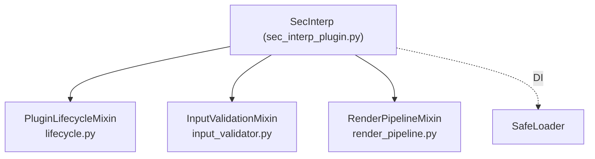

---
tags:
  - secinterp
  - code-walkthrough
  - entry-point
  - plugin-mixins
  - di
aliases:
  - plugin/ package
  - PluginLifecycleMixin
  - InputValidationMixin
  - RenderPipelineMixin
cssclass: secinterp-note
---

# `plugin/`

> [!abstract] One-line summary
> Package of **mixins** that spreads the lifecycle, input validation and preview rendering outside the root `SecInterp` class, leaving it as a thin facade.

**Path**: `plugin/` (package, 4 modules · ~386 lines)
**Class**: `SecInterp` (facade in `sec_interp_plugin.py`, 129 lines)
**Layer**: Entry point / Root
**Tags**: #secinterp #entry-point #plugin-mixins #di

---

## 🎯 Why does this file exist?

On 2026-09-20 the former 508-line `sec_interp_plugin.py` was split. Today the class `SecInterp(TranslatableMixin, PluginLifecycleMixin, InputValidationMixin, RenderPipelineMixin)` is a **129-line facade** that keeps only `__init__` (DI via `SafeLoader`), `_load_translator`, `process_data` and `save_profile_line`.

| Problem (before) | Solution (`plugin/`) |
|------------------|----------------------|
| One file with 3 responsibilities and ~500 lines | One mixin per responsibility |
| Hard to audit Qt signals per file | `connect`/`disconnect` together in their module |
| Initial load mixed with UI and rendering | `__init__` only builds and injects |

> [!important] Composition Root
> `__init__` is the only point where "everything knows everything": it builds and injects dependencies via `SafeLoader`.

---

## 🧬 Relationship diagram

---

## 🔄 `lifecycle.py` — `PluginLifecycleMixin` (163 lines)

| Method | Role |
|--------|------|
| `add_action(...)` | Creates `QAction`, connects `triggered` and registers it in toolbar + menu |
| `initGui()` | QGIS hook; creates the menu and `first_start = True` |
| `run()` | Connects `dlg.accepted`, loads interpretations/settings and opens the dialog |
| `process_data()` | Delegates to `dlg.preview_manager.generate_preview()` |
| `unload()` | Disconnects signals and removes menu/toolbar |
| `disconnect_signals()` | `_disconnect_actions` + `_disconnect_dialog` + layer notifications |

---

## ✅ Other mixins

| Module | Method | Role |
|--------|--------|------|
| `input_validator.py` (106) | `_get_and_validate_inputs()` | Builds `PreviewParams`, runs `params.validate()` and `ProjectValidator.validate_all()`; critical errors are re-raised |
| | `_collect_active_layers(params)` | Maps `bucket → QgsMapLayer` via `resolve_layer` |
| | `disconnect_layer_notifications()` | Cuts the layer-change manager |
| `render_pipeline.py` (108) | `draw_preview(...)` | Filters data, calls `preview_renderer.render()` and updates `render_state` + legend |
| | `_get_filtered_preview_data(...)` | Applies `show_topo/geol/struct/drillholes/interpretations` flags |
| | `_calculate_dip_length(...)` | `rasterUnitsPerPixelX() * dip_scale`; `None` when not applicable |

---

## ⚠️ Key architectural note

> [!important] `connect`/`disconnect` in the same module
> Every `connect`/`disconnect` pair and its Qt slots live in the **same file** that connects them. This is deliberate: `qgis-analyzer` detects *signal leaks* and *missing slots* **per file**, so keeping them together lets each module be audited in isolation.

---

## 🏛️ Design patterns present

| Pattern | Where | Purpose |
|---------|-------|---------|
| **Mixin composition** | `SecInterp(...)` | Spread responsibilities without deep inheritance |
| **Composition Root** | `__init__` | Build and wire dependencies |
| **Dependency Injection** | `SafeLoader.lazy_load` | Inject adapters/controller/dialog |
| **Template Method (Qt)** | `initGui` / `unload` | QGIS lifecycle hooks |

---

## 🔗 Related notes

- [[sec_interp_plugin]] — facade and `__init__` in detail
- [[safe_loader]] — fault-tolerant DI
- [[i18n]] — `TranslatableMixin` (`_load_translator`)
- [[controller]] — injected `ProfileController`
- [[main_dialog]] / [[adapters]] — dialog and GUI extractors
- [[Index]] — vault index

---

*Note of the SecInterp Code Walkthrough vault — v3.8.0*
