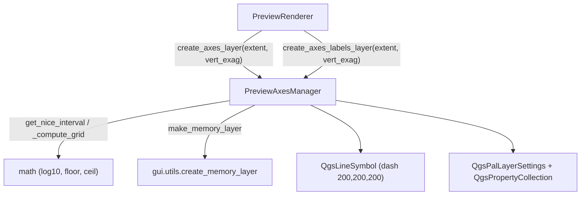

---
tags:
  - secinterp
  - code-walkthrough
  - gui
  - preview
aliases:
  - preview_axes_manager.py
  - PreviewAxesManager
cssclass: secinterp-note
---

# `gui/preview_axes_manager.py`

> [!abstract] One-line summary
> Computes "nice" intervals (the **1-2-5-10** sequence) for the preview grid and builds two memory layers: axis lines and labeled points for coordinates.

**Path**: `gui/preview_axes_manager.py` (204 lines)
**Class**: `PreviewAxesManager`
**Layer**: GUI · Preview
**Tags**: #secinterp #gui #preview

---

## 🎯 Why does this file exist?

A profile grid must stay readable at any scale and with any vertical exaggeration. A grid with "ugly" steps (e.g. 137.4 m) is unreadable; the 1-2-5-10 sequence is the cartographic convention.

| Problem | Solution |
|---------|----------|
| Arbitrary intervals depending on the data range | `get_nice_interval()` rounds to 1/2/5/10 × 10ⁿ |
| Vertical exaggeration distorts Y | `_compute_grid()` divides by `vert_exag` and rescales when drawing |
| Labels must sit on the correct side | `quadrant` field + data-defined `OffsetQuad` (7 = below, 3 = left) |
| Width decides how many divisions to show | Intervals based on `width/5` and `height/5` |

> [!important] Canvas-independent
> The manager does **not** touch the `QgsMapCanvas`: it only receives an `extent` and returns layers. `PreviewRenderer` decides where to place them.

---

## 🧬 Relationship diagram



---

## 📦 Imports — architectural reading

```python
import math

from qgis.core import (
    QgsFeature, QgsGeometry, QgsLineString, QgsLineSymbol,
    QgsMarkerSymbol, QgsPalLayerSettings, QgsPointXY, QgsProperty,
    QgsPropertyCollection, QgsSingleSymbolRenderer, QgsTextFormat,
    QgsVectorLayer, QgsVectorLayerSimpleLabeling,
)
from qgis.PyQt.QtGui import QColor

from sec_interp.gui.utils import create_memory_layer as make_memory_layer
```

| # | Observation |
|---|-------------|
| ① | `math` for `log10`/`floor`/`ceil`: all interval math is pure. |
| ② | It uses the **symbology and labeling** classes from `qgis.core` (no logic in the dialog). |
| ③ | `make_memory_layer` reuses memory creation + project CRS. |
| ④ | The canvas and `QgsProject` are never imported: it is purely a layer builder. |

---

## 🧱 `get_nice_interval()` — the 1-2-5 sequence

```python
@staticmethod
def get_nice_interval(target_step: float) -> float:
    if target_step <= 0:
        return 100.0
    exponent = math.floor(math.log10(target_step))
    fraction = target_step / (10**exponent)
    THRESHOLD_QUARTER = 1.5
    THRESHOLD_HALF = 3.5
    THRESHOLD_FULL = 7.5
    if fraction < THRESHOLD_QUARTER:
        nice_fraction = 1.0
    elif fraction < THRESHOLD_HALF:
        nice_fraction = 2.0
    elif fraction < THRESHOLD_FULL:
        nice_fraction = 5.0
    else:
        nice_fraction = 10.0
    return nice_fraction * (10**exponent)
```

> [!note] Examples: `137.4 → 100`, `2.7 → 2`, `6.0 → 5`, `8.1 → 10`; the 1.5 / 3.5 / 7.5 thresholds are the geometric midpoints between 1-2, 2-5, and 5-10. `target_step <= 0` falls back to `100.0`.

---

## 🧱 `_compute_grid()` — intervals and offsets

```python
@classmethod
def _compute_grid(cls, extent, vert_exag):
    width, height = extent.width(), extent.height()
    x_interval = cls.get_nice_interval(width / 5)
    y_interval = cls.get_nice_interval((height / vert_exag) / 5)
    x_start = math.floor(extent.xMinimum() / x_interval) * x_interval
    y_min_orig = extent.yMinimum() / vert_exag
    y_max_orig = extent.yMaximum() / vert_exag
    y_start = math.floor(y_min_orig / y_interval) * y_interval
    return x_interval, y_interval, x_start, y_start, y_max_orig
```

| Return | Meaning |
|--------|---------|
| `x_interval` / `y_interval` | "Nice" step in X and Y (Y already in **original** units). |
| `x_start` / `y_start` | Grid-aligned origin (`floor` to the multiple). |
| `y_max_orig` | Un-exaggerated Y maximum; rescaled when drawing. |

> [!important] Un-exaggerate before computing
> Y is divided by `vert_exag` to pick a readable interval in real units; geometry construction multiplies it back. This keeps the grid geologically meaningful even when the view is stretched.

---

## 🧱 `create_axes_layer()` — the grid

```python
x_interval, y_interval, x_start, y_start, y_max_orig = cls._compute_grid(extent, vert_exag)
y_floor = y_start * vert_exag
y_ceil = (math.ceil(y_max_orig / y_interval) * y_interval) * vert_exag

x = x_start                                  # vertical lines
while x <= extent.xMaximum() + 0.1:          # epsilon
    feat = QgsFeature()
    feat.setGeometry(QgsGeometry(QgsLineString([QgsPointXY(x, y_floor), QgsPointXY(x, y_ceil)])))
    features.append(feat)
    last_x = x
    x += x_interval

y = y_start                                  # horizontal lines
while y <= y_max_orig + 0.1:
    y_draw = y * vert_exag
    ...
    y += y_interval

symbol = QgsLineSymbol.createSimple(
    {"color": "200,200,200", "width": "0.3", "line_style": "dash"}
)
layer.setRenderer(QgsSingleSymbolRenderer(symbol))
```

| Detail | Value |
|--------|-------|
| Layer | `make_memory_layer("LineString", "Axes")` |
| Color / width / style | `200,200,200` · `0.3` · `dash` |
| Epsilon | `+0.1` to include the top/right border |

---

## 🧱 `create_axes_labels_layer()` — labels

```python
layer = make_memory_layer("Point?field=label:string&field=quadrant:integer", "Axes Labels")
...
feat.setAttribute("label", f"{x:.0f}"); feat.setAttribute("quadrant", 7)   # X: Below
...
feat.setAttribute("label", f"{y:.0f}"); feat.setAttribute("quadrant", 3)   # Y: Left

settings = QgsPalLayerSettings()
settings.fieldName = "label"
settings.placement = QgsPalLayerSettings.Placement.OverPoint
txt_format = QgsTextFormat(); txt_format.setColor(QColor(0, 0, 0)); txt_format.setSize(8)
settings.setFormat(txt_format)

props = QgsPropertyCollection()
props.setProperty(QgsPalLayerSettings.Property.OffsetQuad, QgsProperty.fromField("quadrant"))
props.setProperty(
    QgsPalLayerSettings.Property.LabelDistance,
    QgsProperty.fromExpression("IF(quadrant=3, 15, 8)"),
)
settings.setDataDefinedProperties(props)
settings.dist = 8.0
```

| Element | Role |
|---------|------|
| `quadrant` | 7 = label below (X axis); 3 = to the left (Y axis) |
| `OffsetQuad` | Data-defined from the `quadrant` field |
| `LabelDistance` | Expression: 15 px for Y, 8 px for X |
| `QgsMarkerSymbol.createSimple({"size": "0", ...})` | Invisible point: only the label matters |

---

## 🏛️ Design patterns present

| Pattern | Where | Purpose |
|---------|-------|---------|
| **Pure function / Static utility** | `get_nice_interval()` | Deterministic math, testable without QGIS |
| **Template Method** | `_compute_grid()` shared | Avoids duplicating interval logic |
| **Data-defined properties** | `QgsPropertyCollection` | Position depends on the `quadrant` attribute |
| **Builder** | `create_axes_*` | Build complex layers step by step |
| **Separation of concerns** | Manager without canvas | The renderer decides placement |

---

## 🧾 API summary

| Symbol | Signature | Typical use |
|--------|-----------|-------------|
| `get_nice_interval(target_step)` | `@staticmethod -> float` | 1-2-5-10 rounding of a target step |
| `_compute_grid(extent, vert_exag)` | `@classmethod -> tuple[float, ...]` | Intervals + aligned origin |
| `create_axes_layer(extent, vert_exag=1.0)` | `@classmethod -> QgsVectorLayer | None` | Gray dashed grid |
| `create_axes_labels_layer(extent, vert_exag=1.0)` | `@classmethod -> QgsVectorLayer | None` | Points labeled with `label`/`quadrant` |

---

## 👀 Observations and notes

> [!success] Strengths
> - **Always-readable grid**: the 1-2-5-10 sequence is the cartographic standard.
> - **Correct under exaggeration** and **clean API**: only `extent` + `vert_exag`, no global state.

> [!warning] Points of attention
> - The fixed `+0.1` epsilon assumes metric units; with degrees or feet it could omit the last border.
> - The `while` loops could over-iterate if `x_interval` is `0` or tiny.
> - `settings.dist = 8.0` is a redundant fallback next to the data-defined property.

---

## 🔗 Related notes

- [[preview_renderer]] — orchestrator that uses this manager
- [[preview_layer_factory]] — profile layers the grid is drawn over
- [[preview_state]] — destination of the rendered canvas
- [[layer_gui]] — GUI layer this belongs to
- [[Index]] — vault index

---

*Note of the SecInterp Code Walkthrough vault — v3.8.0*
