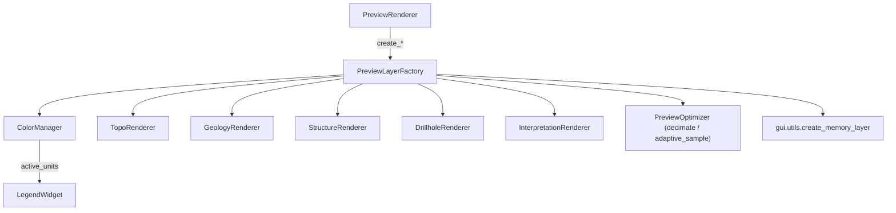

---
tags:
  - secinterp
  - code-walkthrough
  - gui
  - preview
  - factory
aliases:
  - preview_layer_factory.py
  - PreviewLayerFactory
cssclass: secinterp-note
---

# `gui/preview_layer_factory.py`

> [!abstract] One-line summary
> Factory that creates transient **memory layers** for the preview (topo, fill, geology, structures, drillholes, interpretations), assigns geometry with vertical exaggeration, and styles them with specialized renderers.

**Path**: `gui/preview_layer_factory.py` (471 lines)
**Class**: `PreviewLayerFactory`
**Layer**: GUI · Preview
**Tags**: #secinterp #gui #preview #factory

---

## 🎯 Why does this file exist?

The preview does not reuse project layers: it builds ephemeral in-memory layers and applies symbology. That work is repetitive and different per data type.

| Problem | Solution |
|---------|----------|
| Creating memory layers + styles spreads QGIS logic | One factory with a `create_*` method per data type |
| Each unit color must stay **consistent** across renders | `ColorManager` with a fixed palette and name hash |
| Lines may have thousands of points | `PreviewOptimizer.decimate` / `adaptive_sample` (LOD) |
| Data may arrive as DTOs or legacy tuples | `_extract_trace_data` / `_collect_all_segments` normalize both |

> [!important] Color per unit
> `ColorManager.GEOLOGY_COLORS` defines **16 colors**. `get_color(name)` computes `sum(ord(c) for c in name) % 16`, caches it in `_active_units`, and returns the same color for the same unit across every render. The factory's `active_units` property proxies that dictionary.

---

## 🧬 Relationship diagram



> [!tip] How to read
> The factory does not know the canvas: it only returns `QgsVectorLayer`. `PreviewRenderer` decides ordering and lifecycle.

---

## 📦 Imports — architectural reading

```python
import math
from typing import TYPE_CHECKING, Any

from qgis.core import QgsFeature, QgsGeometry, QgsPointXY, QgsVectorLayer
from qgis.PyQt.QtGui import QColor

from sec_interp.core.domain import (
    DrillholeProjection, GeologyData, ProfileData, StructureData,
)
from sec_interp.core.domain.entities import InterpretationPolygon
from sec_interp.core.utils.geometry_utils.optimization import PreviewOptimizer
from sec_interp.gui.utils import create_memory_layer as make_memory_layer
```

| # | Observation |
|---|-------------|
| ① | `math` is used for `radians`, `cos`, `sin` when drawing dip lines. |
| ② | Renderers are imported **inside `__init__`** (lazy) to avoid cycles; under `TYPE_CHECKING` only for annotations. |
| ③ | `PreviewOptimizer` comes from core: geometric simplification is QGIS-agnostic. |
| ④ | `create_memory_layer` is reused from `gui.utils` (assigns the project CRS). |

---

## 🧱 Topography

```python
# create_topo_layer: one feature per point pair, elev field
for i in range(len(render_data) - 1):
    p1, p2 = render_data[i], render_data[i + 1]
    line_points = self._to_qgs_points(self._apply_exaggeration([p1, p2], vert_exag))
    feat = QgsFeature(layer.fields())
    feat.setGeometry(QgsGeometry.fromPolylineXY(line_points))
    avg_elev = (p1[1] + p2[1]) / 2.0      # per-segment color
    feat.setAttribute("elev", avg_elev)
```

One feature per point pair with the `elev` field enables polychromy (elevation gradient). LOD uses `adaptive_sample` when `use_adaptive_sampling`, otherwise `decimate`.

```python
# create_topo_fill_layer: "curtain" polygon under the profile
elevs = [p[1] for p in topo_data]
if base_elevation is None:
    base_elevation = min(elevs) - (max(elevs) - min(elevs)) * 0.2
```

> [!warning] Style reuse
> The fill uses `self.struct_renderer.apply_style(layer)` (the code comment says: "Simple fill style could be here too, but for now reuse"). This is acknowledged technical debt.

---

## 🧱 Geology, structures, and interpretations

| Method | Geometry | Field | Renderer |
|--------|----------|-------|----------|
| `create_geol_layer(geol_data, ...)` | `LineString` per (decimated) segment | `unit:string` | `GeologyRenderer.apply_style(unique_units=...)` |
| `create_struct_layer(struct_data, reference_data, ...)` | Dip `LineString` | — | `StructureRenderer` |
| `create_interp_layer(interp_data, ...)` | Closed `Polygon` | `id:string`, `name:string` | `InterpretationRenderer.apply_style(interp_data=...)` |

```python
# Dip line length
if dip_line_length is not None and dip_line_length > 0:
    line_length = dip_line_length
else:
    e_range = max(elevs) - min(elevs) if reference_data else 100
    line_length = e_range * 0.1

rad_dip = math.radians(abs(app_dip))
dx = line_length * math.cos(rad_dip)
dy = line_length * math.sin(rad_dip)
if app_dip < 0:
    dx = -dx
```

```python
# create_interp_layer: mandatory ring closure
MIN_POLYGON_POINTS = 3
points = [QgsPointXY(x, y * vert_exag) for x, y in interp.vertices_2d]
if points[0] != points[-1]:
    points.append(points[0])
```

---

## 🧱 Drillholes

| Method | Role |
|--------|------|
| `create_drillhole_trace_layer(data, exag)` | Borehole trace (`field=hole_id:string`) |
| `create_drillhole_interval_layer(data, exag)` | Per-unit intervals (`field=unit:string`) |
| `_extract_trace_data(hole_data)` | Supports `DrillholeProjection` or `(id, points)` tuple |
| `_create_trace_feature(...)` | `MIN_TRACE_POINTS = 2`; reads `dist_along`/`z` via `getattr` |
| `_collect_all_segments(data)` | `MIN_HOLE_DATA_FOR_SEGMENTS = 3`; accepts DTO or list |
| `_create_interval_features(...)` | `MIN_SEGMENT_POINTS = 2`; accumulates `unique_units` |

```python
dist = getattr(p, "dist_along", p[0] if isinstance(p, list | tuple) else 0.0)
z = getattr(p, "z", p[1] if isinstance(p, list | tuple) else 0.0)
```

> [!tip] Format tolerance
> The factory normalizes new DTOs and legacy tuples through the same render path, without breaking tests or older flows.

---

## 🏛️ Design patterns present

| Pattern | Where | Purpose |
|---------|-------|---------|
| **Factory Method** | `create_*_layer()` | One construction per data type |
| **Strategy** | `decimate` vs `adaptive_sample` | LOD depending on the mode |
| **Lazy initialization** | imports inside `__init__` | Breaks import cycles |
| **Compatibility shim** | `_extract_trace_data`, `_collect_all_segments` | Accept DTOs and tuples |

---

## 🧾 API summary

| Symbol | Signature | Typical use |
|--------|-----------|-------------|
| `active_units` | `@property` / `@setter` | Proxy to `ColorManager._active_units`; read by the legend |
| `get_color_for_unit(name)` | `-> QColor` | Deterministic color per unit |
| `create_memory_layer(geometry_type, name, fields=None)` | `-> (QgsVectorLayer | None, provider)` | Shared helper |
| `create_topo_layer` / `create_topo_fill_layer` | `-> QgsVectorLayer | None` | Profile and curtain |
| `create_geol_layer` / `create_struct_layer` | `-> QgsVectorLayer | None` | Geology and dips |
| `create_drillhole_trace_layer` / `create_drillhole_interval_layer` | `-> QgsVectorLayer | None` | Drillholes |
| `create_interp_layer` | `-> QgsVectorLayer | None` | Interpretation polygons |

---

## 👀 Observations and notes

> [!success] Strengths
> - **Consistent color**: name hash + fixed palette guarantees a unit never changes color.
> - **Two LOD modes** and **defensive**: `MIN_*` constants prevent degenerate geometries; returns `None` instead of raising.

> [!warning] Points of attention
> - The topo fill reuses `struct_renderer.apply_style`: if the structure style changes, the curtain is affected.
> - The `active_units` setter **only** resets when the value is falsy; a non-empty dict does nothing.
> - `ColorManager` uses Qt's `QColor`; the factory is not testable under `tests/core/`.

> [!question] Open questions
> - Should `create_topo_fill_layer` have its own fill renderer?

---

## 🔗 Related notes

- [[preview_renderer]] — orchestrator that consumes this factory
- [[renderers]] — `TopoRenderer`, `GeologyRenderer`, `StructureRenderer`, `DrillholeRenderer`, `InterpretationRenderer`
- [[preview_axes_manager]] — another specialized preview component
- [[preview_state]] — destination of the resulting layers (`RenderState`)
- [[layer_gui_renderers]] — GUI renderers layer
- [[Index]] — vault index

---

*Note of the SecInterp Code Walkthrough vault — v3.8.0*
