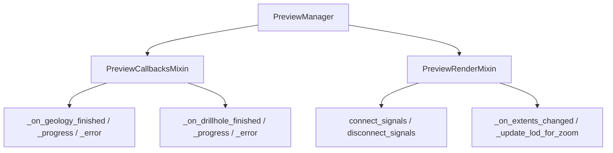

---
tags:
  - secinterp
  - code-walkthrough
  - gui
  - preview-manager
  - mixins
aliases:
  - preview_callbacks_mixin.py
  - preview_render_mixin.py
  - PreviewManager
cssclass: secinterp-note
---

# `gui/dialog_preview_manager.py` — mixins

> [!abstract] One-line summary
> The former 435-line `dialog_preview_manager.py` was decomposed (2026-09-20); `PreviewManager` keeps 231 lines with `generate_preview`, `_process_preview_data`, `_handle_geometric_changes`, and `_update_crs_label`.

**Path**: `gui/dialog_preview_manager.py` (231 lines) + `gui/preview_callbacks_mixin.py` (119), `gui/preview_render_mixin.py` (109)
**Class**: `PreviewManager(TranslatableMixin, PreviewCallbacksMixin, PreviewRenderMixin)`
**Layer**: GUI · Managers
**Tags**: #secinterp #gui #preview-manager #mixins

---

## 🎯 Why does this file exist?

| Problem | Solution |
|---------|----------|
| A 435-line file with async callbacks, rendering, and LOD | Two mixins + the central orchestration |
| Signals connected far from their slots | `connect_signals`/`disconnect_signals` live next to their slots |
| Zoom re-render spam | Debounce with `QTimer` in the render mixin |

> [!important] qgis-analyzer rule
> Signal wiring stays in the same module as its slots (`PreviewRenderMixin`), satisfying the per-file signal-leak/missing-slot rules.

---

## 🧬 Relationship diagram

---

## 🧱 `PreviewCallbacksMixin` — async callbacks

| Method | Role |
|--------|------|
| `_on_geology_finished` | Stores `cached_data["geol"]`, re-renders, and `orchestrator.remove_task` |
| `_on_geology_progress` / `_on_geology_error` | Progress text / `ProcessingError` via `handle_error` |
| `_on_drillhole_finished` / `_progress` / `_error` | Drillhole equivalents (unpack the tuple) |
| `_update_results_display` | Rebuilds `PreviewResult` and formats with `PreviewReporter` |
| `_get_buffer_distance` | `page_section.buffer_spin.value()` |

---

## 🧱 `PreviewRenderMixin` — rendering and LOD

| Method | Role |
|--------|------|
| `connect_signals` / `disconnect_signals` | Connect `debounce_timer.timeout` and `canvas.extentsChanged` (idempotent) |
| `_run_render_pipeline` | Validates `plugin_instance` and times the render |
| `_render_cached_data` | Re-renders with current options; `preserve_extent` keeps the canvas still |
| `update_from_checkboxes` | Re-renders when `last_result` exists |
| `_on_extents_changed` / `_update_lod_for_zoom` | Starts the `QTimer` and re-renders with `preserve_extent=True` |

---

## 🏛️ Design patterns present

| Pattern | Where | Purpose |
|---------|-------|---------|
| **Mixin composition** | Two bases | Separate callbacks from rendering |
| **Observer** | Qt signals (`extentsChanged`) | React to zoom |
| **Debounce** | `QTimer` + `ZOOM_DEBOUNCE_MS` | LOD without spam |
| **Cache** | Shared `PreviewCache` | Avoid recomputation |

---

## 👀 Observations and notes

> [!success] Strengths
> - Manager drops from 435 to 231 lines; signals next to their slots.
> - Debounce and cache keep rendering smooth.

> [!warning] Points of attention
> - The callbacks depend on the manager's `self.orchestrator` and `self.cached_data`.
> - `_update_results_display` and `_update_ui_state` duplicate the message formatting.

---

## 🔗 Related notes

- [[Index]] — vault index
- [[dialog_preview_manager]] — the class that composes these mixins
- [[preview_state]] — shared `PreviewCache`
- [[preview_renderer]] — low-level render
- [[main_dialog]] — creates the manager

---

*Note of the SecInterp Code Walkthrough vault — v3.8.0*
