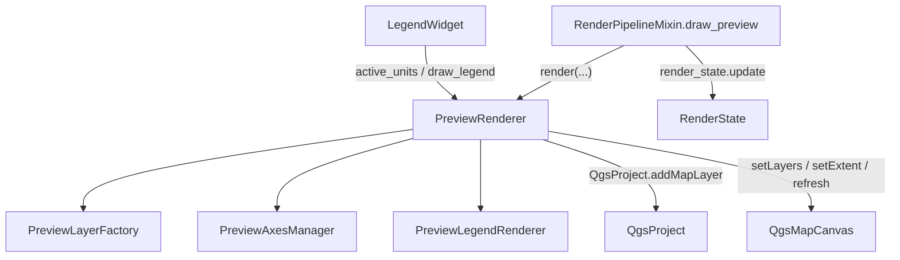

---
tags:
  - secinterp
  - code-walkthrough
  - gui
  - preview
  - renderer
aliases:
  - preview_renderer.py
  - PreviewRenderer
cssclass: secinterp-note
---

# `gui/preview_renderer.py`

> [!abstract] One-line summary
> Preview render orchestrator: cleans up previous layers, asks `PreviewLayerFactory` for the data layers, adds axes/labels, registers them in the project, and configures the `QgsMapCanvas`.

**Path**: `gui/preview_renderer.py` (306 lines)
**Class**: `PreviewRenderer`
**Layer**: GUI · Preview
**Tags**: #secinterp #gui #preview #renderer

---

## 🎯 Why does this file exist?

Rendering the preview mixes layer creation, extent, axes, legend, and the lifecycle of QGIS C++ objects. Without an orchestrator, that logic would end up inside the dialog.

| Problem | Solution |
|---------|----------|
| Layer creation is varied and complex | Delegates to `PreviewLayerFactory` |
| Axes/grid have their own math | Delegates to `PreviewAxesManager` |
| The legend needs a `QPainter` | Delegates to `PreviewLegendRenderer` |
| Render re-entrancy (zoom + checkbox) causes crashes | `is_rendering` guard |
| Transient layers must be released | `_cleanup_layers()` + `_cleanup_rubber_bands()` |

> [!important] Layers in the project (QGIS 4)
> The code comments that in QGIS 4 layers must belong to a `QgsProject` to render reliably. That is why they are registered with `addMapLayer(layer, False)` (no legend) and removed at the start of the next render.

---

## 🧬 Relationship diagram



> [!tip] How to read
> `PreviewRenderer` is the only class that touches `QgsProject` and the canvas; the specialized components never know the canvas.

---

## 📦 Imports — architectural reading

```python
import contextlib
from typing import Any

from qgis.core import QgsProject, QgsWkbTypes
from qgis.gui import QgsMapCanvas
from qgis.PyQt.QtCore import QRectF
from qgis.PyQt.QtGui import QPainter

from sec_interp.core.domain import (
    GeologyData, InterpretationPolygon, ProfileData, StructureData,
)
from .preview_axes_manager import PreviewAxesManager
from .preview_layer_factory import PreviewLayerFactory
from .preview_legend_renderer import PreviewLegendRenderer
```

| # | Observation |
|---|-------------|
| ① | Imports **domain DTOs** only for type annotations; it processes no business logic. |
| ② | `QgsWkbTypes` is used in `_cleanup_rubber_bands` to reset the rubber band to a polygon. |
| ③ | `contextlib.suppress` protects `extent.scale(1.1)` from partial extents. |
| ④ | The three specialized components live in the same `gui/` package. |

---

## 🧱 `render()` — the central method

```python
def render(self, topo_data: ProfileData, geol_data=None, struct_data=None,
           vert_exag: float = 1.0, dip_line_length: float | None = None,
           max_points: int = 1000, preserve_extent: bool = False,
           use_adaptive_sampling: bool = False, drillhole_data: list | None = None,
           interp_data: list[InterpretationPolygon] | None = None,
           ) -> tuple[QgsMapCanvas | None, list]:
```

### Pipeline sequence

| Step | Action | Key code |
|:----:|--------|----------|
| 0 | **Re-entrancy guard** | `if self.is_rendering: return None, []` |
| 1 | Clean layers and flags | `self._cleanup_layers(); self.has_topography = False` |
| 2 | Collect data layers | `data_layers = self._collect_data_layers(...)` |
| 3 | No layers → exit | `if not data_layers: return None, []` |
| 4 | Axes and labels | `extent = self._calculate_extent(...)` |
| 5 | Order and register | `layers = [labels_layer, *data_layers, axes_layer]` |
| 6 | Configure the canvas | `self._setup_canvas(layers, extent, preserve_extent)` |

```python
try:
    self.is_rendering = True
    ...
    return self.canvas, layers
finally:
    self.is_rendering = False       # the lock is ALWAYS released
```

> [!note] Z-order
> The final list is `[labels, *data, axes]`. Inside `_collect_data_layers` the order is `[struct, geol, topo, topo_fill, *drill, interp]`.

---

## 🧱 `_collect_data_layers()` — composition

```python
topo_layer = self.layer_factory.create_topo_layer(topo_data, vert_exag, max_points, use_adaptive)
if topo_layer:
    self.has_topography = True
topo_fill = self.layer_factory.create_topo_fill_layer(topo_data, vert_exag, max_points)
geol_layer = self.layer_factory.create_geol_layer(geol_data, vert_exag, max_points)
struct_layer = self._add_struct_layer(struct_data, topo_data, geol_data, vert_exag, dip_len)
drill_layers = self._add_drillhole_layers(drill_data, vert_exag)
interp_layer = self.layer_factory.create_interp_layer(interp_data, vert_exag)
```

`_add_struct_layer` picks the **elevation reference**: topography when available; otherwise it flattens the geology points. This feeds the dip-line length.

---

## 🧱 `_setup_canvas()` and cleanup

```python
if not self.canvas or not extent:
    return
self.canvas.setLayers(layers)
if not preserve_extent:
    padded_extent = extent
    with contextlib.suppress(AttributeError, TypeError, RuntimeError):
        padded_extent.scale(1.1)          # 10% margin
    self.canvas.setExtent(padded_extent)
self.canvas.refresh()
if self.canvas.scene():
    self.canvas.scene().update()          # forced repaint on Qt6
```

| Method | Role |
|--------|------|
| `_cleanup_layers(layers=None)` | `removeMapLayers(valid_ids)`, resets `active_units` and rubber bands |
| `_get_valid_layer_ids(layers)` | Filters dead C++ objects (`RuntimeError`/`AttributeError`) |
| `_cleanup_rubber_bands()` | `hide()`, `reset(PolygonGeometry)`, `scene.removeItem(rb)` |
| `_calculate_extent(layers)` | `combineExtentWith` over all layers |

> [!warning] C++ memory
> `_cleanup_rubber_bands` is intentionally defensive: resetting and removing from the `scene` releases C++ objects that would otherwise leak or segfault.

---

## 🏛️ Design patterns present

| Pattern | Where | Purpose |
|---------|-------|---------|
| **Facade / Orchestrator** | `render()` | Coordinates factory, axes, legend, and canvas |
| **Delegation** | `layer_factory`, `axes_manager`, `legend_renderer` | Each component does one thing |
| **Re-entrancy guard** | `is_rendering` + `try/finally` | Avoids overlapping renders (zoom + checkbox) |
| **Property proxy** | `active_units` | Exposes the factory state to the legend |
| **Graceful degradation** | `contextlib.suppress`, `_get_valid_layer_ids` | Tolerates partial or dead QGIS objects |

---

## 🧾 API summary

| Symbol | Signature | Typical use |
|--------|-----------|-------------|
| `PreviewRenderer(canvas=None)` | `__init__` | Created by the plugin with the dialog canvas |
| `active_units` | `@property -> dict[str, Any]` | Consumed by `LegendWidget` |
| `render(...)` | `-> tuple[QgsMapCanvas | None, list]` | Render entry point |
| `draw_legend(painter, rect)` | `-> None` | Delegates to `PreviewLegendRenderer` |
| `_collect_data_layers(...)` | `-> list` | Creates and orders data layers |
| `_setup_canvas(layers, extent, preserve_extent)` | `-> None` | Configures canvas layers and extent |
| `_cleanup_layers(layers=None)` | `-> None` | Releases layers and rubber bands |

---

## 👀 Observations and notes

> [!success] Strengths
> - **Anti-reentrancy**: the `is_rendering` lock with `finally` prevents concurrent renders and crashes.
> - **Leak-free**: defensive cleanup of layers and rubber bands.
> - **Clean delegation**: it does not know how each layer is styled.

> [!warning] Points of attention
> - The docstring mentions `PreviewOptimizer`, but the renderer never imports it: it lives in `PreviewLayerFactory`.
> - `is_rendering` is a plain boolean; not thread-safe if render were invoked from a thread.

---

## 🔗 Related notes

- [[preview_layer_factory]] — creates and styles the data layers
- [[preview_axes_manager]] — grid and axis labels
- [[preview_state]] — `RenderState` stores the resulting `canvas`/`layers`
- [[renderers]] — layer renderers applied by the factory
- [[preview_mixins]] — `PreviewRenderMixin` calls `draw_preview`
- [[Index]] — vault index

---

*Note of the SecInterp Code Walkthrough vault — v3.8.0*
