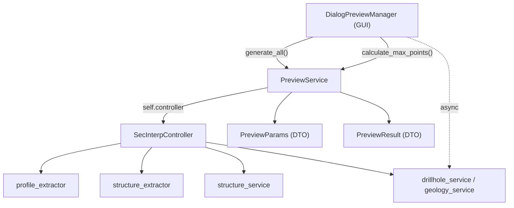

---
tags:
  - secinterp
  - code-walkthrough
  - core
  - preview-service
aliases:
  - preview_service.py
  - PreviewService
cssclass: secinterp-note
---

# `core/services/preview_service.py`

> [!abstract] One-line summary
> Orchestrates **synchronous** preview generation (topography + structures) from the controller, computes the canvas **LOD**, and exposes the services used by the asynchronous geology/drillhole tasks.

**Path**: `core/services/preview_service.py` (175 lines)
**Class**: `PreviewService`
**Layer**: Core · Services (QGIS-agnostic)
**Tags**: #secinterp #core #preview-service

---

## 🎯 Why does this file exist?

`DialogPreviewManager` (GUI) must not know about `profile_extractor`, `structure_extractor`, or `structure_service`. It needs **a single entry point** returning a consolidated `PreviewResult` with metrics.

| Problem | Solution |
|---------|----------|
| The GUI would chain 3–4 services and build the DTO itself | `generate_all(params, transform_context)` runs the pipeline and returns a `PreviewResult` |
| The point count must adapt to canvas and zoom | `calculate_max_points()` (pixels + `log10(ratio)` boost) |
| Geology and drillholes are slow and must not block the UI | It generates only topo + structures; the rest is launched async |

> [!important] Core boundary
> 100% QGIS-agnostic: it receives `PreviewParams` (a DTO) and an opaque `transform_context`. It imports nothing from `qgis.*`.

---

## 🧬 Relationship diagram



> [!tip] How to read
> Solid arrow = call/import; dotted = asynchronous use. `PreviewService` is the only core gateway into the pipeline.

---

## 📦 Imports — architectural reading

```python
import math
from typing import Any

from sec_interp.core.domain import PreviewParams, PreviewResult
from sec_interp.core.exceptions import ProcessingError
from sec_interp.core.performance_metrics import PerformanceTimer
from sec_interp.logger_config import get_logger
```

| # | Observation |
|---|-------------|
| ① | `math` is only used for `log10(ratio)` in the LOD boost. |
| ② | `PreviewParams` / `PreviewResult` are the typed input/output contract. |
| ③ | `ProcessingError` is raised when required topography layers are missing. |
| ④ | `PerformanceTimer` measures each step and accumulates in `result.metrics`. |
| ⑤ | **Zero QGIS imports** → testable with plain mocks. |

---

## 🧱 `calculate_max_points()` — adaptive LOD

```python
@staticmethod
def calculate_max_points(canvas_width, manual_max=1000, auto_lod=True, ratio=1.0) -> int:
    if auto_lod:
        base_points = max(200, int(canvas_width * 2))
        ZOOM_DETAIL_BOOST_THRESHOLD = 1.1
        if ratio > ZOOM_DETAIL_BOOST_THRESHOLD:
            detail_boost = 1.0 + (math.log10(ratio) * 0.5)
            return int(base_points * detail_boost)
        return base_points
    return manual_max
```

| Parameter | Role |
|-----------|------|
| `canvas_width` | Width in pixels; base is `2×` (retina quality). |
| `manual_max` | User ceiling; **only when `auto_lod=False`**. |
| `ratio` | `full_extent / current_extent`; if `> 1.1` applies `1 + log10(ratio)·0.5`. |
| **Return** | Minimum of 200 points to avoid a degenerate line. |

> [!note] The `1.1` threshold avoids recomputing on micro-zooms; `log10` keeps the boost slow and bounded.

---

## 🧱 `generate_all()` — the synchronous pipeline

```python
def generate_all(self, params: PreviewParams, transform_context: Any) -> PreviewResult:
    params.validate()                                    # native DTO validation
    result = PreviewResult(buffer_dist=params.buffer_dist)
    self.transform_context = transform_context
    self._generate_topography_step(params, result)       # Step 1
    self._generate_structures_step(params, result)       # Step 2
    return result
```

### Step 1 — `_generate_topography_step()`

```python
with PerformanceTimer("Topography Generation", result.metrics):
    if not line_lyr or not raster_lyr:
        raise ProcessingError("Required layers for topography are missing.")
    interval = None
    if params.auto_lod:
        interval = self.controller.profile_extractor.calculate_lod_interval(
            line_lyr, params.canvas_width
        )
    result.topo = self.controller.profile_extractor.extract_profile(
        line_lyr, raster_lyr, params.band_num, interval=interval,
    )
    if result.topo:
        result.metrics.record_count("Topography Points", len(result.topo))
```

### Step 2 — `_generate_structures_step()`

Runs only when `struct_layer`, `dip_field`, and `strike_field` are present. It extracts the context and projects via a **sampler** (a closure over the raster):

```python
ctx = extractor.extract_section_and_structures(
    params.line_layer, struct_lyr, params.buffer_dist
)
if ctx is None:
    return

def elevation_sampler(x, y):
    return extractor.sample_elevation(raster_lyr, x, y, params.band_num)

result.struct = self.controller.structure_service.project_structures(
    line_points=ctx.line_points, struct_data=ctx.structures,
    elevation_sampler=elevation_sampler, line_az=ctx.line_azimuth,
    dip_field=params.dip_field, strike_field=params.strike_field,
)
```

> [!warning] Geology is **not** generated here
> `generate_all()` only covers topography and structures. Geology and drillholes are launched as `QgsTask`s from `DialogPreviewManager._trigger_async_updates()`.

---

## 🏛️ Design patterns present

| Pattern | Where | Purpose |
|---------|-------|---------|
| **Facade / Orchestrator** | `generate_all()` | One call over 3 services |
| **Template Method** | `_generate_*_step` | Separate phases and isolate errors |
| **Strategy / Callback** | `elevation_sampler` | Inject sampling without coupling |
| **DTO** | `PreviewParams` / `PreviewResult` | Typed GUI ↔ Core boundary |

---

## 🧾 API summary

| Symbol | Signature | Typical use |
|--------|-----------|-------------|
| `PreviewService(controller)` | `__init__` | Built in `main_dialog` |
| `drillhole_service` / `geology_service` / `structure_service` | `@property` | Consumed by `PreviewTaskOrchestrator` |
| `calculate_max_points(...)` | `@staticmethod -> int` | Canvas LOD (`PreviewRenderMixin`) |
| `generate_all(params, transform_context)` | `-> PreviewResult` | Full synchronous pipeline |
| `_generate_topography_step` / `_generate_structures_step` | `-> None` | Private phases |

---

## 👀 Observations and notes

> [!success] Strengths
> - **Zero QGIS**: testable with `MagicMock` (`tests/core/test_preview_service.py`).
> - **Built-in metrics** and **cheap LOD** (closed-form, stateless).

> [!warning] Points of attention
> - `self.transform_context` is stored but **never used** (leftover from the CRS migration).
> - `_generate_structures_step` has three silent `return`s with no user warning.

---

## 🔗 Related notes

- [[controller]] — provides the extractors and services
- [[domain]] — defines `PreviewParams` / `PreviewResult`
- [[preview_renderer]] — consumes the `PreviewResult`
- [[dialog_preview_manager]] — calls `generate_all()` and launches async tasks
- [[tasks]] — asynchronous geology and drillholes
- [[Index]] — vault index

---

*Note of the SecInterp Code Walkthrough vault — v3.8.0*
