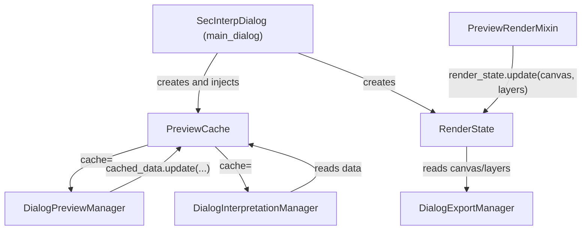

---
tags:
  - secinterp
  - code-walkthrough
  - gui
  - preview
aliases:
  - preview_state.py
  - PreviewCache
  - RenderState
cssclass: secinterp-note
---

# `gui/preview_state.py`

> [!abstract] One-line summary
> Two mutable containers **shared by injection** across the dialog managers: `PreviewCache` (data `topo/geol/struct/drillhole`) and `RenderState` (canvas + rendered layers).

**Path**: `gui/preview_state.py` (57 lines)
**Classes**: `PreviewCache`, `RenderState`
**Layer**: GUI · Shared state
**Tags**: #secinterp #gui #preview

---

## 🎯 Why does this file exist?

Previously, `PreviewManager`, `InterpretationManager`, and `ExportManager` passed the whole dialog around and read loose attributes (`current_canvas`, `current_layers`), creating circular coupling and scattered state.

| Problem | Solution |
|---------|----------|
| `InterpretationManager` needed the data produced by `PreviewManager` | A `PreviewCache` injected into both: neither reaches into the other |
| Export depended on loose dialog attributes | `RenderState` is the **source of truth** for `canvas` + `layers` |
| Cache keys were loose strings and could diverge | `_CACHE_KEYS` centralizes the contract |

> [!important] Shared object, not a Singleton
> `main_dialog` creates **one instance** of each class and injects it via the constructor. State stays per-dialog and is easy to test.

---

## 🧬 Relationship diagram



> [!tip] How to read
> `PreviewCache` links the two preview managers without them knowing each other; `RenderState` links the render pipeline to the exporter.

---

## 📦 Imports — architectural reading

```python
from __future__ import annotations

from typing import Any

_CACHE_KEYS = ("topo", "geol", "struct", "drillhole")
```

| # | Observation |
|---|-------------|
| ① | No `qgis` imports: it is a **pure state** module (even though it lives under `gui/`). |
| ② | `Any` decouples the container from domain DTOs (`ProfileData`, `GeologyData`, ...). |
| ③ | `_CACHE_KEYS` is the single definition of the key contract. |

---

## 🧱 `PreviewCache` — generated data

```python
class PreviewCache:
    def __init__(self) -> None:
        self._data: dict[str, Any] = dict.fromkeys(_CACHE_KEYS)

    def get(self, key: str, default: Any = None) -> Any:
        return self._data.get(key, default)

    def update(self, other: dict[str, Any] | None = None, **kwargs: Any) -> None:
        if other:
            self._data.update(other)
        if kwargs:
            self._data.update(kwargs)

    def __getitem__(self, key: str) -> Any: ...
    def __setitem__(self, key: str, value: Any) -> None: ...
```

| Member | Behavior |
|--------|----------|
| `__init__` | `dict.fromkeys(_CACHE_KEYS)` → all 4 keys exist with value `None`. |
| `get(key, default)` | Safe access without `KeyError`. |
| `update(other, **kwargs)` | Accepts both a mapping and kwargs (like `dict.update`). |
| `__getitem__` / `__setitem__` | Allows `cache["topo"]` in addition to `cache.get("topo")`. |

> [!note] Real usage
> `DialogPreviewManager._update_cache_and_metrics()` dumps `result.topo/geol/struct/drillhole`; `PreviewRenderMixin` reads them via `self.cached_data["topo"]`.

---

## 🧱 `RenderState` — render output

```python
class RenderState:
    def __init__(self) -> None:
        self.canvas: Any = None
        self.layers: list = []

    def update(self, canvas: Any, layers: list) -> None:
        self.canvas = canvas
        self.layers = layers
```

| Member | Behavior |
|--------|----------|
| `canvas` | The preview `QgsMapCanvas` (or `None` if nothing has rendered yet). |
| `layers` | List of transient layers in Z-order. |
| `update(canvas, layers)` | Overwrites both atomically. |

> [!warning] Single writer
> It is written by `RenderPipelineMixin.draw_preview()` after `preview_renderer.render()`; `DialogExportManager` reads it at `dialog_export_manager.py:52` (`render_state.canvas`), `:58` (`.layers()`), and `:122` (`.extent()`).

---

## 🏛️ Design patterns present

| Pattern | Where | Purpose |
|---------|-------|---------|
| **Shared State / Blackboard** | `PreviewCache` | Coordinate managers without direct coupling |
| **Value holder / State object** | `RenderState` | Replace loose attributes with a contract-bearing object |
| **Dependency Injection** | `cache=` constructors | The dialog owns the instance |
| **DTO / Typed mapping** | `_CACHE_KEYS` + `dict[str, Any]` | Explicit key contract |

---

## 🧾 API summary

| Symbol | Signature | Typical use |
|--------|-----------|-------------|
| `_CACHE_KEYS` | `tuple[str, ...]` | `("topo", "geol", "struct", "drillhole")` |
| `PreviewCache()` | `__init__` | Created in `main_dialog._init_managers` |
| `PreviewCache.get(key, default=None)` | `-> Any` | Safe reads in the render mixin |
| `PreviewCache.update(other=None, **kwargs)` | `-> None` | Dump of the `PreviewResult` |
| `RenderState()` | `__init__` | Created in `main_dialog` |
| `RenderState.update(canvas, layers)` | `-> None` | Written by `draw_preview` |

---

## 👀 Observations and notes

> [!success] Strengths
> - **Loose coupling**: managers share data without referencing each other.
> - **Explicit contract** (`_CACHE_KEYS`) and **testable** without QGIS.

> [!warning] Points of attention
> - `PreviewCache` does not validate keys: `cache["foo"]` creates the entry silently.
> - `RenderState.layers` is an exposed mutable list; there is no notification/observer.

---

## 🔗 Related notes

- [[main_dialog]] — creates and injects both instances
- [[dialog_preview_manager]] — writes `PreviewCache`
- [[dialog_export_manager]] — reads `RenderState` to export
- [[preview_renderer]] — produces the `canvas`/`layers` stored in `RenderState`
- [[preview_mixins]] — `PreviewRenderMixin` stores the output into `RenderState`
- [[Index]] — vault index

---

*Note of the SecInterp Code Walkthrough vault — v3.8.0*
