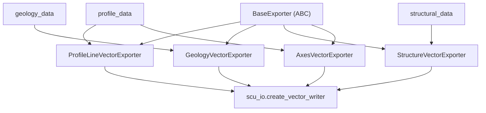

---
tags:
  - secinterp
  - code-walkthrough
  - exporters
aliases:
  - profile_exporters.py
  - ProfileLineVectorExporter
cssclass: secinterp-note
---

# `exporters/profile_exporters.py`

> [!abstract] One-line summary
> Facade of **four profile vector exporters** — topographic line, geology, structures (with dip geometry) and axes — sharing `BaseExporter` and writing SHP/GPKG/DXF through `scu_io.create_vector_writer`.

**Path**: `exporters/profile_exporters.py` (362 lines)
**Classes**: `ProfileLineVectorExporter`, `GeologyVectorExporter`, `StructureVectorExporter`, `AxesVectorExporter`
**Layer**: Exporters (QGIS · format strategies)
**Tags**: #secinterp #exporters #profile

---

## 🎯 Why does this file exist?

Everything drawn on the profile (topography, geology, dips, axes) must land on disk as vectors. This module concentrates that responsibility into four specialized strategies.

| Problem | Solution |
|---------|----------|
| The `(dist, elev)` line is not an ordinary feature | `ProfileLineVectorExporter` → `LineString` with an `id` field |
| Geology is segments with heterogeneous attributes | `GeologyVectorExporter` infers fields from the first segment |
| Structures are not a point: the dip must be drawn | `StructureVectorExporter` computes the dip geometry |
| The chart axes must be reproducible | `AxesVectorExporter` emits Left/Right/Bottom with 5% padding |

> [!important] Architectural boundary
> `exporters/` **does depend on QGIS** (`QgsGeometry`, `QgsPointXY`, `QgsFields`). It is not pure core: it materializes the DTOs coming from `core` onto disk.

---

## 🧬 Relationship diagram



---

## 📦 Imports — architectural reading

`math` only for the dip; `QgsGeometry`/`QgsPointXY` build the 2D geometry; `scu_io` resolves the driver by extension; `QgsWkbTypes` is not imported because `fromPolylineXY` already fixes `LineString`. Only constant: `MIN_REQUIRED_POINTS = 2`.

---

## 🧱 `ProfileLineVectorExporter` — the topographic line

```python
points = [QgsPointXY(d, e) for d, e in profile_data]
geom = QgsGeometry.fromPolylineXY(points)
fields = QgsFields()
fields.append(QgsField("id", QMetaType.Type.Int))
writer = scu_io.create_vector_writer(str(output_path), crs, fields, layer_name=layer_name)
feat = QgsFeature()
feat.setGeometry(geom)
feat.setAttributes([1])
writer.addFeature(feat)
```

| Aspect | Detail |
|--------|--------|
| Input | `data["profile_data"]` + `data["crs"]` |
| Geometry | `LineString` from `(distance, elevation)` |
| Output | **A single feature** with `id = 1` |

---

## 🧱 `GeologyVectorExporter` — segments with attributes

Fields are inferred from the **first** segment (all `QString`); each segment is dropped if it has fewer than 2 points:

```python
for key in geology_data[0].attributes:
    fields.append(QgsField(key, QMetaType.Type.QString))

def _create_geology_feature(self, segment, fields):
    if len(segment.points) < MIN_REQUIRED_POINTS:
        return None
    geom = QgsGeometry.fromPolylineXY([QgsPointXY(d, e) for d, e in segment.points])
    feat = QgsFeature(fields)
    feat.setGeometry(geom)
    for key, val in segment.attributes.items():
        idx = fields.indexOf(key)
        if idx >= 0:
            feat.setAttribute(idx, val)
    return feat
```

> [!note] Segments as lines
> Despite the name, the segment is exported as a `LineString` (not a polygon). The geometry comes from `segment.points`, already in profile coordinates.

---

## 🧱 `StructureVectorExporter` — drawing the dip

It adds three computed fields (`app_dip`, `dist`, `elev`, `Double`) and builds the dip line:

```python
def _calculate_dip_geometry(self, m: Any, line_length: float) -> QgsGeometry:
    rad_dip = math.radians(m.apparent_dip)
    dy = -line_length * math.sin(abs(rad_dip))
    dx = line_length * math.cos(abs(rad_dip))
    if m.apparent_dip < 0:
        dx = -dx
    p1 = QgsPointXY(m.distance, m.elevation)
    p2 = QgsPointXY(m.distance + dx, m.elevation + dy)
    return QgsGeometry.fromPolylineXY([p1, p2])
```

`line_length = raster_res * dip_scale_factor` (defaults `1.0` and `4`). `dy` is always negative (the dip "falls") and `dx` flips sign when `apparent_dip < 0`.

---

## 🧱 `AxesVectorExporter` — the chart axes

It computes the bounding box, pads it by 5% and emits three lines labelled `Left`/`Right`/`Bottom`:

```python
e_range = max_e - min_e
min_e_padded = min_e - e_range * 0.05
max_e_padded = max_e + e_range * 0.05
lines = [
    [QgsPointXY(min_d, min_e_padded), QgsPointXY(min_d, max_e_padded)],
    [QgsPointXY(max_d, min_e_padded), QgsPointXY(max_d, max_e_padded)],
    [QgsPointXY(min_d, min_e_padded), QgsPointXY(max_d, min_e_padded)],
]
fields.append(QgsField("axis", QMetaType.Type.QString))
```

> [!warning] Degenerate cases guarded
> If `max_d == min_d` it forces `+100`, and if `max_e == min_e` it forces `+10`. Without that guard, a flat profile would collapse the 5% padding.

---

## 🏛️ Design patterns present

| Pattern | Where | Purpose |
|---------|-------|---------|
| **Template Method** | `BaseExporter` | `export()` contract + path validation |
| **Strategy** | The 4 classes | One strategy per profile data type |
| **Schema inference** | `_create_*_fields` | Fields derived from the first element |
| **Fail-safe** | `try/except/else` | Logs with `logger.exception` and returns `False` |

---

## 🧾 API summary

| Symbol | Signature / Inherits | Typical use |
|--------|----------------------|-------------|
| `ProfileLineVectorExporter` | `BaseExporter` | Topographic line → 1 feature `id=1` |
| `GeologyVectorExporter` | `BaseExporter` | Geological segments → polylines |
| `StructureVectorExporter` | `BaseExporter` | Measurements → dip lines |
| `AxesVectorExporter` | `BaseExporter` | 3 axes (Left/Right/Bottom) |
| `get_supported_extensions()` | `-> list[str]` | `[".shp", ".gpkg", ".dxf"]` in all 4 |

---

## 👀 Observations and notes

> [!success] Strengths
> - The dip computation is isolated in `_calculate_dip_geometry`, easy to test.
> - All return `bool` and never propagate an I/O failure.

> [!warning] Points of attention
> - The schema is inferred from the **first** element; attributes present only in later segments are ignored.
> - Geology/structure attributes are declared `QString`, even when numeric.

> [!question] Open questions
> - Should geology be exported as a polygon when the segment closes an area?

---

## 🔗 Related notes

- [[Index]] — vault index
- [[base_exporter]] — contract, validation and factory
- [[vector_exporter]] — generic SHP/GPKG/DXF counterpart
- [[export_package]] — orchestrator that invokes these exporters
- [[profile_service]] · [[geology_service]] · [[structure_service]] — DTO sources

---

*Note of the SecInterp Code Walkthrough vault — v3.8.0*
