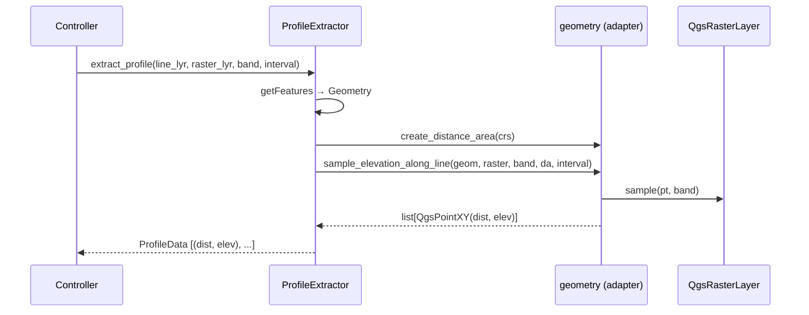

---
tags:
  - secinterp
  - code-walkthrough
  - gui
  - adapters
  - profile
aliases:
  - profile_extractor.py
  - ProfileExtractor
  - profile_service
cssclass: secinterp-note
---

# `profile_extractor.py` / `ProfileService`

> [!abstract] One-line summary
> The **topography extraction adapter** (Extract phase): reads the section line and samples the DEM, returning a pure `ProfileData`.

**Real path**: `gui/adapters/profile_extractor.py` (86 lines)
**Class**: `ProfileExtractor`
**Historic path**: `core/services/profile_service.py` (moved to GUI in v3.8)
**Layer**: GUI · Adapters
**Tags**: #secinterp #gui #adapters #profile

> [!note] Name clarification
> The index lists `13 - profile_service`. Since v3.8 the logic **lives in the adapter** `ProfileExtractor` (GUI). There is no longer a `ProfileService` in `core/`; extraction is pure *Extract*, later computation (if any) uses already-decoupled data. This note documents `profile_extractor.py`.

---

## 🎯 Why does this file exist?

Topography is the **mandatory base** of the section. This adapter solves:

| Problem | Solution |
|---------|----------|
| Need elevations along the line | `extract_profile()` densifies + samples |
| LOD based on canvas width | `calculate_lod_interval()` derives the interval |
| Don't leak `QgsRasterLayer` into the core | Returns `ProfileData = list[tuple[float, float]]` |

> [!important] Pure Extract-then-Compute
> This adapter **does not compute** in the core; it *extracts* and transforms to primitives. The core (`[[controller]]`) receives only ready `ProfileData`.

---

## 🧬 Extraction flow



---

## 🧱 Method 1 — `calculate_lod_interval()`

```python
def calculate_lod_interval(self, line_lyr: QgsVectorLayer, canvas_width: int) -> float | None:
    line_feat = next(line_lyr.getFeatures(), None)
    if not line_feat:
        return None
    line_geom = line_feat.geometry()
    if not line_geom or line_geom.isNull():
        return None

    line_len = line_geom.length()
    max_pts = max(200, int(canvas_width * 2))
    return line_len / max_pts if max_pts > 0 else None
```

| Detail | Explanation |
|--------|-------------|
| **`canvas_width * 2`** | ~2 points per pixel → visual density without excess |
| **`max(200, ...)`** | Guaranteed minimum for very small canvas |
| **Return `None`** | If line is empty, the caller decides the fallback |

> [!tip] LOD = Level of Detail
> Small interval → more points → more detail; large canvas width → more points.

---

## 🧱 Method 2 — `extract_profile()`

```python
def extract_profile(
    self,
    line_lyr: QgsVectorLayer,
    raster_lyr: QgsRasterLayer,
    band_number: int = 1,
    interval: float | None = None,
) -> ProfileData:
    line_feat = next(line_lyr.getFeatures(), None)
    if not line_feat:
        raise DataMissingError(self.tr("Line layer has no features"), {"layer": line_lyr.name()})

    geom = line_feat.geometry()
    if not geom or geom.isNull():
        raise GeometryError(self.tr("Line geometry is not valid"), {"layer": line_lyr.name()})

    da = geometry.create_distance_area(line_lyr.crs())
    points = geometry.sample_elevation_along_line(
        geom, raster_lyr, band_number, da, interval=interval
    )
    return [(round(p.x(), 1), round(p.y(), 1)) for p in points]
```

### Step by step

| Step | What it does | Helper in `geometry.py` |
|------|--------------|-------------------------|
| 1. Get feature | `next(line_lyr.getFeatures())` | — |
| 2. Validate | `isNull()` | — |
| 3. Create `QgsDistanceArea` | For geodetic distance | `create_distance_area(crs)` |
| 4. Densify + sample | Insert vertices every `interval` and sample elevation | `sample_elevation_along_line(...)` |
| 5. Flatten | `QgsPointXY(dist, elev)` → rounded `tuple` | `round(p.x(), 1)` |

> [!warning] Rounding to `0.1`
> Precision is truncated to decimetres. Sufficient for display; for scientific computation
> you could keep full `float` and round only at render time.

> [!important] Dependencies on `geometry.py`
> - `create_distance_area` respects CRS and ellipsoid.
> - `sample_elevation_along_line` densifies via `_densify_line_points` (pure math) and accumulates `distance` with `da.measureLine`.
> - If `interval` is `None`, uses `raster.rasterUnitsPerPixelX()` (native resolution).

---

## 🧱 Errors and `tr()`

```python
def tr(self, message: str) -> str:
    return QCoreApplication.translate("ProfileExtractor", message)
```

| Exception | When |
|-----------|------|
| `DataMissingError` | Line layer without features |
| `GeometryError` | Null geometry |

> [!note] `QCoreApplication.translate("ProfileExtractor", ...)`
> Does not inherit `QObject` nor use `TranslatableMixin`; implements a local `tr()` with context = class name. Minimal and explicit.

---

## 🏛️ Design patterns present

| Pattern | Where | Purpose |
|---------|-------|---------|
| **Adapter (Extract)** | `extract_profile` | QGIS → primitives (`ProfileData`) |
| **Façade** | delegates to `geometry.*` | Reuses sampling/densification helpers |
| **Fail-fast** | `raise` early | Validates geometry before sampling |
| **LOD Strategy** | `calculate_lod_interval` | Adjusts detail to canvas |

---

## 🧾 API summary

| Method | Returns | Uses |
|--------|---------|------|
| `calculate_lod_interval(line_lyr, canvas_width)` | `float | None` | `QgsGeometry.length()` |
| `extract_profile(line_lyr, raster_lyr, band=1, interval=None)` | `ProfileData` | `geometry.sample_elevation_along_line` |
| `tr(message)` | `str` | `QCoreApplication.translate` |

---

## 👀 Observations and notes

> [!success] Strengths
> - **Minimal**, focused adapter (86 lines).
> - Returns a domain type (`ProfileData`) → stable contract.
> - Typed errors with context (`layer`).

> [!warning] Points of attention
> - Assumes **first feature** of the layer (`next(...)`) → ignores multi-line/multi-feature.
> - `_densify_line_points` in `geometry.py` is pure math but uses `math.hypot` per segment (OK for short profiles).
> - Does not validate `band_number` (done by `PreviewParams.validate` and the controller).

> [!question] Open questions
> - Support selecting a feature or line `id` instead of "the first one"?
> - Move the `round(..., 1)` rounding to the renderer (preserve precision in data)?

---

## 🔗 Related notes

- [[Index]] — vault index
- [[controller]] — orchestrates `extract_profile` in `_process_topography`
- [[domain]] — `ProfileData`
- [[exceptions]] — `DataMissingError`, `GeometryError`
- [[adapters]] — extractor family
- `gui/adapters/geometry.py` — sampling/densification helpers

---

*Note of the SecInterp Code Walkthrough vault — v3.8.0*
