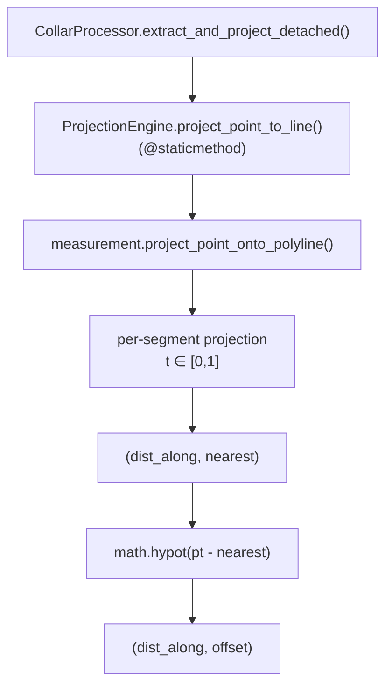

---
tags:
  - secinterp
  - code-walkthrough
  - core
  - drillhole
aliases:
  - projection_engine.py
  - ProjectionEngine
cssclass: secinterp-note
---

# `core/services/drillhole/projection_engine.py`

> [!abstract] One-line summary
> Static facade that projects a point `(x, y)` onto a polyline and returns `(dist_along, offset)` by combining `project_point_onto_polyline` with `math.hypot`.

**Path**: `core/services/drillhole/projection_engine.py` (30 lines)
**Class**: `ProjectionEngine`
**Layer**: Core · Drillhole (QGIS-agnostic)
**Tags**: #secinterp #core #drillhole

---

## 🎯 Why does this file exist?

`CollarProcessor` needs two numbers: **how far along** the section a collar falls and **how far perpendicular** it is from the line. Those two values come from different sources, and it is worth exposing them together behind a semantic API.

| Problem | Solution |
|---------|----------|
| `project_point_onto_polyline` returns `(dist_along, nearest)`, not the offset | `math.hypot` computes the distance to the nearest point |
| The drillhole domain needs a stable API | `ProjectionEngine.project_point_to_line` as a facade |
| Pure geometry must not depend on drillholes | Delegated to `core/utils/geometry_utils` |

> [!important] Core boundary
> It only imports `math` and one pure utility. It touches no QGIS, no CRS, no layers: it is planar math.

---

## 🧬 Relationship diagram



> [!tip] How to read
> `ProjectionEngine` reimplements nothing: it **wraps** a `core/utils` utility and adds the offset computation.

---

## 📦 Imports — architectural reading

```python
import math

from sec_interp.core.utils.geometry_utils.measurement import project_point_onto_polyline
```

| # | Observation |
|---|-------------|
| ① | `math` is pure stdlib: `hypot` avoids a manual `sqrt(dx² + dy²)`. |
| ② | The dependency is a **leaf module** of `core/utils`; the whole package is not imported. |
| ③ | No `qgis`, no `PyQt`, no `core/domain`: the most independent layer of the tree. |

---

## 🧱 `project_point_to_line()` — the only operation

```python
@staticmethod
def project_point_to_line(
    pt: tuple[float, float],
    line_points: list[tuple[float, float]],
) -> tuple[float, float]:
    """Project point to line and return (dist_along, offset)."""
    dist_along, nearest = project_point_onto_polyline(pt, line_points)
    offset = math.hypot(pt[0] - nearest[0], pt[1] - nearest[1])
    return dist_along, offset
```

| Parameter | Role |
|-----------|------|
| `pt` | Point to project, usually the collar `(x, y)` |
| `line_points` | Section line vertices `[(x, y), ...]` |
| **Returns** | `(dist_along, offset)` — station along and perpendicular distance |

### What the delegate does

`project_point_onto_polyline` (in `core/utils/geometry_utils/measurement.py`, 136 lines) walks each segment, computes the parametric projection `t`, **clamps it to `[0, 1]`**, and keeps the segment with the minimum squared distance. It returns:

| Case | Return |
|------|--------|
| Empty polyline | `(0.0, point)` |
| Single vertex | `(0.0, polyline[0])` |
| General case | `(cumulative distance + t·seg_len, nearest point)` |

> [!note] `offset` as `hypot`
> The distance to the nearest point **is** the perpendicular distance to the line within the projected span. For a point whose projection falls beyond the ends, it measures to the end vertex (correct behavior for a section buffer).

---

## 🏛️ Design patterns present

| Pattern | Where | Purpose |
|---------|-------|---------|
| **Facade** | `project_point_to_line` | Simple API over a more detailed utility |
| **Static Utility** | `@staticmethod` | Stateless; needs no instance |
| **Delegation** | `project_point_onto_polyline` | Reuse already-tested geometry |
| **Pure Function** | The whole module | Deterministic and thread-safe |

---

## 🧾 API summary

| Symbol | Signature / Inherits | Typical use |
|--------|----------------------|-------------|
| `ProjectionEngine` | `class` (no inheritance) | Container of static utilities |
| `project_point_to_line` | `@staticmethod (pt: tuple[float, float], line_points: list[tuple[float, float]]) -> tuple[float, float]` | Project a collar onto the section |

---

## 👀 Observations and notes

> [!success] Strengths
> - **Minimal and focused**: 30 lines, a single responsibility.
> - **Reuses** existing geometry instead of duplicating the projection.
> - **100 % pure**: no QGIS, no CRS, no side effects.

> [!warning] Points of attention
> - The math is **planar**: it is only valid in a projected CRS (the `measurement` docstring warns about this). With geographic coordinates the result would be wrong.
> - It does not validate inputs (e.g. `line_points` with `NaN`); that robustness is delegated to the utility.
> - The name `offset` suggests exact perpendicularity; at the ends it is the distance to the vertex.

> [!question] Open questions
> - Should the trajectory engine also reuse this facade instead of `scu.project_trajectory_to_section`?
> - Should a `point_within_buffer(...)` helper be exposed here to unify the `offset <= buffer` filter?

---

## 🔗 Related notes

- [[Index]] — vault index
- [[collar_processor]] — main consumer of this facade
- [[trajectory_engine]] — projects trajectories through another path (`scu`)
- [[layer_core_utils_geometry_utils]] — implementation of `project_point_onto_polyline`
- [[layer_core_services_drillhole]] — pipeline sub-layer

---

*Note of the SecInterp Code Walkthrough vault — v3.8.0*
