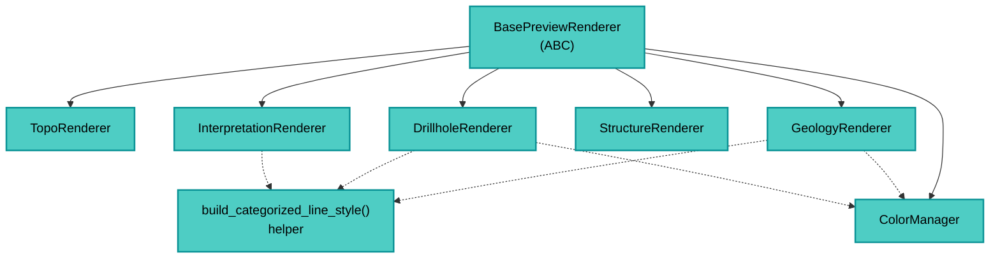

---
tags:
  - secinterp
  - code-walkthrough
  - gui
  - renderers
aliases:
  - gui/renderers
cssclass: secinterp-note
---

# 23 — `gui/renderers/`

> [!abstract] One-line summary
> The **preview styling kit**: 6 specialized renderers + `ColorManager` and symbolic helpers — each dresses one layer type.

**Path**: `gui/renderers/` (package · 8 files)
**Key symbols**: `BasePreviewRenderer`, `TopoRenderer`, `GeologyRenderer`, `DrillholeRenderer`, `StructureRenderer`, `InterpretationRenderer`, `ColorManager`
**Layer**: GUI · Renderers
**Tags**: #secinterp #gui #renderers

---

## 🎯 Why does this package exist?

The preview creates **memory layers** (topography, geology, drillholes, structures, interpretations). Without styling, they'd all look alike. This package solves:

| Problem | Solution |
|---------|----------|
| Consistent colors per geological unit | `ColorManager` with a fixed palette + hash |
| Styling scattered across the code | One renderer per domain (`apply_style(layer, **kwargs)`) |
| Repeated helpers | `build_categorized_line_style` in `base_renderer.py` |

> [!important] GUI-only
> Uses `qgis.core` (`QgsSingleSymbolRenderer`, `QgsCategorizedSymbolRenderer`, etc.). Never goes to the core.

---

## 🧬 Package map



---

## 🧱 `base_renderer.py` — base + helper

```python
class BasePreviewRenderer(ABC):
    @abstractmethod
    def apply_style(self, layer: QgsVectorLayer, **kwargs) -> None: ...

def build_categorized_line_style(
    color_manager, unique_units, field="unit", width="0.7", ...
) -> QgsCategorizedSymbolRenderer:
    categories = []
    for unit in unique_units:
        color = color_manager.get_color(unit)
        symbol = QgsLineSymbol.createSimple({"color": color.name(), "width": width, ...})
        categories.append(QgsRendererCategory(unit, symbol, unit))
    return QgsCategorizedSymbolRenderer(field, categories)
```

| Element | Role |
|---------|------|
| `BasePreviewRenderer` | `apply_style` contract for all |
| `build_categorized_line_style` | Builds a categorized renderer per unit |

---

## 🧱 `color_manager.py` — palette

```python
class ColorManager:
    GEOLOGY_COLORS: ClassVar[list[QColor]] = [
        QColor(231,76,60), QColor(52,152,219), QColor(46,204,113), ...
    ]
    def get_color(self, unit: str) -> QColor:
        return self.GEOLOGY_COLORS[hash(unit) % len(GEOLOGY_COLORS)]
```

> [!tip] Consistent hash
> Same unit → same color every render. No state.

---

## 🧱 Specialized renderers

| Renderer | File | Style | Extra |
|----------|------|-------|-------|
| `TopoRenderer` | `topo_renderer.py` (32 l.) | `QgsGraduatedSymbolRenderer` by elevation | Polychromy |
| `GeologyRenderer` | `geology_renderer.py` (29 l.) | `QgsCategorizedSymbolRenderer` by `unit` | Uses `ColorManager` |
| `DrillholeRenderer` | `drillhole_renderer.py` (71 l.) | Categorized by unit + `QgsPalLayerSettings` labels | Traces + intervals |
| `StructureRenderer` | `structure_renderer.py` (18 l.) | `QgsSingleSymbolRenderer` red `#CC0000` | Dips |
| `InterpretationRenderer` | `interpretation_renderer.py` (43 l.) | `QgsCategorizedSymbolRenderer` by `id` + `interp.color` | Fill with transparency |

> [!note] `InterpretationRenderer` uses `interp.color` directly (not the palette). The user picks it.

---

## 🏛️ Design patterns present

| Pattern | Where | Purpose |
|---------|-------|---------|
| **Strategy** | `BasePreviewRenderer` | One style per domain |
| **Palette** | `ColorManager` | Deterministic colors |
| **Factory helper** | `build_categorized_line_style` | Creates categorized renderers |

---

## 🔗 Related notes

- [[Index]] — vault index
- [[main_dialog]] — orchestrates the preview (creates the `PreviewRenderer` that uses these)
- [[dialog_preview_manager]] — triggers rendering
- [[adapters]] — produce the data these dress

---

*Note 23 of the SecInterp Code Walkthrough vault — v3.8.0*
