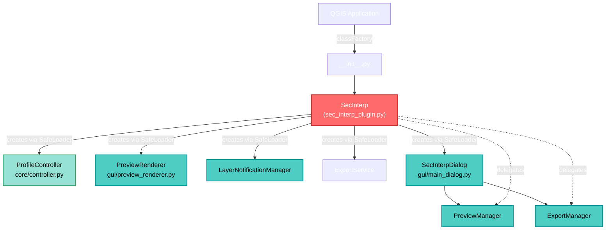
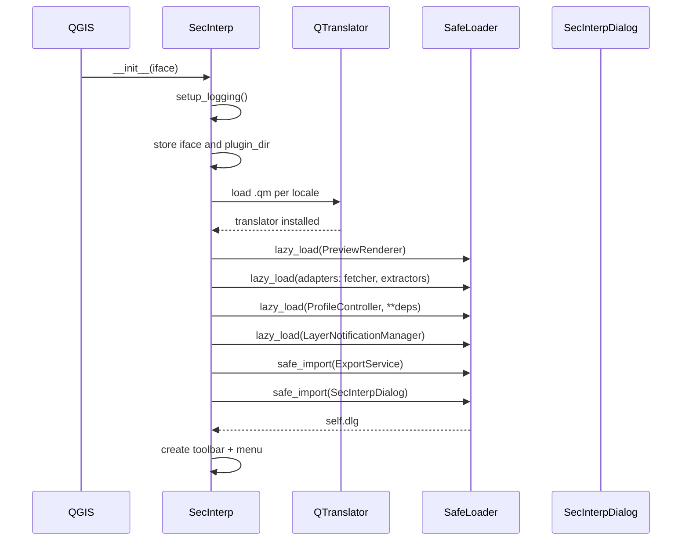
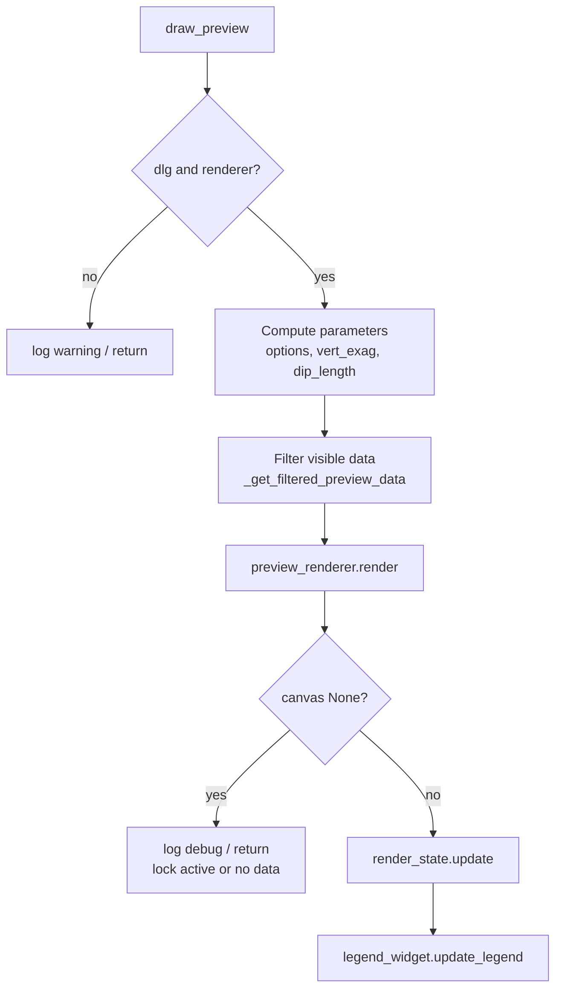

---
tags:
  - secinterp
  - code-walkthrough
  - entry-point
  - plugin-lifecycle
  - di
aliases:
  - sec_interp_plugin.py
  - SecInterp Class
cssclass: secinterp-note
---

# `sec_interp_plugin.py`

> [!abstract] One-line summary
> This is the plugin **entry point**: it defines the `SecInterp` class, which QGIS instantiates on load, and orchestrates its entire **lifecycle** (initialization, GUI, execution, unload).

> [!info] Refactor 2026-09-20
> This 507-line file was decomposed into the `plugin/` package ([[plugin_mixins]]); `SecInterp` is now a **129-line facade** composing the mixins.

**Path**: `sec_interp_plugin.py` (129 lines; formerly 507)
**Main class**: `SecInterp(TranslatableMixin)`
**Layer**: Entry point / Root
**Tags**: #secinterp #entry-point #di #i18n

---

## 🎯 Why does this file exist?

In QGIS, every plugin must expose:

1. An **entry point** that QGIS loads (usually `__init__.py` → `classFactory`).
2. A **root class** with three mandatory methods:
   - `initGui()` — builds menus and toolbar.
   - `unload()` — cleans up everything when the plugin is disabled.
   - `run()` — runs when the button is clicked.

`sec_interp_plugin.py` implements that root class. It **contains no business logic and no complex UI**: it delegates.

> [!important] Key principle
> This class is a **Composition Root**: it builds and injects the dependencies (services, controller, dialog) and wires them together. It is the only place where "everything knows everything".

---

## 🧬 Relationship diagram



---

## 📦 Imports — architectural reading

```python
from qgis.core import QgsMapLayer                          # ①
from qgis.PyQt.QtCore import QCoreApplication, QSettings, QTranslator
from qgis.PyQt.QtGui import QIcon
from qgis.PyQt.QtWidgets import QAction

from sec_interp.core.domain import PreviewParams           # ②
from sec_interp.core.exceptions import SecInterpError
from sec_interp.core.utils.i18n import TranslatableMixin
from sec_interp.core.utils.safe_loader import SafeLoader
from sec_interp.gui.adapters.layer_resolver import resolve_layer  # ③
from sec_interp.logger_config import get_logger, setup_logging
```

| # | Observation |
|---|-------------|
| ① | Imports `qgis.core`/`qgis.PyQt` → **allowed** because it lives in the GUI/root layer, not in `core/`. |
| ② | From `core` it only imports **DTOs, exceptions, and pure utilities** — never concrete services directly. |
| ③ | `resolve_layer` lives in `gui/adapters/` because it uses `QgsProject.instance()`. Respects *Extract-then-Compute*. |

> [!note] Style detail
> Uses `from __future__ import annotations` (required by the coding standards) for deferred typing.

---

## 🔄 Plugin lifecycle

### 1. `__init__(self, iface)` — Initialization

The most important method. Order of operations:



#### 1.1 Logging first
```python
setup_logging()
```
The first action is to enable logging. If anything fails afterwards, it is recorded.

#### 1.2 Localization (i18n)
```python
user_locale = QSettings().value("locale/userLocale", "en")
locale_path = self.plugin_dir / f"i18n/SecInterp_{user_locale}.qm"

MIN_LOCALE_LENGTH = 2
if not locale_path.exists() and user_locale and len(user_locale) > MIN_LOCALE_LENGTH:
    locale_short = user_locale[0:2]                      # "pt_BR" → "pt"
    locale_path = self.plugin_dir / f"i18n/SecInterp_{locale_short}.qm"

if locale_path.exists():
    self.translator = QTranslator()
    self.translator.load(str(locale_path))
    QCoreApplication.installTranslator(self.translator)
```

> [!tip] Locale fallback strategy
> 1. Try the full locale (`pt_BR`).
> 2. If missing, fall back to the 2-letter code (`pt`).
> 3. If still missing, it stays in English (default).

#### 1.3 Dependency Injection (DI) via `SafeLoader`

The order **matters** because of a dependency chain:

```python
# 1. Preview Renderer (heavy GUI component)
self.preview_renderer = SafeLoader.lazy_load(
    "sec_interp.gui.preview_renderer", "PreviewRenderer"
)

# 2. "Extract" phase adapters (QGIS → DTOs)
data_fetcher       = SafeLoader.lazy_load("...feature_fetcher", "DataFetcher")
structure_extractor= SafeLoader.lazy_load("...structure_extractor", "StructureExtractor")
geology_extractor  = SafeLoader.lazy_load("...geology_extractor", "GeologyExtractor")
profile_extractor  = SafeLoader.lazy_load("...profile_extractor", "ProfileExtractor")
drillhole_extractor= SafeLoader.lazy_load(
    "...drillhole_extractor", "DrillholeExtractor", data_fetcher=data_fetcher
)

# 3. Controller (business logic) — receives adapters via constructor
self.controller = SafeLoader.lazy_load(
    "sec_interp.core.controller", "ProfileController",
    data_fetcher=data_fetcher,
    structure_extractor=structure_extractor,
    geology_extractor=geology_extractor,
    profile_extractor=profile_extractor,
    drillhole_extractor=drillhole_extractor,
)
```

> [!important] Why `SafeLoader` instead of a direct `import`
> - **Fault tolerance**: if an optional module fails to load, the plugin **does not crash**; it logs the error and continues.
> - **Lazy loading**: heavy imports are resolved at runtime, speeding up startup.
> - See [[safe_loader]] for the helper details.

> [!warning] Observed coupling
> `ProfileController` receives **GUI-layer** adapters (`gui/adapters/*`) via constructor.
> Conceptually the controller is `core`, yet it is injected with QGIS-dependent extractors.
> This is the **Ports & Adapters** pattern: the controller consumes "ports" (objects with a contract) without importing QGIS directly.

#### 1.4 ExportService (two-step load)

```python
export_mod   = SafeLoader.safe_import("sec_interp.core.services.export_service")
export_klass = SafeLoader.get_class(export_mod, "ExportService")
self.export_service = export_klass(self.controller) if export_klass else None
```
Here it uses `safe_import` + `get_class` (instead of `lazy_load`) because it needs the module and class separately. It receives `self.controller` as a dependency.

#### 1.5 Main dialog
```python
dialog_mod   = SafeLoader.safe_import("sec_interp.gui.main_dialog")
dialog_klass = SafeLoader.get_class(dialog_mod, "SecInterpDialog")
self.dlg     = dialog_klass(self.iface, self) if dialog_klass else None

if self.dlg:
    self.dlg.plugin_instance = self
else:
    logger.error("Failed to initialize main dialog. ...")
```
The dialog receives `iface` and `self` (a controlled circular reference so the dialog can call back into the plugin).

#### 1.6 Toolbar and initial state
```python
self.first_start = True
self.actions = []
self.menu = self.tr("&Sec Interp")
self.toolbar = self.iface.addToolBar(self.tr("Sec Interp"))
self.toolbar.setObjectName("SecInterp")
self.toolbar.setVisible(True)
```

---

### 2. `add_action(...)` — Action helper

Creates a `QAction` and registers it in the toolbar + menu. Key parameters:

| Parameter | Purpose |
|-----------|---------|
| `icon_path` | Path to the icon |
| `text` | Menu item text |
| `callback` | Function to run (`self.run`) |
| `add_to_toolbar` | Adds to the custom toolbar **and** the Plugins toolbar |
| `add_to_menu` | Adds to `Plugins > Sec Interp` |

Returns the `QAction` and accumulates it in `self.actions` (for later cleanup).

---

### 3. `initGui()` — GUI construction

```python
def initGui(self):  # noqa: N802 (name required by QGIS)
    icon_path = str(self.plugin_dir / "icon.png")
    self.add_action(
        icon_path,
        text=self.tr("Geological data extraction"),
        callback=self.run,
        parent=self.iface.mainWindow(),
    )
    self.first_start = True
```

> [!note] `# noqa: N802`
> The name `initGui` is not snake_case, but **QGIS requires it**. The linter is silenced.

---

### 4. `run()` — Execution on button click

```python
def run(self):
    if not self.dlg:
        QMessageBox.critical(...)   # dialog failed to initialize
        return

    if self.first_start:
        self.first_start = False
        if self.preview_renderer:
            self.preview_renderer.canvas = self.dlg.preview_widget.canvas
        self.dlg.accepted.connect(self.process_data)

    if hasattr(self.dlg, "signal_manager"):
        self.dlg.signal_manager.connect_all()   # idempotent

    self.dlg._load_interpretations()
    self.dlg._load_user_settings()
    self.dlg.show()
    self.dlg.exec()
```

> [!important] "Always reconnect" pattern
> `signal_manager.connect_all()` is called on **every** `run()` in an idempotent way. This keeps tools working across multiple open/close sessions without duplicating connections.

---

### 5. `unload()` — Cleanup on disable

```python
def unload(self):
    self.disconnect_signals()                 # 1. disconnect signals
    for action in self.actions:               # 2. remove menus/toolbar
        self.iface.removePluginMenu(self.tr("&Sec Interp"), action)
        self.iface.removeToolBarIcon(action)
    if self.toolbar:                          # 3. remove custom toolbar
        with contextlib.suppress(Exception):
            self.iface.mainWindow().removeToolBar(self.toolbar)
        del self.toolbar
        self.toolbar = None
```

> [!warning] Memory-leak prevention
> Disconnecting signals before destroying objects is **critical** in PyQt. See [[sec_interp_plugin#🔐 Signal management]] below.

---

## 🧩 Delegation methods (thin wrappers)

This class **does not implement logic**: it delegates to the dialog's managers.

### `process_data(inputs=None)`
```python
success, message = self.dlg.preview_manager.generate_preview()
if not success:
    logger.warning(f"Data processing failed: {message}")
    return None
cache = self.dlg.preview_manager.cached_data
return cache["topo"], cache["geol"], cache["struct"]
```
Delegates to `PreviewManager` and returns cached data for backward compatibility.

### `save_profile_line()`
```python
self.dlg.export_manager.export_data()
```
Delegates to `ExportManager`.

---

## 🎨 `draw_preview(...)` — Profile rendering

The longest method in the class. Flow:



### 5.1 `_get_filtered_preview_data(...)`
Returns a dict with only the visible data according to the `options` flags:
`show_topo`, `show_geol`, `show_struct`, `show_drillholes`, `show_interpretations`.

### 5.2 `_calculate_dip_length(struct_data)`
Computes the visual length of dip lines:
```python
dip_scale = self.dlg.page_struct.scale_spin.value()
raster_layer = self.dlg.page_dem.raster_combo.currentLayer()
if raster_layer and raster_layer.isValid():
    res = raster_layer.rasterUnitsPerPixelX()
    if res > 0:
        return res * dip_scale
```
> [!tip] Why multiply by raster resolution
> This makes the dip line length **proportional to the map scale**, not an arbitrary pixel value.

---

## 🔐 Signal management

```python
def disconnect_signals(self):
    self._disconnect_actions()
    self._disconnect_dialog()
    self._disconnect_layer_notifications()
```

| Method | What it disconnects |
|--------|---------------------|
| `_disconnect_actions` | `action.triggered` for each action |
| `_disconnect_dialog` | `dlg.accepted` + calls `dlg.cleanup()` if present |
| `_disconnect_layer_notifications` | `layer_notification_manager.disconnect()` |

All use `contextlib.suppress(TypeError, RuntimeError)` or `suppress(Exception)` to be **tolerant**: disconnecting something already disconnected must not break unload.

> [!important] PyQt golden rule
> Every connected signal must be disconnected on unload. SecInterp reached **zero signal leaks** in v3.0.1 (down from 22).

---

## 🔗 `_collect_active_layers(params)` and `_get_and_validate_inputs()`

### `_get_and_validate_inputs()`
1. Reads dialog values (`get_selected_values`, `get_preview_options`).
2. Builds a `PreviewParams` (DTO).
3. `params.validate()`.
4. Validates with `ProjectValidator.validate_all(build_validation_params(params))`.
5. **Granular** error handling:
   - `SecInterpError` → configuration error.
   - `(ValueError, TypeError, KeyError, AttributeError)` → input error.
   - `(MemoryError, SystemError, KeyboardInterrupt)` → **re-raised** (critical).
   - `Exception` → catch-all with `logger.exception`.

> [!note] Why re-raise critical exceptions
> `MemoryError`/`KeyboardInterrupt` are not user errors: they must propagate to avoid leaving the process in an inconsistent state.

### `_collect_active_layers(params)`
Builds a `bucket → QgsMapLayer` map using `resolve_layer()` (GUI adapter), so `LayerNotificationManager` can watch changes in active layers.

| bucket | parameter |
|--------|-----------|
| `topo` | `raster_layer` |
| `section` | `line_layer` |
| `geol` | `outcrop_layer` |
| `struct` | `struct_layer` |
| `drill_collar` | `collar_layer` |
| `drill_survey` | `survey_layer` |
| `drill_interval` | `interval_layer` |

---

## 🏛️ Design patterns present

| Pattern | Where | Purpose |
|---------|-------|---------|
| **Composition Root** | `__init__` | Build and wire all dependencies |
| **Dependency Injection** | `lazy_load(..., **deps)` | Inject adapters/controller |
| **Lazy Loading** | `SafeLoader.lazy_load` | Load components only when needed |
| **Fault Tolerance / Circuit** | `SafeLoader.safe_import` | Don't crash if a module fails |
| **Delegation / Facade** | `process_data`, `draw_preview` | The root class delegates to managers |
| **Mixin** | `TranslatableMixin` | Provides `tr()` without inheriting `QObject` |
| **Template Method (Qt)** | `initGui` / `unload` | QGIS lifecycle hooks |

---

## 🌐 Internationalization

```python
class SecInterp(TranslatableMixin):
    ...
    self.menu = self.tr("&Sec Interp")
```

`TranslatableMixin` (in [[i18n]]) defines:
```python
def tr(self, message: str) -> str:
    return QCoreApplication.translate(self.__class__.__name__, message)
```

> [!tip] Translation context
> The "context" is the **class name** (`SecInterp`), which allows class-specific translations without collisions.

---

## 🧾 Public API summary

| Method | Type | Responsibility |
|--------|------|----------------|
| `__init__(iface)` | lifecycle | Init, i18n, DI, toolbar |
| `initGui()` | lifecycle | Menu + toolbar (QGIS hook) |
| `run()` | lifecycle | Opens the dialog (QGIS hook) |
| `unload()` | lifecycle | Full cleanup (QGIS hook) |
| `add_action(...)` | helper | Creates and registers a `QAction` |
| `disconnect_signals()` | cleanup | Disconnects everything |
| `process_data(...)` | delegation | → `PreviewManager` |
| `save_profile_line()` | delegation | → `ExportManager` |
| `draw_preview(...)` | render | Orchestrates profile rendering |
| `_get_and_validate_inputs()` | validation | Builds/validates `PreviewParams` |
| `_collect_active_layers(...)` | helper | bucket→layer map |
| `_get_filtered_preview_data(...)` | helper | Filters by visibility |
| `_calculate_dip_length(...)` | helper | Dip line length |

---

## 👀 Observations and notes

> [!success] Strengths
> - Explicit, ordered DI; easy to test/mock.
> - Fault tolerance via `SafeLoader` (a broken module doesn't take down the plugin).
> - Robust i18n with locale fallback.
> - Careful signal cleanup (zero leaks).

> [!warning] Points of attention
> - **Coupling**: the controller (core) receives GUI adapters; deliberate but watch that QGIS doesn't leak into `core/services`.
> - `draw_preview` is ~40 lines with several steps; a candidate for extraction if it grows.
> - Access to the dialog's private attributes (`self.dlg._load_interpretations()`, `_load_user_settings()`): breaks encapsulation. They could be exposed as public methods.
> - `# noinspection PyBroadException` + `contextlib.suppress(Exception)` in `unload` silence errors; acceptable in cleanup, but logging would be better.

> [!question] Open questions
> - Should `_get_and_validate_inputs` live in a dedicated validator in `core/validation/`?
> - Should `self.dlg` be created lazily only on the first `run()` to speed up loading?

---

## 🔗 Related notes

- [[Index]] — vault index
- [[safe_loader]] — `SafeLoader` (tolerant DI)
- [[i18n]] — `TranslatableMixin`
- [[controller]] — `ProfileController`
- [[main_dialog]] — `SecInterpDialog`
- [[dialog_preview_manager]] — `PreviewManager`
- [[dialog_export_manager]] — `ExportManager`
- [[adapters]] — Extract-phase adapters
- [[ARCHITECTURE_EN]] — general architecture

---

*Note of the SecInterp Code Walkthrough vault — v3.8.0*
