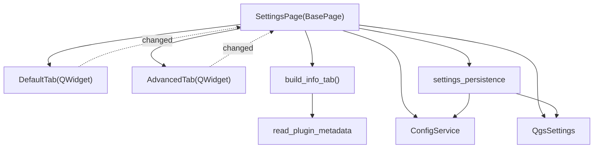

---
tags:
  - secinterp
  - code-walkthrough
  - gui
  - ui-pages
aliases:
  - settings_page.py
  - SettingsPage
cssclass: secinterp-note
---

# `gui/ui/pages/settings_page.py`

> [!abstract] One-line summary
> **Settings** page acting as a **coordinator**: it mounts the Default/Advanced/Info tabs from [[settings_tabs]], re-exposes their widgets for backward compatibility, and delegates persistence to `settings_persistence` (`QgsSettings` + `ConfigService`).

> [!info] Refactor 2026-09-20
> This 416-line page was decomposed into tabs ([[settings_tabs]]); `SettingsPage` is now a **124-line coordinator** with backward-compatible aliases to each tab's widgets.

**Path**: `gui/ui/pages/settings_page.py` (124 lines; formerly 416)
**Class**: `SettingsPage(BasePage)`
**Layer**: GUI · UI Pages
**Tags**: #secinterp #gui #ui-pages

---

## 🎯 Why does this file exist?

| Problem (before) | Solution (today) |
|------------------|------------------|
| 416 lines mixing export, 3D, info and persistence | Tabs in `gui/ui/pages/settings/` |
| Persistence was coupled to the widgets | `settings_persistence` isolates `QgsSettings`/`ConfigService` |
| The page's public API kept breaking | The coordinator exposes aliases (`self.chk_exp_topo = ...`) |
| `QgsSettings` duplicated in several places | Centralized `load_settings` / `save_settings` |

> [!important] Coordinator + Facade
> `SettingsPage` owns the `QTabWidget`, re-exposes widgets and delegates; it does **not** implement save logic or build checkboxes.

---

## 🧬 Relationship diagram



> [!tip] How to read
> Solid arrow = composition/import; dotted = `changed` signal re-emitted to the coordinator. Persistence crosses through `settings_persistence`.

---

## 📦 Imports — architectural reading

```python
# settings_page.py
import contextlib
from typing import Any

from qgis.core import QgsSettings
from qgis.PyQt.QtCore import QCoreApplication
from qgis.PyQt.QtWidgets import QTabWidget, QVBoxLayout, QWidget

from sec_interp.core.config import ConfigService
from sec_interp.logger_config import get_logger

from .base_page import BasePage
from .settings import AdvancedTab, DefaultTab, build_info_tab
from .settings.settings_persistence import load_settings, save_settings
```

| # | Observation |
|---|-------------|
| ① | `QgsSettings` (read) and `ConfigService` (write) coexist: the page is the join point. |
| ② | `build_info_tab` is a **factory function** (not a class) that receives `self.tr`. |
| ③ | `settings_persistence` is imported as a flat module: pure functions over widgets. |

---

## 🧱 `__init__` and state

```python
class SettingsPage(BasePage):
    """Page for managing plugin settings and restricted features."""

    def __init__(self, parent: QWidget | None = None) -> None:
        self.settings = QgsSettings()
        self.config_service = ConfigService()
        super().__init__(
            QCoreApplication.translate("SettingsPage", "Plugin Settings"), parent
        )
```

| Member | Role |
|--------|------|
| `self.settings` | Read store (`QgsSettings`). |
| `self.config_service` | Write facade (`ConfigService`). |
| `BasePage` | `group_box` + `get_data/validate/...` protocol. |

> [!note] Initialization order
> `self.settings` and `self.config_service` are created **before** `super().__init__`, because `_setup_ui()` (called by `BasePage`) invokes `_load_settings()`.

---

## 🧱 `_setup_ui()` — mounting the 3 tabs

```python
def _setup_ui(self) -> None:
    super()._setup_ui()

    layout = self.group_box.layout()
    if layout is None:
        layout = QVBoxLayout(self.group_box)
        self.group_box.setLayout(layout)

    self.tab_widget = QTabWidget()
    layout.addWidget(self.tab_widget)

    self.default_tab = DefaultTab()
    self.tab_widget.addTab(self.default_tab, self.tr("Default"))

    self.advanced_tab = AdvancedTab()
    self.tab_widget.addTab(self.advanced_tab, self.tr("Advanced"))

    self.info_tab = build_info_tab(self.tr)
    self.tab_widget.addTab(self.info_tab, self.tr("Plugin Information"))

    self._expose_tab_widgets()
    self._load_settings()
```

| Tab | Content |
|-----|---------|
| `default_tab` | Export selection (topo/geol/struct/drill/interp), format and naming pattern. |
| `advanced_tab` | 3D feature gate + 3D export toggles (traces/intervals/original/projected). |
| `info_tab` | Read-only metadata (`read_plugin_metadata`). |

> [!important] Load during setup
> `_load_settings()` runs at the end of `_setup_ui()`: the page starts already synchronized with `QgsSettings`.

---

## 🧱 `_expose_tab_widgets()` — backward-compatible aliases

```python
def _expose_tab_widgets(self) -> None:
    self.chk_exp_topo = self.default_tab.chk_exp_topo
    self.chk_exp_geol = self.default_tab.chk_exp_geol
    self.chk_exp_struct = self.default_tab.chk_exp_struct
    self.chk_exp_drill = self.default_tab.chk_exp_drill
    self.chk_exp_interp = self.default_tab.chk_exp_interp
    self.combo_format = self.default_tab.combo_format
    self.txt_naming = self.default_tab.txt_naming
    self.btn_reset_export = self.default_tab.btn_reset_export

    self.chk_enable_3d = self.advanced_tab.chk_enable_3d
    self.chk_3d_traces = self.advanced_tab.chk_3d_traces
    self.chk_3d_intervals = self.advanced_tab.chk_3d_intervals
    self.chk_3d_original = self.advanced_tab.chk_3d_original
    self.chk_3d_projected = self.advanced_tab.chk_3d_projected
```

| Alias | Source tab |
|-------|------------|
| `chk_exp_*` | `default_tab` |
| `combo_format`, `txt_naming`, `btn_reset_export` | `default_tab` |
| `chk_enable_3d`, `chk_3d_*` | `advanced_tab` |

> [!warning] Duplicated references
> The aliases point to the same widget objects: when adding or renaming widgets, this list must be updated so code still using `page.chk_*` does not break.

---

## 🧱 Persistence — `_load_settings` / `_on_settings_changed`

```python
def _load_settings(self) -> None:
    load_settings(self.settings, self.default_tab, self.advanced_tab)

def _on_settings_changed(self) -> None:
    save_settings(self.config_service, self.default_tab, self.advanced_tab)

def _reset_export_defaults(self) -> None:
    self.default_tab.reset_to_defaults()
    self.advanced_tab.reset_to_defaults()
```

| Function | Source | Destination |
|----------|--------|-------------|
| `load_settings` | `QgsSettings` (`SecInterp/*`) | Tab widgets |
| `save_settings` | Tab widgets | `ConfigService.set(...)` |
| `_reset_export_defaults` | — | `reset_to_defaults()` on both tabs |

> [!note] `settings_persistence`
> `load_settings` reads keys such as `SecInterp/enable_3d`, `SecInterp/exp_topo`, `SecInterp/export_format`; `save_settings` writes them back via `ConfigService`. See [[settings_tabs]].

---

## 🧱 `get_data()` / `validate()` and signals

```python
def get_data(self) -> dict[str, Any]:
    data = self.default_tab.get_data()
    data.update(self.advanced_tab.get_data())
    return data

def validate(self) -> tuple[bool, str]:
    return True, ""     # the settings page validates nothing

def connect_signals(self) -> None:
    self.default_tab.changed.connect(self._on_settings_changed)
    self.advanced_tab.changed.connect(self._on_settings_changed)
    self.default_tab.connect_signals()
    self.advanced_tab.connect_signals()

def disconnect_signals(self) -> None:
    self.default_tab.disconnect_signals()
    self.advanced_tab.disconnect_signals()
    with contextlib.suppress(TypeError, RuntimeError):
        self.default_tab.changed.disconnect(self._on_settings_changed)
    with contextlib.suppress(TypeError, RuntimeError):
        self.advanced_tab.changed.disconnect(self._on_settings_changed)
```

| Method | Detail |
|--------|--------|
| `get_data()` | Merges `exp_*`/format from Default with `enable_3d`/`drill_3d_*` from Advanced. |
| `validate()` | Always `(True, "")`: there are no rules to validate. |
| `connect_signals()` | Auto-saves on every `changed` and connects the tab widgets. |
| `disconnect_signals()` | Disconnects tabs and re-emissions with tolerance. |

---

## 🏛️ Design patterns present

| Pattern | Where | Purpose |
|---------|-------|---------|
| **Facade / Coordinator** | `SettingsPage` | Single API over 3 tabs + persistence. |
| **Adapter** | `settings_persistence` | Isolate `QgsSettings`/`ConfigService`. |
| **Observer** | `changed` | Auto-save on every change. |
| **Backward-compat aliases** | `_expose_tab_widgets` | Do not break old consumers. |
| **Factory Function** | `build_info_tab` | Stateless info tab. |

---

## 🧾 API summary

| Symbol | Signature / Inherits | Typical use |
|--------|----------------------|-------------|
| `SettingsPage` | `BasePage` | Settings page. |
| `_setup_ui()` | `() -> None` | Mounts tabs, aliases and load. |
| `_expose_tab_widgets()` | `() -> None` | Creates backward-compatible aliases. |
| `_load_settings()` | `() -> None` | `load_settings(...)`. |
| `_on_settings_changed()` | `() -> None` | `save_settings(...)`. |
| `_reset_export_defaults()` | `() -> None` | Resets both tabs. |
| `get_data()` | `() -> dict[str, Any]` | Current settings. |
| `validate()` | `() -> tuple[bool, str]` | Always valid. |
| `connect_signals()` / `disconnect_signals()` | `() -> None` | Auto-save and cleanup. |

---

## 👀 Observations and notes

> [!success] Strengths
> - A 124-line coordinator: clear reading and decoupled persistence.
> - `settings_persistence` makes `load/save` testable without instantiating the page.
> - Aliases preserve compatibility during the migration to tabs.

> [!warning] Points of attention
> - `_reset_export_defaults()` is not connected in `connect_signals()`; the real reset is triggered by `DefaultTab.btn_reset_export` → `reset_to_defaults()`. The page method looks like dead or reserved code.
> - Aliases duplicate references: keep them in sync when adding widgets.
> - `get_data()` does **not** include `info_tab` fields (they are read-only).

> [!question] Open questions
> - Should `_reset_export_defaults()` be removed or wired to the reset button?
> - Should read/write be unified in `ConfigService` to avoid two stores?

---

## 🔗 Related notes

- [[Index]] — vault index
- [[settings_tabs]] — tabs package (`DefaultTab`, `AdvancedTab`, `build_info_tab`)
- [[config]] — `ConfigService`
- [[access_control_service]] — 3D gate
- [[ui_pages]] — page catalog
- [[layer_gui_ui_pages]] — GUI pages layer

---

*Note of the SecInterp Code Walkthrough vault — v3.8.0*
