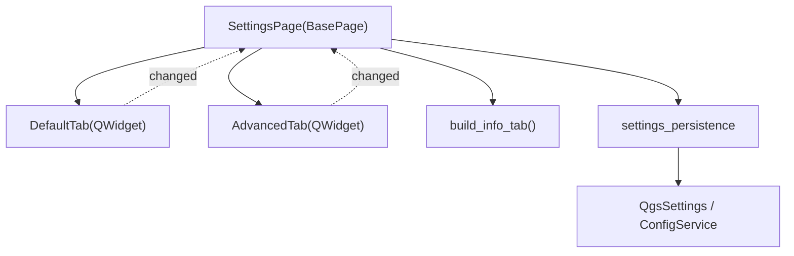

---
tags:
  - secinterp
  - code-walkthrough
  - gui
  - ui-pages
  - settings-tabs
aliases:
  - settings/
  - DefaultTab
  - AdvancedTab
cssclass: secinterp-note
---

# `gui/ui/pages/settings/`

> [!abstract] One-line summary
> **Settings** tab package: `DefaultTab`, `AdvancedTab` and `info_tab`, decomposed on **2026-09-20** from the former `settings_page.py` (417 lines).

**Path**: `gui/ui/pages/settings/` (default_tab 178 · advanced_tab 106 · info_tab 48 · settings_persistence 75 · `__init__` 9 lines)
**Main class**: `DefaultTab`, `AdvancedTab` (`QWidget`)
**Layer**: GUI · UI Pages
**Tags**: #secinterp #gui #ui-pages #settings-tabs

---

## 🎯 Why does this package exist?

| Problem | Solution |
|---------|----------|
| `settings_page.py` had 417 lines mixing export, 3D, info and persistence | Widget/Composite decomposition (2026-09-20) |
| Persistence was coupled to the widgets | `settings_persistence` isolates `QgsSettings`/`ConfigService` |
| The page's public API kept breaking | The coordinator exposes backward-compatible aliases |

> [!important] Coordinator + Facade
> `SettingsPage` (124 lines) owns the `QTabWidget`, re-exposes widgets and delegates; it does not implement save logic.

---

## 🧬 Relationship diagram



> [!tip] How to read
> Solid arrow = composition/imports; dotted = `changed` signal re-emitted to the coordinator.

---

## 🧱 Main section — `DefaultTab`

```python
class DefaultTab(QWidget):
    changed = pyqtSignal()
```

| Symbol | Role |
|--------|------|
| `chk_exp_*` | Export selection (topo/geol/struct/drill/interp). |
| `combo_format` | Vector format: Shapefile / GeoPackage / DXF. |
| `get_data()` / `reset_to_defaults()` | Read and reset defaults. |

---

## 🧱 `AdvancedTab` and `info_tab`

- **`AdvancedTab`**: `chk_enable_3d` + 3D toggles (`chk_3d_traces/intervals/original/projected`), `get_data()` and `reset_to_defaults()`.
- **`info_tab`**: `build_info_tab(translate)` builds read-only metadata via `read_plugin_metadata`.

---

## 🧱 `settings_persistence`

- `load_settings(settings, default_tab, advanced_tab)`: reads from `QgsSettings`.
- `save_settings(config_service, default_tab, advanced_tab)`: writes through `ConfigService.set(...)`.

---

## 🏛️ Design patterns present

| Pattern | Where | Purpose |
|---------|-------|---------|
| **Widget decomposition** | `SettingsPage` | Coordinator + tabs |
| **Facade** | `SettingsPage` | Single API over 3 tabs |
| **Adapter** | `settings_persistence` | Isolates `QgsSettings`/`ConfigService` |
| **Observer** | `changed` | Change re-emission |

> [!warning] Point of attention
> The aliases (`self.chk_enable_3d = self.advanced_tab.chk_enable_3d`) duplicate references: keep them in sync when adding widgets.

---

## 🔗 Related notes

- [[settings_page]] — `SettingsPage` coordinator
- [[config]] — `ConfigService` persistence
- [[access_control_service]] — 3D gate
- [[ui_pages]] — page catalog
- [[Index]] — vault index

---

*Note of the SecInterp Code Walkthrough vault — v3.8.0*
