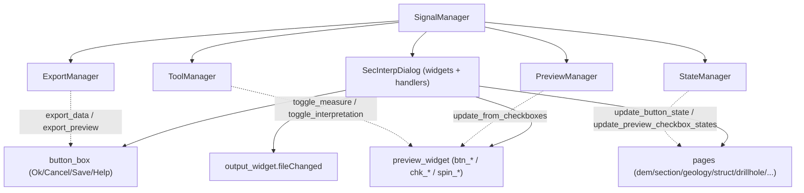

---
tags:
  - secinterp
  - code-walkthrough
  - gui
  - signals
aliases:
  - dialog_signal_manager.py
  - SignalManager
cssclass: secinterp-note
---

# `gui/dialog_signal_manager.py`

> [!abstract] One-line summary
> Single **signal/slot** wiring point for the dialog: groups connections and disconnections by domain (buttons, preview, pages, tools) with strict symmetry and idempotency.

**Path**: `gui/dialog_signal_manager.py` (354 lines)
**Class**: `SignalManager`
**Layer**: GUI · Managers
**Tags**: #secinterp #gui #signals

---

## 🎯 Why does this file exist?

Without a manager, `SecInterpDialog` would accumulate dozens of scattered `widget.clicked.connect(...)` calls, and it would be impossible to guarantee that **every connection has its disconnection** (Qt memory leak + analyzer noise).

| Problem | Solution |
|---------|----------|
| 50+ connections scattered across the dialog | Four `_connect_*` groups by domain |
| Signals outliving dialog close | Mirror `disconnect_all()`, run **before** reconnecting |
| Double connection when reopening the dialog | `connect_all()` starts with `disconnect_all()` (idempotent) |
| The analyzer reports "leaking" signals | Explicit per-name disconnection + sequential sweep |

> [!important] Extract/Present rule and symmetry
> This module **does not process data**: it only connects widgets to managers (QGIS work lives in them). For almost every `X.connect(...)` there is an `X.disconnect(...)` under `contextlib.suppress`; that symmetry is deliberate and required by the plugin's static analysis.

---

## 🧬 Relationship diagram



Solid = the manager wires toward the target; dotted = the manager is the signal target.

---

## 📦 Imports — architectural reading

```python
from __future__ import annotations
import contextlib
from typing import TYPE_CHECKING, Any
from qgis.PyQt.QtWidgets import QDialogButtonBox
from sec_interp.logger_config import get_logger
if TYPE_CHECKING:
    from .main_dialog import SecInterpDialog
```

Only Qt import: `QDialogButtonBox` (locate standard buttons). The four managers arrive as `Any` via the constructor (low coupling); `TYPE_CHECKING` avoids the cycle with `main_dialog`.

---

## 🧱 Code walkthrough

### `__init__` and `connect_all()` — idempotency first

```python
self.dialog = dialog
self.preview_manager = preview_manager
self.export_manager = export_manager
self.tool_manager = tool_manager
self.state_manager = state_manager

def connect_all(self) -> None:
    self.disconnect_all()          # ← prevents double connections
    self._connect_button_signals()
    self._connect_preview_signals()
    self._connect_page_signals()
    self._connect_tool_signals()
```

The manager does not create dependencies: it receives them (Dependency Injection). The dialog provides widgets/handlers; the managers, the destination logic.

### `disconnect_all()` — exhaustive mirror

```python
def disconnect_all(self) -> None:
    self._disconnect_button_signals()
    self._disconnect_preview_signals()
    self._disconnect_page_signals()
    self._disconnect_tool_signals()
```

| Level 1 | Level 2 | Level 3 |
|---------|---------|---------|
| `_disconnect_button_signals` | `_disconnect_dialog_buttons` | Ok / Cancel / Save / `helpRequested` |
| | `_disconnect_custom_buttons` | `clear_cache_btn` / `reset_defaults_btn` |
| `_disconnect_preview_signals` | `_disconnect_preview_action_buttons` | `btn_preview` / `btn_export` / `btn_measure` / `btn_interpret` / `btn_finalize` |
| | `_disconnect_preview_options` | checkboxes + `chk_legend` / `spin_max_points` / `chk_auto_lod` / `chk_adaptive_sampling` |
| `_disconnect_page_signals` | `_disconnect_explicit_page_signals` | the 6 signals reported as "leaking" |
| | `_disconnect_sequential_pages` | sweep over 9 pages/components |
| `_disconnect_tool_signals` | — | `tool_manager.disconnect_signals()` |

### Connection — buttons

```python
ok_btn = self.dialog.button_box.button(QDialogButtonBox.StandardButton.Ok)
if ok_btn:
    ok_btn.clicked.connect(self.dialog.accept_handler)
cancel_btn = self.dialog.button_box.button(QDialogButtonBox.StandardButton.Cancel)
if cancel_btn:
    cancel_btn.clicked.connect(self.dialog.reject_handler)
save_btn = self.dialog.button_box.button(QDialogButtonBox.StandardButton.Save)
if save_btn:
    save_btn.clicked.connect(self.export_manager.export_data)
self.dialog.button_box.helpRequested.connect(self.dialog.open_help)
self.dialog.clear_cache_btn.clicked.connect(self.dialog.clear_cache_handler)
self.dialog.reset_defaults_btn.clicked.connect(self.dialog.reset_defaults_handler)
```

### Connection — preview, pages, and tools

```python
btn_preview.clicked.connect(self.dialog.preview_profile_handler)
btn_export.clicked.connect(self.export_manager.export_preview)
for chk in (chk_topo, chk_geol, chk_struct, chk_drillholes, chk_interpretations, chk_legend):
    chk.stateChanged.connect(self.preview_manager.update_from_checkboxes)
spin_max_points.valueChanged.connect(self.preview_manager.update_from_checkboxes)
chk_auto_lod.toggled.connect(self.preview_manager.update_from_checkboxes)
chk_adaptive_sampling.toggled.connect(self.preview_manager.update_from_checkboxes)

output_widget.fileChanged.connect(self.state_manager.update_button_state)
page_dem.raster_combo.layerChanged.connect(self.state_manager.update_button_state)
page_dem.raster_combo.layerChanged.connect(self.state_manager.update_preview_checkbox_states)
# geology/struct/drillhole.dataChanged → update_preview_checkbox_states

btn_measure.toggled.connect(self.tool_manager.toggle_measure_tool)
btn_interpret.toggled.connect(self.tool_manager.toggle_interpretation_tool)
btn_finalize.clicked.connect(self.tool_manager.measure_tool.finalize_measurement)
self.tool_manager.connect_signals()   # restores the tools' internal signals
```

> [!important] Why `tool_manager.connect_signals()`
> At the end the tools' **internal** signals are restored (`measurementChanged`, `measurementFinished`, `measurementCleared`, `polygonFinished`), which had been disconnected by the sweep. Pages also receive `page.connect_signals()` when they expose it.

---

## 🏛️ Design patterns present

| Pattern | Where | Purpose |
|---------|-------|---------|
| **Mediator / Event bus** | `SignalManager` | One wiring point widget↔manager |
| **Dependency Injection** | `__init__` | Managers injected as `Any` |
| **Idempotent wiring** | `connect_all` → `disconnect_all` | Safe to re-run |
| **Template method (groups)** | `_connect_*` / `_disconnect_*` | Symmetric structure |
| **Graceful degradation** | `contextlib.suppress` | Tolerance for already-disconnected signals |

---

## 🧾 API summary

| Symbol | Signature | Typical use |
|--------|-----------|-------------|
| `SignalManager(...)` | `__init__(dialog, preview, export, tool, state)` | Composition |
| `connect_all()` / `disconnect_all()` | `-> None` | Wire everything / clean everything |
| `_connect_button_signals()` | `-> None` | Ok/Cancel/Save/Help/Cache/Reset |
| `_connect_preview_signals()` | `-> None` | Preview + checkboxes + options |
| `_connect_page_signals()` | `-> None` | layerChanged / dataChanged / fileChanged |
| `_connect_tool_signals()` | `-> None` | tool toggles + internal signals |

---

## 👀 Observations and notes

> [!success] Strengths
> - Almost complete connect/disconnect **symmetry**, grouped by domain.
> - Real idempotency: reopening the dialog does not duplicate connections.
> - Low coupling: destinations are injected.

> [!warning] Points of attention
> - Preview/page disconnection uses `suppress(Exception)` (broader than the `(TypeError, RuntimeError)` used for buttons): it can hide real errors.
> - `_disconnect_preview_signals` disconnects `btn_measure.toggled` / `btn_interpret.toggled`, but their connection lives in `_connect_tool_signals`: symmetry crosses groups.
> - `_connect_button_signals` assumes `clear_cache_btn` / `reset_defaults_btn` exist (no `hasattr`), unlike their disconnections.

> [!question] Open questions
> - Could the connection list be generated from a declarative table to guarantee automatic symmetry?

---

## 🔗 Related notes

- [[main_dialog]] — creates it and calls `connect_all()` in `__init__`
- [[state_manager]] — state signal destination
- [[tool_manager]] — tool signal destination
- [[dialog_preview_manager]] — preview signal destination
- [[dialog_export_manager]] — export destination
- [[Index]] — vault index

---

*Note of the SecInterp Code Walkthrough vault — v3.8.0*
