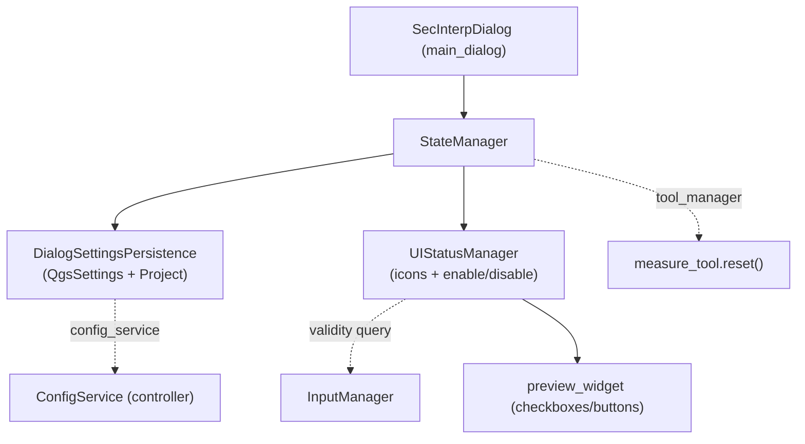

---
tags:
  - secinterp
  - code-walkthrough
  - gui
  - state-manager
aliases:
  - dialog_state_manager.py
  - StateManager
cssclass: secinterp-note
---

# `gui/dialog_state_manager.py`

> [!abstract] One-line summary
> Dialog **state orchestrator**: delegates persistence to `DialogSettingsPersistence`, visual state to `UIStatusManager`, and keeps its own signal registry for safe disconnection.

**Path**: `gui/dialog_state_manager.py` (117 lines)
**Class**: `StateManager`
**Layer**: GUI · Managers
**Tags**: #secinterp #gui #state-manager

---

## 🎯 Why does this file exist?

`main_dialog.py` must not mix `QgsSettings` with status icons. `StateManager` is the **state facade**: it groups two responsibilities that change for different reasons.

| Problem | Solution |
|---------|----------|
| The dialog would talk to `QgsSettings`/`QgsProject` directly | `DialogSettingsPersistence` encapsulates load/save/reset |
| `setEnabled` and icon logic scattered | `UIStatusManager` centralizes indicators and enablement |
| Signals connected with no way to disconnect them | `connect_checked()` + `disconnect_signals()` with tracking |
| After bulk-restoring settings the UI is stale | `load_settings()` chains `update_all()` |

`StateManager` **contains no business or QGIS-agnostic logic**: it only coordinates collaborators. Real validation lives in `InputManager` + `ProjectValidator` (core).

---

## 🧬 Relationship diagram



Solid arrow = composition/direct call; dotted = consulted or injected collaborator.

---

## 📦 Imports — architectural reading

```python
from __future__ import annotations
import contextlib
from typing import TYPE_CHECKING, Any

from sec_interp.logger_config import get_logger
from .dialog_settings_persistence import DialogSettingsPersistence
from .ui_status_manager import UIStatusManager

if TYPE_CHECKING:
    from sec_interp.gui.main_dialog import SecInterpDialog
```

`TYPE_CHECKING` breaks the `main_dialog → StateManager → main_dialog` cycle; `contextlib.suppress(TypeError, RuntimeError)` tolerates already-dead Qt signals; `logger` is the manager's only observability point.

---

## 🧱 Code walkthrough — `StateManager`

### `__init__(dialog)` — composition

```python
def __init__(self, dialog: SecInterpDialog) -> None:
    self.dialog = dialog
    self._connected_widgets: list[Any] = []
    self.persistence = DialogSettingsPersistence(dialog)
    self.status_manager = UIStatusManager(dialog)
```

Instantiates both delegates and prepares the tracked-signal list. It receives the full dialog (not narrow containers) because its delegates do need the widget surface.

### Visual delegation (6 methods)

| Method | Delegate |
|--------|----------|
| `setup_indicators()` / `update_all()` | `status_manager.*` |
| `update_preview_checkbox_states()` | `status_manager.*` |
| `update_button_state()` | `status_manager.*` |
| `update_raster_status()` / `update_section_status()` | `status_manager.*` |

They are **thin wrappers**: the dialog and `SignalManager` call `StateManager`, not `UIStatusManager` directly (single entry point).

### Signal tracking

```python
def connect_checked(self, widget, signal, slot) -> None:
    signal.connect(slot)
    self._connected_widgets.append((widget, signal, slot))

def disconnect_signals(self) -> None:
    logger.debug(f"Disconnecting {len(self._connected_widgets)} UI signals")
    for _widget, signal, slot in self._connected_widgets:
        with contextlib.suppress(TypeError, RuntimeError):
            signal.disconnect(slot)
    self._connected_widgets.clear()
```

`connect_checked` stores the `(widget, signal, slot)` triple so it can disconnect **that exact slot** without affecting other connections to the same signal.

### Persistence and reset

```python
def load_settings(self) -> None:
    self.persistence.load_settings()
    self.update_all()          # refresh icons/buttons after bulk restore
    logger.info("Settings loaded and UI updated")

def save_settings(self) -> None:
    self.persistence.save_settings()

def reset_to_defaults(self) -> None:
    self.persistence.reset_pages()
    self.persistence.reset_preview()
    self._reset_tools()
    self.dialog.preview_widget.results_text.append(
        self.dialog.tr("✓ Form reset to default values"))
    self.update_all()
```

`load_settings()` chains `update_all()` because bulk restoration does not fire widget-by-widget signals.

### `_reset_tools()` — backward compatibility

```python
def _reset_tools(self) -> None:
    if hasattr(self.dialog, "tool_manager"):
        self.dialog.tool_manager.measure_tool.reset()
    if hasattr(self.dialog, "interpretation_manager") and self.dialog.interpretation_manager:
        self.dialog.interpretation_manager.interpretations = []
        self.dialog.interpretation_manager.save_interpretations()
    elif hasattr(self.dialog, "interpretations"):
        self.dialog.interpretations = []
        if hasattr(self.dialog, "_save_interpretations"):
            self.dialog._save_interpretations()
```

It detects managers via `hasattr`, with compatibility branches for older dialog versions.

---

## 🏛️ Design patterns present

| Pattern | Where | Purpose |
|---------|-------|---------|
| **Facade** | `StateManager` | One API over persistence + visual state |
| **Delegation / Composition** | `persistence`, `status_manager` | Single responsibility per collaborator |
| **Lazy import (`TYPE_CHECKING`)** | `SecInterpDialog` | Break the import cycle |
| **Tracked connections** | `connect_checked` | Avoid Qt memory leaks |
| **Backward compatibility** | `_reset_tools` via `hasattr` | Survives dialog refactors |

---

## 🧾 API summary

| Symbol | Signature | Typical use |
|--------|-----------|-------------|
| `StateManager(dialog)` | `__init__` | Dialog composition root |
| `setup_indicators()` / `update_all()` | `-> None` | Load icons / refresh all |
| `update_button_state()` / `update_preview_checkbox_states()` | `-> None` | Enable buttons / checkboxes |
| `load_settings()` / `save_settings()` | `-> None` | Persistence via `QgsSettings`/`Project` |
| `reset_to_defaults()` | `-> None` | Reset pages + preview + tools |
| `connect_checked(w, s, slot)` / `disconnect_signals()` | `-> None` | Tracking / tolerant disconnection |

---

## 👀 Observations and notes

> [!success] Strengths
> - Separates **persistence** from **state presentation**, each with its own dependency.
> - `load_settings()` guarantees a consistent UI via `update_all()`.

> [!warning] Points of attention
> - `connect_checked()` / `_connected_widgets` are **unused** in the current code: the actual wiring happens in `SignalManager`. It is latent API and `disconnect_signals()` disconnects an empty list.
> - `_reset_tools()` accesses `measure_tool` without a nested check: if `tool_manager` exists but has no `measure_tool` yet, it would raise `AttributeError`.
> - It writes directly to `preview_widget.results_text`, coupling the manager to a concrete widget.

> [!question] Open questions
> - Should the local tracking be removed and rely entirely on `SignalManager.disconnect_all()`?

---

## 🔗 Related notes

- [[main_dialog]] — creates the manager and uses it in two phases
- [[ui_status_manager]] — visual delegate
- [[signal_manager]] — wires the signals this manager exposes
- [[input_manager]] — validity source consulted by `UIStatusManager`
- [[config]] — `ConfigService` behind persistence
- [[Index]] — vault index

---

*Note of the SecInterp Code Walkthrough vault — v3.8.0*
