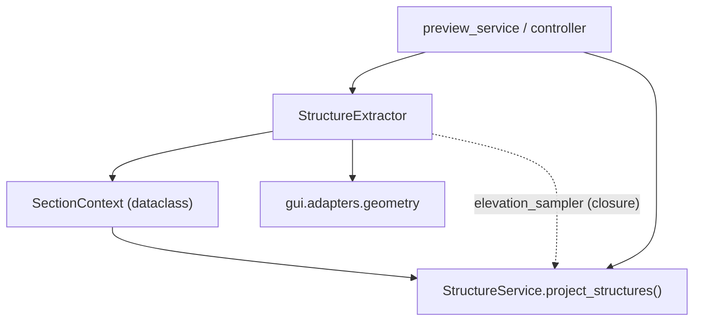

---
tags:
  - secinterp
  - code-walkthrough
  - gui
  - adapters
  - structure
aliases:
  - structure_extractor.py
  - StructureExtractor
  - SectionContext
cssclass: secinterp-note
---

# `gui/adapters/structure_extractor.py`

> [!abstract] One-line summary
> **Extract** adapter for structures: reads the section line, buffers its geometry, filters structural measurements inside the buffer and samples the DEM → detached primitives for `StructureService`.

**Path**: `gui/adapters/structure_extractor.py` (226 lines)
**Classes**: `StructureExtractor`, `SectionContext`
**Layer**: GUI · Adapters (Extract phase)
**Tags**: #secinterp #gui #adapters #structure

---

## 🎯 Why does this file exist?

| Problem | Solution |
|---------|----------|
| `StructureService` (core) cannot touch `QgsGeometry`/`QgsFeature` | The adapter reads and converts everything to tuples and dicts |
| We must know which structures fall near the line | `QgsGeometry.buffer(buffer_m, 25)` + `QgsFeatureRequest` rectangle filter + `intersects()` |
| The core needs elevations to project apparent dips | `sample_elevation()` is injected as an `elevation_sampler` closure |
| QGIS `QVariant`s are not thread-safe | `_extract_attributes` sanitizes to `int\|float\|str\|bool\|None` |

> [!important] Extract boundary
> This file is the only piece that knows QGIS for structures. `StructureService` receives a `SectionContext` and a callable `(x, y) -> float`; never a raster or a layer.

---

## 🧬 Relationship diagram



> [!tip] How to read
> Solid arrow = imports/calls; dotted = callback injected at runtime.

---

## 📦 Imports — architectural reading

```python
from qgis.core import (
    QgsFeature, QgsFeatureRequest, QgsGeometry,
    QgsRaster, QgsRasterLayer, QgsVectorLayer, QgsWkbTypes,
)
```

| # | Observation |
|---|-------------|
| ① | `QgsFeatureRequest` + `QgsGeometry.buffer` = efficient spatial filtering (bbox first, then real intersection). |
| ② | `QgsRaster` is only used for `IdentifyFormat.IdentifyFormatValue` when sampling the DEM. |
| ③ | Imports nothing from `sec_interp.core`: the output is pure primitives. |

---

## 🧱 `SectionContext` — the output DTO

```python
@dataclass
class SectionContext:
    line_points: list[tuple[float, float]] = field(default_factory=list)
    line_start: tuple[float, float] = (0.0, 0.0)
    line_azimuth: float = 0.0
    structures: list[dict[str, Any]] = field(default_factory=list)
```

| Field | Role |
|-------|------|
| `line_points` | `(x, y)` vertices of the section line |
| `line_start` | First vertex (origin for distance measurement) |
| `line_azimuth` | Section bearing in degrees |
| `structures` | `[{"point": (x, y), "attributes": {...}}]` |

---

## 🧱 `extract_section_and_structures()` — the main flow

```python
def extract_section_and_structures(self, line_lyr, struct_lyr, buffer_m) -> SectionContext | None:
    line_geom = self._read_line_geometry(line_lyr)
    if line_geom is None:
        return None
    line_points, line_start, line_azimuth = self.extract_line(line_geom)
    structures = self.detach_structures(struct_lyr, line_geom, buffer_m)
    return SectionContext(line_points=..., line_start=..., line_azimuth=..., structures=...)
```

1. `_read_line_geometry` takes the first feature and validates that its geometry is not null.
2. `extract_line` returns vertices + start + azimuth.
3. `detach_structures` buffers and filters.

Returns `None` when the line layer has no valid geometry.

---

## 🧱 `detach_structures()` — two-step spatial filtering

```python
buffer_geom = line_geom.buffer(buffer_m, 25)
request = QgsFeatureRequest().setFilterRect(buffer_geom.boundingBox())
for feature in struct_lyr.getFeatures(request):
    if not feature.hasGeometry() or not feature.geometry().intersects(buffer_geom):
        continue
    point = self._feature_point(feature)
    ...
```

| Step | Detail |
|------|--------|
| `buffer(m, 25)` | 25 approximation segments for the buffer |
| `setFilterRect(bbox)` | Cheap provider-level filter |
| `intersects(buffer_geom)` | Exact geometric check |
| `_feature_point` | Point if the geometry is a point; otherwise the centroid |

---

## 🧱 `sample_elevation()` — injected into the core

```python
def sample_elevation(self, raster_lyr, x, y, band_number=1) -> float:
    ...
    ident = raster_lyr.dataProvider().identify(
        QgsPointXY(x, y), QgsRaster.IdentifyFormat.IdentifyFormatValue
    )
    if ident.isValid():
        val = ident.results().get(band_number)
        ...
    return 0.0
```

> [!tip] Callback pattern
> In `preview_service.py:162` and `controller.py:326` this is built:
> ```python
> def elevation_sampler(x: float, y: float) -> float:
>     return extractor.sample_elevation(raster_lyr, x, y, params.band_num)
> ```
> and passed to `StructureService.project_structures(...)`. The core never sees the raster.

---

## 🧱 Private helpers

| Method | Responsibility |
|--------|----------------|
| `_read_line_geometry` | First feature → `QgsGeometry` or `None` |
| `_extract_line_points` | Vertices of a single or multi-part line (`asPolyline`/`asMultiPolyline`) |
| `_calculate_azimuth` | `degrees(atan2(dx, dy))`, normalized to `[0, 360)` |
| `_feature_point` | `asPoint()` or `centroid().asPoint()` |
| `_extract_attributes` | Sanitizes `QVariant` → `int/float/str/bool/None` |

> [!note] `atan2(dx, dy)` = bearing
> The `(Δx, Δy)` order in `atan2` yields an azimuth measured from north clockwise, which is exactly the compass convention. If negative, 360 is added.

---

## 🏛️ Design patterns present

| Pattern | Where | Purpose |
|---------|-------|---------|
| **Adapter / Bridge** | whole class | QGIS → primitives |
| **DTO** | `SectionContext` | Detached transport to core |
| **Callback injection** | `elevation_sampler` | The core does not depend on the raster |
| **Fail-soft** | `return []` / `return 0.0` | Invalid layers do not break the flow |
| **Two-phase filtering** | bbox + `intersects` | Cheap-then-exact performance |

---

## 🧾 API summary

| Symbol | Signature | Use |
|--------|-----------|-----|
| `SectionContext` | dataclass | Extractor output |
| `extract_section_and_structures` | `(line_lyr, struct_lyr, buffer_m) -> SectionContext \| None` | Entry point |
| `extract_line` | `(line_geom) -> (points, start, azimuth)` | Section geometry |
| `detach_structures` | `(struct_lyr, line_geom, buffer_m) -> list[dict]` | Structures in buffer |
| `sample_elevation` | `(raster_lyr, x, y, band_number=1) -> float` | Single-point elevation |

---

## 👀 Observations and notes

> [!success] Strengths
> - Two-phase filtering (cheap bbox + exact `intersects`).
> - 100% primitive output: ready to travel into a `QgsTask`.
> - `sample_elevation` decouples the core from the raster via a closure.

> [!warning] Points of attention
> - The buffer uses the **line layer's units**; if the line is in degrees, `buffer_m` is not metres.
> - `_extract_attributes` does not preserve QGIS `datetime` types (converts them to `str`).
> - The DEM is sampled once per structure; on large buffers this can be costly.

> [!question] Open questions
> - Should the elevation be cached per structure to avoid re-sampling?
> - Should `buffer_m > 0` be validated explicitly, as `DrillholeExtractor` does?

---

## 🔗 Related notes

- [[structure_service]] — consumes `SectionContext` and the `elevation_sampler`
- [[adapters]] — overview of the Extract phase
- [[controller]] — orchestrates extraction + service
- [[preview_service]] — same flow in the preview pipeline
- [[domain]] — domain DTOs
- [[Index]] — vault index

---

*Note of the SecInterp Code Walkthrough vault — v3.8.0*
