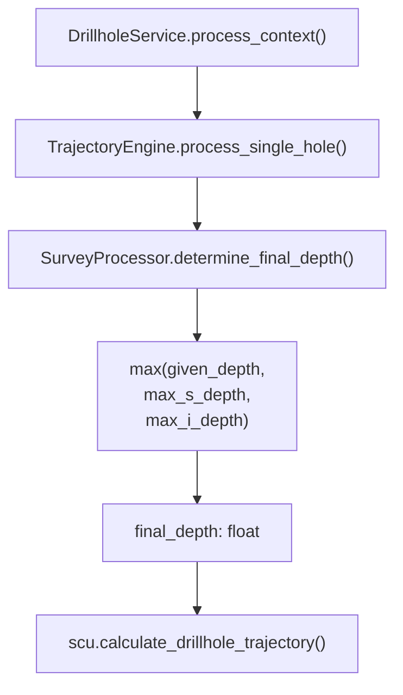

---
tags:
  - secinterp
  - code-walkthrough
  - core
  - drillhole
aliases:
  - survey_processor.py
  - SurveyProcessor
cssclass: secinterp-note
---

# `core/services/drillhole/survey_processor.py`

> [!abstract] One-line summary
> Computes a drillhole's **final depth** as `max(given_depth, max survey, max interval)` so no trace is ever truncated.

**Path**: `core/services/drillhole/survey_processor.py` (15 lines)
**Class**: `SurveyProcessor`
**Layer**: Core · Drillhole (100 % QGIS-agnostic)
**Tags**: #secinterp #core #drillhole

---

## 🎯 Why does this file exist?

The collar declares a depth, but *surveys* and lithological intervals often extend **deeper** than that declared value (or the collar carries no depth at all). Using only `given_depth` would cut the trajectory short and drop intervals.

| Problem | Solution |
|---------|----------|
| The collar depth field is 0 or incomplete | `max_i_depth` from intervals as fallback |
| A survey descends deeper than the declared depth | `max_s_depth` enters the `max()` |
| Holes with no surveys or intervals | Defaults to `0.0` for empty lists |

> [!important] Core boundary
> This module **imports nothing** except `from __future__ import annotations`. It is the canonical definition of pure logic: no QGIS, no Qt, no state, testable without a QGIS install.

---

## 🧬 Relationship diagram



> [!tip] How to read
> Solid arrow = imports/calls. `SurveyProcessor` is a leaf of the tree: it depends on nobody.

---

## 📦 Imports — architectural reading

```python
from __future__ import annotations
```

| # | Observation |
|---|-------------|
| ① | The only possible import: deferred annotations. **Zero runtime dependencies.** |
| ② | The total absence of imports is intentional: proof of no coupling to QGIS or `core/domain`. |

---

## 🧱 `determine_final_depth()` — the only operation

```python
def determine_final_depth(
    self, given_depth: float, survey_data: list[tuple], intervals: list[tuple]
) -> float:
    """Determine final depth from given depth, surveys and intervals."""
    max_s_depth = max([s[0] for s in survey_data]) if survey_data else 0.0
    max_i_depth = max([i[1] for i in intervals]) if intervals else 0.0
    return max(given_depth, max_s_depth, max_i_depth)
```

| Parameter | Role |
|-----------|------|
| `given_depth` | Declared collar depth (`DrillholeProjection.total_depth`). |
| `survey_data` | List of `(depth, azimuth, inclination)`; reads **index 0** (depth). |
| `intervals` | List of `(from, to, lith)`; reads **index 1** (`to`, the interval bottom). |
| **Returns** | `float` — the greatest of the three candidates. |

### Calculation trace

| Source | Expression | Meaning |
|--------|-----------|---------|
| Collar | `given_depth` | Declared total depth |
| Survey | `max([s[0] for s in survey_data])` | Deepest measurement station |
| Intervals | `max([i[1] for i in intervals])` | Bottom of the last lithological interval |

> [!warning] Implicit tuple contract
> The method assumes fixed positions: `s[0]` and `i[1]`. There is no length or type validation. If an extractor changes the tuple order, the calculation silently fails. The real contract lives in `DrillholeContext.survey_data` / `interval_data` (see [[domain]]).

---

## 🏛️ Design patterns present

| Pattern | Where | Purpose |
|---------|-------|---------|
| **Pure Function / Stateless Strategy** | `determine_final_depth` | Deterministic, side-effect-free calculation |
| **Guard Defaults** | `if survey_data else 0.0` | Avoids `ValueError: max() arg is an empty sequence` |
| **Single Responsibility** | The whole class | Only resolves the final depth |
| **Composition** | Instantiated by `TrajectoryEngine.__init__` | Simple injection without a DI container |

---

## 🧾 API summary

| Symbol | Signature / Inherits | Typical use |
|--------|----------------------|-------------|
| `SurveyProcessor` | `class` (no inheritance) | Processor injected into `TrajectoryEngine` |
| `determine_final_depth` | `(given_depth: float, survey_data: list[tuple], intervals: list[tuple]) -> float` | First step of `process_single_hole` |

---

## 👀 Observations and notes

> [!success] Strengths
> - **Empty-safe**: empty lists degrade to `0.0` without raising.
> - **Trivial to test**: requires no mocks and no QGIS.
> - **Clear semantics**: the name expresses the exact business rule.

> [!warning] Points of attention
> - It uses *list comprehensions* inside `max()`; with thousands of stations this materializes an extra list (irrelevant at drillhole scale, but avoidable with `default=0.0`).
> - It does not validate negative or `NaN` depths.
> - The positional tuple contract is untyped (`list[tuple]` with no parameters).

> [!question] Open questions
> - Should it migrate to `max(..., default=0.0)` to remove the conditionals?
> - Should `list[tuple[float, float, float]]` and `list[tuple[float, float, str]]` be typed?

---

## 🔗 Related notes

- [[Index]] — vault index
- [[trajectory_engine]] — orchestrates and calls this processor
- [[collar_processor]] — provides `given_depth` via `DrillholeProjection`
- [[interval_processor]] — consumes the same interval list
- [[drillhole_service]] — top-level service
- [[layer_core_services_drillhole]] — pipeline sub-layer

---

*Note of the SecInterp Code Walkthrough vault — v3.8.0*
