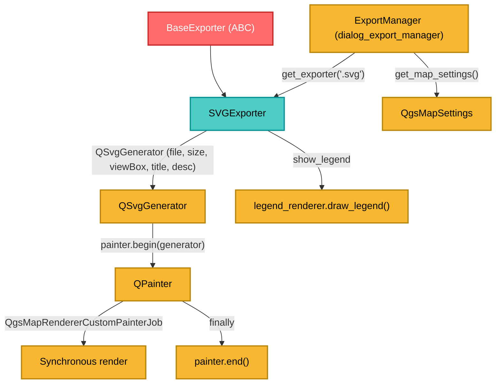

---
tags:
  - secinterp
  - code-walkthrough
  - exporters
  - svg
  - vector
  - render
  - i18n
aliases:
  - svg_exporter.py
  - SVGExporter
cssclass: secinterp-note
---

# `exporters/svg_exporter.py`

> [!abstract] One-line summary
> Exports a `QgsMapSettings` to **vector SVG** with `QSvgGenerator` + `QgsMapRendererCustomPainterJob`, with translatable title and description embedded in the XML.

**Path**: `exporters/svg_exporter.py` (85 lines)
**Class**: `SVGExporter(BaseExporter)`
**Layer**: Exporters (QGIS · Vector graphics)
**Tags**: #secinterp #exporters #svg #vector #render #i18n

---

## 🎯 Why does this file exist?

SVG is ideal for embedding the section in websites, presentations or vector editors (Inkscape/Illustrator): scalable XML text with no loss. It also supports **metadata** (title/description) that the plugin generates translated.

| Problem | Solution |
|---------|----------|
| Raster loses sharpness when zoomed | `QSvgGenerator` produces vectors |
| The file has no embedded context | `setTitle()` / `setDescription()` with `QCoreApplication.translate` |
| Wrong viewbox → cropped SVG | `setSize(QSize(...))` + `setViewBox(QRectF(0, 0, w, h))` |
| The painter stays open if the render fails | `try/finally: painter.end()` |
| Failure to initialize the generator | `if not painter.begin(generator): return False` |

> [!important] Architectural note
> This is the exporter with the most **user-facing strings** (`title`, `description`) and the only one in the package using `QCoreApplication.translate`. That means its texts must be kept in the plugin's i18n catalog.

---

## 🧬 Relationship diagram



---

## 📦 Imports — architectural reading

```python
from qgis.core import QgsMapRendererCustomPainterJob
from qgis.PyQt.QtCore import QCoreApplication, QRectF, QSize
from qgis.PyQt.QtGui import QPainter
from qgis.PyQt.QtSvg import QSvgGenerator

from sec_interp.logger_config import get_logger
from .base_exporter import BaseExporter
```

| # | Observation |
|---|-------------|
| ① | `QSvgGenerator` lives in `qgis.PyQt.QtSvg` (the QtSvg module, not QtGui) |
| ② | `QCoreApplication.translate` enables i18n of title/description |
| ③ | `QgsMapRendererCustomPainterJob` is the same job used by image and PDF |
| ④ | The module **does not import `QgsMapSettings`**: the parameter is unannotated |

---

## 🧱 `export()` — SVG generation

```python
def export(self, output_path: Path, map_settings) -> bool:
    try:
        width = self.get_setting("width", 800)
        height = self.get_setting("height", 600)
        title = self.get_setting(
            "title", QCoreApplication.translate("SVGExporter", "Section Interpretation Preview"))
        description = self.get_setting(
            "description",
            QCoreApplication.translate("SVGExporter", "Generated by SecInterp QGIS Plugin"))

        generator = QSvgGenerator()
        generator.setFileName(str(output_path))
        generator.setSize(QSize(width, height))
        generator.setViewBox(QRectF(0, 0, width, height))
        generator.setTitle(title)
        generator.setDescription(description)

        painter = QPainter()
        if not painter.begin(generator):
            return False
        try:
            painter.setRenderHint(QPainter.RenderHint.Antialiasing)

            job = QgsMapRendererCustomPainterJob(map_settings, painter)
            job.start()
            job.waitForFinished()

            show_legend = self.get_setting("show_legend", True)
            legend_renderer = self.get_setting("legend_renderer")
            if legend_renderer and show_legend:
                legend_renderer.draw_legend(painter, QRectF(0, 0, width, height))
            return True
        finally:
            painter.end()
    except Exception:
        logger.exception(f"SVG export failed for {output_path}")
        return False
```

| Setting | Default | Role |
|---------|---------|------|
| `width` / `height` | `800` / `600` | SVG dimensions (px) |
| `title` | `"Section Interpretation Preview"` (translated) | `<title>` metadata |
| `description` | `"Generated by SecInterp QGIS Plugin"` (translated) | `<desc>` metadata |
| `show_legend` | `True` | Enable/disable the legend |
| `legend_renderer` | `None` | Object with `draw_legend(painter, rect)` |

> [!tip] `return True` inside `try` with `finally`
> `finally` runs **before** the return value is materialized. So `painter.end()` always runs, even on the success path.

> [!warning] Failed `begin()` with no log, and signature off-contract
> Unlike [[pdf_exporter]] (which calls `logger.error`), a failed `begin()` returns `False` silently. Also, `export` omits `layer_name` and does not annotate `map_settings`: it does not strictly honor the abstract contract.

> [!note] SVG i18n
> `QCoreApplication.translate("SVGExporter", ...)` registers the literals under the `SVGExporter` context. If new texts are added, the `.ts` files must be regenerated (workflow `/i18n-maintenance`).

---

## 🏛️ Design patterns present

| Pattern | Where | Purpose |
|---------|-------|---------|
| **Template Method** | `BaseExporter` | Contract and settings |
| **Strategy** | `SVGExporter` | Concrete vector strategy |
| **Job / Command** | `QgsMapRendererCustomPainterJob` | Synchronous render |
| **RAII / try-finally** | `painter.end()` | Always release the resource |
| **Decorator (informal)** | `legend_renderer.draw_legend` | Overlays the legend |
| **i18n** | `QCoreApplication.translate` | Localized texts |

---

## 🧾 API summary

| Symbol | Signature / Inherits | Typical use |
|--------|----------------------|-------------|
| `SVGExporter` | `class SVGExporter(BaseExporter)` | SVG exporter |
| `get_supported_extensions()` | `-> [".svg"]` | Extension validation |
| `export(output_path, map_settings)` | `-> bool` | Writes the SVG |
| `get_setting(key, default)` | inherited | Access to settings |

---

## 👀 Observations and notes

> [!success] Strengths
> - **Vector and scalable** with embedded metadata.
> - **Guaranteed cleanup** of the painter with `try/finally`.
> - **i18n title/description** from day one and **coherent viewbox**.

> [!warning] Points of attention
> - Failed `begin()` **with no log** (inconsistent with PDF).
> - Signature outside the base contract (no `layer_name`, no type on `map_settings`).
> - Broad `except Exception` that silences errors by returning `False`.
> - **Synchronous** render that blocks the calling thread.
> - `legend_renderer` couples the exporter to the GUI.
> - Strings must be regenerated in `.ts` if changed; a poorly maintained context leaves stale translations.

> [!question] Open questions
> - Should `logger.error` be added when `painter.begin()` fails?
> - Should the three render exporters (image/PDF/SVG) be unified under a common base class with `try/finally`?

---

## 🔗 Related notes

- [[Index]] — vault index
- [[base_exporter]] — abstract contract
- [[image_exporter]] / [[pdf_exporter]] — same render job, different destination
- [[dialog_export_manager]] — builds `QgsMapSettings` and calls `export()`
- [[export_package]] — `ExportService.get_map_settings()`
- [[controller]] — preview data flow

---

*Note of the SecInterp Code Walkthrough vault — v3.8.0*
