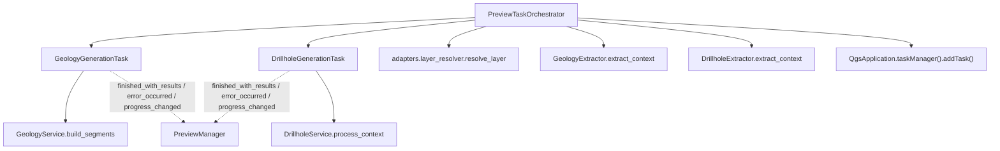

---
tags:
  - secinterp
  - code-walkthrough
  - gui
  - qgstask
  - background
aliases:
  - gui/tasks
  - QgsTask
  - PreviewTaskOrchestrator
cssclass: secinterp-note
---

# `gui/tasks/` + `preview_task_orchestrator.py`

> [!abstract] One-line summary
> Runs geology and drillhole generation in the **background** with `QgsTask`, feeding them detached DTOs and emitting deferred signals to the main thread.

**Path**: `gui/tasks/` (`geology_task.py` 101 l., `drillhole_task.py` 107 l.) + `gui/preview_task_orchestrator.py` (158 l.)
**Classes**: `GeologyGenerationTask`, `DrillholeGenerationTask`, `PreviewTaskOrchestrator`
**Layer**: GUI · Tasks
**Tags**: #secinterp #gui #qgstask #background

---

## 🎯 Why does this package exist?

Geology and drillhole generation can take seconds. Blocking the UI is unacceptable, and touching QGIS from a background thread causes segfaults.

| Problem | Solution |
|---------|----------|
| Do not block the interface | `QgsTask` registered in the `QgsTaskManager` |
| Never pass `QgsVectorLayer` to a thread | Detached DTOs (`GeologyContext`, `DrillholeContext`) |
| Signals emitted from the worker thread | `QTimer.singleShot(0, ...)` defers emission to the event loop |
| Premature task GC on QGIS 4/Qt6 | Anchoring in `self._active_tasks` |
| Cancel work when re-launching | `cancel()` + signal disconnection in `cancel_active_tasks` |

> [!important] Thread boundary
> Extraction (QGIS) happens on the main thread inside the orchestrator; the task only receives DTOs and runs pure core math.

---

## 🧬 Relationship diagram



---

## 📦 Imports — architectural reading

```python
from qgis.core import Qgis, QgsMessageLog, QgsTask, QgsApplication
from qgis.PyQt.QtCore import QTimer, pyqtSignal
from sec_interp.core.domain import DrillholeContext, GeologyContext, GeologyData
from sec_interp.gui.adapters.layer_resolver import resolve_layer
```

| # | Observation |
|---|-------------|
| ① | `QgsTask` is the base; `QgsApplication.taskManager()` is what actually enqueues. |
| ② | `pyqtSignal` defines the 3 signals observed by the manager. |
| ③ | `QTimer` is only used to defer emission to the main thread. |
| ④ | Core DTOs cross into the thread; QGIS layers **never** do. |

---

## 🧱 `geology_task.py` (101 l.) — `GeologyGenerationTask`

```python
class GeologyGenerationTask(QgsTask):
    finished_with_results = pyqtSignal(object)
    error_occurred = pyqtSignal(str)
    progress_changed = pyqtSignal(float)

    def __init__(self, description, context: GeologyContext, service: GeologyService, params):
        super().__init__(description, QgsTask.Flag.CanCancel)
        self.service = service
        self.context = context
        self.params = params
        self.result: GeologyData | None = None
        self.exception: Exception | None = None
```

| Method | Thread | What it does |
|--------|:------:|--------------|
| `run()` | worker | `self.service.build_segments(self.context, feedback=self)` |
| `finished(is_successful)` | main | Defers emission with `QTimer.singleShot(0, ...)` or emits `error_occurred` |
| `setProgress(progress)` | worker | `super().setProgress()` + `progress_changed.emit(progress)` |

> [!note] `feedback=self`
> The `QgsTask` already implements `isCanceled()` and `setProgress()`; the core service uses them as a feedback interface without knowing it is a task.

---

## 🧱 `drillhole_task.py` (107 l.) — `DrillholeGenerationTask`

```python
def run(self) -> bool:
    try:
        self.result = self.service.process_context(self.context, feedback=self)
        count = len(self.result[1]) if self.result and len(self.result) > 1 else 0
        logger.info(f"DrillholeGenerationTask finished with {count} holes")
        return True
    except Exception as e:
        self.exception = e
        return False
```

| Aspect | Detail |
|--------|--------|
| Result | Tuple `(geol_data_all, drillhole_data_all)`; `result[1]` is the hole list |
| Fallback | If `run()` succeeded but `result is None`, `finished()` uses `([], [])` |
| Errors | `QgsMessageLog.logMessage(..., "SecInterp", Qgis.MessageLevel.Critical)` + `error_occurred` |
| Rest | Same pattern as `GeologyGenerationTask` |

> [!warning] About `finished()`
> The whole body is wrapped in `try/except Exception` logging as critical: the UI should never hang because of an exception in the completion phase.

---

## 🧱 `preview_task_orchestrator.py` (158 l.) — `PreviewTaskOrchestrator`

```python
def __init__(self, manager: PreviewManager) -> None:
    self.manager = manager
    self.geology_task: GeologyGenerationTask | None = None
    self.drillhole_task: DrillholeGenerationTask | None = None
    self._active_tasks: list[Any] = []   # anchor against GC (QGIS 4/Qt6)
```

### `start_geology_task(params, service)`

```python
if self.geology_task:
    self.geology_task.cancel()
line_lyr = resolve_layer(params.line_layer)
raster_lyr = resolve_layer(params.raster_layer)
outcrop_lyr = resolve_layer(params.outcrop_layer)
extractor = self.manager.preview_service.controller.geology_extractor
context = extractor.extract_context(line_lyr, raster_lyr, outcrop_lyr,
                                    params.outcrop_name_field, params.band_num)
self.geology_task = GeologyGenerationTask("Geology Preview (Async)", context, service, params)
self._active_tasks.append(self.geology_task)
self.geology_task.finished_with_results.connect(self.manager._on_geology_finished)
self.geology_task.progress_changed.connect(self.manager._on_geology_progress)
self.geology_task.error_occurred.connect(self.manager._on_geology_error)
QgsApplication.taskManager().addTask(self.geology_task)
```

### `start_drillhole_task(params, service, extractor)`

| Step | Detail |
|------|--------|
| Resolve layers | line, collar, survey, interval, raster via `resolve_layer` |
| Build mappings | `survey_fields_dict` (`id/depth/azim/incl`) and `interval_fields_dict` (`id/from/to/lith`) |
| Extract context | `extractor.extract_context(...)` with the 14 arguments |
| Create task | `DrillholeGenerationTask("Drillhole Preview (Async)", ...)` |
| Connect & enqueue | `finished_with_results` / `progress_changed` / `error_occurred` + `addTask` |

### `cancel_active_tasks()` and `remove_task(task)`

```python
def cancel_active_tasks(self) -> None:
    import contextlib
    for task in list(self._active_tasks):
        if task:
            with contextlib.suppress(RuntimeError):
                task.cancel()
            try:
                task.finished_with_results.disconnect()
                task.progress_changed.disconnect()
                task.error_occurred.disconnect()
            except (TypeError, RuntimeError):
                pass
    self._active_tasks.clear()
    self.geology_task = None
    self.drillhole_task = None
```

| Method | Role |
|--------|------|
| `cancel_active_tasks` | Cancels, disconnects the 3 signals and clears the anchors |
| `remove_task` | Removes a finished task from `_active_tasks` (prevents growth) |

> [!tip] Anchoring
> Keeping references in `self._active_tasks` prevents Python/QGIS from destroying the `QgsTask` before it finishes, a classic cause of Qt6 segfaults.

> [!note] `gui/tasks/__init__.py`
> It is **empty** (0 lines): tasks are imported by direct path (`from .tasks.drillhole_task import ...`). There is no package-level public API.

---

## 🏛️ Design patterns present

| Pattern | Where | Purpose |
|---------|-------|---------|
| **Worker / Background Task** | both `QgsTask` classes | Heavy work off the UI |
| **Orchestrator** | `PreviewTaskOrchestrator` | Encapsulates extraction + task + signals |
| **Anchor / Retention** | `_active_tasks` | Prevent premature task GC |
| **Deferred signal** | `QTimer.singleShot(0, ...)` | Emit from the correct thread |
| **Observer** | `pyqtSignal` × 3 | Decouple task from manager |
| **Feedback interface** | `feedback=self` | The core does not know `QgsTask` |
| **Idempotent cancel** | `contextlib.suppress` + `try/except` | Cancelling is safe |

---

## 🧾 API summary

| Symbol | Signature / Inherits | Use |
|--------|----------------------|-----|
| `GeologyGenerationTask` | `QgsTask` | Generates geological segments |
| `DrillholeGenerationTask` | `QgsTask` | Generates drillhole traces/intervals |
| `PreviewTaskOrchestrator` | class | Creates, connects and enqueues tasks |
| `start_geology_task` | `(params, service) -> None` | Launches the geology task |
| `start_drillhole_task` | `(params, service, extractor) -> None` | Launches the drillhole task |
| `cancel_active_tasks` | `() -> None` | Cancels and clears anchors |
| `remove_task` | `(task) -> None` | Removes a finished task |
| `finished_with_results` | `pyqtSignal(object)` | Result on the main thread |
| `error_occurred` | `pyqtSignal(str)` | Error message |
| `progress_changed` | `pyqtSignal(float)` | Progress for the UI bar |

---

## 👀 Observations and notes

> [!success] Strengths
> - Tasks receive DTOs: zero live QGIS objects on the worker thread.
> - Deferred emission: avoids races with the geology render.
> - Explicit anchoring that prevents GC segfaults on Qt6.
> - Safe and idempotent cancellation.

> [!warning] Points of attention
> - Context extraction happens **on the main thread** inside the orchestrator; with huge layers a pause may be noticeable.
> - The orchestrator reaches `manager.preview_service.controller.geology_extractor` (a long dependency chain).
> - `finished()` catches a generic `Exception` and reports it as critical: useful, but it can hide the cause if the log is not reviewed.
> - `_active_tasks` is fully cleared in `cancel_active_tasks`; `remove_task` is the fine-grained mechanism.

> [!question] Open questions
> - Should the heavy extraction also move into a prior task?
> - Would a single generic `GenerationTask` parameterized by service be better?
> - Should `__init__.py` expose the tasks to simplify imports?

---

## 🔗 Related notes

- [[adapters]] — produces the DTOs that feed the tasks
- [[controller]] — pure core consumed by the task services
- [[domain]] — `GeologyContext` / `DrillholeContext`
- [[geology_service]] — `build_segments` invoked in `run()`
- [[drillhole_service]] — `process_context` invoked in `run()`
- [[dialog_preview_manager]] — manager whose callbacks receive the signals
- [[layer_gui_tasks]] — GUI · tasks layer index
- [[Index]] — vault index

---

*Note of the SecInterp Code Walkthrough vault — v3.8.0*
