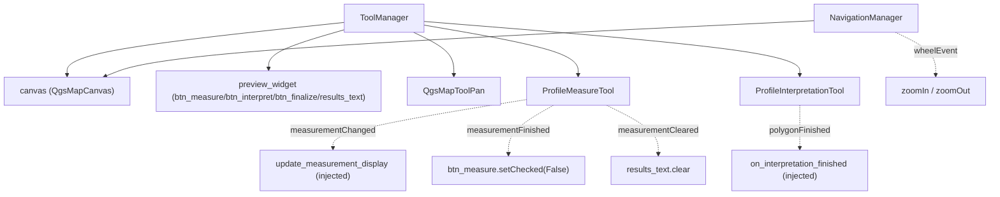

---
tags:
  - secinterp
  - code-walkthrough
  - gui
  - map-tools
aliases:
  - dialog_tool_manager.py
  - ToolManager
  - NavigationManager
cssclass: secinterp-note
---

# `gui/dialog_tool_manager.py`

> [!abstract] One-line summary
> Orchestrates the preview canvas **map tools** (pan, multi-point measurement, polygon interpretation) and exposes `NavigationManager` for wheel zoom, injecting callbacks to decouple from the dialog.

**Path**: `gui/dialog_tool_manager.py` (203 lines)
**Classes**: `ToolManager`, `NavigationManager`
**Layer**: GUI · Managers
**Tags**: #secinterp #gui #map-tools

---

## 🎯 Why does this file exist?

The dialog must not instantiate `QgsMapToolPan`, `ProfileMeasureTool`, or `ProfileInterpretationTool` inline, nor wire their signals. This module is the **sole owner** of the tools' lifecycle.

| Problem | Solution |
|---------|----------|
| Scattered tool creation in `main_dialog` | `initialize_tools()` creates them if not injected |
| Tool signals connected with no disconnection | Symmetric, idempotent `connect_signals()`/`disconnect_signals()` |
| `ToolManager` coupled to `InterpretationManager` | Injected `on_interpretation_finished` callback |
| The dialog formats measurement metrics | Injected `update_measurement_display` callback |
| Wheel zoom with no clear owner | `NavigationManager.handle_wheel_event()` |

> [!important] Extract/Present rule
> Metric computation lives in `core/utils/geometry_utils/measurement.calculate_polyline_metrics` (core). Here we only **present** the result as HTML (`results_text.setHtml`).

---

## 🧬 Relationship diagram



Dotted = Qt signals/injected callbacks (low coupling). Solid = composition.

---

## 📦 Imports — architectural reading

```python
from __future__ import annotations
import contextlib
from collections.abc import Callable
from typing import Any
from qgis.gui import QgsMapTool, QgsMapToolPan
from .tools.interpretation_tool import ProfileInterpretationTool
from .tools.measure_tool import ProfileMeasureTool
```

`QgsMapToolPan` (Qt/QGIS) is created here; this is the GUI layer, not core. The concrete tools come from `gui/tools/`. `Callable` types the callbacks; `Any` keeps widget decoupling.

---

## 🧱 Code walkthrough

### `ToolManager.__init__(...)` — injection

```python
def __init__(self, canvas, preview_widget, translate,
             on_interpretation_finished, update_measurement_display,
             pan_tool=None, measure_tool=None, interpretation_tool=None) -> None:
    self.canvas = canvas
    self.preview_widget = preview_widget
    self.tr = translate
    self.on_interpretation_finished = on_interpretation_finished
    self._update_measurement_display_cb = update_measurement_display
    self.pan_tool = pan_tool
    self.measure_tool = measure_tool
    self.interpretation_tool = interpretation_tool
```

Tools are **optional**: if not injected (tests, fakes), `initialize_tools()` creates them.

### `initialize_tools()` and signal symmetry

```python
def initialize_tools(self) -> None:
    if not self.pan_tool:
        self.pan_tool = QgsMapToolPan(self.canvas)
    if not self.measure_tool:
        self.measure_tool = ProfileMeasureTool(self.canvas)
    if not self.interpretation_tool:
        self.interpretation_tool = ProfileInterpretationTool(self.canvas)
    self.connect_signals()
    self.canvas.setMapTool(self.pan_tool)

def connect_signals(self) -> None:
    self.disconnect_signals()          # ← idempotent
    self.interpretation_tool.polygonFinished.connect(self.on_interpretation_finished)
    self.measure_tool.measurementChanged.connect(self._update_measurement_display_cb)
    self.measure_tool.measurementFinished.connect(
        lambda: self.preview_widget.btn_measure.setChecked(False))
    self.measure_tool.measurementCleared.connect(self.preview_widget.results_text.clear)
```

`disconnect_signals()` mirrors the four connections with `contextlib.suppress(TypeError, RuntimeError)`.

| Signal | Slot | Effect |
|--------|------|--------|
| `interpretation_tool.polygonFinished` | `on_interpretation_finished` | Register the interpretation |
| `measure_tool.measurementChanged` | `update_measurement_display` | Render metrics |
| `measure_tool.measurementFinished` | `lambda` | Uncheck `btn_measure` |
| `measure_tool.measurementCleared` | `results_text.clear` | Clear results |

### `toggle_measure_tool(checked)` / `toggle_interpretation_tool(checked)`

```python
def toggle_measure_tool(self, checked: bool) -> None:
    if checked:
        self.measure_tool.reset()
        self.canvas.setMapTool(self.measure_tool)
        self.measure_tool.activate()
        self.preview_widget.btn_finalize.setVisible(True)
        self.canvas.setFocus()
    else:
        self.canvas.setMapTool(self.pan_tool)
        self.pan_tool.activate()
        self.preview_widget.btn_finalize.setVisible(False)
```

`toggle_interpretation_tool` is analogous, but first calls `btn_measure.setChecked(False)` to guarantee **a single active tool**. `activate_default_tool()` always returns to pan.

### `update_measurement_display(metrics)` — Present

```python
MIN_POINT_COUNT = 2
if not metrics or metrics.get("point_count", 0) < MIN_POINT_COUNT:
    return
msg = (
    f"<b>{self.tr('Multi-Point Measurement')}</b><br>"
    f"<b>{self.tr('Total Distance')}:</b> {metrics['total_distance']:.2f} m<br>"
    f"<b>{self.tr('Elevation Change')}:</b> {metrics['elevation_change']:+.2f} m<br>"
    f"<b>{self.tr('Average Slope')}:</b> {metrics['avg_slope']:.1f}°"
)
self.preview_widget.results_text.setHtml(msg)
self.preview_widget.results_group.setCollapsed(False)
```

It ignores measurements with fewer than 2 points and expands the results group.

### `NavigationManager.handle_wheel_event(event)`

```python
def handle_wheel_event(self, event: Any) -> bool:
    if self.canvas.underMouse():
        if event.angleDelta().y() > 0:
            self.canvas.zoomIn()
        else:
            self.canvas.zoomOut()
        event.accept()
        return True
    return False
```

Returns `True` if it consumed the event; `False` lets the dialog's `wheelEvent` forward it to Qt.

---

## 🏛️ Design patterns present

| Pattern | Where | Purpose |
|---------|-------|---------|
| **Manager / Orchestrator** | `ToolManager` | Sole owner of the tools |
| **Dependency Injection** | `pan_tool=None`, callbacks | Interchangeable tools and presentation |
| **Idempotent wiring** | `connect_signals` → `disconnect_signals` | Safe reconnection |
| **Callback (Observer)** | `on_interpretation_finished` | Decoupling from `InterpretationManager` |
| **State toggle** | `toggle_*` | One active tool at a time |
| **Separate Query** | `NavigationManager` | Isolates zoom logic |

---

## 🧾 API summary

| Symbol | Signature | Typical use |
|--------|-----------|-------------|
| `ToolManager(...)` | `__init__` | Inject canvas/widget/callbacks/tools |
| `initialize_tools()` | `-> None` | Create tools + connect + default pan |
| `connect_signals()` / `disconnect_signals()` | `-> None` | Wire / disconnect (idempotent) |
| `toggle_measure_tool(checked)` | `-> None` | Enable/disable measurement |
| `toggle_interpretation_tool(checked)` | `-> None` | Enable/disable polygon |
| `activate_default_tool()` | `-> None` | Return to pan |
| `update_measurement_display(metrics)` | `-> None` | HTML metrics render |
| `NavigationManager(canvas)` / `handle_wheel_event(event)` | `-> bool` | Wheel zoom in/out |

---

## 👀 Observations and notes

> [!success] Strengths
> - **Full injection**: tools and callbacks replaceable in tests.
> - Symmetric connect/disconnect and real idempotency.
> - Metric presentation stays separate from computation (core).

> [!warning] Points of attention
> - `toggle_measure_tool` does not check `self.measure_tool is None`: if `initialize_tools()` was not called, it raises `AttributeError`.
> - `ProfileMeasureTool.finalize_measurement` internally creates a `QgsMapToolPan` **and** emits `measurementFinished`, which triggers `toggle_measure_tool(False)` → the canvas may receive `setMapTool(pan)` twice (redundant, not incorrect).
> - `update_measurement_display` writes to concrete widgets: `ToolManager` knows the `preview_widget` structure.

> [!question] Open questions
> - Should `initialize_tools()` be mandatory in the constructor to remove the "tools = None" state?

---

## 🔗 Related notes

- [[main_dialog]] — creates the manager and calls `initialize_tools()`
- [[measure_tool]] — multi-point measurement tool
- [[interpretation_tool]] — polygon tool
- [[interpretation_manager]] — receives `polygonFinished`
- [[signal_manager]] — wires the button toggles
- [[Index]] — vault index

---

*Note of the SecInterp Code Walkthrough vault — v3.8.0*
