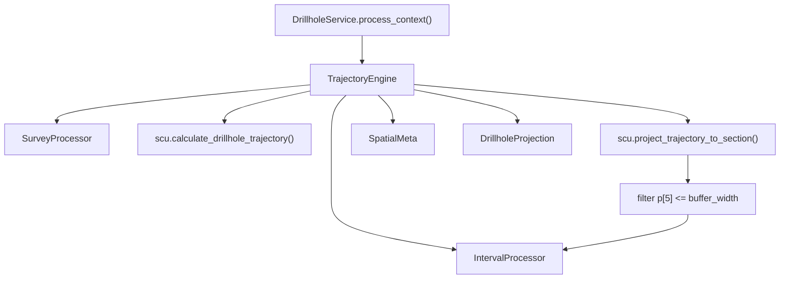

---
tags:
  - secinterp
  - code-walkthrough
  - core
  - drillhole
aliases:
  - trajectory_engine.py
  - TrajectoryEngine
cssclass: secinterp-note
---

# `core/services/drillhole/trajectory_engine.py`

> [!abstract] One-line summary
> Orchestrates per hole the sequence **final depth → 3D trajectory → 2D projection with buffer filter → intervals**, and assembles the final `DrillholeProjection`.

**Path**: `core/services/drillhole/trajectory_engine.py` (111 lines)
**Class**: `TrajectoryEngine`
**Layer**: Core · Drillhole (QGIS-agnostic)
**Tags**: #secinterp #core #drillhole

---

## 🎯 Why does this file exist?

It is the **composition point** of the drillhole pipeline. `DrillholeService` should not know the details of computing a trajectory or interpolating intervals; this engine concentrates that sequence and returns two render-ready DTOs.

| Problem | Solution |
|---------|----------|
| The calculation sequence is scattered | `process_single_hole()` encapsulates it in 4 steps |
| The depth must be decided before tracing | Delegates to `SurveyProcessor` |
| The 3D trajectory must be clipped to the buffer | Filters `p[5] <= buffer_width` after projecting |
| Render/export need spatial metadata | `create_drillhole_result()` builds `SpatialMeta` |

> [!important] Core boundary
> It composes pure processors and pure utilities (`scu`). It does not import QGIS; the only coupling is to `core/domain` and `core/utils`.

---

## 🧬 Relationship diagram



> [!tip] How to read: `TE` is an **orchestrator**; arrows leave toward injected collaborators and pure functions, none point to QGIS.

---

## 📦 Imports — architectural reading

```python
from sec_interp.core import utils as scu
from sec_interp.core.domain import DrillholeProjection, GeologySegment, SpatialMeta
from sec_interp.core.services.drillhole.interval_processor import IntervalProcessor
from sec_interp.core.services.drillhole.survey_processor import SurveyProcessor
```

| # | Observation |
|---|-------------|
| ① | `scu` provides the heavy math (`calculate_drillhole_trajectory`, `project_trajectory_to_section`). |
| ② | It imports the two processors it composes: **explicit composition**, not a service locator. |
| ③ | `SpatialMeta` is the domain's 2D/3D bridge; zero `qgis` / `PyQt` imports. |

---

## 🧱 `process_single_hole()` — the 4 steps

```python
def process_single_hole(
    self, hole_id, collar_point, collar_z, given_depth, survey_data,
    intervals, line_points, buffer_width, section_azimuth,
) -> tuple[list[GeologySegment], DrillholeProjection]:
    # 1. Determine Final Depth
    final_depth = self.survey_processor.determine_final_depth(
        given_depth, survey_data, intervals
    )

    # 2. Trajectory and Projection
    trajectory = scu.calculate_drillhole_trajectory(
        collar_point, collar_z, survey_data, section_azimuth, total_depth=final_depth,
    )
    projected_traj = [
        p for p in scu.project_trajectory_to_section(trajectory, line_points)
        if p[5] <= buffer_width
    ]

    # 3. Interpolate Intervals
    hole_geol_data = self.interval_processor.interpolate_hole_intervals(
        projected_traj, intervals, buffer_width
    )

    # 4. Generate results
    hole_proj = self.create_drillhole_result(hole_id, projected_traj, hole_geol_data)

    return hole_geol_data, hole_proj
```

| Step | Collaborator | Role |
|------|--------------|------|
| 1. Depth | `SurveyProcessor` | `max(given, surveys, intervals)` |
| 2. Trajectory + projection | `scu` | Real 3D → 2D profile, filtered by buffer |
| 3. Intervals | `IntervalProcessor` | Geology sampled over `projected_traj` |
| 4. Result | `create_drillhole_result` | Assembles `DrillholeProjection` with `SpatialMeta` |

> [!warning] Magic indices
> The filter `p[5] <= buffer_width` assumes the offset is **position 5** of the projected tuple. It is an untyped positional contract shared with `scu`.

---

## 🧱 `create_drillhole_result()` — DTO assembly

```python
def create_drillhole_result(self, hole_id, projected_traj, hole_geol_data, collar_proj=None):
    spatial_points = [
        SpatialMeta(hole_id=str(hole_id), dist_along=p[4], offset=p[5], z=p[3],
                    x_3d=p[1], y_3d=p[2], x_proj=p[6], y_proj=p[7])
        for p in projected_traj
    ]

    if collar_proj:                       # header from the projected collar
        dist, elev, offset, depth = (collar_proj.distance, collar_proj.elevation,
                                     collar_proj.offset, collar_proj.total_depth)
    elif spatial_points:                  # fallback to first point; depth = 0.0
        dist, elev, offset, depth = (spatial_points[0].dist_along,
                                     spatial_points[0].z, spatial_points[0].offset, 0.0)
    else:                                 # empty trajectory
        dist = elev = offset = depth = 0.0

    return DrillholeProjection(
        hole_id=str(hole_id), distance=dist, elevation=elev, offset=offset,
        total_depth=depth, points_3d=spatial_points, segments=hole_geol_data,
    )
```

| Header source | When |
|---------------|------|
| `collar_proj` | Already-projected collar (includes `total_depth`) |
| First `SpatialMeta` | Fallback without a collar; `total_depth = 0.0` |
| Zeros | Empty trajectory |

---

## 🏛️ Design patterns present

| Pattern | Where | Purpose |
|---------|-------|---------|
| **Orchestrator / Facade** | `process_single_hole` | Hides the 4-step sequence |
| **Pipeline / Chain** | Steps 1→2→3→4 | Unidirectional data flow |
| **DTO Assembly** | `create_drillhole_result` | Aggregates `SpatialMeta` + `GeologySegment` |

---

## 🧾 API summary

| Symbol | Signature / Inherits | Typical use |
|--------|----------------------|-------------|
| `process_single_hole` | `(hole_id, collar_point, collar_z, given_depth, survey_data, intervals, line_points, buffer_width, section_azimuth) -> tuple[list[GeologySegment], DrillholeProjection]` | Processes one hole |
| `create_drillhole_result` | `(hole_id, projected_traj, hole_geol_data, collar_proj=None) -> DrillholeProjection` | Assembles the final DTO |

---

## 👀 Observations and notes

> [!success] Strengths
> - **Clean composition**: each step has a clear collaborator.
> - **Graceful degradation**: with no collar or trajectory it still returns a valid DTO.

> [!warning] Points of attention
> - `create_drillhole_result` accesses `p[1..7]` by index; a change in `scu` silently breaks the engine.
> - The buffer filter happens here, but `interpolate_hole_intervals` also receives `buffer_width`: double responsibility over clipping.

> [!question] Open questions
> - Should `projected_traj` be a list of `SpatialMeta` from `scu`, and should the buffer filter move to a single point in the pipeline?

---

## 🔗 Related notes

- [[Index]] — vault index
- [[drillhole_service]] — orchestrates it per collar
- [[survey_processor]] / [[interval_processor]] — injected collaborators
- [[collar_processor]] — provides `collar_z` and `given_depth`
- [[domain]] — `DrillholeProjection`, `GeologySegment`, `SpatialMeta`
- [[layer_core_services_drillhole]] — pipeline sub-layer

---

*Note of the SecInterp Code Walkthrough vault — v3.8.0*
