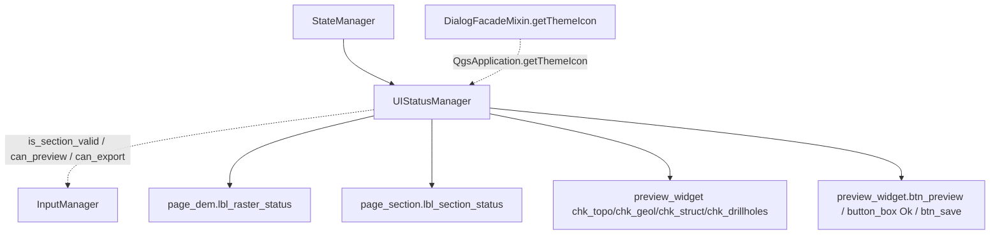

---
tags:
  - secinterp
  - code-walkthrough
  - gui
  - status
aliases:
  - ui_status_manager.py
  - UIStatusManager
cssclass: secinterp-note
---

# `gui/ui_status_manager.py`

> [!abstract] One-line summary
> Translates **input validity** into visual cues: warning/success icons on layer labels and enable/disable of dialog checkboxes and buttons.

**Path**: `gui/ui_status_manager.py` (85 lines)
**Class**: `UIStatusManager`
**Layer**: GUI · Managers
**Tags**: #secinterp #gui #status

---

## 🎯 Why does this file exist?

The "ready to preview?" logic must not be scattered as `setEnabled(...)` across the dialog. `UIStatusManager` is the **state presentation layer**: it queries `InputManager` and applies the result to widgets.

| Problem | Solution |
|---------|----------|
| `setEnabled` scattered across `main_dialog` | Four centralized methods |
| Validation icons with no owner | `setup_indicators()` loads warning/success once |
| Layer checkboxes always enabled | `update_preview_checkbox_states()` conditions them on validity |
| Buttons that fail when clicked with no data | `update_button_state()` disables them preemptively |

> [!important] Architectural note
> This manager **only presents**: it never validates on its own. Every decision comes from `InputManager` (`is_section_valid`, `can_preview`, `can_export`), which in turn delegates to core.

---

## 🧬 Relationship diagram



Dotted = service query or dependency; solid = write onto widgets.

---

## 📦 Imports — architectural reading

```python
from __future__ import annotations
from typing import TYPE_CHECKING
from qgis.PyQt.QtWidgets import QDialogButtonBox
if TYPE_CHECKING:
    from sec_interp.gui.main_dialog import SecInterpDialog  # type: ignore
```

It imports only `QDialogButtonBox` from Qt (to locate the `Ok` button by role). `TYPE_CHECKING` avoids the cycle with `main_dialog`. It does **not** import `InputManager` or core: it queries them via `self.dialog.input_manager`.

---

## 🧱 Code walkthrough — `UIStatusManager`

### `__init__(dialog)` and `setup_indicators()`

```python
def __init__(self, dialog: SecInterpDialog) -> None:
    self.dialog = dialog
    self._warning_icon = None
    self._success_icon = None

def setup_indicators(self) -> None:
    self._warning_icon = self.dialog.getThemeIcon("mMessageLogCritical.svg")
    self._success_icon = self.dialog.getThemeIcon("mIconSuccess.svg")
    self.update_raster_status()
    self.update_section_status()
```

`getThemeIcon` is a `DialogFacadeMixin` proxy to `QgsApplication.getThemeIcon(name)`, so icons honor the active QGIS theme. Until `setup_indicators()`, icons are `None` and the methods exit early.

### `update_all()` — full refresh

```python
def update_all(self) -> None:
    self.update_button_state()
    self.update_preview_checkbox_states()
    self.update_raster_status()
    self.update_section_status()
```

This is the entry point `StateManager.update_all()` calls after loading settings or resetting.

### `update_preview_checkbox_states()` — enable layers

```python
im = self.dialog.input_manager
has_section = im.is_section_valid("section")
has_dem = im.is_section_valid("dem")

pw = self.dialog.preview_widget
pw.chk_topo.setEnabled(has_dem and has_section)
pw.chk_geol.setEnabled(im.is_section_valid("geology") and has_section)
pw.chk_struct.setEnabled(im.is_section_valid("structure") and has_section)
pw.chk_drillholes.setEnabled(im.is_section_valid("drillhole") and has_section)
```

| Checkbox | Condition |
|----------|-----------|
| `chk_topo` | DEM **and** section valid |
| `chk_geol` / `chk_struct` / `chk_drillholes` | their layer valid **and** section |

The section is cross-cutting: without a cross-section line there is no point showing any layer.

### `update_button_state()` — enable actions

```python
im = self.dialog.input_manager
can_preview = im.can_preview()
self.dialog.preview_widget.btn_preview.setEnabled(can_preview)
self.dialog.button_box.button(QDialogButtonBox.StandardButton.Ok).setEnabled(can_preview)
if hasattr(self.dialog, "btn_save"):
    self.dialog.btn_save.setEnabled(im.can_export())
```

`Ok` shares the preview gate; `btn_save` (if present) uses `can_export()`, which additionally requires the output path.

### `update_raster_status()` and `update_section_status()`

```python
def update_raster_status(self) -> None:
    if not self._warning_icon:
        return
    im = self.dialog.input_manager
    label = self.dialog.page_dem.lbl_raster_status
    if im.is_section_valid("dem"):
        label.setPixmap(self._success_icon.pixmap(16, 16))
        label.setToolTip(self.dialog.tr("Raster layer selected"))
    else:
        label.setPixmap(self._warning_icon.pixmap(16, 16))
        label.setToolTip(im.get_section_error("dem"))
```

`update_section_status()` is identical over `page_section.lbl_section_status`. Both use `get_section_error()` as the tooltip when data is missing.

---

## 🏛️ Design patterns present

| Pattern | Where | Purpose |
|---------|-------|---------|
| **Presenter / MVP** | `UIStatusManager` | Validity → presentation without validating |
| **Facade (icons)** | `dialog.getThemeIcon` | QGIS theme icons |
| **Guard clause** | `if not self._warning_icon: return` | Avoid painting before init |
| **Conditional enablement** | `update_*` | UI consistent with state |
| **Delegation** | `StateManager` → here | Single entry point |

---

## 🧾 API summary

| Symbol | Signature | Typical use |
|--------|-----------|-------------|
| `UIStatusManager(dialog)` | `__init__` | Composition |
| `setup_indicators()` | `-> None` | Load icons + initial state |
| `update_all()` | `-> None` | Full refresh |
| `update_preview_checkbox_states()` | `-> None` | Enable layer checkboxes |
| `update_button_state()` | `-> None` | Enable preview/Ok/save |
| `update_raster_status()` / `update_section_status()` | `-> None` | DEM / section line icon |

---

## 👀 Observations and notes

> [!success] Strengths
> - **Centralized** state presentation with no business logic.
> - Icons consistent with the QGIS theme via `getThemeIcon`.
> - Guard clauses that avoid work before `setup_indicators()`.

> [!warning] Points of attention
> - `update_preview_checkbox_states()` calls `is_section_valid` up to 4 times, and each call rebuilds `ValidationParams` inside `InputManager` (repeated cost).
> - `chk_interpretations` is **not** managed here (it stays always enabled), unlike the other four checkboxes.
> - `update_button_state()` assumes the `Ok` button exists: `button(...).setEnabled(...)` on `None` would raise `AttributeError`.
> - It depends on concrete widget names (`lbl_raster_status`, `lbl_section_status`, `chk_*`), coupling the manager to the programmatic UI.

> [!question] Open questions
> - Should `ValidationParams` be computed once per refresh and passed to all queries?

---

## 🔗 Related notes

- [[state_manager]] — delegates visual state here
- [[input_manager]] — source of `is_section_valid`/`can_preview`/`can_export`
- [[main_dialog]] — exposes `getThemeIcon` and the widgets
- [[ui_pages]] — pages with `lbl_*_status`
- [[dialog_mixins]] — `DialogFacadeMixin.getThemeIcon`
- [[Index]] — vault index

---

*Note of the SecInterp Code Walkthrough vault — v3.8.0*
