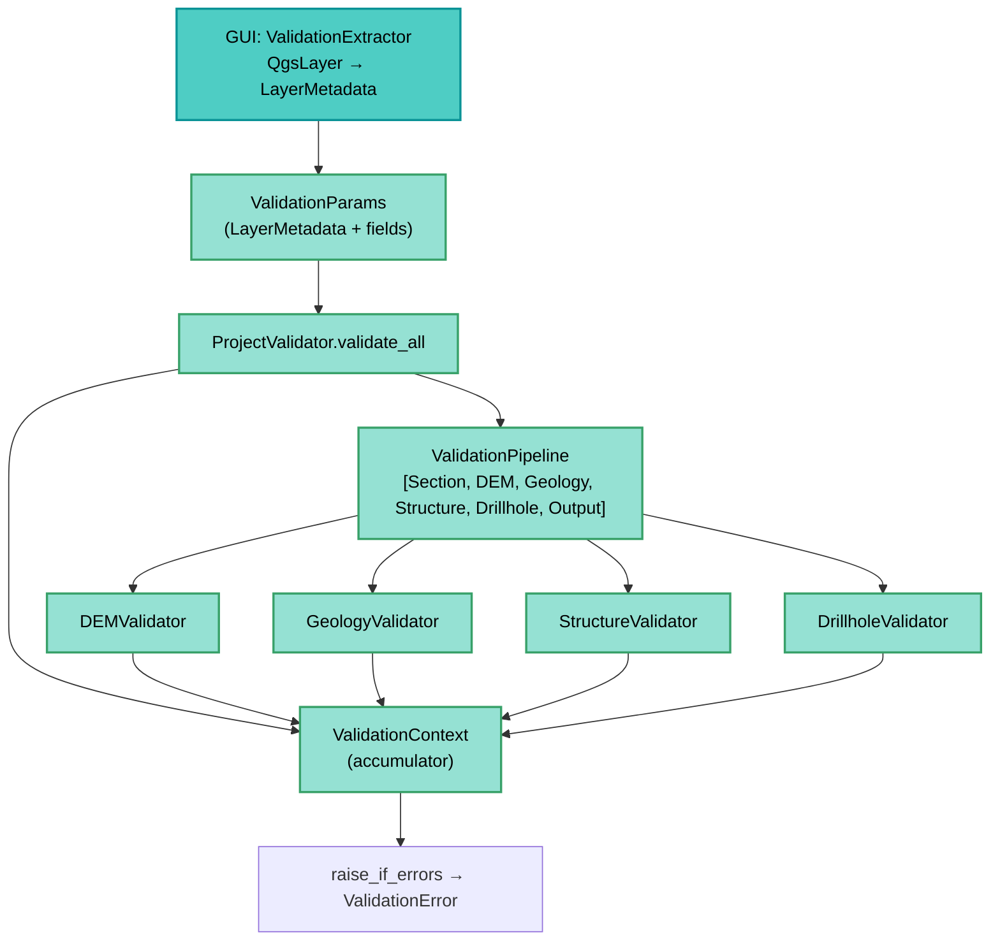

---
tags:
  - secinterp
  - code-walkthrough
  - core
  - validation
  - pipeline
aliases:
  - core/validation
  - Validation Pipeline
cssclass: secinterp-note
---

# 16 — `core/validation/`

> [!abstract] One-line summary
> The **validation pipeline** — QGIS-agnostic, domain-based, and accumulative: it validates layers, fields, CRS, bands, and ranges without touching QGIS.

**Path**: `core/validation/` (package · 12 files)
**Key symbols**: `LayerMetadata`, `ValidationParams`, `ValidationPipeline`, `ValidationContext`, `IValidator`, `ProjectValidator`
**Layer**: Core · Validation
**Tags**: #secinterp #core #validation #pipeline

---

## 🎯 Why does this package exist?

Validating in the GUI mixes QGIS with business logic. This package **decouples** them:

| Problem | Solution |
|---------|----------|
| Validators need `QgsVectorLayer` | They work with detached `LayerMetadata` |
| Fail-fast hides multiple errors | `ValidationContext` **accumulates** errors |
| Validation scattered across the dialog | `ProjectValidator.validate_all()` centralizes it |
| Need to validate ranges/CRS/fields | Helpers `field_validator`, `layer_validator`, `path_validator` |

> [!important] QGIS-agnostic
> No validator imports `qgis.*`. The GUI produces `LayerMetadata` via a `ValidationExtractor` (Extract).

---

## 🧬 Pipeline architecture



---

## 🧱 `LayerMetadata` — detached DTO

```python
@dataclass
class LayerMetadata:
    name: str = ""
    is_valid: bool = False
    kind: str = KIND_VECTOR | KIND_RASTER | KIND_UNKNOWN
    geometry_type: str | None = GEOMETRY_POINT | GEOMETRY_LINE | GEOMETRY_POLYGON
    field_names: list[str] = ...
    field_types: dict[str, FieldType] = ...
    band_count: int = 0
    feature_count: int = 0
    crs_authid: str | None = None
```

> [!tip] Bridge
> The GUI extracts `LayerMetadata` from QGIS layers; the core validates only this DTO.

---

## 🧱 `ValidationParams` + `ProjectValidator`

```python
@dataclass
class ValidationParams:
    raster_layer: LayerMetadata | None = None
    band_number: int | None = None
    line_layer: LayerMetadata | None = None
    outcrop_layer: LayerMetadata | None = None
    outcrop_field: str | None = None
    struct_layer: LayerMetadata | None = None
    collar_layer: LayerMetadata | None = None
    collar_id: str | None = None
    # ... survey/interval, scale, vert_exag, buffer, output_path
```

```python
class ProjectValidator:
    @classmethod
    def validate_all(cls, params: ValidationParams) -> bool:
        context = ValidationContext()
        pipeline = ValidationPipeline([
            SectionValidator(), DEMValidator(),
            GeologyValidator(), StructureValidator(),
            DrillholeValidator(), OutputValidator(),
        ])
        pipeline.execute(params, context)
        context.raise_if_errors()
        return True
```

| Method | Scope |
|--------|-------|
| `validate_all` | Full pipeline (6 validators) |
| `validate_preview_requirements` | Only `Section + DEM` (minimum for preview) |

---

## 🧱 `IValidator` + `ValidationPipeline`

```python
class IValidator(ABC):
    @abstractmethod
    def validate(self, params: ValidationParams, context: ValidationContext) -> None: ...

class ValidationPipeline:
    def __init__(self, validators: Iterable[IValidator] | None = None): ...
    def add_validator(self, validator: IValidator) -> None: ...
    def execute(self, params, context) -> None:
        for validator in self._validators:
            validator.validate(params, context)
```

> [!note] Order matters
> `SectionValidator` → `DEMValidator` → … The pipeline runs in sequence.

---

## 🧱 `ValidationContext` — accumulator

```python
@dataclass
class RichValidationError:
    message: str
    field_name: str | None = None
    severity: str = "error"   # error / warning / info
    context: dict[str, Any] = ...

class ValidationContext:
    def add_error(self, message, field_name=None, **kwargs): ...
    def add_warning(self, message, field_name=None, **kwargs): ...
    @property
    def has_errors(self) -> bool: ...
    @property
    def errors(self) -> list[RichValidationError]: ...
    def raise_if_errors(self): ...  # → ValidationError with aggregate
```

| Feature | Detail |
|---------|--------|
| **Accumulation** | Does not fail fast; collects every error |
| **Severity** | `error` blocking vs `warning` informational |
| **Raise** | `raise_if_errors()` throws a single `ValidationError` with the aggregate |

> [!warning] `raise_if_errors`
> Centralizes the `raise` — validators only **add** to the context.

---

## 🧱 Domain validators

| Module | Functions |
|--------|-----------|
| `field_validator.py` | `validate_numeric_input`, `validate_integer_input`, `validate_field_exists`, `validate_field_type`, `validate_angle_range` |
| `layer_validator.py` | `validate_layer_has_features`, `validate_layer_geometry`, `validate_raster_band`, `validate_structural_requirements`, `validate_crs_compatibility` |
| `path_validator.py` | `validate_output_path`, `validate_safe_output_path` |
| `project_validators/` | `Section/DEM/Geology/Structure/Drillhole/OutputValidator` (each `IValidator`) |

---

## 🏛️ Design patterns present

| Pattern | Where | Purpose |
|---------|-------|---------|
| **Pipeline / Chain** | `ValidationPipeline` | Orchestrates validators in sequence |
| **Strategy** | `IValidator` | Each domain with its rule |
| **Context Object** | `ValidationContext` | Accumulates errors without throwing |
| **DTO Bridge** | `LayerMetadata` | Decouples QGIS from the core |

---

## 👀 Observations and notes

> [!success] Strengths
> - **Centralized**, testable validation without QGIS.
> - `LayerMetadata` reusable for other validations.
> - Messages via `RichValidationError` with field and severity.

> [!warning] Points of attention
> - `field_validator` returns `(bool, msg, value)` triplets — different style from `ValidationContext`.
> - `ProjectValidator` is pure `@classmethod` (stateless) → could be a function.
> - Some validators mix `error` and `warning` without a clear guide.

---

## 🔗 Related notes

- [[Index]] — vault index
- [[controller]] — invokes `ProjectValidator.validate_all(build_validation_params(params))`
- [[domain]] — `FieldType`, `ValidationResult`
- [[exceptions]] — `ValidationError`, `ParameterError`
- [[adapters]] — `ValidationExtractor` (producer of `LayerMetadata`)

---

*Note 16 of the SecInterp Code Walkthrough vault — v3.8.0*
