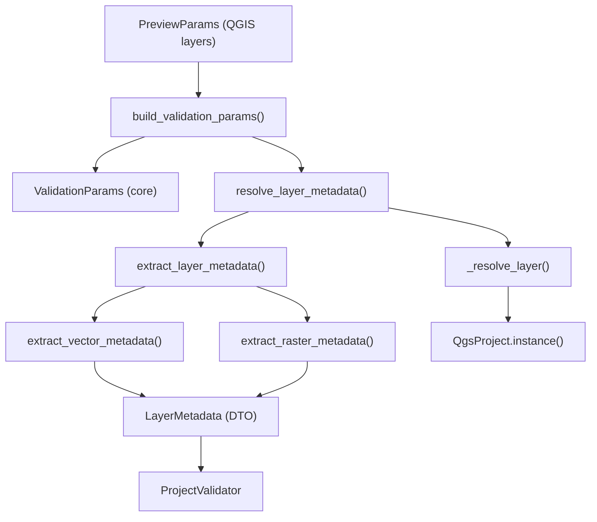

---
tags:
  - secinterp
  - code-walkthrough
  - gui
  - adapters
  - validation
aliases:
  - validation_extractor.py
  - resolve_layer_metadata
  - LayerMetadata
cssclass: secinterp-note
---

# `gui/adapters/validation_extractor.py`

> [!abstract] One-line summary
> **Extract** adapter for validation: converts QGIS layers (and project references) into detached `LayerMetadata` records and assembles a `ValidationParams` for the pure validator.

**Path**: `gui/adapters/validation_extractor.py` (176 lines)
**Functions**: `resolve_layer_metadata`, `extract_layer_metadata`, `extract_vector_metadata`, `extract_raster_metadata`, `build_validation_params`
**Layer**: GUI · Adapters (Extract phase)
**Tags**: #secinterp #gui #adapters #validation

---

## 🎯 Why does this file exist?

| Problem | Solution |
|---------|----------|
| The core validator cannot touch `QgsVectorLayer` | A `LayerMetadata` of primitives is extracted |
| Layer references may be an object, ID or name | `_resolve_layer` covers all three cases |
| QGIS field types are not portable | `_to_field_type` maps the `QVariant` to `FieldType` |
| `PreviewParams` holds live layers | `build_validation_params` replaces them with metadata |

> [!important] Extract boundary
> It is the bridge between `PreviewParams` (GUI, with QGIS layers) and `ValidationParams` (core, with `LayerMetadata`). `ProjectValidator` never sees QGIS.

---

## 🧬 Relationship diagram



---

## 📦 Imports — architectural reading

```python
from qgis.core import QgsMapLayer, QgsProject, QgsRasterLayer, QgsVectorLayer, QgsWkbTypes
from sec_interp.core.domain import FieldType
from sec_interp.core.validation.layer_metadata import (
    GEOMETRY_LINE, GEOMETRY_POINT, GEOMETRY_POLYGON, GEOMETRY_UNKNOWN,
    KIND_RASTER, KIND_UNKNOWN, KIND_VECTOR, LayerMetadata,
)
```

| # | Observation |
|---|-------------|
| ① | Imports the core's **type constants** (`KIND_*`, `GEOMETRY_*`) to avoid duplicating strings. |
| ② | `_GEOMETRY_MAP` translates `QgsWkbTypes.GeometryType` into those agnostic strings. |
| ③ | `ValidationParams` is imported **inside** `build_validation_params` to avoid a circular import. |

---

## 🧱 `_GEOMETRY_MAP` — type translation

```python
_GEOMETRY_MAP = {
    QgsWkbTypes.GeometryType.PointGeometry: GEOMETRY_POINT,
    QgsWkbTypes.GeometryType.LineGeometry: GEOMETRY_LINE,
    QgsWkbTypes.GeometryType.PolygonGeometry: GEOMETRY_POLYGON,
}
```

> [!note] QGIS → our own vocabulary
> Any type not listed (e.g. `NullGeometry`) falls back to `GEOMETRY_UNKNOWN` via `dict.get(..., GEOMETRY_UNKNOWN)`.

---

## 🧱 `resolve_layer_metadata()` + `_resolve_layer()`

```python
def resolve_layer_metadata(layer_ref: Any) -> LayerMetadata | None:
    layer = _resolve_layer(layer_ref)
    if layer is None:
        return None
    return extract_layer_metadata(layer)

def _resolve_layer(layer_ref: Any) -> QgsMapLayer | None:
    if isinstance(layer_ref, QgsMapLayer):
        return layer_ref
    if not layer_ref:
        return None
    if isinstance(layer_ref, str):
        project = QgsProject.instance()
        layer = project.mapLayer(layer_ref)          # 1. by ID
        if layer is not None:
            return layer
        for lyr in project.mapLayers().values():     # 2. by name
            if lyr.name() == layer_ref:
                return lyr
    return None
```

| Input | Behaviour |
|-------|-----------|
| `QgsMapLayer` | Returned as is |
| `str` (ID) | `project.mapLayer(ref)` |
| `str` (name) | Linear search in `project.mapLayers().values()` |
| Falsy / other type | `None` |

> [!tip] Resolver + extract combo
> `resolve_layer_metadata` is the shortcut: it accepts a raw reference and directly returns `LayerMetadata | None`.

---

## 🧱 `extract_layer_metadata()` — dispatch by type

```python
def extract_layer_metadata(layer: QgsMapLayer) -> LayerMetadata:
    if isinstance(layer, QgsVectorLayer):
        return extract_vector_metadata(layer)
    if isinstance(layer, QgsRasterLayer):
        return extract_raster_metadata(layer)
    return LayerMetadata(name=layer.name(), is_valid=layer.isValid(), kind=KIND_UNKNOWN)
```

| Branch | Output |
|--------|--------|
| Vector | `extract_vector_metadata` |
| Raster | `extract_raster_metadata` |
| Other | Minimal `LayerMetadata` with `KIND_UNKNOWN` |

---

## 🧱 Vector vs raster extraction

```python
def extract_vector_metadata(layer):
    metadata = LayerMetadata(name=layer.name(), is_valid=layer.isValid(),
                             kind=KIND_VECTOR, feature_count=layer.featureCount())
    if not layer.isValid():
        return metadata
    metadata.geometry_type = _GEOMETRY_MAP.get(
        QgsWkbTypes.geometryType(layer.wkbType()), GEOMETRY_UNKNOWN)
    for f in layer.fields():
        metadata.field_names.append(f.name())
        metadata.field_types[f.name()] = _to_field_type(f.type())
    crs = layer.crs()
    if crs.isValid():
        metadata.crs_authid = crs.authid()
    return metadata
```

| Field | Vector | Raster |
|-------|:------:|:------:|
| `name`, `is_valid` | ✅ | ✅ |
| `kind` | `vector` | `raster` |
| `feature_count` | ✅ | 0 |
| `geometry_type` | ✅ | — |
| `field_names` / `field_types` | ✅ | — |
| `band_count` | 0 | ✅ |
| `crs_authid` | ✅ (if valid) | ✅ (if valid) |

> [!warning] Early return
> If `layer.isValid()` is `False`, **partial** metadata is returned (name/validity/kind only); no attempt is made to read fields, geometry or CRS.

---

## 🧱 `build_validation_params()` — from `PreviewParams` to `ValidationParams`

```python
def build_validation_params(params: Any) -> Any:
    from sec_interp.core.validation.project_validator import ValidationParams
    return ValidationParams(
        raster_layer=resolve_layer_metadata(params.raster_layer),
        band_number=params.band_num,
        line_layer=resolve_layer_metadata(params.line_layer),
        buffer_dist=float(params.buffer_dist),
        outcrop_layer=resolve_layer_metadata(params.outcrop_layer),
        ...
        interval_lith=params.interval_lith_field,
    )
```

| Group | Mapped fields |
|-------|---------------|
| Raster | `raster_layer`, `band_number` |
| Line | `line_layer`, `buffer_dist` |
| Outcrop | `outcrop_layer`, `outcrop_field` |
| Structures | `struct_layer`, `struct_dip_field`, `struct_strike_field`, `dip_scale_factor` |
| Collar | `collar_layer`, `collar_id`, `collar_use_geom`, `collar_x/y` |
| Survey | `survey_layer`, `survey_id/depth/azim/incl` |
| Interval | `interval_layer`, `interval_id/from/to/lith` |

> [!note] Local import
> `ValidationParams` is imported inside the function because `project_validator` in turn imports core modules; the local import breaks the cycle.

---

## 🏛️ Design patterns present

| Pattern | Where | Purpose |
|---------|-------|---------|
| **Adapter** | `extract_*` functions | QGIS → `LayerMetadata` |
| **Dispatcher** | `extract_layer_metadata` | Vector vs raster vs unknown |
| **Mapper / dict** | `_GEOMETRY_MAP`, `_to_field_type` | Vocabulary translation |
| **Lazy import** | `build_validation_params` | Break the circular import |
| **Null object** | `KIND_UNKNOWN` / `GEOMETRY_UNKNOWN` | Tolerate unsupported types |

---

## 🧾 API summary

| Symbol | Signature | Use |
|--------|-----------|-----|
| `resolve_layer_metadata` | `(layer_ref) -> LayerMetadata \| None` | Resolve + extract |
| `extract_layer_metadata` | `(layer) -> LayerMetadata` | Dispatch by type |
| `extract_vector_metadata` | `(layer) -> LayerMetadata` | Fields, geometry, CRS |
| `extract_raster_metadata` | `(layer) -> LayerMetadata` | Bands, CRS |
| `build_validation_params` | `(params) -> ValidationParams` | Convert `PreviewParams` |
| `_resolve_layer` | `(layer_ref) -> QgsMapLayer \| None` | Object / ID / name |
| `_to_field_type` | `(qvariant_type) -> FieldType` | Field type |

---

## 👀 Observations and notes

> [!success] Strengths
> - The validation core stays 100% free of QGIS.
> - Accepts heterogeneous references (object, ID, name).
> - Early return for invalid layers.

> [!warning] Points of attention
> - Name lookup is linear (`O(n)` over project layers); caching would help large projects.
> - `_to_field_type` relies on the integer value of the QGIS enum; a misaligned `FieldType` falls back to `FieldType.NULL`.
> - `build_validation_params` reads **every** attribute of `params`; if `PreviewParams` changes, this mapping must be updated.

> [!question] Open questions
> - Should `_resolve_layer` reuse `LayerResolver` to benefit from its cache?
> - Should we validate that `params` has the expected fields before mapping?

---

## 🔗 Related notes

- [[validation]] — consumes `LayerMetadata` / `ValidationParams`
- [[adapters]] — overview of the Extract phase
- [[domain]] — `FieldType` and domain types
- [[layer_notification_manager]] — invalidates cache on layer change
- [[controller]] — origin of the `PreviewParams`
- [[Index]] — vault index

---

*Note of the SecInterp Code Walkthrough vault — v3.8.0*
