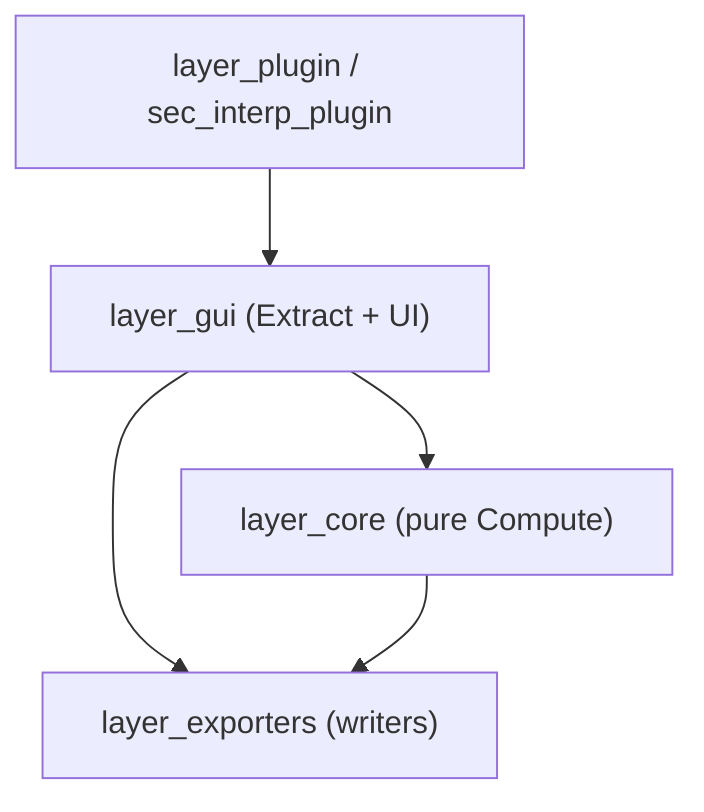

---
tags:
  - secinterp
  - code-walkthrough
  - moc
aliases:
  - SecInterp Code Walkthrough v2
  - SecInterp Code Guide v2
cssclass: secinterp-moc
---

# 🗺️ SecInterp — Code Walkthrough v2 (MOC)

> [!abstract] Purpose
> **Complete, self-contained** vault (v2) documenting the SecInterp implementation
> file-by-file: **151 substantive notes + 23 `layer_*` hubs per language**
> (ES in `code_walkthrough_v2/`, EN in `code_walkthrough_en_v2/`), with
> method-by-method walkthroughs, data flow, patterns, error handling and tests.
> The v1 vault (`code_walkthrough/`) is left untouched.

> [!info] Context
> - **Plugin**: SecInterp — QGIS ≥ 3.28, QGIS 4.x ready
> - **Architecture**: Clean Architecture (Core/GUI separation, Extract-then-Compute)
> - **Documented version**: 3.8.0
> - **Status**: ✅ Complete — 302 substantive notes + 46 hubs (both languages), 0 skeletons

---

## 📚 Map by layer (`layer_*` hubs)

| Hub | Layer / package | Notes | Covers |
|---|---|---:|---|
| [[layer_core]] | `core/` | 5 + 6 sub-hubs | QGIS-agnostic core facade |
| [[layer_core_services]] | `core/services/` | 6 + 2 sub-hubs | Domain services |
| [[layer_core_services_drillhole]] | `core/services/drillhole/` | 4 | Drillhole processors |
| [[layer_core_services_export]] | `core/services/export/` | 4 + 1 sub-hub | Export orchestration |
| [[layer_core_services_export_handlers]] | `core/services/export/handlers/` | 7 | One handler per entity |
| [[layer_core_validation]] | `core/validation/` | 8 | Validation framework |
| [[layer_core_utils]] | `core/utils/` | 8 + 1 sub-hub | Pure utilities |
| [[layer_core_utils_geometry_utils]] | `core/utils/geometry_utils/` | 4 | Measurement/optimization/processing |
| [[layer_core_domain]] | `core/domain/` | 6 | DTOs and entities |
| [[layer_core_models]] | `core/models/` | 2 | Settings model |
| [[layer_core_interfaces]] | `core/interfaces/` | 2 | Ports (contracts) |
| [[layer_gui]] | `gui/` | 31 + 6 sub-hubs | Dialog, managers and preview |
| [[layer_gui_adapters]] | `gui/adapters/` | 9 | Extract side (QGIS → DTOs) |
| [[layer_gui_renderers]] | `gui/renderers/` | 3 | Renderer family |
| [[layer_gui_tasks]] | `gui/tasks/` | 3 | Background QgsTasks |
| [[layer_gui_tools]] | `gui/tools/` | 4 | Interactive map tools |
| [[layer_gui_ui]] | `gui/ui/` | 3 + 1 sub-hub | Window and sidebar |
| [[layer_gui_ui_pages]] | `gui/ui/pages/` | 10 + 2 sub-hubs | Dialog pages |
| [[layer_gui_ui_pages_drillhole]] | `gui/ui/pages/drillhole/` | 4 | Collar/interval/survey tabs |
| [[layer_gui_ui_pages_settings]] | `gui/ui/pages/settings/` | 4 | Settings tabs |
| [[layer_gui_dialogs]] | `gui/dialogs/` | 1 + related | Properties dialog |
| [[layer_exporters]] | `exporters/` | 13 | File writers |
| [[layer_plugin]] | `plugin/` | 4 | Entry and lifecycle |
| — | root + `resources/` | 5 | [[sec_interp_plugin]], [[logger_config]], [[resources]], [[resources_pkg]], [[root]] |

---

## 🧭 Suggested reading paths

| Profile | Path |
|---|---|
| **Newcomer** | [[layer_core]] → [[controller]] → [[layer_gui]] → [[main_dialog]] |
| **Extract-then-Compute flow** | [[layer_gui_adapters]] → [[domain]] → [[layer_core_services]] |
| **Preview** | [[dialog_preview_manager]] → [[preview_task_orchestrator]] → [[preview_service]] → [[preview_renderer]] → [[topo_renderer]] |
| **Export** | [[dialog_export_manager]] → [[orchestrator]] → [[layer_exporters]] |
| **Validation** | [[layer_core_validation]] → [[layer_metadata]] → [[crs_plausibility]] → [[project_validator]] → [[layer_validator]] |
| **Plugin entry** | [[sec_interp_plugin]] → [[lifecycle]] → [[main_dialog]] |

---

## 🧬 Layer diagram

> [!tip] How to read
> Dependencies point toward the core: the GUI extracts DTOs from QGIS, the core
> computes without QGIS, exporters write files. See [[controller]] and
> [[core_interfaces]] for the contracts holding the boundary.

---

## 📖 How to read these notes

Each substantive note follows the v2 template (`_template.md`):

1. **Frontmatter** — tags and aliases.
2. **Summary + why it exists** — problem/solution.
3. **Diagram** — relationship Mermaid.
4. **Imports** — architectural reading.
5. **Inventory** — classes/functions/constants.
6. **Method-by-method walkthrough** — the depth core.
7. **Data flow** — input → transformation → output.
8. **Patterns / API / Errors / Tests / Observations**.
9. **Related notes** — wikilinks (all resolve).

`layer_*` hubs are short navigation notes: member table with roles, mini-map and
fit. Sizes: Tier A/C 400–500 lines, Tier B 300–400, hubs 150–260.

> [!tip] Structure documents
> See [[project_structure]] (tree), [[project_structure_table]] (tabular
> depth view) and [[project_structure_links]] (file → note map) for the
> full plugin map.

---

## 🔖 Tags used

`#secinterp` · `#code-walkthrough` · `#moc` · `#layer` · `#core` · `#gui` · `#exporters` · `#plugin` · `#interfaces` · `#services` · `#utils` · `#validation` · `#pages` · `#renderers` · `#tasks` · `#tools` · `#adapters` · `#managers`

---

*Root note of the v2 vault — complete vault (Phases 1–4), v3.9.0.*
