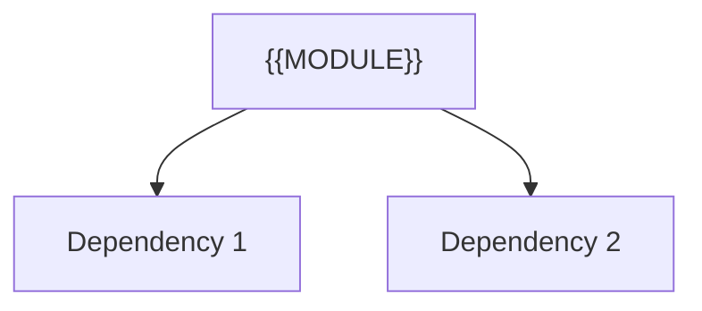

---
tags:
  - secinterp
  - code-walkthrough
  - {{LAYER_TAG}}      # core | gui | exporters
  - {{DOMAIN_TAG}}     # services | managers | renderers | adapters | validation | etc.
aliases:
  - {{FILE_BASENAME}}  # e.g. path_resolver.py
  - {{CLASS_NAME}}     # e.g. resolve_export_path
cssclass: secinterp-note
{{NOTE_LINES}}
---

# `{{REL_PATH}}`

> [!abstract] One-line summary
> {{ONE_LINE_SUMMARY}} — what this module does in one sentence, without touching QGIS if it is core.

**Path**: `{{REL_PATH}}` ({{LINES}} lines)
**Main class/function**: `{{CLASS_NAME}}`
**Layer**: {{LAYER}} (QGIS-agnostic / GUI · Type)
**Tags**: #secinterp #{{LAYER_TAG}} #{{DOMAIN_TAG}}

---

## 🎯 Why does this file exist?

| Problem | Solution |
|---------|----------|
| {{PROBLEM_1}} | {{SOLUTION_1}} |
| {{PROBLEM_2}} | {{SOLUTION_2}} |

> [!important] Architectural note
> {{ARCH_NOTE}} (e.g. "QGIS-agnostic", "Extract Adapter", "Factory").

---

## 🧬 Relationship diagram



> [!tip] How to read
> Solid arrow = imports/delegates; dashed = callback/injected.

---

## 📦 Imports — architectural reading

```python
# {{FILE}}
{{IMPORT_BLOCK}}
```

| # | Observation |
|---|-------------|
| ① | {{OBS_1}} |
| ② | {{OBS_2}} |

---

## 🏗️ Structure inventory

{{STRUCTURE_INVENTORY}}

---

## 📁 Files in the package

{{FILE_INVENTORY}}

---

## 📖 Method-by-method walkthrough

### `{{M1_NAME}}`

```python
{{M1_CODE}}
```

{{M1_PROSE}}

### `{{M2_NAME}}`

```python
{{M2_CODE}}
```

{{M2_PROSE}}

<!-- Add one subsection per public method of the module -->

---

## 🔄 Data flow

| Phase | Input | Transformation | Output |
|-------|-------|----------------|--------|
| {{FLOW_PHASE_1}} | {{FLOW_IN_1}} | {{FLOW_TRANSFORM_1}} | {{FLOW_OUT_1}} |
| {{FLOW_PHASE_2}} | {{FLOW_IN_2}} | {{FLOW_TRANSFORM_2}} | {{FLOW_OUT_2}} |

---

## 🏛️ Design patterns present

| Pattern | Where | Purpose |
|---------|-------|---------|
| {{PATTERN}} | {{WHERE}} | {{WHY}} |

---

## 🧾 API summary

| Symbol | Signature / Inherits | Typical use |
|--------|----------------------|-------------|
| {{SYMBOL}} | `{{SIG}}` | {{USE}} |

---

## 🛡️ Error handling

{{ERROR_HANDLING}}

---

## 🧪 Associated tests

{{TESTS}}

---

## 👀 Observations and notes

> [!success] Strengths
> - {{STRENGTH}}

> [!warning] Points of attention
> - {{RISK}}

> [!question] Open questions
> - {{QUESTION}}

---

## 🔗 Related notes

- [[Index]] — vault index
- [[{{RELATED_1}}]] — {{WHY_1}}
- [[{{RELATED_2}}]] — {{WHY_2}}

---

*Note of the SecInterp Code Walkthrough v2 vault — v3.9.0*
