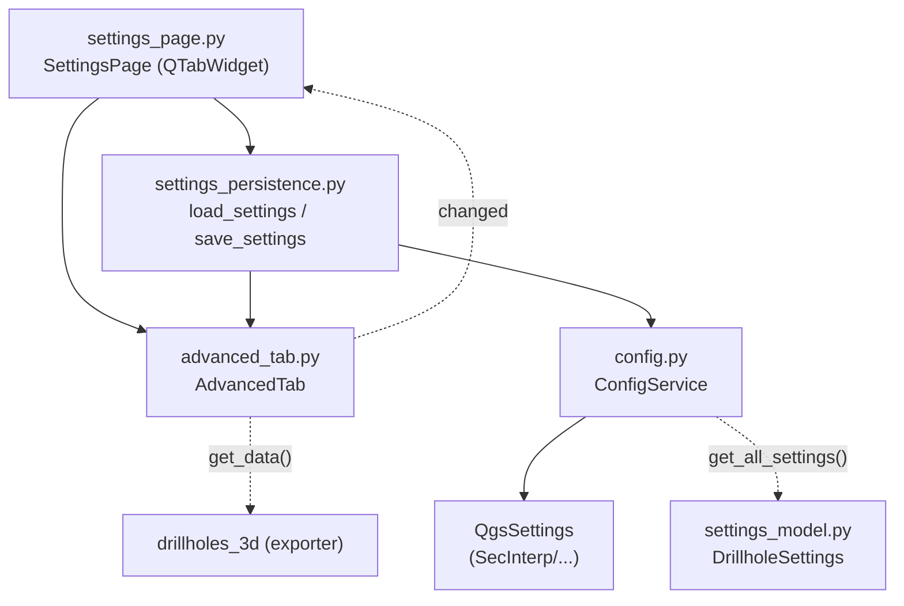

---
tags:
  - secinterp
  - code-walkthrough
  - gui
  - pages
aliases:
  - advanced_tab.py
  - AdvancedTab
cssclass: secinterp-note
---

# `gui/ui/pages/settings/advanced_tab.py`

> [!abstract] One-line summary
> Advanced settings tab: 3D export switches (master enable, traces, intervals, real vs. projected coordinates) persisted via `ConfigService` and `QgsSettings`.

**Path**: `gui/ui/pages/settings/advanced_tab.py` (106 lines)
**Main class**: `AdvancedTab`
**Layer**: GUI (QGIS-dependent · sub-page / tab)
**Tags**: #secinterp #gui #pages

---

## 🎯 Why does this file exist?

3D features are restricted/experimental: they should not mix with everyday
export selection. This tab isolates them with their own `changed` signal and
their own defaults.

| Problem | Solution |
|---------|----------|
| 3D needs 5 related switches | `AdvancedTab` groups them in a `QVBoxLayout` |
| Enabling 3D without traces/intervals makes no sense | Master `chk_enable_3d` + 4 subordinate checks |
| Two coordinate modes, exclusive in spirit | `chk_3d_original` (default) and `chk_3d_projected` as flags |
| The parent must treat default and advanced alike | `get_data` / `reset_to_defaults` / `connect` / `disconnect` contract |

> [!important] Architectural note
> **Pure-configuration** tab (no layers or fields): its values travel to
> `ConfigService.set()` and then to `QgsSettings` under the `SecInterp/`
> prefix. Typed modelling lives in `DrillholeSettings.export_3d_*` (see
> [[settings_model]]).

---

## 🧬 Relationship diagram



> [!tip] How to read
> Solid arrow = imports/calls; dashed = signal or deferred consumption (3D export).

---

## 📦 Imports — architectural reading

```python
# gui/ui/pages/settings/advanced_tab.py
from __future__ import annotations
import contextlib
from typing import Any
from qgis.PyQt.QtCore import QCoreApplication, pyqtSignal
from qgis.PyQt.QtWidgets import QCheckBox, QLabel, QVBoxLayout, QWidget
from sec_interp.logger_config import get_logger
```

| # | Observation |
|---|-------------|
| ① | No `qgis.core` or `qgis.gui`: no layer selectors, only checkboxes. |
| ② | Simple vertical `QVBoxLayout`: HTML headers + 5 checks + stretch. |
| ③ | Own `changed` signal (not `dataChanged`): settings vocabulary, not pages. |
| ④ | `contextlib` only for `disconnect_signals`, as in the drillhole tabs. |
| ⑤ | `get_logger(__name__)` declared though this tab never logs (package symmetry). |

---

## 🏗️ Structure inventory

**Class:** `AdvancedTab(QWidget)` — 1 signal, 6 methods, 5 checkboxes.

| Member | Type | Role |
|--------|------|------|
| `changed` | `pyqtSignal()` | Notifies the parent to auto-save |
| `chk_enable_3d` | `QCheckBox` | Master: enable 3D interpretation export |
| `chk_3d_traces` | `QCheckBox` | Export 3D drillhole traces |
| `chk_3d_intervals` | `QCheckBox` | Export 3D intervals |
| `chk_3d_original` | `QCheckBox` | Use original coordinates (real 3D) |
| `chk_3d_projected` | `QCheckBox` | Use projected coordinates (section plane) |

**Methods:**

| Method | Signature | Purpose |
|--------|-----------|---------|
| `__init__` | `(parent=None) -> None` | Builds and calls `_setup_ui` |
| `tr` | `(message: str) -> str` | Translates with the `"AdvancedTab"` context |
| `_setup_ui` | `() -> None` | Vertical layout with 2 headers |
| `get_data` | `() -> dict[str, Any]` | Defensive read with `hasattr` |
| `reset_to_defaults` | `() -> None` | Restores defaults via `getattr` |
| `connect_signals` | `() -> None` | 5 × `stateChanged → changed.emit` |
| `disconnect_signals` | `() -> None` | 5 suppressed disconnections |

---

## 📁 Files in the package

| File | Lines | Role |
|---|---|---|
| `settings/__init__.py` | 9 | Re-exports `AdvancedTab`, `DefaultTab`, `build_info_tab` |
| `advanced_tab.py` | 106 | This note: 3D / restricted features |
| `default_tab.py` | 178 | Export selection (see [[default_tab]]) |
| `info_tab.py` | — | Informational tab (`build_info_tab`) |
| `settings_persistence.py` | 75 | `load/save_settings` (see [[settings_persistence]]) |
| `../settings_page.py` | 124 | Parent with `QTabWidget` (see [[settings_page]]) |

---

## 📖 Method-by-method walkthrough

### `__init__` + `tr`

```python
def __init__(self, parent: QWidget | None = None) -> None:
    super().__init__(parent)
    self._setup_ui()

def tr(self, message: str) -> str:
    return QCoreApplication.translate("AdvancedTab", message)
```

Delegated construction and the `"AdvancedTab"` context for `update-strings.sh`.

### `_setup_ui`

```python
layout = QVBoxLayout(self)

layout.addWidget(QLabel(self.tr("<b>Advanced Features</b>")))

self.chk_enable_3d = QCheckBox(self.tr("Enable 3D Interpretation Export"))
self.chk_enable_3d.setToolTip(
    self.tr("Enables the generation of 3D Shapefiles (.shp) during export.")
)
layout.addWidget(self.chk_enable_3d)

layout.addWidget(QLabel(self.tr("<br><b>Drillhole 3D Export Options</b>")))
self.chk_3d_traces = QCheckBox(self.tr("Export 3D Traces"))
self.chk_3d_intervals = QCheckBox(self.tr("Export 3D Intervals"))
self.chk_3d_original = QCheckBox(self.tr("Use Original Coordinates (Real 3D)"))
self.chk_3d_projected = QCheckBox(self.tr("Use Projected Coordinates (Section Plane)"))

layout.addWidget(self.chk_3d_traces)
layout.addWidget(self.chk_3d_intervals)
layout.addWidget(self.chk_3d_original)
layout.addWidget(self.chk_3d_projected)

layout.addStretch()
```

| Block | Content |
|-------|---------|
| Header 1 | `"Advanced Features"` in bold HTML |
| Master | `chk_enable_3d` with tooltip about 3D Shapefiles |
| Header 2 | `"Drillhole 3D Export Options"` |
| Subordinates | Traces, intervals, original, projected |
| Closing | `addStretch()` pushes content up |

> [!note] No explicit initial state
> `_setup_ui` checks nothing: the real state is applied by `load_settings`
> (via `SettingsPage._load_settings`) right after the tab is created.

### `get_data` — defensive read

```python
def get_data(self) -> dict[str, Any]:
    return {
        "enable_3d": (self.chk_enable_3d.isChecked() if self.chk_enable_3d else False),
        "drill_3d_traces": (
            self.chk_3d_traces.isChecked() if hasattr(self, "chk_3d_traces") else True
        ),
        "drill_3d_intervals": (
            self.chk_3d_intervals.isChecked() if hasattr(self, "chk_3d_intervals") else True
        ),
        "drill_3d_original": (
            self.chk_3d_original.isChecked() if hasattr(self, "chk_3d_original") else True
        ),
        "drill_3d_projected": (
            self.chk_3d_projected.isChecked() if hasattr(self, "chk_3d_projected") else False
        ),
    }
```

Each key has a fallback if the attribute is missing (`True` except master and
projected). Mock-first pattern: tests may use partial doubles without all
five widgets.

| Key | Fallback if missing | `QgsSettings` key |
|-----|---------------------|-------------------|
| `enable_3d` | `False` | `SecInterp/enable_3d` (default `True`) |
| `drill_3d_traces` | `True` | `SecInterp/drill_3d_traces` |
| `drill_3d_intervals` | `True` | `SecInterp/drill_3d_intervals` |
| `drill_3d_original` | `True` | `SecInterp/drill_3d_original` |
| `drill_3d_projected` | `False` | `SecInterp/drill_3d_projected` |

### `reset_to_defaults`

```python
def reset_to_defaults(self) -> None:
    defaults = {
        "chk_enable_3d": True,
        "chk_3d_traces": True,
        "chk_3d_intervals": True,
        "chk_3d_original": True,
        "chk_3d_projected": False,
    }
    for attr, value in defaults.items():
        widget = getattr(self, attr, None)
        if widget is not None:
            widget.setChecked(value)
```

Dict + `getattr`: adding a future check is a one-liner. Invoked by
`SettingsPage._reset_export_defaults()` together with the default-tab reset.
Note it fires `stateChanged` ⇒ `changed` ⇒ auto-save: resetting persists too.

### `connect_signals`

```python
def connect_signals(self) -> None:
    self.chk_enable_3d.stateChanged.connect(self.changed.emit)
    self.chk_3d_traces.stateChanged.connect(self.changed.emit)
    self.chk_3d_intervals.stateChanged.connect(self.changed.emit)
    self.chk_3d_original.stateChanged.connect(self.changed.emit)
    self.chk_3d_projected.stateChanged.connect(self.changed.emit)
```

Five direct connections to `changed.emit`. The parent listens to `changed`
and calls `_on_settings_changed()` → `save_settings(...)`: every click
persists immediately.

### `disconnect_signals`

```python
def disconnect_signals(self) -> None:
    with contextlib.suppress(TypeError, RuntimeError):
        self.chk_enable_3d.stateChanged.disconnect(self.changed.emit)
    ...  # one block per checkbox
```

Five individual `suppress(TypeError, RuntimeError)` blocks: idempotent
against double-disconnect or destroyed widgets.

---

## 🔄 Data flow

| Phase | Input | Transformation | Output |
|-------|-------|----------------|--------|
| Setup | `parent` | `_setup_ui` builds 5 checks | Stateless widgets |
| Hydration | `QgsSettings` | `load_settings(settings, default_tab, advanced_tab)` | Checks set |
| Editing | Click | `stateChanged → changed.emit` | Signal to parent |
| Auto-save | `changed` | `SettingsPage._on_settings_changed` → `save_settings` | `ConfigService.set(...)` × 5 |
| Reading | Widgets | Defensive `get_data()` | `dict` with 5 flags |
| Model | `QgsSettings` | `ConfigService._load_from_qgs_settings` | `DrillholeSettings.export_3d_*` |
| Reset | Button/parent | `reset_to_defaults()` | Defaults + cascading auto-save |
| Close | Dialog | `disconnect_signals()` | No dangling signals |

---

## 📐 Tab → SettingsModel → QgsSettings mapping

Each checkbox travels through three representations with different names:

| Widget | `get_data()` | `QgsSettings` (`SecInterp/…`) | `DrillholeSettings` / `ExportSettings` |
|--------|--------------|-------------------------------|----------------------------------------|
| `chk_enable_3d` | `enable_3d` | `enable_3d` | No direct field (global export flag) |
| `chk_3d_traces` | `drill_3d_traces` | `drill_3d_traces` | `export_3d_traces` (default `True`) |
| `chk_3d_intervals` | `drill_3d_intervals` | `drill_3d_intervals` | `export_3d_intervals` (default `True`) |
| `chk_3d_original` | `drill_3d_original` | `drill_3d_original` | `export_3d_original` (default `True`) |
| `chk_3d_projected` | `drill_3d_projected` | `drill_3d_projected` | `export_3d_projected` (default `False`) |

> [!note] Dual persistence read
> `load_settings` reads with `settings.value("SecInterp/…", default, type=bool)`
> (raw `QgsSettings` access), while `save_settings` writes with
> `config_service.set(...)` (implicit prefix + `sync()`). Both converge on the
> same keys.

---

## 🧩 Relation to DefaultTab and SettingsPage

| Aspect | `AdvancedTab` | `DefaultTab` |
|--------|---------------|--------------|
| Signal | `changed` | `changed` (same signature) |
| Layout | Simple `QVBoxLayout` | `QVBoxLayout` + `QHBoxLayout` sub-layouts |
| Reset | Own `reset_to_defaults()` | Own `reset_to_defaults()` |
| Own button | No (parent resets it) | Yes (`btn_reset_export`) |
| Exposure | `SettingsPage._expose_tab_widgets` replicates the 5 checks | Replicates 5 checks + format + naming + button |
| Saving | `save_settings` reads both tabs at once | Same call |

The parent treats both tabs symmetrically: it connects each `changed` to
`_on_settings_changed` and disconnects with the same `suppress` pattern.

---

## 🏛️ Design patterns present

| Pattern | Where | Purpose |
|---------|-------|---------|
| **Composite (tab)** | `SettingsPage` + tabs | Uniform default/advanced contract |
| **Observer** | `changed` | Reactive auto-save |
| **Partial memento** | `reset_to_defaults` | Declarative defaults dict |
| **Defensive programming** | `hasattr`/`getattr` | Supports partial doubles in tests |
| **Guarded disconnect** | `contextlib.suppress` | Idempotent unwiring |
| **Persistence facade** | `settings_persistence` | Tabs with no direct `QgsSettings` |

---

## 🧾 API summary

| Symbol | Signature / Inherits | Typical use |
|--------|----------------------|-------------|
| `AdvancedTab` | `QWidget` | `SettingsPage.tab_widget.addTab(AdvancedTab(), ...)` |
| `changed` | `pyqtSignal()` | `tab.changed.connect(self._on_settings_changed)` |
| `get_data()` | `-> dict[str, Any]` | 5 flags for 3D exporters |
| `reset_to_defaults()` | `-> None` | Restore 3D defaults |
| `connect_signals()` | `-> None` | Wire when shown |
| `disconnect_signals()` | `-> None` | Unwire on close |

---

## 🛡️ Error handling

No domain `try/except`; targeted defences:

- `get_data`/`reset_to_defaults` tolerate missing attributes (`hasattr`,
  `getattr(..., None)`): a partial mock does not break reading.
- `disconnect_signals` suppresses `TypeError`/`RuntimeError`.
- Real validation (is the 3D selection coherent?) lives in the exporter, not
  the tab.

---

## 🧪 Associated tests

No dedicated `tests/gui/test_advanced_tab.py`; coverage via the parent page:

- `tests/gui/test_settings_page.py::TestSettingsPage::test_initialization` — tabs built, widgets exposed.
- `test_load_settings` — hydration from `QgsSettings` with `True/False` values.
- `test_save_settings` — `save_settings` persists the 5 flags via `ConfigService`.
- `test_get_data` — `SettingsPage.get_data()` merges default + advanced.
- `tests/gui/test_main_dialog_settings.py` — global persistence with boolean parsing.

---

## 🌐 i18n and migration notes

- `"AdvancedTab"` context; headers with translatable HTML (`<b>`, `<br>`).
- Master tooltip translated too (mentions 3D `.shp`).
- No `qgis.core`/`qgis.gui`: immune to QGIS 3/4 layer-API changes.
- `chk_3d_original` vs `chk_3d_projected` are independent flags (no
  `QButtonGroup`): exclusivity, if wanted, must be added.

---

## 👀 Observations and notes

> [!success] Strengths
> - Isolating 3D/restricted features keeps the everyday tab clean.
> - Declarative defaults dict: easy to audit.
> - Defensive read suitable for partial mocks.

> [!warning] Points of attention
> - Original/projected are not UI-exclusive: both can be checked.
> - The master does not disable subordinates (unlike `chk_use_geom` in collar).
> - `logger` imported but unused in this module.

> [!question] Open questions
> - Exclusive group or cascading disable for original/projected?
> - Sync unchecked `chk_enable_3d` with disabled subordinates?

---

## 🔗 Related notes

- [[Index]] — vault index
- [[settings_page]] — parent page with the `QTabWidget`
- [[gui_ui_pages_settings]] — settings tab package
- [[default_tab]] — sibling export tab
- [[settings_persistence]] — `load/save_settings` hydrating this tab
- [[settings_model]] — `DrillholeSettings.export_3d_*` and `PluginSettings`
- [[config]] — `ConfigService` (`get`/`set`, `SecInterp/` prefix)
- [[drillholes_3d]] — exporter consuming these flags

---

*Note of the SecInterp Code Walkthrough v2 vault — v3.9.1*
