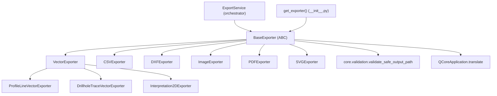

---
tags:
  - secinterp
  - code-walkthrough
  - exporters
  - contracts
aliases:
  - base_exporter.py
  - BaseExporter
cssclass: secinterp-note
---

# `exporters/base_exporter.py`

> [!abstract] One-line summary
> Abstract contract of the whole export layer: `BaseExporter` pins the **Template Method** (`export`, `get_supported_extensions`) plus safe path validation and settings access, so each format only implements its own writing.

**Path**: `exporters/base_exporter.py` (137 lines)
**Main class**: `BaseExporter(ABC)`
**Layer**: Exporters (boundary: `QCoreApplication` for `tr()` only, no `qgis.core`)
**Tags**: #secinterp #exporters #contracts

---

## 🎯 Why does this file exist?

Without a common base, every exporter would reinvent path validation, extension
checking and settings reading, with mutually incompatible signatures:

| Problem | Solution |
|---------|----------|
| Diverging `export()` signatures per format | Single abstract method `export(output_path, data, layer_name=None) -> bool` |
| Writes outside the target folder (path traversal) | `validate_export_path()` with `resolve()` + `validate_safe_output_path` |
| Extension check repeated in each exporter | Generic `validate_path()` over `get_supported_extensions()` |
| Scattered `.get()` settings access without defaults | Centralised `get_setting(key, default)` |
| Untranslated error messages | `QCoreApplication.translate("BaseExporter", …)` at this layer |

> [!important] Architectural note
> This is the **port** of the `exporters/` layer: the orchestrator (`ExportService`),
> the `core/services/export/handlers/` handlers and the `get_exporter()` factory depend
> on this abstraction, never on concrete classes. Template Method + Dependency Inversion.

---

## 🧬 Relationship diagram



> [!tip] How to read
> Solid arrow = inherits from / imports. `BaseExporter` is the only node the factory
> and the orchestrator know; concrete subclasses hang off it directly or indirectly.

---

## 📦 Imports — architectural reading

```python
# exporters/base_exporter.py
from __future__ import annotations

from abc import ABC, abstractmethod
from pathlib import Path
from typing import Any

from qgis.PyQt.QtCore import QCoreApplication

from sec_interp.core.validation import validate_safe_output_path
```

| # | Observation |
|---|-------------|
| ① | `ABC` + `abstractmethod` → **nominal** typing: each exporter must inherit and satisfy the contract. |
| ② | `pathlib.Path` in every signature: paths never travel as raw `str`. |
| ③ | `QCoreApplication` is the **only** QGIS import and is used purely for `translate()` — the `qgis.PyQt` shim touches neither `qgis.core` nor the GUI. |
| ④ | `validate_safe_output_path` comes from `core/validation`: path security lives in the QGIS-agnostic core and is reused here. |
| ⑤ | Zero `qgis.core`/`qgis.gui` imports: this module loads without initialised QGIS. |

> [!note] Lightweight QGIS boundary
> Unlike `vector_exporter.py` or `image_exporter.py` (which do import `qgis.core`),
> the base only needs translation. That keeps it importable and testable with minimal mocks.

---

## 🏗️ Structure inventory

**Classes:** `class BaseExporter(ABC)` — 1 class, 6 members.

**Abstract methods (contract each subclass implements):**

- `export(output_path: Path, data: Any, layer_name: str | None = None) -> bool`
- `get_supported_extensions() -> list[str]`

**Concrete methods (shared logic inherited as-is):**

- `__init__(settings: dict[str, Any]) -> None`
- `validate_export_path(output_path: Path, base_dir: Path | None = None) -> tuple[bool, str]`
- `validate_path(path: Path) -> bool`
- `get_setting(key: str, default: Any = None) -> Any`

**Attributes:**

- `self.settings` — `dict[str, Any]` with export configuration (width, height, DPI, background colour, `legend_renderer`, `geometry_type`, `crs`, `symbology_export`, …).

---

## 📁 Files in the package

| File | Lines | Role |
|---|--:|---|
| `__init__.py` | 81 | Re-exports + `get_exporter(extension, settings)` factory |
| `base_exporter.py` | 137 | `BaseExporter` — abstract contract (this note) |
| `vector_exporter.py` | 122 | `VectorExporter` — SHP/GPKG/DXF via `QgsVectorFileWriter` |
| `csv_exporter.py` | 58 | `CSVExporter` — pure tabular with standard `csv` |
| `dxf_exporter.py` | 126 | `DXFExporter` — dedicated CAD variant |
| `image_exporter.py` | 72 | `ImageExporter` — PNG/JPG via `QgsMapRendererCustomPainterJob` |
| `pdf_exporter.py` | 79 | `PDFExporter` — PDF via `QPdfWriter` at 300 DPI |
| `svg_exporter.py` | 85 | `SVGExporter` — vector graphics via `QSvgGenerator` |
| `profile_exporters.py` | — | `ProfileLineVectorExporter`, `GeologyVectorExporter`, `AxesVectorExporter`, `StructureVectorExporter` |
| `drillhole_exporters.py` | — | `DrillholeTraceVectorExporter`, `DrillholeIntervalVectorExporter` |
| `drillhole_3d_exporter.py` | — | `DrillholeTrace3DExporter`, `DrillholeInterval3DExporter` |
| `interpretation_exporters.py` | — | `Interpretation2DExporter` |
| `interpretation_3d_exporter.py` | — | `Interpretation3DExporter` |

> [!tip] Where this note fits
> `base_exporter.py` is the inheritance root of **every** row above. The
> [[vector_exporter]], [[csv_exporter]], [[dxf_exporter]], [[image_exporter]],
> [[pdf_exporter]] and [[svg_exporter]] notes document each concrete branch.

---

## 📖 Method-by-method walkthrough

### `__init__`

```python
def __init__(self, settings: dict[str, Any]) -> None:
    """Initialize the exporter with settings.

    Args:
        settings: Dictionary containing export settings such as:
            - width: Output width in pixels
            - height: Output height in pixels
            - dpi: Dots per inch for resolution
            - background_color: Background color (QColor)
            - legend_renderer: Optional renderer for legend overlay

    """
    self.settings = settings
```

Minimal constructor: stores the dict without validating it. Lazy validation (via
`get_setting` with a default) lets each subclass read only the keys it needs.

| Typical key | Consumed by |
|-------------|-------------|
| `width`, `height` | `ImageExporter`, `PDFExporter`, `SVGExporter` |
| `background_color` | `ImageExporter` |
| `legend_renderer`, `show_legend` | `ImageExporter`, `PDFExporter`, `SVGExporter` |
| `geometry_type`, `crs`, `symbology_export` | `VectorExporter`, `DXFExporter` |

### `export` — the abstract template method

```python
@abstractmethod
def export(self, output_path: Path, data: Any, layer_name: str | None = None) -> bool:
    """Export data to file.

    This method must be implemented by all concrete exporters.

    Args:
        output_path: Destination file path
        data: Data to export (format depends on exporter type)
        layer_name: Optional conceptual name for the layer (e.g. inside a GeoPackage)

    Returns:
        bool: True if export successful, False otherwise

    """
    pass
```

This is the **Template Method**: it pins the name, parameters and return semantics
(`bool`, never an exception to the direct caller). The `data` type varies by family:

| Exporter | Expected `data` |
|----------|-----------------|
| `VectorExporter` / `DXFExporter` | `list[dict]` with `geometry` + `attributes` keys |
| `CSVExporter` | `dict` with `headers` + `rows` |
| `ImageExporter` / `PDFExporter` / `SVGExporter` | Already-configured `QgsMapSettings` |

> [!important] `bool`, not exceptions
> The contract returns `True`/`False` and **logs** the failure with `logger.exception`.
> Translation into `ExportError` happens one level up, in the
> `core/services/export/handlers/` handlers (see [[orchestrator]] and [[compat]]).

### `validate_export_path` — path security

```python
def validate_export_path(
    self, output_path: Path, base_dir: Path | None = None
) -> tuple[bool, str]:
    try:
        # Resolve the absolute path to detect traversal
        resolved_path = output_path.resolve()

        if base_dir:
            resolved_base = base_dir.resolve()
            if not str(resolved_path).startswith(str(resolved_base)):
                return False, QCoreApplication.translate(
                    "BaseExporter",
                    "Path traversal detected: {path} is outside of {base}",
                ).format(path=output_path, base=base_dir)

        # Get parent directory for existence/permissions validation
        parent_dir = output_path.parent

        # Validate parent directory using existing helper
        is_valid, error, _ = validate_safe_output_path(
            str(parent_dir),
            base_dir=base_dir,
            must_exist=False,
            create_if_missing=True,
        )

        if not is_valid:
            return False, QCoreApplication.translate(
                "BaseExporter", "Invalid export path: {error}"
            ).format(error=error)

        return True, ""

    except (OSError, ValueError) as e:
        return False, QCoreApplication.translate(
            "BaseExporter", "Path resolution error: {error}"
        ).format(error=str(e))
```

| Step | Behaviour |
|------|-----------|
| 1. Resolution | `output_path.resolve()` dissolves `..` and symlinks before comparing |
| 2. Cage (`base_dir`) | When a base directory is given, the resolved path must start with it; otherwise `(False, translated message)` |
| 3. Delegation | The parent directory is validated with the core's `validate_safe_output_path` (`must_exist=False`, `create_if_missing=True`) |
| 4. Shielding | Resolution `OSError`/`ValueError` become `(False, message)` — never propagated |

> [!tip] Double defence layer
> The `startswith` check is the fast local guard; `validate_safe_output_path`
> (see [[path_validator]]) is the project's canonical validation. Both must pass.

### `get_supported_extensions` — abstract

```python
@abstractmethod
def get_supported_extensions(self) -> list[str]:
    """Get list of supported file extensions.

    Returns:
        List of supported extensions (e.g., ['.png', '.jpg'])

    """
```

Each subclass declares its lowercase dotted extensions. This is what `validate_path()`
and the `get_exporter()` factory use for routing:

| Exporter | Extensions |
|----------|------------|
| `VectorExporter` | `.shp`, `.gpkg`, `.dxf` |
| `CSVExporter` | `.csv` |
| `DXFExporter` | `.dxf` |
| `ImageExporter` | `.png`, `.jpg`, `.jpeg` |
| `PDFExporter` | `.pdf` |
| `SVGExporter` | `.svg` |

### `validate_path`

```python
def validate_path(self, path: Path) -> bool:
    """Validate that the output path has a supported extension.

    Args:
        path: Path to validate

    Returns:
        True if path has a supported extension, False otherwise

    """
    return path.suffix.lower() in self.get_supported_extensions()
```

Case-insensitive comparison (`.SHP` counts). This is a **syntactic** pre-check before
writing; security validation (existence, traversal) lives in `validate_export_path`.

### `get_setting`

```python
def get_setting(self, key: str, default: Any = None) -> Any:
    """Get a setting value with optional default.

    Args:
        key: Setting key
        default: Default value if key not found

    Returns:
        Setting value or default

    """
    return self.settings.get(key, default)
```

Sugar over `dict.get` that decouples subclasses from the configuration source
(today a flat dict the GUI builds from `settings_model`). Every
`self.get_setting("width", 800)` in image/pdf/svg and every `geometry_type`/`crs`
read in vector/dxf goes through here.

---

## 🔄 Data flow

| Phase | Input | Transformation | Output |
|-------|-------|----------------|--------|
| Configuration | `settings: dict` | `__init__` stores it | `self.settings` |
| Pre-validation | `output_path` | `validate_path()` (extension) + `validate_export_path()` (security) | `(bool, str)` |
| Writing | `(output_path, data, layer_name)` | subclass `export()` | `bool` success/failure |
| Lazy reading | `key + default` | `get_setting()` | value or default |

---

## 🏛️ Design patterns present

| Pattern | Where | Purpose |
|---------|-------|---------|
| **Template Method** | abstract `export` + concrete helpers | Pin the skeleton, delegate the format |
| **Dependency Inversion** | orchestrator/handlers depend on `BaseExporter` | Swap formats without touching callers |
| **Factory** | `get_exporter()` in `__init__.py` | Instantiate the subclass by extension |
| **Guard Clauses** | early `return False` in subclasses | Reject empty `data` without nesting |
| **Secure path validation** | `validate_export_path` + core validation | Prevent path traversal |

---

## 🧾 API summary

| Symbol | Signature / Inherits | Typical use |
|--------|----------------------|-------------|
| `BaseExporter` | `(ABC)` | Inherit in each concrete exporter |
| `__init__` | `(settings: dict[str, Any]) -> None` | `VectorExporter({"crs": crs, …})` |
| `export` | `(output_path: Path, data: Any, layer_name: str \| None = None) -> bool` | `exporter.export(path, features)` |
| `get_supported_extensions` | `() -> list[str]` | `[".shp", ".gpkg", ".dxf"]` |
| `validate_path` | `(path: Path) -> bool` | Extension pre-check |
| `validate_export_path` | `(output_path: Path, base_dir: Path \| None = None) -> tuple[bool, str]` | Security check |
| `get_setting` | `(key: str, default: Any = None) -> Any` | `self.get_setting("width", 800)` |

---

## 🛡️ Error handling

| Situation | Behaviour |
|-----------|-----------|
| `output_path` outside `base_dir` | `(False, "Path traversal detected…")` translated |
| Invalid parent directory | `(False, "Invalid export path: …")` from the core helper |
| `OSError`/`ValueError` while resolving | `(False, "Path resolution error: …")` |
| Write failure in a subclass | The subclass logs with `logger.exception` and returns `False` |
| `False` from the exporter | The handler converts it into `raise ExportError(…)` (see [[compat]]) |

> [!note] Two error levels
> `BaseExporter` never raises on the validation path: it returns tuples. Subclasses do
> not raise in `export()` either: they return `bool`. Only the handlers translate
> `False` into `ExportError` from the [[exceptions]] hierarchy for the
> `dialog_export_manager` to display.

---

## 🧪 Associated tests

The base is exercised indirectly across `tests/exporters/`, plus direct contract cases
in `tests/exporters/test_exporters.py`:

- `test_get_supported_extensions` — each exporter declares its extensions.
- `test_export_valid_data` — valid write under the `bool` contract.
- `test_export_empty_data` — `False` guard with empty `data`.
- `test_export_missing_headers` / `test_export_missing_rows` — CSV rejects an incomplete dict.
- `test_get_setting_with_default` / `test_get_setting_no_default` — inherited settings reading.
- `tests/exporters/test_vector_exporter.py` — `test_export_writer_error`, `test_export_exception_handling` (`False` contract on OGR failures).
- `tests/exporters/test_image_exporter.py`, `test_pdf_exporter.py`, `test_svg_exporter.py` — success and exception handling per format.
- **Integration**: `tests/integration/test_export_workflow.py` and `tests/integration/test_export_service_e2e.py` (real SHP/CSV writes via the orchestrator).

---

## 👀 Observations and notes

> [!success] Strengths
> - Minimal, stable contract: two abstracts plus four helpers cover seven formats.
> - Centralised path security reusing the core's canonical validation.
> - Translation without coupling to `qgis.core`: the module imports without initialised QGIS.
> - Uniform `bool` return that simplifies handlers (one `if not ok: raise`).

> [!warning] Points of attention
> - `validate_export_path` exists but **no subclass calls it** inside `export()`: pre-validation depends on the caller (handlers/GUI).
> - The string-based `startswith` path check can false-positive on sibling directories (`/exp` vs `/exp2`); the core helper compensates, but the local guard is fragile.
> - `settings` is a schemaless dict: a misspelled key (`"widht"`) silently falls back to the default.
> - `data: Any` dilutes typing; each subclass redefines the parameter with its real type and no explicit `override`.

> [!question] Open questions
> - Call `validate_export_path` inside the Template Method to shield every write?
> - Type `settings` with a `TypedDict` or dataclass to catch misspelled keys?
> - Compare paths with `Path.is_relative_to()` (3.9+) instead of `startswith`?

---

## 🔗 Related notes

- [[Index]] — vault index
- [[exporters]] — layer note of the `exporters/` package
- [[orchestrator]] — `ExportService`, contract consumer via handlers
- [[compat]] — `ExportServiceCompatMixin`, translates `False` into `ExportError`
- [[vector_exporter]] — vector branch of the contract (SHP/GPKG/DXF)
- [[csv_exporter]] — pure tabular branch of the contract
- [[dxf_exporter]] — dedicated CAD branch of the contract
- [[image_exporter]] / [[pdf_exporter]] / [[svg_exporter]] — map-render branches
- [[profile_exporters]] / [[drillhole_exporters]] — per-entity specialisations
- [[exceptions]] — `ExportError`, final destination of failures
- [[path_validator]] — core `validate_safe_output_path`
- [[dialog_export_manager]] — GUI that starts the export run

---

*Note of the SecInterp Code Walkthrough v2 vault — v3.9.1*
