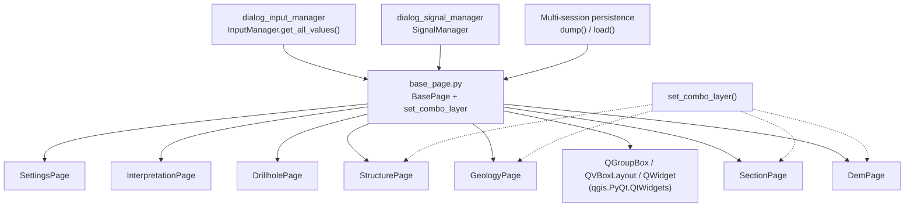

---
tags:
  - secinterp
  - code-walkthrough
  - gui
  - pages
aliases:
  - base_page.py
  - BasePage
  - set_combo_layer
cssclass: secinterp-note
---

# `gui/ui/pages/base_page.py`

> [!abstract] One-line summary
> Visual and persistence contract for every dialog page: `BasePage` fixes the `get_data/dump/load/reset/validate/connect/disconnect` skeleton and `set_combo_layer` restores combos without firing signals.

**Path**: `gui/ui/pages/base_page.py` (105 lines)
**Main class**: `BasePage` (`QWidget`) + `set_combo_layer` function
**Layer**: GUI (programmatic presentation · no business logic)
**Tags**: #secinterp #gui #pages

---

## 🎯 Why does this file exist?

Without a common base, each dialog page (`DemPage`, `SectionPage`, `GeologyPage`,
`StructurePage`, `DrillholePage`, `InterpretationPage`, `SettingsPage`) would invent
its own way of exposing data, persisting state and wiring signals, and the managers
(`InputManager`, `SignalManager`, persistence manager) would treat every page as a
special case.

| Problem | Solution |
|---------|----------|
| Managers need to read, save, restore, validate and (dis)connect every page uniformly | `BasePage` declares the `get_data/dump/load/reset/validate/connect_signals/disconnect_signals` protocol |
| Restoring a `QgsMapLayerComboBox` with `setLayer` fires `layerChanged` and causes cascading effects (field refresh, recomputation) | `set_combo_layer` wraps `setLayer` with `blockSignals(True/False)` |
| Every page needs the same visual container (title + top-anchored widgets) without repeating `QVBoxLayout` | `_setup_ui` creates `main_layout` + `group_box` + `addStretch()` once |

> [!important] Architectural note
> GUI-side Extract adapter: the page **extracts** state from QGIS widgets and hands it
> over as a `dict` of primitives and layers; it never computes geology. The core
> (`ProjectValidator`, services) only receives those already-detached dicts.

---

## 🧬 Relationship diagram



> [!tip] How to read
> Solid arrow = inherits/imports; dashed = uses the helper or the protocol without inheriting.

---

## 📦 Imports — architectural reading

```python
# gui/ui/pages/base_page.py
from __future__ import annotations

from typing import Any

from qgis.PyQt.QtWidgets import QGroupBox, QVBoxLayout, QWidget
```

| # | Observation |
|---|-------------|
| ① | `from __future__ import annotations` — project standard for deferred annotations. |
| ② | `typing.Any` is the only imported type: the protocol dicts mix layers, `str`, `bool`, `int` and `float`, so `dict[str, Any]` is the honest signature. |
| ③ | Only imports from `qgis.PyQt.QtWidgets` (generic containers). No `qgis.core` or `qgis.gui`: the base knows nothing about layer combos or geometries; subclasses add that. |
| ④ | Zero `sec_interp` imports: the base depends on nothing in the plugin, which is why it sits at the bottom of the `gui/ui/pages/` dependency graph. |

---

## 🏗️ Structure inventory

**Module-level function:**

- `set_combo_layer(combo: Any, layer: Any) -> None` — pins the selected layer with signals blocked.

**`BasePage(QWidget)` class:**

- `__init__(self, title: str, parent: QWidget | None = None) -> None`
- `_setup_ui(self) -> None`
- `get_data(self) -> dict[str, Any]` — abstract by convention (`raise NotImplementedError`)
- `dump(self) -> dict[str, Any]` — base: `return {}`
- `load(self, data: dict[str, Any]) -> None` — base: `pass`
- `reset(self) -> None` — base: `pass`
- `validate(self) -> tuple[bool, str]` — base: `return True, ""`
- `connect_signals(self) -> None` — base: `pass`
- `disconnect_signals(self) -> None` — base: `pass`

**Attributes created in `_setup_ui`:**

| Attribute | Type | Role |
|-----------|------|------|
| `title` | `str` | Title received in the constructor |
| `main_layout` | `QVBoxLayout` | Root layout with zero margins |
| `group_box` | `QGroupBox` | Titled container of the page |
| `group_layout` | `None` | Placeholder each subclass replaces with its real layout (`QGridLayout`, `QVBoxLayout`) |

---

## 📁 Pages inheriting the protocol

| Page | Visible title | Real `group_layout` | Protocol quirk |
|------|---------------|---------------------|----------------|
| [[dem_page]] | Digital Elevation Model | `QGridLayout` | Adds `is_complete()` + `set_auto_ve()` |
| [[section_page]] | Cross Section Line | `QGridLayout` | `is_complete()` without `ProjectValidator`; no `connect_signals` |
| [[geology_page]] | Geological Outcrops | `QGridLayout` | Adds a `dataChanged` signal |
| [[structure_page]] | Structural Measurements | `QGridLayout` | Wires signals in `_setup_ui`, not in `connect_signals` |
| [[drillhole_page]] | Drillhole Data | `QVBoxLayout` + `QTabWidget` | Coordinates 3 tabs; re-emits `dataChanged` |
| [[interpretation_page]] | Interpretation Settings | `QVBoxLayout` | Empty `layer_keys`; validates duplicates |
| [[settings_page]] | Plugin Settings | `QVBoxLayout` + `QTabWidget` | Coordinates 2 tabs + info; `validate` always ok |

> [!note] `PreviewWidget` ([[preview_page]]) does not inherit `BasePage`
> The preview widget extends `QWidget` directly: it exposes no `get_data` or
> `validate`, only `dump/load/reset` of its controls. It is a viewer, not a
> configuration page.

---

## 📖 Method-by-method walkthrough

### `set_combo_layer` — restoring combos without side effects

```python
def set_combo_layer(combo: Any, layer: Any) -> None:
    combo.blockSignals(True)
    combo.setLayer(layer)
    combo.blockSignals(False)
```

Three-line routine used by the `load()` methods of [[dem_page]], [[geology_page]],
[[section_page]] and [[structure_page]]. Without it, restoring a session would fire
`layerChanged`, refreshing the associated `QgsFieldComboBox` widgets, emitting
`dataChanged`, and possibly triggering recomputations (`_update_resolution` in DEM)
with half-restored state. The pattern is: block → set → unblock, with no
`try/finally` because `setLayer` does not raise in practice with resolved layers.

> [!tip] Already-resolved layers
> The docstring clarifies that `load()` receives `QgsMapLayer` objects already
> resolved (the persistence manager looks them up by id before calling `load`),
> never raw ids. `set_combo_layer` resolves nothing: it only selects silently.

### `__init__` — title and deferred construction

```python
def __init__(self, title: str, parent: QWidget | None = None) -> None:
    super().__init__(parent)
    self.title = title
    self._setup_ui()
```

Stores the title and delegates all construction to `_setup_ui`, which subclasses
extend by calling `super()._setup_ui()` first. Subclasses pass the title already
translated with `QCoreApplication.translate("DemPage", ...)`; the base never calls
`self.tr()` for the title, so each page owns its translation context.

### `_setup_ui` — shared visual skeleton

```python
def _setup_ui(self) -> None:
    self.main_layout = QVBoxLayout(self)
    self.main_layout.setContentsMargins(0, 0, 0, 0)

    # Main group box
    self.group_box = QGroupBox(self.title)
    self.group_layout = None  # To be set by subclasses

    self.main_layout.addWidget(self.group_box)

    # Add stretch at the bottom to keep widgets at the top
    self.main_layout.addStretch()
```

Builds the zero-margin root layout (the page lives inside a `QStackedWidget` that
already provides framing), the titled `QGroupBox`, and a trailing stretch so
controls stay top-anchored. `group_layout = None` is a deliberate marker: it forces
each subclass to install its own layout on `group_box`
(`QGridLayout(self.group_box)` does so automatically).

### `get_data` — reading (abstract by convention)

```python
def get_data(self) -> dict[str, Any]:
    raise NotImplementedError("Subclasses must implement get_data()")
```

The only method without a useful base implementation. Each page returns its flat
namespace: DEM uses `raster_layer/selected_band/scale/vertexag/auto_vert_exag`,
geology `outcrop_layer/outcrop_name_field`, and so on. `InputManager.get_all_values()`
merges those dicts into the flat dictionary feeding `ValidationParams`. It does not
use `abc.ABC` — abstraction is by convention plus error message, keeping the class
instantiable for skeleton tests.

### `dump` / `load` — multi-session persistence

```python
def dump(self) -> dict[str, Any]:
    return {}

def load(self, data: dict[str, Any]) -> None:
    pass
```

`dump` returns persistable state as a flat dict: layers as `QgsMapLayer` objects
(or `None`), everything else as primitives. Each page renames its keys when
persisting (`raster_layer` → `dem_layer`, `outcrop_layer` → `geol_layer`):
`get_data` speaks the validator's language, `dump` the session store's. `load`
applies defensively with per-key `.get()` and re-applies derived effects
(`_on_auto_ve_toggled`, `_update_resolution`).

### `reset` — back to defaults

```python
def reset(self) -> None:
    pass
```

Each subclass restores its initial values (`setLayer(None)`, spins to
`DialogDefaults`, checkboxes to their default) and re-syncs derived toggles.
The base cannot guess the defaults, so it is a documented no-op.

### `validate` — lightweight per-page validation

```python
def validate(self) -> tuple[bool, str]:
    return True, ""
```

`(is_valid, error_message)` contract: DEM and section require their layer
(`"Raster layer is required"`, `"Section line layer is required"`),
interpretation rejects empty or duplicate field names, and the rest inherit the
optimistic ok. This is Level-1 (UI) validation; business validation lives in
`ProjectValidator.validate_all` via [[dialog_input_manager]].

### `connect_signals` / `disconnect_signals` — signal hygiene

```python
def connect_signals(self) -> None:
    pass

def disconnect_signals(self) -> None:
    pass
```

Every connection made in `connect_signals` must have a mirror disconnection: this
is the anti-leak rule verified by `tests/gui/test_signal_restoration.py`. The
subclass pattern is `contextlib.suppress(TypeError, RuntimeError)` around each
`disconnect` (disconnecting an already-disconnected signal raises `TypeError` in
PyQt). [[structure_page]] is the exception: it connects in `_setup_ui` and only
overrides `disconnect_signals`.

---

## 🔄 Data flow

| Phase | Input | Transformation | Output |
|-------|-------|----------------|--------|
| Construction | Translated `title` + `parent` | `_setup_ui` builds layout + group + stretch | Empty page ready for the subclass widgets |
| Reading (Extract) | QGIS widgets (`currentLayer()`, `value()`, `isChecked()`) | `get_data()` | Flat `dict[str, Any]` per page |
| Aggregation | Dicts of the 7 pages | `InputManager.get_all_values()` | Global flat dict + `ValidationParams` |
| Persistence | Widgets | `dump()` | Dict with layers + primitives |
| Restoration | Persisted dict (resolved layers) | `load()` + `set_combo_layer` | Widgets restored with no spurious signals |
| Cleanup | — | `reset()` | Widgets back to `DialogDefaults` |

---

## 🏛️ Design patterns present

| Pattern | Where | Purpose |
|---------|-------|---------|
| **Template Method** | `__init__` → `_setup_ui` | Base fixes the skeleton; subclass fills the layout |
| **Contract / interface by convention** | `get_data/dump/load/reset/validate/connect/disconnect` | Uniformity without `ABC`; polymorphic managers |
| **Signal suppression** | `set_combo_layer` (`blockSignals`) | Restoring state without cascades |
| **Extract/Compute split** | `get_data` returns data, never computes | Core validates and computes outside the GUI |
| **Null Object** | Defaults `{}`, `pass`, `(True, "")` | Simple pages (settings) inherit what they do not need |

---

## 🧾 API summary

| Symbol | Signature / Inherits | Typical use |
|--------|----------------------|-------------|
| `set_combo_layer` | `(combo: Any, layer: Any) -> None` | Silent `load()` in 4 pages |
| `BasePage` | `(QWidget)` | Base of the 7 configuration pages |
| `get_data` | `() -> dict[str, Any]`, raises `NotImplementedError` | Reading for `InputManager` |
| `dump` / `load` | `() -> dict` / `(dict) -> None` | Multi-session persistence |
| `reset` | `() -> None` | Restore `DialogDefaults` |
| `validate` | `() -> tuple[bool, str]` | Lightweight per-page check |
| `connect/disconnect_signals` | `() -> None` | Signal hygiene (anti-leak) |
| `layer_keys` | `frozenset[str]` (subclasses only) | Persisted layer keys per page |

---

## 🛡️ Error handling

The base neither raises nor catches: it delegates. Three defensive decisions spread
around:

- Unimplemented `get_data` fails **loud and early** with `NotImplementedError` naming the method, instead of returning an empty dict that would silently corrupt `ValidationParams`.
- Subclass `load` uses per-field `data.get(key)` with an `is not None` guard: an old session without `auto_vert_exag` restores partially instead of breaking.
- `disconnect_signals` swallows `TypeError`/`RuntimeError`: disconnecting twice (dialog rewire + close) is a normal path, not an error.

---

## 🧪 Associated tests

There is no dedicated `tests/gui/test_base_page.py`; the protocol is verified
through its consumers:

- `tests/gui/test_dem_page.py` — DEM `get_data/dump` contract (`raster_layer…` / `dem_layer…` keys) and the VE Auto/Manual toggle.
- `tests/gui/test_drillhole_page.py` — merged `get_data/dump/load` of the three tabs and `dataChanged` re-emission.
- `tests/gui/test_settings_page.py` — merged default + advanced `get_data` and `QgsSettings` persistence.
- `tests/gui/test_signal_restoration.py` — `test_page_signals_survive_connect_all`: page signals survive dialog rewires; includes preview-widget wiring logic.
- `tests/gui/test_dialog_input_manager.py` — `InputManager` consumes each page's `get_data()` without knowing its class.
- `tests/gui/test_multi_session_persistence.py` — dialog-level `dump/load` round-trip.

> [!note] Honest coverage gap
> `set_combo_layer` has no unit test of its own (blocking signals with
> `QgsMapLayerComboBox` mocks would be trivial with a spied `blockSignals`). Pages
> without a dedicated file ([[geology_page]], [[structure_page]], [[section_page]],
> [[interpretation_page]], [[preview_page]]) are only covered by dialog and input
> manager tests.

---

## 🌐 i18n and migration notes

- The base translates nothing: it receives the `title` already translated (`QCoreApplication.translate("DemPage", …)`), preserving each page's Qt translation context.
- `validate` messages do use `self.tr(...)` in each subclass (`"Raster layer is required"`…), so they appear in the translation catalogue.
- Toward QGIS 4.x: only `QGroupBox/QVBoxLayout/QWidget` from `qgis.PyQt` are used — widgets stable across versions; no change expected.

---

## 👀 Observations and notes

> [!success] Strengths
> - Minimal yet complete protocol: 7 methods cover reading, persistence, validation and the signal lifecycle without coupling to any manager.
> - `set_combo_layer` removes a whole class of restoration bugs (`layerChanged` cascades) in three lines.
> - Zero plugin dependencies: it is the bottom of the graph, unbreakable by import cycles.

> [!warning] Points of attention
> - `get_data` is abstract by convention, not by `ABC`: instantiating `BasePage` directly compiles and only fails on read. An `@abstractmethod` would make it explicit.
> - `load` has no `try/finally` in `set_combo_layer`: if `setLayer` raised, signals would stay blocked. Low risk with resolved layers, but real.
> - Asymmetry in [[structure_page]] (connects in `_setup_ui`, not in `connect_signals`): the `SignalManager` must know the exception or double connections happen.
> - `DemPage.__init__` assigns `self.iface = iface` twice (before and after `super().__init__()`): harmless but redundant.

> [!question] Open questions
> - Migrate the contract to `ABC` with abstract `get_data` to fail at construction instead of at read time?
> - Add `is_complete()` to the base (today it exists on 5 pages with different signatures) to unify sidebar state?

---

## 🔗 Related notes

- [[Index]] — vault index
- [[gui_ui_pages]] — `gui/ui/pages/` package note and its role in the window
- [[main_window]] — assembles the 7 pages into the `QStackedWidget` with the sidebar
- [[sidebar]] — side navigation switching the pages
- [[dialog_input_manager]] — aggregates `get_data()` and validates with `ProjectValidator`
- [[project_validator]] — business validation over the extracted dicts
- [[dem_page]] / [[section_page]] / [[geology_page]] / [[structure_page]] — simple protocol pages
- [[drillhole_page]] / [[settings_page]] — coordinator protocol pages
- [[preview_page]] — the widget deliberately not inheriting `BasePage`

---

*Note of the SecInterp Code Walkthrough v2 vault — v3.9.0*
