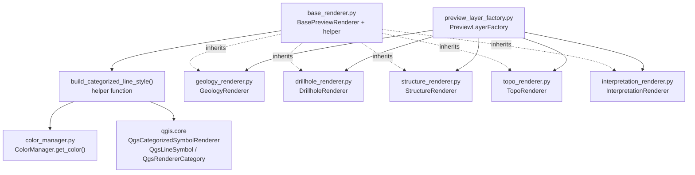

---
tags:
  - secinterp
  - code-walkthrough
  - gui
  - renderers
aliases:
  - base_renderer.py
  - BasePreviewRenderer
  - build_categorized_line_style
cssclass: secinterp-note
---

# `gui/renderers/base_renderer.py`

> [!abstract] One-line summary
> Defines the `BasePreviewRenderer.apply_style()` contract and the `build_categorized_line_style()` helper: the polymorphic base on which all five preview renderers apply QGIS symbology without duplicating code.

**Path**: `gui/renderers/base_renderer.py` (60 lines)
**Main class/function**: `BasePreviewRenderer` / `build_categorized_line_style()`
**Layer**: GUI · Present (styles already-built `QgsVectorLayer` objects)
**Tags**: #secinterp #gui #renderers

---

## 🎯 Why does this file exist?

Without a common base, each preview renderer (geology, drillholes, structures, topo, interpretations) would build its own categorized symbology with copy-pasted code.

| Problem | Solution |
|---------|----------|
| Five renderers need unit-categorized styling with consistent colors | `build_categorized_line_style()` centralizes the `QgsCategorizedSymbolRenderer` construction |
| `PreviewLayerFactory` must treat every renderer uniformly | `BasePreviewRenderer` (ABC) fixes the `apply_style(layer, **kwargs)` contract |
| Per-unit colors must stay stable across layers and sessions | The helper delegates to `ColorManager.get_color()` instead of picking ad hoc colors |

> [!important] Architectural note
> This module lives on the **Present** side of Extract-then-Compute: it computes no geology, it only dresses memory layers already built by `PreviewLayerFactory`. It is a **Strategy** contract: the factory keeps one instance per entity and invokes it polymorphically.

---

## 🧬 Relationship diagram



> [!tip] How to read
> Solid arrow = imports/delegates; dashed = ABC contract inheritance. `PreviewLayerFactory` is the only direct consumer: it instantiates one renderer per entity and invokes it via `apply_style()`.

---

## 📦 Imports — architectural reading

```python
# gui/renderers/base_renderer.py
from __future__ import annotations

from abc import ABC, abstractmethod
from collections.abc import Iterable
from typing import Any

from qgis.core import (
    QgsCategorizedSymbolRenderer,
    QgsLineSymbol,
    QgsRendererCategory,
    QgsVectorLayer,
)
```

| # | Observation |
|---|-------------|
| ① | `from __future__ import annotations` — project standard postponing annotation evaluation. |
| ② | `ABC` + `abstractmethod` — the contract is **nominal**: it is only satisfied by inheriting. Contrast with the core's `ICacheService`, which is a structural `Protocol`. |
| ③ | `Iterable[str]` (from `collections.abc`, not `typing`) — accepts a `set`, `list`, or any unit iterable; callers pass `unique_units: set[str]`. |
| ④ | `color_manager: Any` — deliberately loose typing so the helper is not coupled to the concrete `ColorManager` class; anything exposing `get_color(name)` works. Documented duck typing. |
| ⑤ | Four `qgis.core` imports and **zero** `qgis.gui` imports — it styles data layers, not widgets. Correct for a preview renderer. |

---

## 🏗️ Structure inventory

**Functions (1):**

| Function | Signature | Role |
|---------|-------|------|
| `build_categorized_line_style` | `(color_manager: Any, unique_units: Iterable[str], field: str = "unit", width: str = "0.7", capstyle: str = "round", joinstyle: str = "round") -> QgsCategorizedSymbolRenderer` | Builds a unit-categorized line renderer |

**Classes (1):**

| Class | Inherits | Members |
|-------|--------|----------|
| `BasePreviewRenderer` | `ABC` | `apply_style()` (abstract) |

**How each child implements the contract:**

| Renderer | Uses the helper | Own style |
|----------|:---:|---|
| `GeologyRenderer` | Yes (helper defaults `field="unit"`, `width="0.7"`) | — |
| `DrillholeRenderer` | Yes, only for `role="interval"` (`width="2.0"`, `flat`/`bevel`) | Trace: gray `QgsSingleSymbolRenderer` + `hole_id` labels |
| `StructureRenderer` | No | Single red line `204,0,0` |
| `TopoRenderer` | No | Graduated by `elev` with `Spectral`/`RdYlGn` ramp, 8 classes |
| `InterpretationRenderer` | No (**fill** categorized by `id`) | `QgsFillSymbol` with the polygon's own color |

---

## 📁 Files in the package

| File | Lines | Role |
|---|--:|---|
| `base_renderer.py` | 60 | ABC contract + categorized helper (this note) |
| `color_manager.py` | 48 | `ColorManager`: deterministic 16-color palette + `_active_units` cache |
| `geology_renderer.py` | 29 | `GeologyRenderer`: categorized by `unit` with helper defaults |
| `drillhole_renderer.py` | 71 | `DrillholeRenderer`: labeled gray traces + categorized intervals |
| `structure_renderer.py` | 18 | `StructureRenderer`: single red line for dips |
| `topo_renderer.py` | 32 | `TopoRenderer`: polychromatic graduated styling by `elev` |
| `interpretation_renderer.py` | 43 | `InterpretationRenderer`: fill categorized by `id` with own color |
| `__init__.py` | — | Package marker |

---

## 📖 Method-by-method walkthrough

### `build_categorized_line_style(...)`

```python
def build_categorized_line_style(
    color_manager: Any,
    unique_units: Iterable[str],
    field: str = "unit",
    width: str = "0.7",
    capstyle: str = "round",
    joinstyle: str = "round",
) -> QgsCategorizedSymbolRenderer:
    categories = []
    for unit_name in unique_units:
        color = color_manager.get_color(unit_name)
        symbol = QgsLineSymbol.createSimple(
            {
                "color": f"{color.red()},{color.green()},{color.blue()}",
                "width": width,
                "capstyle": capstyle,
                "joinstyle": joinstyle,
            }
        )
        categories.append(QgsRendererCategory(unit_name, symbol, unit_name))
    return QgsCategorizedSymbolRenderer(field, categories)
```

One loop per unit: ask the manager for the `QColor`, serialize it to `"r,g,b"` (the format `createSimple` understands), create a `QgsLineSymbol`, and wrap it in `QgsRendererCategory(value, symbol, label)`. All three category arguments use `unit_name`, so value, symbol, and legend label agree. `width`/`capstyle`/`joinstyle` travel as strings because that is what the `createSimple` property dict expects.

> [!note] No guaranteed order
> If `unique_units` is a `set`, category order varies between runs. Rendering is unaffected (each category matches by attribute value), but the legend may list units in a different order. `GeologyRenderer` and `DrillholeRenderer` pass the `set` through as is.

### `BasePreviewRenderer.apply_style(...)`

```python
class BasePreviewRenderer(ABC):
    """Base class for all preview layer renderers."""

    @abstractmethod
    def apply_style(self, layer: QgsVectorLayer, **kwargs) -> None:
        """Apply symbology and settings to the given layer."""
        pass
```

A minimal, deliberately open contract: the layer plus per-entity `**kwargs` (`role`, `unique_units`, `interp_data`). Each child interprets the kwargs it needs and ignores the rest, letting `PreviewLayerFactory` call all of them the same way without `isinstance`.

> [!tip] Where it is invoked
> `PreviewLayerFactory` keeps one instance per renderer (`self.geol_renderer`, `self.drill_renderer`, …) and calls `apply_style()` right after creating each memory layer. See [[preview_layer_factory]] and [[gui_renderers]].

### What the ABC forbids (and the error you will see)

```python
>>> from sec_interp.gui.renderers.base_renderer import BasePreviewRenderer
>>> BasePreviewRenderer()
TypeError: Can't instantiate abstract class BasePreviewRenderer
  without an implementation for abstract method 'apply_style'
```

The ABC cannot be instantiated: any subclass forgetting `apply_style()` fails at creation time, not at styling time. It is the plugin's cheapest check against incomplete renderers.

| Child | Real `apply_style()` signature | Kwargs it reads |
|------|-------------------------------|-----------------------|
| `GeologyRenderer` | `(layer, **kwargs)` | `unique_units` |
| `DrillholeRenderer` | `(layer, **kwargs)` | `role`, `unique_units` |
| `StructureRenderer` | `(layer, **kwargs)` | none (fixed style) |
| `TopoRenderer` | `(layer, **kwargs)` | none (reads `elev` from the layer) |
| `InterpretationRenderer` | `(layer, **kwargs)` | `interp_data` |

> [!note] Identical signatures, different bodies
> Every child literally repeats `(self, layer, **kwargs)` so the factory calls them without branching. Variation lives inside, not in the signature.

---

## 🔄 Data flow

| Phase | Input | Transformation | Output |
|-------|-------|----------------|--------|
| Request | `unique_units` + `color_manager` | `get_color()` per unit → `"r,g,b"` | One `QgsLineSymbol` per unit |
| Categorization | symbols + `field` | `QgsRendererCategory(value, symbol, label)` per unit | `QgsCategorizedSymbolRenderer` |
| Application | renderer + `QgsVectorLayer` | child calls `layer.setRenderer(...)` | styled layer on the canvas |

---

## 🏛️ Design patterns present

| Pattern | Where | Purpose |
|---------|-------|---------|
| **Template / Strategy (ABC contract)** | `BasePreviewRenderer.apply_style()` | Swap per-entity renderers through one interface |
| **Helper / Factory function** | `build_categorized_line_style()` | Reuse categorized-renderer construction |
| **Dependency Inversion (duck typing)** | `color_manager: Any` | Depend on `get_color()`, not on the concrete class |
| **Parameter Object (kwargs)** | `apply_style(layer, **kwargs)` | Unify the call although each entity needs different data |

---

## 🧾 API summary

| Symbol | Signature / Inherits | Typical use |
|--------|----------------------|-------------|
| `build_categorized_line_style` | `(manager, units, field="unit", ...) -> QgsCategorizedSymbolRenderer` | `layer.setRenderer(build_categorized_line_style(cm, units))` |
| `BasePreviewRenderer` | `ABC` | Inherit and implement `apply_style()` |
| `BasePreviewRenderer.apply_style` | `(layer: QgsVectorLayer, **kwargs) -> None` | Polymorphic point invoked by the factory |

---

## 🛡️ Error handling

The module contains **no `try/except`**: failures propagate to QGIS and callers. Cases to know:

| Situation | Behavior |
|-----------|----------|
| Empty `unique_units` | Returns a `QgsCategorizedSymbolRenderer` with no categories; the layer shows no visible symbols |
| `unit_name` with no registered color | `ColorManager.get_color()` assigns a deterministic hash-based color and caches it; never returns `None` |
| `color_manager` without `get_color` | `AttributeError` at runtime (the price of duck typing) |
| Invalid layer in `setRenderer` | Handled by the caller (`PreviewLayerFactory` / `PreviewRenderer`) |

> [!warning] No defensive validation
> The helper does not check `field` against the layer's real fields. A nonexistent `field` yields a renderer matching no features (visually empty layer, no exception). The factory always passes fields it created itself, so the risk is low.

---

## 🧪 Associated tests

There is no dedicated test for `build_categorized_line_style()` or the ABC; the contract is verified through its children with mocks (Mock-first, no real QGIS):

- `tests/gui/renderers/test_renderers.py::TestDrillholeRenderer::test_apply_trace_style` — `apply_style(role="trace")` calls `setRenderer` once, plus `setLabeling` and `setLabelsEnabled(True)`.
- `tests/gui/renderers/test_renderers.py::TestDrillholeRenderer::test_apply_interval_style` — `apply_style(role="interval", unique_units={"LithA", "LithB"})` calls `setRenderer` once and `get_color` exactly twice (once per unit).
- `tests/gui/renderers/test_renderers.py::TestTopoRenderer::test_apply_style` — verifies `setRenderer` on the graduated child that does **not** use the helper.

Nothing in `tests/core/` applies: this module imports `qgis.core` and belongs to the GUI layer.

---

## 👀 Observations and notes

> [!success] Strengths
> - Single-method contract: easy to implement and to mock in tests.
> - The helper removes categorized-renderer duplication between geology and drillholes.
> - `ColorManager` injected as a soft dependency: children receive the same manager from the factory, keeping colors consistent across layers.

> [!warning] Points of attention
> - `width` typed as `str` (not `float`): consistent with `createSimple`, but prone to silent mistakes if someone passes a number.
> - Nondeterministic category order when `unique_units` is a `set`; the legend may reorder between sessions.
> - `StructureRenderer`, `TopoRenderer`, and `InterpretationRenderer` do not reuse the helper: each justifies its own style, but a new reader may expect otherwise.

> [!question] Open questions
> - Should the helper sort `unique_units` to stabilize the legend?
> - Should `color_manager` be typed as a `Protocol` with `get_color()` instead of `Any`, following the core's `ICacheService` example?

---

## 🔗 Related notes

- [[Index]] — vault index
- [[gui_renderers]] — family note for all preview renderers
- [[preview_layer_factory]] — sole consumer: instantiates the renderers and invokes them
- [[drillhole_renderer]] — child combining the helper (intervals) with its own style (traces)
- [[preview_renderer]] — orchestrates preview layers, legend, and cleanup
- [[controller]] — produces the data the factory turns into layers before styling

---

*Note of the SecInterp Code Walkthrough v2 vault — v3.8.0*
