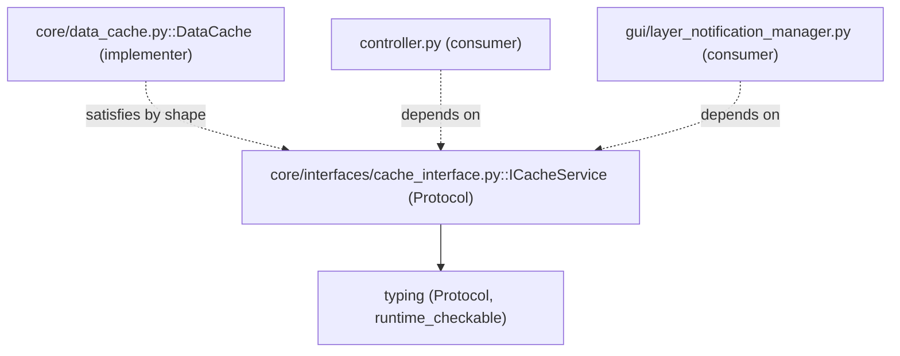

---
tags:
  - secinterp
  - code-walkthrough
  - core
  - interfaces
  - ports
aliases:
  - cache_interface.py
  - ICacheService
cssclass: secinterp-note
---

# `core/interfaces/cache_interface.py`

> [!abstract] One-line summary
> Defines `ICacheService`, the core's **cache contract (Protocol)**: 5 methods (`get`, `set`, `invalidate`, `clear`, `get_metadata`) with **structural** typing and `runtime_checkable`.

**Path**: `core/interfaces/cache_interface.py` (62 lines)
**Main class/function**: `ICacheService`
**Layer**: Core (QGIS-agnostic)
**Tags**: #secinterp #core #interfaces #ports

---

## 🎯 Why does this file exist?

The `controller` and `layer_notification_manager` need a cache, but must not couple to a
concrete implementation. `ICacheService` declares **what** a cache must know how to do, so
consumers depend on the contract and not on `DataCache`:

| Problem | Solution |
|---------|----------|
| Coupling consumers to `DataCache` | Depend on `ICacheService` (abstraction) |
| Being able to substitute/mock the cache | `Protocol` (structural typing) |
| Runtime verification that an object satisfies the contract | `@runtime_checkable` |
| Unify invalidation semantics | Granular `invalidate(bucket, key)` |

> [!important] Architectural note — `Protocol`, not `ABC`
> `ICacheService` is the **only** core contract that uses `Protocol` (the rest are `ABC`).
> With `Protocol`, any class having those methods satisfies the contract **without
> inheriting**. `runtime_checkable` enables `isinstance(obj, ICacheService)` at runtime.

---

## 🧬 Relationship diagram



> [!tip] How to read
> Solid = imports (`typing`). Dashed = conformance/dependency: `DataCache` **satisfies** the
> contract without inheriting, and consumers depend on the contract (not on `DataCache`).

---

## 📦 Imports — architectural reading

```python
# core/interfaces/cache_interface.py
from __future__ import annotations

from typing import Any, Protocol, runtime_checkable
```

| # | Observation |
|---|-------------|
| ① | `Protocol` — base for structural typing (no inheritance required). |
| ② | `runtime_checkable` — decorator enabling runtime `isinstance`. |
| ③ | `Any` — generic types for keys/data (no DTO or QGIS imports). |

---

## 🏗️ Structure inventory

**Classes:** `class ICacheService(Protocol)` — 5 methods (all with `...` body)

**Methods:**
- `get(bucket, key)`, `set(bucket, key, data, metadata=None)`
- `invalidate(bucket=None, key=None)`, `clear()`, `get_metadata(bucket, key)`

---

## 📁 Files in the package

- `cache_interface.py` — individual note for this file (the `core/interfaces/` package has its note in [[core_interfaces]]).

---

## 📖 Method-by-method walkthrough

### `ICacheService` — declaration

```python
@runtime_checkable
class ICacheService(Protocol):
    """Abstract protocol for the Processing Data Cache Service."""
    ...
```

The `@runtime_checkable` decorator (valid only on `Protocol`) makes
`isinstance(obj, ICacheService)` check at runtime whether `obj` has the required methods.
Methods have `...` (ellipsis) bodies: they are **signatures**, not implementations.

### `get(bucket, key)`

```python
def get(self, bucket: str, key: str) -> Any | None:
    """Retrieve data from a specific cache bucket.

    Args:
        bucket: The cache category (e.g., 'topo', 'geol').
        key: Unique key for the parameter set.

    Returns:
        The cached data or None if not found or expired.
    """
    ...
```

Retrieves data from a bucket. Returns `Any | None` (`None` if missing or expired). The
docstring establishes the bucket contract (`topo`, `geol`, …) and keys.

### `set(bucket, key, data, metadata=None)`

```python
def set(self, bucket: str, key: str, data: Any, metadata: dict | None = None) -> None:
    """Store data in a specific cache bucket.

    Args:
        bucket: The cache category.
        key: Unique key for the parameter set.
        data: The data to cache.
        metadata: Optional metadata (e.g., TTL, LOD info).
    """
    ...
```

Stores data with **optional metadata** (`dict | None`), intended for TTL and LOD info. The
contract does not specify the metadata shape (left to the implementation).

### `invalidate(bucket=None, key=None)`

```python
def invalidate(self, bucket: str | None = None, key: str | None = None) -> None:
    """Invalidate cache entries.

    Args:
        bucket: If provided, only invalidate this bucket.
        key: If provided, only invalidate this specific key.
    """
    ...
```

**Granular** invalidation: no arguments clears everything; with `bucket` clears one bucket;
with `key` deletes one entry. The richest signature in the contract.

### `clear()`

```python
def clear(self) -> None:
    """Clear the entire cache."""
    ...
```

Shortcut to empty the whole cache. In practice (`DataCache`) it delegates to `invalidate()`.

### `get_metadata(bucket, key)`

```python
def get_metadata(self, bucket: str, key: str) -> dict[str, Any] | None:
    """Retrieve metadata for a cached entry.

    Args:
        bucket: The cache category.
        key: Unique key for the entry.

    Returns:
        Dictionary containing entry metadata or None if not found.
    """
    ...
```

Reads only an entry's metadata (without retrieving the data). Lets the consumer query state
(e.g. LOD) without deserialization cost.

---

## 🔄 Data flow

| Phase | Input | Transformation | Output |
|-------|-------|----------------|--------|
| Contract | — (signature only) | shape declaration | — |
| Implementation | `bucket, key, data, metadata` | `DataCache` (`get`/`set`/…) | `data` / `None` |

---

## 🏛️ Design patterns present

| Pattern | Where | Purpose |
|---------|-------|---------|
| **Port / Adapter** | `ICacheService` | Decouple the cache from its implementation |
| **Protocol (structural typing)** | `typing.Protocol` | Contract without mandatory inheritance |
| **Dependency Inversion** | consumers | Depend on the abstraction |

---

## 🔬 `Protocol` vs `ABC` — selection criteria

`ICacheService` is the core's only `Protocol`; the other contracts (`IDrillholeService`,
etc.) are `ABC`. The difference:

| Criterion | `Protocol` (`ICacheService`) | `ABC` (rest) |
|-----------|------------------------------|--------------|
| Typing | Structural (shape suffices) | Nominal (requires inheritance) |
| Inheritance | Not required | Mandatory |
| `isinstance` | Only with `runtime_checkable` | Always |
| When to use | Substitutable by composition (cache, mocks) | Service contracts with rigid signatures |

> [!note] Why the cache is a `Protocol`
> A cache is an **infrastructure detail** that should be trivially mockable or substitutable
> (e.g. a `NullCache` in tests). `Protocol` lets any class with the 5 methods be valid,
> without forcing an inheritance hierarchy.

---

## 🧾 API summary

| Symbol | Signature / Inherits | Typical use |
|--------|----------------------|-------------|
| `ICacheService` | `Protocol` (`runtime_checkable`) | Cache contract |
| `ICacheService.get` | `(bucket, key) -> Any \| None` | Retrieve data |
| `ICacheService.set` | `(bucket, key, data, metadata=None) -> None` | Store |
| `ICacheService.invalidate` | `(bucket=None, key=None) -> None` | Invalidate |
| `ICacheService.clear` | `() -> None` | Empty everything |
| `ICacheService.get_metadata` | `(bucket, key) -> dict \| None` | Read metadata |

---

## 🛡️ Error handling

The contract **handles no errors**: it only declares signatures. The implicit contract is
that an implementer returns `None` on absence (in `get`/`get_metadata`) and does not raise
on missing bucket/key. `DataCache` honors this by design (see [[data_cache]]).

---

## 🧪 Associated tests

The contract is not tested directly, but its implementation is:

- `tests/core/test_data_cache_fix.py` — verifies that `DataCache` satisfies the contract
  (`get`/`set`/`invalidate`).

> [!note] Conformance verification
> Conformance with the `Protocol` can be checked via
> `isinstance(DataCache(), ICacheService)` (thanks to `runtime_checkable`), although the
> current test does so indirectly (get/set round-trip).

---

## 👀 Observations and notes

> [!success] Strengths
> - Structural typing: trivial mocks and substitutes without an inheritance hierarchy.
> - `runtime_checkable` enables runtime `isinstance`.
> - Complete docstrings with the bucket and key contract.

> [!warning] Points of attention
> - `Any | None` returns dilute the typing (could be more concrete).
> - `metadata: dict | None` without a schema: consumers know keys by convention
>   (`ttl`, LOD).
> - Inconsistency with the other contracts (which are `ABC`).

> [!question] Open questions
> - Type `metadata` as a `TypedDict` (`{"ttl": int, "lod": ...}`)?
> - Unify all contracts to `Protocol` (or to `ABC`) for consistency?

---

## 🔗 Related notes

- [[Index]] — vault index
- [[data_cache]] — `DataCache` (implementer of the contract)
- [[core_interfaces]] — the contracts package (the rest are `ABC`)
- [[controller]] — cache consumer
- [[layer_core_interfaces]] — interfaces layer note

---

*Note of the SecInterp Code Walkthrough v2 vault — v3.9.1*
