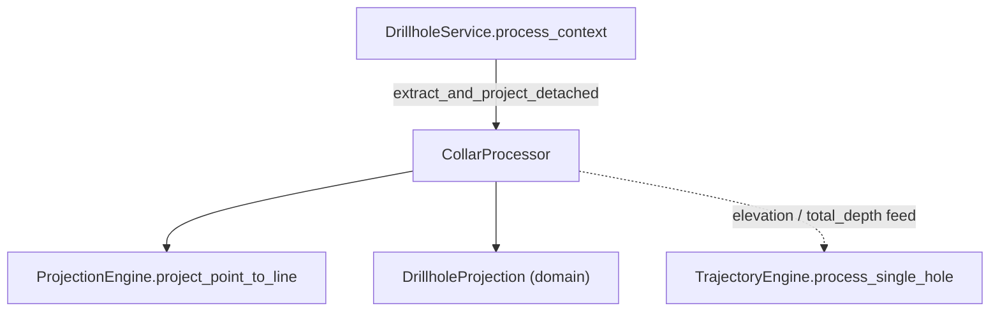

---
tags:
  - secinterp
  - code-walkthrough
  - core
  - processors
aliases:
  - collar_processor.py
  - CollarProcessor
cssclass: secinterp-note
---

# `core/services/drillhole/collar_processor.py`

> [!abstract] One-line summary
> A **pure** processor that projects a drillhole *collar* (mouth) onto the section line and extracts its elevation and total depth from detached data, returning a `DrillholeProjection` or `None` when the collar falls outside the buffer.

**Path**: `core/services/drillhole/collar_processor.py` (100 lines)
**Main class/function**: `CollarProcessor`
**Layer**: Core (QGIS-agnostic)
**Tags**: #secinterp #core #processors

---

## 🎯 Why does this file exist?

A collar does not reach the core as a QGIS object, but as a loose dict
`{"id", "point", "attributes"}` (output of the Extract phase). Someone has to turn
that dict into a section projection and decide whether the hole is close enough to
be drawn:

| Problem | Solution |
|---------|----------|
| The collar is a heterogeneous dict, not a typed entity | `extract_and_project_detached` normalizes it into `DrillholeProjection` |
| Elevation may come from a field or from prior sampling | `_extract_z` with fallback to `pre_sampled_z` |
| Far-away collars must be dropped | `offset <= buffer_width` comparison → `None` |

> [!important] Architectural note
> **QGIS-agnostic** and stateless: the class keeps nothing between calls and receives
> everything by parameter. `point` is consumed by duck-typing (a `(x, y)` tuple), so
> `CollarProcessor` never imports `qgis.core`. It is the first link of the
> `collar → trajectory → intervals` pipeline orchestrated by [[drillhole_service]].

---

## 🧬 Relationship diagram



> [!tip] How to read
> Solid arrow = imports/delegates; dashed = the result (`DrillholeProjection`) is
> consumed downstream. `CollarProcessor` depends on `ProjectionEngine` and the domain
> DTO, but **nobody depends on it** except the orchestrating service.

---

## 📦 Imports — architectural reading

```python
# collar_processor.py
from __future__ import annotations

import contextlib
from typing import Any

from sec_interp.core.domain import DrillholeProjection
from sec_interp.core.services.drillhole.projection_engine import ProjectionEngine
```

| # | Observation |
|---|-------------|
| ① | `contextlib.suppress(ValueError, TypeError)` — float conversion tolerant to dirty strings or missing fields. |
| ② | `DrillholeProjection` imported from `core.domain`: the return is a pure DTO, not a QGIS object. |
| ③ | `ProjectionEngine` is the only internal service dependency: it delegates trigonometry, not duplicates it. |
| ④ | `Any` appears in the collar dict and `hole_id`: the module accepts IDs of any type (str, int). |

> [!note] Minimal dependency
> Only two domain imports and one local utility. No `math`, no extra `typing` and,
> above all, no `qgis.*`. The geometric work lives in [[core_services_drillhole]]
> (`projection_engine.py`), not here.

---

## 🏗️ Structure inventory

**Classes:** `class CollarProcessor` — 4 methods (2 public + 2 private)

**Functions/Methods:**
- `extract_and_project_detached(collar_data, line_points, buffer_width, collar_id_field, collar_z_field, collar_depth_field, pre_sampled_z=None) -> DrillholeProjection | None`
- `build_coordinate_map(collar_data: list[dict]) -> dict[Any, tuple[float, float]]`
- `_extract_z(attrs, z_field, hole_id, pre_sampled) -> float`
- `_extract_depth(attrs, depth_field) -> float`

---

## 📁 Files in the package

| File | Note |
|------|------|
| `collar_processor.py` | this note |
| `projection_engine.py` | [[core_services_drillhole]] — `ProjectionEngine.project_point_to_line` |
| `survey_processor.py` | [[core_services_drillhole]] — `SurveyProcessor.determine_final_depth` |
| `interval_processor.py` | [[interval_processor]] — interval interpolation |
| `trajectory_engine.py` | [[trajectory_engine]] — per-hole orchestration |

---

## 📖 Method-by-method walkthrough

### `extract_and_project_detached`

```python
def extract_and_project_detached(
    self,
    collar_data: dict[str, Any],
    line_points: list[tuple[float, float]],
    buffer_width: float,
    collar_id_field: str,
    collar_z_field: str,
    collar_depth_field: str,
    pre_sampled_z: dict[Any, float] | None = None,
) -> DrillholeProjection | None:
```

Main entry point. Decision flow:

1. `point = collar_data.get("point")` → if absent, `None` (nothing to project).
2. `attrs = collar_data.get("attributes", {})`.
3. `hole_id` comes from `collar_data["id"]`; if missing, falls back to
   `collar_id_field` inside `attrs`; if still absent, `None`.
4. `z = _extract_z(...)` and `depth = _extract_depth(...)`.
5. `dist_along, offset = ProjectionEngine.project_point_to_line(point, line_points)`.
6. If `offset <= buffer_width` build `DrillholeProjection(hole_id=str(hole_id),
   distance=dist_along, elevation=z, offset=offset, total_depth=depth)`; otherwise `None`.

> [!warning] `hole_id` is coerced to `str`
> The DTO `DrillholeProjection.hole_id` is typed `str`. The processor calls
> `str(hole_id)` to normalize numeric IDs. Downstream, `context.survey_data` and
> `context.interval_data` are indexed by that same `hole_id` **before** the cast (see
> [[drillhole_service]]), which requires key coherence between the collar and the
> survey/interval tables.

### `build_coordinate_map`

```python
def build_coordinate_map(
    self, collar_data: list[dict[str, Any]]
) -> dict[Any, tuple[float, float]]:
    collar_coords: dict[Any, tuple[float, float]] = {}
    for item in collar_data:
        hid = item.get("id")
        pt = item.get("point")
        if hid is not None and pt is not None:
            collar_coords[hid] = pt
    return collar_coords
```

Builds the `hole_id → (x, y)` map, filtering entries with missing ID or point. A
convenience utility for consumers that want the collar coordinate without running the
full projection.

### `_extract_z`

```python
def _extract_z(
    self,
    attrs: dict[str, Any],
    z_field: str,
    hole_id: Any,
    pre_sampled: dict[Any, float] | None,
) -> float:
    z = 0.0
    if z_field:
        with contextlib.suppress(ValueError, TypeError):
            z = float(attrs.get(z_field, 0.0))
    if z == 0.0 and pre_sampled and hole_id in pre_sampled:
        z = pre_sampled[hole_id]
    return z
```

Two elevation sources: first the `z_field` (converted tolerantly to
`ValueError`/`TypeError`); if the result is `0.0`, fall back to `pre_sampled_z`
(elevation sampled from a DEM, when the collar carries no elevation of its own).

> [!note] `0.0` as sentinel
> A collar with a true elevation of `0.0` (sea level) would also trigger the fallback
> to `pre_sampled_z`. This is a subtle edge: the logic does not distinguish "absent"
> from "real zero".

### `_extract_depth`

```python
def _extract_depth(self, attrs: dict[str, Any], depth_field: str) -> float:
    depth = 0.0
    if depth_field:
        with contextlib.suppress(ValueError, TypeError):
            depth = float(attrs.get(depth_field, 0.0))
    return depth
```

Extracts the declared total depth. No sampling fallback: if there is no field or it
is non-numeric, it returns `0.0` (the real depth is reconciled later in
[[core_services_drillhole]] via `SurveyProcessor.determine_final_depth`).

---

## 🔄 Data flow

| Phase | Input | Transformation | Output |
|-------|-------|----------------|--------|
| Collar extraction | `collar_data` `{"id","point","attributes"}` | `get` + `hole_id` fallback | `point`, `hole_id`, `attrs` |
| Elevation/depth | `attrs` + `pre_sampled_z` | `float()` with `suppress` + fallback | `z`, `depth` |
| Projection | `point` + `line_points` | `ProjectionEngine.project_point_to_line` | `(dist_along, offset)` |
| Buffer filter | `offset`, `buffer_width` | `offset <= buffer_width` | `DrillholeProjection` or `None` |

> [!tip] Canonical chain
> `DrillholeService.process_context` calls `extract_and_project_detached` for each
> collar; if it returns a projection, it injects `elevation` and `total_depth` into
> `TrajectoryEngine.process_single_hole`. `CollarProcessor` only decides "is this
> collar on the section?" and hands off the hole's base coordinates.

---

## 📐 The detached collar contract

`CollarProcessor` expects a dict of a concrete shape, produced by the GUI
`DrillholeExtractor` and carried by `DrillholeContext.collar_data`:

| Key | Type | Meaning |
|-----|------|---------|
| `"id"` | `Any` (str/int) | Hole identifier (key for survey/intervals) |
| `"point"` | `(x, y)` | Collar coordinate in the plane (duck-typed) |
| `"attributes"` | `dict[str, Any]` | Raw attributes: elevation, depth, lithology… |

> [!note] Why `"point"` and not `"geometry"`?
> The name `point` underlines that the geometry was already flattened to a plain
> tuple. No `QgsGeometry`: the Extract phase already reduced it. This is what keeps
> the core 100 % agnostic (see [[task_inputs]] and [[drillhole_service]]).

### Relationship to `DrillholeContext`

The fields `collar_id_field`, `collar_z_field`, `collar_depth_field` and
`pre_sampled_z` do **not** travel inside the collar dict: they are fields of the full
`DrillholeContext` and are passed as separate parameters. In other words, the
processor receives the context "dismantled", not a context object.

> [!note] Cohesion with `DrillholeContext`
> The exact correspondence between `extract_and_project_detached`'s parameters and
> the `DrillholeContext` attributes (documented in [[task_inputs]]) is deliberate:
> `collar_id_field`, `collar_z_field` and `collar_depth_field` are read once in the
> extractor and propagated unchanged to this method.

---

## 🔢 Numeric example — collar on the line

Section `line_points = [(0, 0), (100, 0)]`, collar `{"id": "DH01", "point": (50, 10),
"attributes": {"z": 50.0, "depth": 100.0}}`, `buffer_width = 50.0`:

1. `hole_id = "DH01"`, `attrs = {"z": 50.0, "depth": 100.0}`.
2. `_extract_z` → `z = 50.0`; `_extract_depth` → `depth = 100.0`.
3. `project_point_to_line((50, 10), line)` → `dist_along = 50.0`, `offset = 10.0`.
4. `10.0 <= 50.0` → `DrillholeProjection("DH01", 50.0, 50.0, 10.0, 100.0)`.

The same collar with `point = (50, 500)` gives `offset = 500.0 > 50.0` → `None` and
the hole is skipped (the case covered by
`test_process_context_collar_outside_buffer_skipped`).

---

## 🏛️ Design patterns present

| Pattern | Where | Purpose |
|---------|-------|---------|
| **Adapter (Extract-then-Compute)** | `extract_and_project_detached` | Normalize loose dict → domain DTO |
| **Guard clause** | `if not point` / `if not hole_id` | Early exit on incomplete data |
| **Null Object / Sentinel** | `None` return | "outside buffer" as absence, not error |
| **Duck typing** | `point` as `(x, y)` | Accept any point type without importing QGIS |
| **Tolerant conversion** | `contextlib.suppress` | Don't break the pipeline on a non-numeric field |

---

## 🧾 API summary

| Symbol | Signature / Inherits | Typical use |
|--------|----------------------|-------------|
| `extract_and_project_detached` | `(collar_data, line_points, buffer_width, collar_id_field, collar_z_field, collar_depth_field, pre_sampled_z=None) -> DrillholeProjection \| None` | Project a collar and filter by buffer |
| `build_coordinate_map` | `(collar_data: list[dict]) -> dict[Any, tuple[float, float]]` | `hole_id → (x, y)` map |
| `_extract_z` | `(attrs, z_field, hole_id, pre_sampled) -> float` | Elevation with sampling fallback |
| `_extract_depth` | `(attrs, depth_field) -> float` | Declared total depth |

---

## 🛡️ Error handling

It does not raise exceptions; it prefers **safe degradation**:

| Case | Behavior |
|------|----------|
| Missing `point` or `hole_id` | `extract_and_project_detached` → `None` |
| `z_field`/`depth_field` non-numeric or absent | `contextlib.suppress` → `0.0` |
| Collar outside buffer (`offset > buffer_width`) | `None` (the hole is skipped) |
| Non-string ID | `str(hole_id)` normalizes before building the DTO |

> [!important] No local logging
> The module emits no logs or translatable strings; data failures are reported
> upstream, in `DrillholeService.process_context` (which catches
> `ValueError`/`TypeError`/`KeyError`/`SecInterpError` and logs `logger.exception`).

---

## 🧪 Associated tests

Mapping to the real tests under `tests/core/`:

- `tests/core/test_drillhole_service.py::test_collar_processor_project` — direct collar
  projection, verifies expected `hole_id` and `distance`.
- `tests/core/test_drillhole_service.py::test_process_context_projects_collar` — full
  flow with a valid collar.
- `tests/core/test_drillhole_service.py::test_process_context_collar_outside_buffer_skipped` —
  far collar → `[]`.
- `tests/core/services/drillhole/test_processors.py::TestCollarProcessor::test_build_coordinate_map` —
  `hole_id → point` map.

> [!warning] Partially out-of-sync tests
> `tests/core/services/drillhole/test_processors.py` calls
> `build_coordinate_map(..., use_geometry=..., collar_x_field=..., collar_y_field=...)`
> and `extract_point_agnostic` / `_extract_depth_agnostic`, which **no longer exist** in
> the current source (the signature is `build_coordinate_map(self, collar_data)`). It is
> a leftover from an earlier refactor and should be updated.

---

## ⚡ Performance and complexity

| Aspect | Analysis |
|--------|----------|
| **Complexity** | `extract_and_project_detached` is `O(1)` (one projection per collar); `build_coordinate_map` is `O(n)` |
| **Dominant cost** | `ProjectionEngine.project_point_to_line` — `O(m)` in the section line vertex count |
| **Memory** | Negligible: one light `DrillholeProjection` per collar, source dict not retained |
| **Hot spot** | The `for` loop in `DrillholeService` calls this method `n` times (one per collar); it is the drillhole-domain hot path |

> [!tip] Reentrant and stateless
> Because `CollarProcessor` mutates nothing between calls, a single instance can be
> shared across all collars (as `DrillholeService.__init__` does), with no risk of
> race conditions in a `QgsTask`.

---

## 👀 Observations and notes

> [!success] Strengths
> - 100 % QGIS-agnostic, stateless and testable without QGIS.
> - Tolerant to dirty data thanks to `contextlib.suppress`.
> - Clean separation: geometry lives in `ProjectionEngine`, here only orchestration.

> [!warning] Points of attention
> - `0.0` as sentinel in `_extract_z` confuses "no elevation" with "real zero".
> - The `str(hole_id)` cast can desynchronize keys with `survey_data`/`interval_data`.
> - `test_processors.py` targets methods that no longer exist (needs an update).

> [!question] Open questions
> - Use `None` instead of `0.0` for "elevation absent", to distinguish it from real zero?
> - Unify the `build_coordinate_map` contract with the GUI `data_fetcher`?

---

## 🌐 i18n and migration notes

- **No user-facing strings**: the module emits no translatable messages; it does not
  inherit `TranslatableMixin` (unlike [[drillhole_service]]). Every error degrades to
  `None` or `0.0`.
- **Thread-safety**: the class holds no state ⇒ safe for `QgsTask`; each collar is
  processed independently and reentrantly.
- **v3.x migration**: the `build_coordinate_map(self, collar_data)` signature simplified
  an earlier version that received `use_geometry`/`collar_x_field`/`collar_y_field`;
  tests that still pass those arguments became stale (see Associated tests).

---

## 🔗 Related notes

- [[Index]] — vault index
- [[drillhole_service]] — orchestrates `extract_and_project_detached`
- [[trajectory_engine]] — consumes the collar's `elevation` and `total_depth`
- [[core_services_drillhole]] — `ProjectionEngine` (geometric delegate) and `SurveyProcessor`
- [[drillhole]] — pure trajectory utilities used downstream
- [[dtos]] — `DrillholeProjection`, `SpatialMeta` and `GeologySegment` of the domain

---

*Note of the SecInterp Code Walkthrough v2 vault — v3.9.1*
