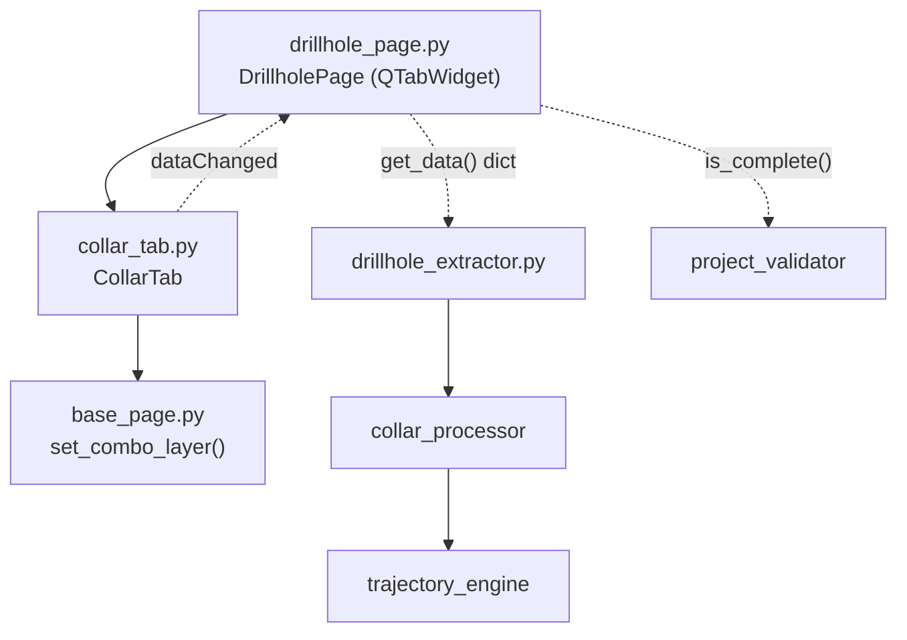

---
tags:
  - secinterp
  - code-walkthrough
  - gui
  - pages
aliases:
  - collar_tab.py
  - CollarTab
cssclass: secinterp-note
---

# `gui/ui/pages/drillhole/collar_tab.py`

> [!abstract] One-line summary
> Drillhole collar configuration tab: point-layer selector plus field mapping (ID, X, Y, Z, depth) with a use-geometry switch, feeding the Extract-side `DrillholeContext`.

**Path**: `gui/ui/pages/drillhole/collar_tab.py` (180 lines)
**Main class**: `CollarTab`
**Layer**: GUI (QGIS-dependent · sub-page / tab)
**Tags**: #secinterp #gui #pages

---

## 🎯 Why does this file exist?

The drillhole page needs three independent forms (collar, survey, intervals)
living as tabs inside a `QTabWidget`. This module encapsulates only the first
one: where drillholes are collared and how they are identified.

| Problem | Solution |
|---------|----------|
| The collar mixes layer + 5 fields + a coordinate mode | `CollarTab` groups the 7 widgets in its own `QGridLayout` |
| The user may use geometry or two X/Y fields | `chk_use_geom` switches mode and disables X/Y via `_toggle_xy_fields` |
| The parent page must aggregate three forms without knowing widgets | `get_data` / `dump` / `load` / `reset` / `connect_signals` / `disconnect_signals` contract |
| Field combos must follow the chosen layer | `layerChanged` wired to all five `setLayer` |

> [!important] Architectural note
> **Extract**-phase tab: it only reads QGIS widgets and returns primitives
> (`currentLayer()`, `currentField()`, `isChecked()`). It never computes
> trajectories; [[collar_processor]] and [[trajectory_engine]] do that from the
> context.

---

## 🧬 Relationship diagram



> [!tip] How to read
> Solid arrow = imports/delegates; dashed = callback/data flow toward the parent
> or toward the core.

---

## 📦 Imports — architectural reading

```python
# gui/ui/pages/drillhole/collar_tab.py
from __future__ import annotations
import contextlib
from typing import Any
from qgis.core import Qgis
from qgis.gui import QgsFieldComboBox, QgsMapLayerComboBox
from qgis.PyQt.QtCore import QCoreApplication, pyqtSignal
from qgis.PyQt.QtWidgets import QCheckBox, QGridLayout, QLabel, QWidget
from sec_interp.gui.ui.pages.base_page import set_combo_layer
from sec_interp.logger_config import get_logger
```

| # | Observation |
|---|-------------|
| ① | `from __future__ import annotations` + `QWidget \| None`: modern type syntax. |
| ② | `contextlib` exists only for `disconnect_signals` (failure-tolerant unwiring). |
| ③ | `qgis.gui.QgsMapLayerComboBox` / `QgsFieldComboBox`: native layer-aware combos. |
| ④ | `Qgis.LayerFilter.PointLayer`: collar accepts point layers only. |
| ⑤ | `pyqtSignal` declares argument-less `dataChanged` to notify the parent. |
| ⑥ | `set_combo_layer` from `base_page` restores the layer with signals blocked. |
| ⑦ | `get_logger(__name__)` follows the plugin logging standard. |

---

## 🏗️ Structure inventory

**Class:** `CollarTab(QWidget)` — 1 signal, 9 methods.

| Member | Type | Role |
|--------|------|------|
| `dataChanged` | `pyqtSignal()` | Notifies the parent that some field changed |
| `c_layer` | `QgsMapLayerComboBox` | Collar (point) layer |
| `chk_use_geom` | `QCheckBox` | Use geometry instead of X/Y fields |
| `c_id` | `QgsFieldComboBox` | Hole ID field |
| `c_x` / `c_y` | `QgsFieldComboBox` | Easting (X) / Northing (Y) fields |
| `lbl_x` / `lbl_y` | `QLabel` | Labels disabled together with X/Y |
| `c_z` | `QgsFieldComboBox` | Elevation field (optional, DEM used if empty) |
| `c_depth` | `QgsFieldComboBox` | Total depth field |

**Methods:**

| Method | Signature | Purpose |
|--------|-----------|---------|
| `__init__` | `(parent=None) -> None` | Builds and calls `_setup_ui` |
| `tr` | `(message: str) -> str` | Translates with the `"CollarTab"` context |
| `_setup_ui` | `() -> None` | 7-row grid + stretch |
| `_toggle_xy_fields` | `(checked: bool) -> None` | Enables/disables X/Y |
| `get_data` | `() -> dict[str, Any]` | Live values for validation/extract |
| `dump` | `() -> dict[str, Any]` | Persistable state (`dh_*` keys) |
| `load` | `(data: dict) -> None` | Applies persisted state |
| `reset` | `() -> None` | Back to defaults |
| `connect_signals` | `() -> None` | Wires layer, fields and checkbox |
| `disconnect_signals` | `() -> None` | Unwires everything without raising |

---

## 📁 Files in the package

| File | Lines | Role |
|---|---|---|
| `drillhole/__init__.py` | 9 | Re-exports `CollarTab`, `IntervalTab`, `SurveyTab` |
| `collar_tab.py` | 180 | This note: collar form |
| `survey_tab.py` | 144 | Deviation form (see [[survey_tab]]) |
| `interval_tab.py` | 144 | Interval form (see [[interval_tab]]) |
| `../drillhole_page.py` | 130 | Parent with `QTabWidget` (see [[drillhole_page]]) |

---

## 📖 Method-by-method walkthrough

### `__init__` + `tr`

```python
def __init__(self, parent: QWidget | None = None) -> None:
    super().__init__(parent)
    self._setup_ui()

def tr(self, message: str) -> str:
    return QCoreApplication.translate("CollarTab", message)
```

The constructor delegates all construction to `_setup_ui`, no logic. `tr`
uses the `"CollarTab"` context so strings are translatable via
`update-strings.sh` (see 🌐 section).

### `_setup_ui`

```python
layout = QGridLayout(self)
layout.setSpacing(6)

layout.addWidget(QLabel(self.tr("Collar Layer:")), 0, 0)
self.c_layer = QgsMapLayerComboBox()
self.c_layer.setFilters(Qgis.LayerFilter.PointLayer)
self.c_layer.setAllowEmptyLayer(True)
self.c_layer.setCurrentIndex(0)
layout.addWidget(self.c_layer, 0, 1)

self.chk_use_geom = QCheckBox(self.tr("Use Layer Geometry for Coordinates"))
self.chk_use_geom.setChecked(True)
layout.addWidget(self.chk_use_geom, 1, 0, 1, 2)
```

| Row | Widgets | Detail |
|-----|---------|--------|
| 0 | Label + `c_layer` | `PointLayer` filter, empty layer allowed |
| 1 | `chk_use_geom` (span 2) | Checked by default: geometry wins |
| 2 | Label + `c_id` | Hole ID, no empty field allowed |
| 3 | `lbl_x` + `c_x` | Allows empty field name (`setAllowEmptyFieldName(True)`) |
| 4 | `lbl_y` + `c_y` | Same as X |
| 5 | Label + `c_z` | Tooltip: empty ⇒ use DEM elevation |
| 6 | Label + `c_depth` | Total depth, optional |
| 7 | `layout.setRowStretch(7, 1)` | Pushes everything up |

> [!note] 100 % programmatic UI
> No `.ui` file: every `QLabel` goes through `self.tr()` at creation time, and
> field combos accept an empty name except `c_id`.

### `_toggle_xy_fields`

```python
def _toggle_xy_fields(self, checked: bool) -> None:
    enabled = not checked
    self.lbl_x.setEnabled(enabled)
    self.c_x.setEnabled(enabled)
    self.lbl_y.setEnabled(enabled)
    self.c_y.setEnabled(enabled)
```

When `chk_use_geom` is checked, X/Y fields are disabled (but keep their
value). It is invoked once with `True` inside `connect_signals` to sync the
initial state.

### `get_data` — live values

```python
def get_data(self) -> dict[str, Any]:
    return {
        "collar_layer": self.c_layer.currentLayer(),
        "use_geometry": self.chk_use_geom.isChecked(),
        "collar_id": self.c_id.currentField(),
        "collar_x": self.c_x.currentField(),
        "collar_y": self.c_y.currentField(),
        "collar_z": self.c_z.currentField(),
        "collar_depth": self.c_depth.currentField(),
    }
```

Returns the **live layer object** plus field names. Consumed by
`DrillholePage.get_data()` and, from there, by `is_complete()` and the
extractor that builds the `DrillholeContext`.

### `dump` — persistable state

```python
def dump(self) -> dict[str, Any]:
    return {
        "dh_collar_layer": self.c_layer.currentLayer(),
        "dh_collar_id": self.c_id.currentField(),
        "dh_use_geom": self.chk_use_geom.isChecked(),
        "dh_collar_x": self.c_x.currentField(),
        "dh_collar_y": self.c_y.currentField(),
        "dh_collar_z": self.c_z.currentField(),
        "dh_collar_depth": self.c_depth.currentField(),
    }
```

Same readings as `get_data` but with `dh_*`-prefixed keys, which are what
`ConfigService` persists into `QgsSettings` (see [[config]]).

### `load` — apply persisted state

```python
def load(self, data: dict[str, Any]) -> None:
    c_layer = data.get("dh_collar_layer")
    if c_layer is not None:
        set_combo_layer(self.c_layer, c_layer)
        for w in (self.c_id, self.c_x, self.c_y, self.c_z, self.c_depth):
            w.setLayer(c_layer)

    for key, combo in [
        ("dh_collar_id", self.c_id),
        ("dh_collar_x", self.c_x),
        ...
    ]:
        field = data.get(key)
        if field:
            combo.setField(field)

    use_geom = data.get("dh_use_geom")
    if use_geom is not None:
        self.chk_use_geom.setChecked(bool(use_geom))
```

| Step | Behaviour |
|------|-----------|
| Layer | Applied only if not `None`; uses `set_combo_layer` (no signal emission) |
| Fields | `setLayer` first, then `setField` only if the name is non-empty |
| Checkbox | Defensive `bool` cast before `setChecked` |

### `reset`

```python
def reset(self) -> None:
    self.c_layer.setLayer(None)
    self.chk_use_geom.setChecked(True)
```

Clears the layer and restores geometry mode. It does not touch field combos:
with no layer they empty themselves.

### `connect_signals`

```python
def connect_signals(self) -> None:
    self.c_layer.layerChanged.connect(self.c_id.setLayer)
    self.c_layer.layerChanged.connect(self.c_x.setLayer)
    self.c_layer.layerChanged.connect(self.c_y.setLayer)
    self.c_layer.layerChanged.connect(self.c_z.setLayer)
    self.c_layer.layerChanged.connect(self.c_depth.setLayer)
    self.c_layer.layerChanged.connect(self.dataChanged.emit)

    self.chk_use_geom.toggled.connect(self._toggle_xy_fields)
    self._toggle_xy_fields(True)

    self.c_id.fieldChanged.connect(self.dataChanged.emit)
    ...  # c_x, c_y, c_z, c_depth alike
    self.chk_use_geom.toggled.connect(self.dataChanged.emit)
```

Five `layerChanged → setLayer` connections keep fields in sync with the layer;
every layer or field change re-emits `dataChanged` toward `DrillholePage`,
which forwards it to the dialog.

### `disconnect_signals`

```python
def disconnect_signals(self) -> None:
    with contextlib.suppress(TypeError, RuntimeError):
        self.c_layer.layerChanged.disconnect(self.c_id.setLayer)
        ...  # 5 more
    with contextlib.suppress(TypeError, RuntimeError):
        self.chk_use_geom.toggled.disconnect(self._toggle_xy_fields)
        ...
```

Seven `suppress(TypeError, RuntimeError)` blocks: disconnecting an already
disconnected signal or a destroyed widget must not raise. Satisfies the GUI
explicit-disconnection stop-condition.

---

## 🔄 Data flow

| Phase | Input | Transformation | Output |
|-------|-------|----------------|--------|
| Setup | `parent` | `_setup_ui` builds grid + combos | Widgets ready |
| Editing | User click | `layerChanged`/`fieldChanged`/`toggled` | `dataChanged` to parent |
| Extract | Widgets | `get_data()` reads layer + fields | `dict` with `collar_*` keys |
| Aggregation | Three tabs | `DrillholePage.get_data()` merges | Collar + survey + interval `dict` |
| Validation | Merged `dict` | `resolve_layer_metadata` + `ProjectValidator.is_drillhole_complete` | `bool` in `is_complete()` |
| Compute | Context | [[collar_processor]] + [[trajectory_engine]] | 3D trajectories |
| Persistence | Widgets | `dump()` with `dh_*` keys | `QgsSettings` via `ConfigService` |
| Restore | `QgsSettings` | `load()` with `set_combo_layer` | Widgets restored with no spurious signals |

---

## 🏛️ Design patterns present

| Pattern | Where | Purpose |
|---------|-------|---------|
| **Composite (tab)** | `DrillholePage` + 3 tabs | Parent treats each tab through one contract |
| **Observer** | `dataChanged` | Change propagation tab → page → dialog |
| **Extract** | `get_data` | GUI only extracts; core computes |
| **Memento** | `dump` / `load` | Persistable and restorable state |
| **Guarded disconnect** | `contextlib.suppress` | Idempotent, safe unwiring |

---

## 🧾 API summary

| Symbol | Signature / Inherits | Typical use |
|--------|----------------------|-------------|
| `CollarTab` | `QWidget` | `DrillholePage.tab_widget.addTab(CollarTab(), ...)` |
| `dataChanged` | `pyqtSignal()` | `tab.dataChanged.connect(self.dataChanged.emit)` |
| `get_data()` | `-> dict[str, Any]` | Live read for validation/extract |
| `dump()` | `-> dict[str, Any]` | Persistence (`dh_collar_*` keys) |
| `load(data)` | `(dict) -> None` | Restore session |
| `reset()` | `-> None` | Clear form |
| `connect_signals()` | `-> None` | Wire when the page is shown |
| `disconnect_signals()` | `-> None` | Unwire on close |

---

## 🛡️ Error handling

No domain `try/except`: the strategy is **defensive by design**:

- `load` ignores missing keys (`data.get(...) is None`) and empty field
  names, so a partial dict never breaks the UI.
- `set_combo_layer` blocks signals during restore to avoid mid-apply
  `layerChanged` cascades.
- `disconnect_signals` suppresses `TypeError`/`RuntimeError` (missing signal
  or destroyed C++ object).

---

## 🧪 Associated tests

There is no dedicated `tests/gui/test_collar_tab.py`; coverage arrives via
the parent page with QGIS mocks (mock-first):

- `tests/gui/test_drillhole_page.py::TestDrillholePage::test_tabs_are_composed` — all three tabs exist.
- `test_get_data_contract` — `collar_*` keys present after `get_data()`.
- `test_dump_contract` — `dh_collar_*` keys present after `dump()`.
- `test_load_reset_roundtrip` — `load` + `reset` raise nothing with mocks.
- `test_connect_disconnect_signals` — idempotent wiring.
- `test_is_complete_returns_bool` — `is_complete()` with resolved metadata.

---

## 🌐 i18n and migration notes

- All labels go through `self.tr()` with the `"CollarTab"` context.
- The Z-field tooltip (`"Leave empty to use DEM elevation"`) is translatable too.
- No obsolete `qgis.PyQt` imports: uses 4.x-agnostic `qgis.PyQt`.
- The `Qgis.LayerFilter.PointLayer` filter is the modern API (compare with the
  `interval_tab`/`survey_tab` fallback).

---

## 👀 Observations and notes

> [!success] Strengths
> - Symmetric contract with the other two tabs: the parent iterates with no special cases.
> - Separate `dump`/`get_data`: compute keys vs. persistence keys.
> - Exhaustive disconnection with `suppress`: no signal leaks.

> [!warning] Points of attention
> - `reset` does not restore field combos explicitly; it relies on layer-clear emptying.
> - `c_id` disallows an empty field while the rest allow it: intentional but undocumented inconsistency.
> - `_toggle_xy_fields(True)` runs inside `connect_signals`, not `_setup_ui`: initial state depends on wiring.

> [!question] Open questions
> - Should `reset` call `_toggle_xy_fields(True)` to guarantee visual coherence?
> - Should an empty `c_id` with a layer set be validated early (Extract level)?

---

## 🔗 Related notes

- [[Index]] — vault index
- [[drillhole_page]] — parent page with the `QTabWidget`
- [[gui_ui_pages_drillhole]] — drillhole tab package
- [[survey_tab]] — sibling deviation tab
- [[interval_tab]] — sibling interval tab
- [[collar_processor]] — core consumer of the collar
- [[trajectory_engine]] — 3D trajectory computation
- [[drillhole_extractor]] — Extract adapter toward `DrillholeContext`
- [[project_validator]] — `is_drillhole_complete` used by the parent
- [[settings_model]] — core `DrillholeSettings`

---

*Note of the SecInterp Code Walkthrough v2 vault — v3.8.0*
