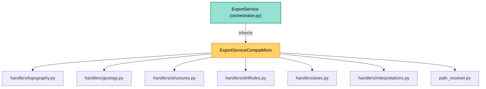

---
tags:
  - secinterp
  - code-walkthrough
  - core
  - export
  - compat
aliases:
  - compat.py
  - ExportServiceCompatMixin
cssclass: secinterp-note
---

# `core/services/export/compat.py`

> [!abstract] One-line summary
> Backward-compatibility **mixin** that preserves the old `_export_*` private API of `ExportService`, delegating each wrapper to the matching handler in `handlers/` without coupling QGIS types.

**Path**: `core/services/export/compat.py` (129 lines)
**Main class**: `ExportServiceCompatMixin`
**Layer**: Core (QGIS-agnostic, QGIS types crossing as `Any`)
**Tags**: #secinterp #core #export #compat

---

## 🎯 Why does this file exist?

When the export logic was reorganized into module-level handlers (`topography.py`,
`geology.py`, …), old tests and code still called the private `_export_*` methods of
`ExportService`. This mixin freezes that API so existing consumers keep working:

| Problem | Solution |
|---------|----------|
| Old tests call `service._export_topography(...)` | `_export_topography` wrapper delegating to `topography.export_topography` |
| The public API moved from private methods to module functions | Mixin adapts the old signature to the new one |
| Avoid heavy/circular imports at load time | **Lazy** imports inside each method |
| Reach `controller`/`access_control` without inheriting anything | Mixin assumes attributes supplied by the host (`ExportService`) |

> [!important] Architectural note
> It is a **compatibility shim** (Mixin/Trait). It defines no `__init__` and no state:
> it relies on the host class (`ExportService`, in `orchestrator.py`) providing
> `self.controller` and `self.access_control`. Hence each use carries `# type: ignore[attr-defined]`.

---

## 🧬 Relationship diagram



> [!tip] How to read
> Solid arrow = imports/delegates. `ExportService` **mixes in** the trait; the mixin's
> `_export_*` methods **delegate** to module functions in `handlers/` and `path_resolver`.

---

## 📦 Imports — architectural reading

```python
# core/services/export/compat.py
"""Backward compatibility wrappers for ExportService private API."""

from __future__ import annotations

from pathlib import Path
from typing import Any
```

```python
# lazy imports inside each method (not at the top)
from sec_interp.core.services.export.handlers import topography as topo_h
from sec_interp.core.services.export.handlers import geology as geo_h
from sec_interp.core.services.export.handlers import structures as struct_h
from sec_interp.core.services.export.handlers import drillholes as dh_h
from sec_interp.core.services.export.handlers import axes as axes_h
from sec_interp.core.services.export.handlers import interpretations as interp_h
from sec_interp.core.services.export.path_resolver import get_profile_name, resolve_export_path
```

| # | Observation |
|---|-------------|
| ① | Minimal header: only `Path` and `Any`. Zero `qgis.*`, zero coupling. |
| ② | All handler and `path_resolver` imports are **local** (inside the method body). |
| ③ | QGIS types (`crs`, `csv_exporter`, `line_layer`) cross as `Any` — clean boundary. |
| ④ | The `Any | None` on `settings` reflects that export configuration is optional. |

> [!note] Lazy imports = deferred coupling
> Importing handlers *inside* the method means `compat.py` does not drag in the
> `exporters`/`handlers` graph when the package is imported. Same technique used by
> `orchestrator.py` in `_orchestrate_exports`.

---

## 🏗️ Structure inventory

**Classes:** `class ExportServiceCompatMixin` — 7 methods, no state, no `__init__`.

**Functions/Methods (all delegating):**
- `_export_topography(folder, data, crs, csv_exporter, msg, settings, ext)` → `topography.export_topography`
- `_export_geology(folder, data, crs, csv_exporter, msg, settings, ext)` → `geology.export_geology`
- `_export_structures(folder, data, raster_layer, crs, csv_exporter, msg, options, settings, ext)` → `structures.export_structures`
- `_export_drillholes(folder, data, crs, msg, settings, ext)` → `drillholes.export_drillholes`
- `_export_axes(folder, data, crs, msg, settings, ext)` → `axes.export_axes`
- `_export_interpretations(folder, data, line_layer, crs, msg, settings, ext)` → `interpretations.export_interpretations`
- `_get_export_path(folder, base_name, settings, ext)` → `resolve_export_path` (via `get_profile_name`)

**Assumed attributes (from the host):**
- `self.controller` — `ProfileController` (or `None`), for `get_profile_name`.
- `self.access_control` — `AccessControlService`, for the 3D gate on interpretations.

---

## 📁 Files in the package

| File | Lines | Role |
|---|--:|---|
| `__init__.py` | 9 | Re-exports `ExportService`, `create_map_settings`, `get_profile_name`, `resolve_export_path` |
| `orchestrator.py` | 207 | `ExportService` — facade that **inherits** this mixin |
| `compat.py` | 129 | `ExportServiceCompatMixin` — legacy `_export_*` wrappers |
| `path_resolver.py` | 60 | `get_profile_name` / `resolve_export_path` |
| `map_settings_factory.py` | 34 | `create_map_settings` — isolates the `qgis.core` import |
| `handlers/` | ~490 | Seven per-entity export handlers |

---

## 📖 Method-by-method walkthrough

### `_export_topography`

```python
def _export_topography(
    self, folder: Path, data: list[tuple], crs: Any, csv_exporter: Any,
    msg: list[str], settings: Any | None = None, ext: str = ".shp",
) -> None:
    from sec_interp.core.services.export.handlers import topography as topo_h
    topo_h.export_topography(
        folder, data, crs, csv_exporter, msg, self.controller, settings, ext
    )  # type: ignore[attr-defined]
```

Adapts the old signature to `topography.export_topography`, injecting `self.controller`
as the second-to-last argument. The simplest wrapper: the first six parameters are
copied verbatim, `controller` is supplied by the host.

### `_export_geology`

```python
def _export_geology(
    self, folder: Path, data: list[Any] | None, crs: Any, csv_exporter: Any,
    msg: list[str], settings: Any | None = None, ext: str = ".shp",
) -> None:
    from sec_interp.core.services.export.handlers import geology as geo_h
    geo_h.export_geology(folder, data, crs, csv_exporter, msg, self.controller, settings, ext)  # type: ignore[attr-defined]
```

Delegates to `geology.export_geology`. `data` is `list[Any] | None` (a list of
`GeologySegment`); when empty, the handler returns without writing anything.

### `_export_structures`

```python
def _export_structures(
    self, folder: Path, data: list[Any] | None, raster_layer: Any | None,
    crs: Any, csv_exporter: Any, msg: list[str],
    options: dict[str, Any] | None = None, settings: Any | None = None,
    ext: str = ".shp",
) -> None:
    from sec_interp.core.services.export.handlers import structures as struct_h
    struct_h.export_structures(
        folder, data, raster_layer, crs, csv_exporter, msg,
        options or {}, self.controller, settings, ext,  # type: ignore[attr-defined]
    )
```

The wrapper with the most parameters: adds `raster_layer` and `options`. Normalizes
`options or {}` before delegating, so the handler always receives a dict.

### `_export_drillholes`

```python
def _export_drillholes(
    self, folder: Path, data: list[Any] | None, crs: Any,
    msg: list[str], settings: Any | None = None, ext: str = ".shp",
) -> None:
    from sec_interp.core.services.export.handlers import drillholes as dh_h
    dh_h.export_drillholes(folder, data, crs, msg, self.controller, settings, ext)  # type: ignore[attr-defined]
```

Delegates to `drillholes.export_drillholes` (2D traces + intervals). Note it receives no
`csv_exporter`: drillholes are exported as vectors only, not CSV.

### `_export_axes`

```python
def _export_axes(
    self, folder: Path, data: list[tuple], crs: Any,
    msg: list[str], settings: Any | None = None, ext: str = ".shp",
) -> None:
    from sec_interp.core.services.export.handlers import axes as axes_h
    axes_h.export_axes(folder, data, crs, msg, self.controller, settings, ext)  # type: ignore[attr-defined]
```

Delegates to `axes.export_axes` (profile axes). Vector only, no CSV.

### `_export_interpretations`

```python
def _export_interpretations(
    self, folder: Path, data: list[Any] | None, line_layer: Any, crs: Any,
    msg: list[str], settings: Any | None = None, ext: str = ".shp",
) -> None:
    from sec_interp.core.services.export.handlers import interpretations as interp_h
    interp_h.export_interpretations(
        folder, data, line_layer, crs, msg,
        self.controller, settings, ext, self.access_control,  # type: ignore[attr-defined]
    )
```

The only wrapper that passes **two** host attributes: `self.controller` and
`self.access_control`. The latter toggles 3D export based on permissions.

### `_get_export_path`

```python
def _get_export_path(
    self, folder: Path, base_name: str, settings: Any | None, ext: str,
) -> tuple[Path, str]:
    from sec_interp.core.services.export.path_resolver import (
        get_profile_name, resolve_export_path,
    )
    profile_name = get_profile_name(self.controller)  # type: ignore[attr-defined]
    pattern = getattr(settings, "naming_pattern", None) if settings else None
    return resolve_export_path(folder, base_name, profile_name, pattern, ext)
```

The only wrapper that **returns** something: the `(physical_path, logical_name)` tuple.
Derives `profile_name` from the controller, extracts `naming_pattern` from `settings`
(if present), delegating the final composition to `resolve_export_path`.

---

## 🤝 Implicit contract with the host

The mixin does not work alone: it depends on `ExportService` (the host) defining two
attributes. Since Python resolves attributes via **MRO** (Method Resolution Order), the
mixin reaches `self.controller` and `self.access_control` even though it never declares
them:

| Attribute | Who defines it | What it gives the wrappers |
|-----------|----------------|----------------------------|
| `self.controller` | `ExportService.__init__` | `get_profile_name(...)` in `_get_export_path` |
| `self.access_control` | `ExportService.__init__` | 3D gate in `_export_interpretations` |

```python
# host in orchestrator.py
class ExportService(ExportServiceCompatMixin):
    def __init__(self, controller: Any | None = None) -> None:
        self.controller = controller          # ← consumed by the mixin
        self.access_control = AccessControlService()  # ← consumed by the mixin
```

> [!warning] Coupling by convention
> The mixin **assumes** the host has those attributes; if mixed into another class
> without `controller`/`access_control`, it would fail at runtime (`AttributeError`).
> The `# type: ignore[attr-defined]` comments document that the type checker cannot see them.

> [!tip] Mixin or normal inheritance?
> A mixin is used because `ExportService` must already inherit its own hierarchy, and the
> legacy API is **optional**: the trait is mixed in only where tests require it, without
> forcing an "is-a" relationship between the host and the compatibility layer.

---

## 🔄 Data flow

| Phase | Input | Transformation | Output |
|-------|-------|----------------|--------|
| Legacy call | `service._export_topography(folder, data, crs, …)` | Wrapper injects `self.controller` | `topo_h.export_topography(...)` |
| Delegation | `(folder, data, crs, csv_exporter, msg)` | `options or {}`, reorder args | handler in `handlers/` |
| Path resolution | `(folder, base_name, settings, ext)` | `get_profile_name` + `naming_pattern` | `(Path, str)` from `resolve_export_path` |
| Writing | handler → `exporter.export(...)` | `CSVExporter` / `*VectorExporter` | CSV/SHP/GPKG/DXF files |

> [!note] The mixin writes nothing
> `compat.py` **produces no files**: it only reroutes calls. Real writing lives in
> `exporters/` and the handlers. See [[core_services_export_handlers]].

---

## 🏛️ Design patterns present

| Pattern | Where | Purpose |
|---------|-------|---------|
| **Mixin / Trait** | `ExportServiceCompatMixin` | Add the legacy API without deep inheritance |
| **Adapter (shim)** | each `_export_*` | Translate the old signature to the new module function |
| **Facade delegation** | wrappers → `handlers/*` | Hide the handler graph behind a single call |
| **Lazy import / deferred DI** | local imports | Avoid heavy dependencies at load time |
| **Compatibility layer** | whole module | Keep the private API stable for old tests |

---

## 🧾 API summary

| Symbol | Signature / Inherits | Typical use |
|--------|----------------------|-------------|
| `ExportServiceCompatMixin` | `(object)` | Mixin base; no state |
| `_export_topography` | `(folder, data, crs, csv_exporter, msg, settings=None, ext=".shp") -> None` | Export topographic profile (legacy) |
| `_export_geology` | `(folder, data, crs, csv_exporter, msg, settings=None, ext=".shp") -> None` | Export geology (legacy) |
| `_export_structures` | `(folder, data, raster_layer, crs, csv_exporter, msg, options=None, settings=None, ext=".shp") -> None` | Export structures (legacy) |
| `_export_drillholes` | `(folder, data, crs, msg, settings=None, ext=".shp") -> None` | Export 2D drillholes (legacy) |
| `_export_axes` | `(folder, data, crs, msg, settings=None, ext=".shp") -> None` | Export axes (legacy) |
| `_export_interpretations` | `(folder, data, line_layer, crs, msg, settings=None, ext=".shp") -> None` | Export 2D/3D interpretations (legacy) |
| `_get_export_path` | `(folder, base_name, settings, ext) -> tuple[Path, str]` | Resolve output path and layer name |

---

## 🛡️ Error handling

The mixin **catches no exceptions**: it lets them propagate to the caller.

- The handlers (`topography.py`, `geology.py`, …) already wrap their failures in
  `ExportError` (via `raise … from e`), so the error reaches the test or GUI typed.
- `_export_interpretations` may return **without doing anything** if `data` is empty
  (the handler early-returns) — no exception raised.
- `get_profile_name(self.controller)` is tolerant: if `controller` is `None` or lacks
  `settings.section.layer_name`, it returns `"profile"` instead of failing.

> [!tip] No `try/except` = clean propagation
> The absence of handling is deliberate: the shim must not mask the real error type. The
> `SecInterpError → ExportError` hierarchy (see [[exceptions]]) does the rest.

---

## 🧪 Associated tests

The wrappers are exercised directly and indirectly in `tests/core/test_export_service.py`:

- `test_export_data_minimal` — topography + axes flow (uses `_export_topography`/`_export_axes` via `export_data`).
- `test_export_data_all_types` — geology, structures, drillholes, interpretations.
- `test_export_topography_error` — calls `self.service._export_topography(...)` directly and asserts `ExportError`.
- `test_export_geology_error` / `test_export_structures_error` / `test_export_drillholes_error` — per-entity failure paths.

> [!note] Why this mixin exists as a "test API"
> `test_export_topography_error` invokes `service._export_topography` to isolate
> topography without going through `export_data`. The mixin preserves that entry point.

---

## 👀 Observations and notes

> [!success] Strengths
> - **Lazy** imports: does not drag the exporter graph when importing the package.
> - Stable signature for old tests: no breaking change.
> - No state of its own: trivial to compose and test.
> - 100% delegation: no duplicated write logic.

> [!warning] Points of attention
> - **Implicit** coupling: assumes `self.controller` and `self.access_control` (defined by the host).
> - The `# type: ignore[attr-defined]` comments hide that dependency from the type checker.
> - Signature duplication: each wrapper repeats the handler's parameters.
> - It is "legacy": if tests migrate to `export_data`, the mixin could be removed.

> [!question] Open questions
> - Migrate the tests to `export_data` and retire the mixin (and `_export_*`) entirely?
> - Type `self.controller` as `ProfileController | None` instead of `Any`?
> - Collapse `_export_*` into a single generic `_delegate(handler, *args)` method?

---

## 🔗 Related notes

- [[Index]] — vault index
- [[orchestrator]] — `ExportService`, the host class that inherits this mixin
- [[path_resolver]] — `get_profile_name` / `resolve_export_path` used by `_get_export_path`
- [[core_services_export_handlers]] — the `handlers/` package each wrapper delegates to
- [[core_services_export]] — the `export/` package (re-exports from `__init__.py`)
- [[controller]] — source of `self.controller` (profile data)
- [[dtos]] — `PreviewParams`, which feeds `export_data` in [[orchestrator]]
- [[exceptions]] — `ExportError` / `DataMissingError` propagated by the handlers

---

*Note of the SecInterp Code Walkthrough v2 vault — v3.9.0*
