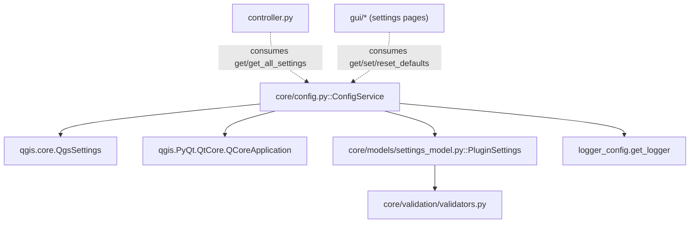

---
tags:
  - secinterp
  - code-walkthrough
  - core
  - config
aliases:
  - config.py
  - ConfigService
cssclass: secinterp-note
---

# `core/config.py`

> [!abstract] One-line summary
> `ConfigService` is the plugin's **persistence adapter**: it wraps `QgsSettings`, centralizes defaults, applies type coercion (especially string booleans) and returns a validated `PluginSettings`.

**Path**: `core/config.py` (253 lines)
**Main class/function**: `ConfigService`
**Layer**: Core (with a documented QGIS *gray area*)
**Tags**: #secinterp #core #config

---

## 🎯 Why does this file exist?

Plugin configuration lives in `QgsSettings` (QGIS's persistent registry), but the rest of
the core wants a **validated, typed object**, not dozens of scattered `get()` calls.
`ConfigService` resolves the tension between the two worlds:

| Problem | Solution |
|---------|----------|
| `QgsSettings` keys are fragile, scattered strings | `PREFIX = "SecInterp/"` + `get`/`set` methods |
| Defaults ("magic numbers") repeat everywhere | `DEFAULT_*` class constants |
| `QgsSettings` returns `"true"`/`"false"` as strings | Explicit coercion to `bool` in `get()` |
| The core wants a typed model, not a raw dict | `_load_from_qgs_settings()` → `PluginSettings.from_dict()` |
| Reloading everything on every access is expensive | Internal cache `_current_settings`, invalidated on `set()` |

> [!important] Architectural note — gray area
> Unlike the rest of the core (which must be 100% QGIS-agnostic per `core/AGENTS.md`),
> `config.py` **does import QGIS**: `QgsSettings` and `QCoreApplication` (for `tr()`).
> This is an explicit, reasonable exception: configuration is by nature a port to QGIS's
> storage. See the imports section for the honest analysis of this boundary.

---

## 🧬 Relationship diagram



> [!tip] How to read
> Solid arrow = imports; dashed = consumed by. `ConfigService` depends on the QGIS world
> (left) and on the `PluginSettings` model (which itself delegates validation to
> `validators.py`). The GUI and `controller` use it as the **single door** to persistent
> configuration.

---

## 📦 Imports — architectural reading

```python
# core/config.py
from __future__ import annotations

from typing import Any

from qgis.core import QgsSettings
from qgis.PyQt.QtCore import QCoreApplication

from sec_interp.core.models.settings_model import PluginSettings
from sec_interp.logger_config import get_logger

logger = get_logger(__name__)
```

| # | Observation |
|---|-------------|
| ① | `QgsSettings` — direct QGIS dependency: the real persistence source. |
| ② | `QCoreApplication.translate` — only for `tr()`; annotated `# type: ignore[no-any-return]`. |
| ③ | `PluginSettings` — the typed output DTO consumed by the rest of the core. |
| ④ | `get_logger(__name__)` — per-module logger, no third-party deps. |

> [!warning] The exception to the QGIS-agnostic rule
> `core/AGENTS.md` forbids `from qgis.core import *` in `/core`. `config.py` imports
> `QgsSettings` **explicitly and narrowly**, not `import *`. It is an intentional *gray
> area*: persistent configuration is, by definition, a port toward QGIS. Other core
> modules **must not** imitate this exception.

---

## 🏗️ Structure inventory

**Classes:** `class ConfigService` — 7 methods

**Class constants:**
- `PREFIX = "SecInterp/"` — prefix of every key.
- `DEFAULT_SCALE = 50000.0`, `DEFAULT_BUFFER_DIST = 100.0`, `DEFAULT_VERT_EXAG = 1.0`
- `DEFAULT_DPI = 300`, `DEFAULT_MAX_POINTS = 10000`, `DEFAULT_DEM_BAND = 1`
- `DEFAULT_SAMPLING_INTERVAL = 10.0`, `DEFAULT_EXPORT_QUALITY = 95`
- `DEFAULT_PREVIEW_WIDTH = 800`, `DEFAULT_PREVIEW_HEIGHT = 600`

**Non-persistent constants (supported formats):**
- `SUPPORTED_IMAGE_FORMATS = [".png", ".jpg", ".jpeg"]`
- `SUPPORTED_VECTOR_FORMATS = [".shp"]`
- `SUPPORTED_DOCUMENT_FORMATS = [".pdf", ".svg"]`

**Methods:**
- `__init__()`, `get_all_settings(reload=False)`, `tr(message)`
- `_load_from_qgs_settings()`, `get(key, default=None)`, `set(key, value)`, `reset_defaults()`

---

## 📁 Files in the package

- `config.py` — individual note for this file (root module, not a package).

---

## 📖 Method-by-method walkthrough

### `__init__()`

```python
def __init__(self) -> None:
    self.settings = QgsSettings()
    self._current_settings: PluginSettings | None = None
```

Creates the `QgsSettings` instance (no prefix: the prefix is applied in `get`/`set`) and
the internal cache `_current_settings`. The cache starts at `None` to force the first
lazy read in `get_all_settings()`.

> [!tip] Lazy cache
> `_current_settings` is only populated on the first `get_all_settings()` call. `set()`
> invalidates it (`None`), so the next read reloads from disk.

### `get_all_settings(reload=False)`

```python
def get_all_settings(self, reload: bool = False) -> PluginSettings:
    if reload or self._current_settings is None:
        self._current_settings = self._load_from_qgs_settings()
    return self._current_settings
```

Main entry point. Returns the full `PluginSettings`, reading from `QgsSettings` only when
a reload is requested or the cache is empty. This is the method the `controller` and the
settings pages consume.

### `tr(message)`

```python
def tr(self, message: str) -> str:
    return QCoreApplication.translate("ConfigService", message)  # type: ignore[no-any-return]
```

Translates messages (logs and errors) using the `"ConfigService"` context. It is one of
the two reasons this module imports QGIS. The `# type: ignore` silences the
`str | None` return of `QCoreApplication.translate`.

### `_load_from_qgs_settings()`

```python
def _load_from_qgs_settings(self) -> PluginSettings:
    data = {}
    data["section"] = {"layer_id": self.get("section_layer", ""), ...}
    data["dem"] = {"layer_id": ..., "band": ..., "scale": ..., "vert_exag": ..., "auto_vert_exag": ...}
    data["geology"] = {...}
    data["structure"] = {...}
    data["drillhole"] = {...}
    # Interpretation (JSON parse for custom_fields)
    data["interpretation"] = {...}
    data["preview"] = {...}
    data["export"] = {...}
    data["last_output_dir"] = self.get("last_output_dir", "")
    try:
        return PluginSettings.from_dict(data)
    except (ValueError, TypeError, KeyError):
        logger.exception(self.tr("Failed to validate settings during load. Using defaults."))
        return PluginSettings()
```

Builds a **nested dict with 8 categories** (plus `last_output_dir`) and validates it
through `PluginSettings.from_dict()`. This is the configuration "Extract": it transforms
flat `QgsSettings` keys into a typed model.

| Category | Key fields |
|----------|------------|
| `section` | `layer_id`, `layer_name`, `buffer_dist` |
| `dem` | `layer_id`, `layer_name`, `band`, `scale`, `vert_exag`, `auto_vert_exag` |
| `geology` | `layer_id`, `layer_name`, `field` |
| `structure` | `layer_id`, `layer_name`, `dip_field`, `strike_field`, `dip_scale_factor` |
| `drillhole` | 3 blocks (collar/survey/interval) + 4 `export_3d_*` flags |
| `interpretation` | `inherit_geol`, `inherit_drill`, `custom_fields` (JSON) |
| `preview` | 5 `show_*` flags, `auto_lod`, `adaptive_sampling`, `max_points` |
| `export` | `default_format`, `naming_pattern`, `overwrite_existing` |

> [!note] `custom_fields` is JSON
> The `interpretation` block does `json.loads(self.get("interp_custom_fields", "[]"))`
> inside a `try/except (ValueError, TypeError)` that degrades to `[]` if the JSON is
> corrupt. A local `import json` avoids loading the module unless needed.

### `get(key, default=None)`

```python
def get(self, key: str, default: Any = None) -> Any:
    full_key = self.PREFIX + key
    static_defaults = { ... }          # 20+ keys -> default value
    if default is None:
        default = static_defaults.get(key)
    value = self.settings.value(full_key, None)
    if value is None:
        value = self.settings.value("/SecInterp/" + key, default)
    if isinstance(value, str):
        if value.lower() == "true":
            return True
        if value.lower() == "false":
            return False
    return value
```

Low-level read. Four-step logic:

1. **Prefix** — `full_key = "SecInterp/" + key`.
2. **Default** — if no `default` passed, look it up in `static_defaults` (an internal map
   of 20+ keys with their `DEFAULT_*` values).
3. **Double read** — first `SecInterp/key`; if `None`, retry with the old prefix
   `"/SecInterp/" + key` (backward compatibility with previous versions).
4. **Bool coercion** — converts `"true"`/`"false"` strings to `True`/`False`.

> [!important] `static_defaults` and `DEFAULT_*` coexist
> There are two default mechanisms: the `DEFAULT_*` constants (used in
> `_load_from_qgs_settings`) and the `static_defaults` dict (used in `get`). It is a minor
> design overlap that should be kept in sync.

### `set(key, value)`

```python
def set(self, key: str, value: Any) -> None:
    full_key = self.PREFIX + key
    self.settings.setValue(full_key, value)
    self.settings.sync()
    self._current_settings = None
    logger.debug(f"Config set: {full_key} = {value}")
```

Persists the value, forces `sync()` (immediate disk write) and **invalidates the cache**
(`_current_settings = None`). The next read therefore reloads from the registry.

### `reset_defaults()`

```python
def reset_defaults(self) -> None:
    logger.info(self.tr("Configuration reset to defaults initiated"))
    self.set("scale", self.DEFAULT_SCALE)
    self.set("vert_exag", self.DEFAULT_VERT_EXAG)
    ...
    self.set("dem_band", self.DEFAULT_DEM_BAND)
```

Resets ~16 persistent keys to their defaults by calling `set()` (which already invalidates
the cache and syncs). It is the configuration "reset button".

---

## 📐 Key and default reference

The `static_defaults` dict (inside `get()`) centralizes the defaults of 24 keys. It is the
canonical "key → default value" map when `QgsSettings` has no persisted value:

| Key | Default | Type |
|-----|--------:|------|
| `scale` | `50000.0` | float |
| `vert_exag` | `1.0` | float |
| `auto_vert_exag` | `True` | bool |
| `buffer_dist` | `100.0` | float |
| `dip_scale_factor` | `1.0` | float |
| `last_output_dir` | `""` | str |
| `dpi` | `300` | int |
| `preview_width` | `800` | int |
| `preview_height` | `600` | int |
| `sampling_interval` | `10.0` | float |
| `export_quality` | `95` | int |
| `auto_lod` | `True` | bool |
| `max_preview_points` | `10000` | int |
| `max_points` | `10000` | int |
| `dh_use_geom` | `True` | bool |
| `interp_inherit_geol` | `True` | bool |
| `interp_inherit_drill` | `True` | bool |
| `show_topo` | `True` | bool |
| `show_geol` | `True` | bool |
| `show_struct` | `True` | bool |
| `show_drillholes` | `True` | bool |
| `show_interpretations` | `True` | bool |
| `adaptive_sampling` | `True` | bool |
| `dem_band` | `1` | int |

> [!warning] `static_defaults` ↔ `DEFAULT_*` overlap
> Several keys have **two** default sources: the `DEFAULT_*` constant (e.g.
> `DEFAULT_SCALE = 50000.0`) and the `static_defaults` dict (e.g. `"scale": 50000.0`). The
> value must match; otherwise `get()` and `_load_from_qgs_settings()` could diverge. Some
> keys live only in `static_defaults` (e.g. `dpi`, `preview_width`, `preview_height`) and
> lack their own `DEFAULT_*` constant despite `DEFAULT_DPI`, `DEFAULT_PREVIEW_WIDTH` and
> `DEFAULT_PREVIEW_HEIGHT` existing — another sign of the dual table.

---

## 🌐 i18n and migration notes

- **Translation**: log/error messages pass through `self.tr(...)` with the `"ConfigService"`
  context. Configuration keys are **not** translated (they are identifiers).
- **Backward compatibility**: `get()` retries with the old prefix `"/SecInterp/" + key` if
  the new `"SecInterp/key"` returns `None`. Allows migrating from previous versions.
- **Bool coercion**: `QgsSettings` sometimes stores booleans as `"true"`/`"false"`; `get()`
  normalizes them. It is the most common bug source if forgotten.
- **Explicit `sync()`**: `set()` calls `QgsSettings.sync()` to persist immediately; in tests
  `QgsSettings` is mocked to avoid touching disk.

---

## 🔄 Data flow

| Phase | Input | Transformation | Output |
|-------|-------|----------------|--------|
| Read | `QgsSettings` (flat keys) | `get(key, default)` + bool coercion | primitive values |
| Validation | nested dict (8 categories) | `PluginSettings.from_dict()` + `validate_and_clamp` | `PluginSettings` |
| Cache | `_current_settings is None` | `_load_from_qgs_settings()` | cached `PluginSettings` |
| Write | `set(key, value)` | `setValue` + `sync` + invalidate cache | persistence |

---

## 🏛️ Design patterns present

| Pattern | Where | Purpose |
|---------|-------|---------|
| **Adapter (Extract)** | `ConfigService` over `QgsSettings` | Adapt QGIS's registry to a typed model |
| **Service** | `ConfigService` | Single door to configuration |
| **Cache-aside (lazy)** | `_current_settings` | Avoid re-reading the registry on every access |
| **Default object / Coalesce** | `get()` with `static_defaults` | Centralized defaults |
| **Type coercion** | `get()` (`"true"`→`bool`) | Normalize types that `QgsSettings` degrades |

---

## 🧾 API summary

| Symbol | Signature / Inherits | Typical use |
|--------|----------------------|-------------|
| `ConfigService.__init__` | `() -> None` | Instantiate the service |
| `ConfigService.get_all_settings` | `(reload=False) -> PluginSettings` | Get the full validated configuration |
| `ConfigService.get` | `(key, default=None) -> Any` | Read a key with a default |
| `ConfigService.set` | `(key, value) -> None` | Persist a key |
| `ConfigService.reset_defaults` | `() -> None` | Restore defaults |
| `ConfigService.tr` | `(message) -> str` | Translate internal messages |
| `ConfigService._load_from_qgs_settings` | `() -> PluginSettings` | Extract `QgsSettings` → model |

---

## 🛡️ Error handling

| Situation | Behavior |
|-----------|----------|
| Corrupt `custom_fields` JSON | `except (ValueError, TypeError)` → `[]` |
| `PluginSettings.from_dict` fails | `except (ValueError, TypeError, KeyError)` → default `PluginSettings()` |
| Key not found | `get()` returns `default` (or `None`) |

> [!note] Silent degradation on load
> If validation fails, it is logged with `logger.exception` and a fresh `PluginSettings()`
> is returned (defaults). The plugin never crashes because of a corrupt configuration; it
> simply starts with defaults.

---

## 🧪 Associated tests

Pure cases (mocking `QgsSettings`), mapped to `tests/core/test_config.py` and
`tests/core/test_config_integration.py`:

- `test_get_default` — missing key returns the default (`50000.0` for `scale`).
- `test_get_explicit_default` — explicit default takes priority.
- `test_set_value` — `set("scale", 200.0)` → `setValue("SecInterp/scale", 200.0)`.
- `test_reset_defaults` — restores `scale` and `vert_exag`.
- `test_auto_vert_exag_default` / `test_reset_auto_vert_exag` — Auto VE toggle.
- `test_get_all_settings_mapping` — type coercion (`"10000"`→float, `"false"`→bool).
- `test_cache_invalidation` — `set()` sets `_current_settings` to `None`.
- `test_auto_vert_exag_roundtrip` — `"false"` persists as `False`.

---

## 👀 Observations and notes

> [!success] Strengths
> - Single door to configuration: avoids scattered keys across the code.
> - String-bool coercion solves the classic `QgsSettings` limitation.
> - Lazy cache with explicit invalidation on `set()`.
> - Degrades to defaults on corrupt configuration.

> [!warning] Points of attention
> - **Documented violation** of the QGIS-agnostic rule (`QgsSettings` + `QCoreApplication`).
> - Dual default mechanism (`DEFAULT_*` + `static_defaults`) that must be kept in sync.
> - `reset_defaults()` does not cover every key (only ~16 of 20+).
> - Local `import json` inside `_load_from_qgs_settings`.

> [!question] Open questions
> - Move persistence to a `SettingsRepository` `Protocol` (like `ICacheService`) so
>   `QgsSettings` can be mocked without `patch`, approaching the QGIS-agnostic rule?
> - Unify `DEFAULT_*` and `static_defaults` into a single defaults table?
> - Extend `reset_defaults()` to cover 100% of the keys?

---

## 🔗 Related notes

- [[Index]] — vault index
- [[settings_model]] — `PluginSettings` (the model produced by `from_dict`)
- [[core_models]] — the `core/models/` namespace
- [[data_cache]] — another core service with `tr()` via `QCoreApplication`
- [[controller]] — consumer of `get_all_settings()`
- [[core_validation]] / [[validators]] — `validate_and_clamp` used by `PluginSettings`
- [[exceptions]] — error hierarchy (here it degrades to defaults instead of raising)

---

*Note of the SecInterp Code Walkthrough v2 vault — v3.8.0*
