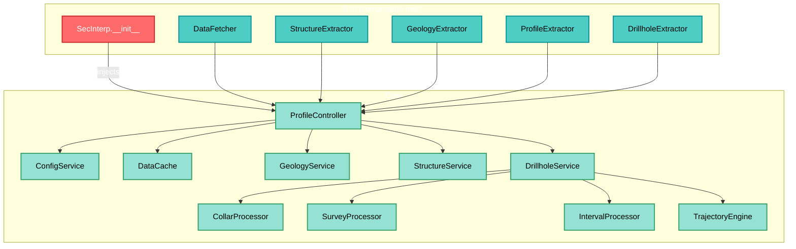
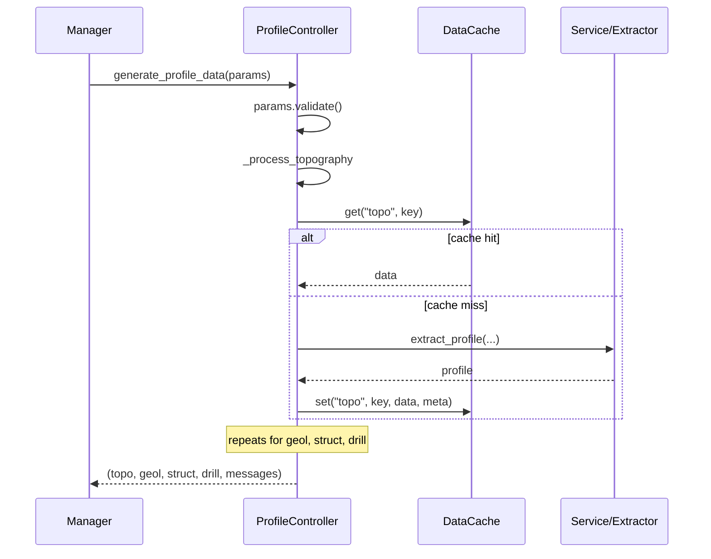

---
tags:
  - secinterp
  - code-walkthrough
  - core
  - orchestrator
  - caching
  - di
aliases:
  - controller.py
  - ProfileController
cssclass: secinterp-note
note_lines: 700
---

# `core/controller.py`

> [!abstract] One-line summary
> The central core orchestrator: coordinates the four domains (topography, geology, structures, drillholes) with **injected adapters** and a **per-component granular cache**, returning a unified result tuple.

**Path**: `core/controller.py` (425 lines)
**Main class**: `ProfileController(TranslatableMixin)`
**Layer**: Core (QGIS-agnostic)
**Tags**: #secinterp #core #orchestrator #caching #di

---

## 🎯 Why does this file exist?

Without a single orchestration point, each domain would be invoked separately and the
GUI would need to know the details of every service. The controller centralises:

| Problem | Solution |
|---------|----------|
| Coordinate 4 data domains with one call | `generate_profile_data(params)` |
| Avoid recomputing unchanged data | Granular cache per namespace (`topo`, `geol`, `struct`, `drill`) |
| Not couple the core to QGIS | Extractors injected via constructor (DI) |
| Accumulate UI state without Qt | `messages` list returned at the end |

> [!important] QGIS-agnostic verified
> `controller.py` imports nothing from `qgis.*`. All layer interaction happens via the
> injected extractors (`gui/adapters/*`) and the pure services. It is the
> **Extract-then-Compute** pattern in its most explicit form.

---

## 🧬 Orchestration architecture



---

## 📦 Imports — architectural reading

```python
import hashlib
import time
from typing import Any

from sec_interp.core.config import ConfigService          # ①
from sec_interp.core.data_cache import DataCache
from sec_interp.core.domain import (                       # ②
    DrillholeProjection, GeologySegment, PreviewParams, StructureMeasurement,
)
from sec_interp.core.exceptions import ProcessingError
from sec_interp.core.utils.i18n import TranslatableMixin
from sec_interp.core.utils.safe_loader import SafeLoader
from sec_interp.logger_config import get_logger
```

| # | Observation |
|---|-------------|
| ① | Only stdlib + internal core dependencies. **Zero `qgis.*`**. |
| ② | The domain DTOs (`PreviewParams`, `GeologySegment`…) define the data contracts. |

---

## 🏗️ Structure inventory

**Classes:** `class ProfileController(TranslatableMixin)` — 13 methods

**Functions/Methods:**
- `__init__(data_fetcher, structure_extractor, geology_extractor, profile_extractor, drillhole_extractor)`
- `reload_settings()`
- `get_cached_data(inputs)` / `cache_data(inputs, data)`
- `generate_profile_data(params)`
- `_get_cache_sub_key(param_values)`
- `_process_topography(...)`, `_process_geology(...)`, `_process_structures(...)`, `_process_drillholes(...)`

---

## 📖 Method-by-method walkthrough

### `__init__` — Dependency injection

```python
def __init__(
    self,
    data_fetcher=None,
    structure_extractor=None,
    geology_extractor=None,
    profile_extractor=None,
    drillhole_extractor=None,
) -> None:
```

Receives the five adapters from the composition root (GUI) and stores them as
attributes. Instantiates `ConfigService` and `DataCache` directly (core's own
dependencies) and then **lazily loads** the services/processors:

```python
self.collar_processor   = SafeLoader.lazy_load("...collar_processor", "CollarProcessor")
self.survey_processor   = SafeLoader.lazy_load("...survey_processor", "SurveyProcessor")
self.interval_processor = SafeLoader.lazy_load("...interval_processor", "IntervalProcessor")
self.trajectory_engine  = SafeLoader.lazy_load("...trajectory_engine", "TrajectoryEngine")

self.geology_service  = SafeLoader.lazy_load("...geology_service", "GeologyService")
self.structure_service = SafeLoader.lazy_load("...structure_service", "StructureService")
self.drillhole_service = SafeLoader.lazy_load(
    "...drillhole_service", "DrillholeService",
    collar_processor=self.collar_processor,
    survey_processor=self.survey_processor,
    interval_processor=self.interval_processor,
    data_fetcher=self.data_fetcher,
    trajectory_engine=self.trajectory_engine,
)
```

> [!tip] Service composition
> `DrillholeService` receives its 4 collaborators by constructor (Facade). See
> [[drillhole_service]] for the sub-system breakdown.

> [!note] `data_fetcher` crosses layers
> The `DataFetcher` (GUI) is passed **twice**: to the controller and to
> `DrillholeService`. It is the lowest-level adapter for obtaining features from QGIS.

### `reload_settings`

```python
def reload_settings(self) -> None:
    self.settings = self.config_service.get_all_settings(reload=True)
```

Forces a settings reload from `ConfigService` (QgsSettings). Called at the end of
`__init__` and when the GUI detects a configuration change.

### `get_cached_data` / `cache_data` — legacy public API

```python
def get_cached_data(self, inputs: dict[str, Any]) -> dict[str, Any] | None:
    cache_key = self.data_cache.get_cache_key(inputs)
    return self.data_cache.get("main", cache_key)
```

Public pair operating on the `main` cache namespace. It is the **legacy API**:
`generate_profile_data` uses the granular namespaces (`topo`, `geol`, `struct`, `drill`)
internally, while this pair exposes an "all-or-nothing" cache keyed by `inputs`.

### `generate_profile_data` — main orchestration

```python
def generate_profile_data(self, params: PreviewParams) -> tuple[...]:
    params.validate()
    messages: list[str] = []
    cache_meta = {"max_points": params.max_points, "canvas_width": params.canvas_width, "timestamp": time.time()}

    profile_data   = self._process_topography(params, cache_meta, messages)   # 1
    geol_data      = self._process_geology(params, cache_meta, messages)      # 2
    struct_data    = self._process_structures(params, cache_meta, messages)   # 3
    drillhole_data = self._process_drillholes(params, cache_meta, messages)   # 4

    return profile_data, geol_data, struct_data, drillhole_data, messages
```



> [!important] Per-component granular cache
> Each domain has its **own namespace**: `topo`, `geol`, `struct`, `drill` (and
> `main`). If only geology changes, topography is served from cache — not recomputed.

### `_get_cache_sub_key` — cache key

```python
def _get_cache_sub_key(self, param_values: list[Any]) -> str:
    hasher = hashlib.md5()  # nosec B324
    for val in param_values:
        if hasattr(val, "id"):
            val = val.id()
        hasher.update(str(val).encode("utf-8"))
    return hasher.hexdigest()
```

| Detail | Reason |
|--------|--------|
| **MD5** | Not security, a cache key → `# nosec B324` (Bandit) |
| `hasattr(val, "id")` | A QGIS layer is identified by its `id()`, not its `repr` |
| `str(val)` | Normalises int/float/str to text |

> [!warning] `MD5` and the security linter
> Bandit flags `hashlib.md5` as `B324`. Here it is not cryptography: it is a cache key.
> The `# nosec B324` comment documents and suppresses the alert.

### `_process_topography` — Topography (required)

```python
topo_key = self._get_cache_sub_key([params.band_num, params.max_points])
profile_data = self.data_cache.get("topo", topo_key)
if profile_data:
    logger.debug("Cache hit: Topography")
else:
    line_lyr = params.line_layer
    raster_lyr = params.raster_layer
    if not line_lyr or not raster_lyr:
        raise ProcessingError(self.tr("Required layers for topography are missing."))
    if not self.profile_extractor:
        raise ProcessingError(self.tr("Topography service failed to load."))
    profile_data = self.profile_extractor.extract_profile(line_lyr, raster_lyr, params.band_num)
    if not profile_data:
        raise ProcessingError(self.tr("No topographic profile data was generated."))
self.data_cache.set("topo", topo_key, profile_data, cache_meta)
messages.append(self.tr("✓ Data processed successfully!\n\nTopography: {0} points").format(len(profile_data)))
```

| Characteristic | Detail |
|----------------|--------|
| **Required** | Raises `ProcessingError` if layer or service is missing (unlike the rest) |
| **Key** | `[band_num, max_points]` |
| **Adapter** | `profile_extractor.extract_profile(...)` (Extract phase) |

> [!note] Why topography is "required"
> It is the section's base. Without a topographic profile there is nothing to show, so
> it fails fast instead of returning `None`.

### `_process_geology` — Geology (optional)

```python
if not params.outcrop_layer:
    return None                       # optional

geol_key = self._get_cache_sub_key([params.outcrop_layer, params.outcrop_name_field, params.band_num])
geol_data = self.data_cache.get("geol", geol_key)
if geol_data:
    messages.append(self.tr("Geology: {0} segments").format(len(geol_data)))
else:
    if not all([line_lyr, raster_lyr, outcrop_lyr]):
        return None
    if not self.geology_service or not self.geology_extractor:
        messages.append(self.tr("Geology: Service failed to load"))
        return None
    context = self.geology_extractor.extract_context(...)   # EXTRACT
    geol_data = self.geology_service.build_segments(context) # COMPUTE
```

> [!important] Explicit Extract-then-Compute pattern
> `geology_extractor.extract_context(...)` turns QGIS layers into a pure *context*;
> `geology_service.build_segments(context)` is **pure computation**. See [[geology_service]].

### `_process_structures` — Structures (optional)

```python
ctx = self.structure_extractor.extract_section_and_structures(line_lyr, struct_lyr, params.buffer_dist)
if ctx is None:
    return None

def elevation_sampler(x: float, y: float) -> float:
    return self.structure_extractor.sample_elevation(raster_lyr, x, y, params.band_num)

struct_data = self.structure_service.project_structures(
    line_points=ctx.line_points,
    struct_data=ctx.structures,
    elevation_sampler=elevation_sampler,   # ← callback injection
    line_az=ctx.line_azimuth,
    dip_field=params.dip_field,
    strike_field=params.strike_field,
)
```

> [!tip] Closure as sampling strategy
> `elevation_sampler` is a **closure** encapsulating raster access. This lets
> `structure_service.project_structures` (pure core) obtain elevations **without knowing
> QGIS**: it only calls `elevation_sampler(x, y)`. Dependency inversion in action.

### `_process_drillholes` — Drillholes (optional)

```python
if not params.collar_layer:
    return None                       # optional

drill_key = self._get_cache_sub_key([params.collar_layer, params.survey_layer, params.interval_layer, params.buffer_dist])
drillhole_data = self.data_cache.get("drill", drill_key)
if drillhole_data:
    return drillhole_data

survey_fields   = {"id": ..., "depth": ..., "azim": ..., "incl": ...}
interval_fields = {"id": ..., "from": ..., "to": ..., "lith": ...}

context = self.drillhole_extractor.extract_context(
    params.line_layer, params.buffer_dist, params.collar_layer, params.collar_id_field,
    params.collar_use_geometry, params.collar_x_field, params.collar_y_field,
    params.collar_z_field, params.collar_depth_field, params.survey_layer, survey_fields,
    params.interval_layer, interval_fields, params.raster_layer, params.band_num,
)
if context is None:
    return None

_, drillhole_data = self.drillhole_service.process_context(context)   # COMPUTE
```

| Characteristic | Detail |
|----------------|--------|
| **Key** | `[collar_layer, survey_layer, interval_layer, buffer_dist]` |
| **Fields** | Grouped into `survey_fields` / `interval_fields` dicts |
| **Return** | `process_context` returns `(something, drillhole_data)`; only the second matters |

> [!note] Why `_, drillhole_data = ...`
> `process_context` returns a tuple; `_` explicitly discards the unused part.

---

## 🔄 Data flow

| Phase | Input | Transformation | Output |
|-------|-------|----------------|--------|
| Validation | `PreviewParams` | `params.validate()` | raises `ValidationError` if invalid |
| Topography | `line_lyr`, `raster_lyr` | `extract_profile` | `list[(dist, elev)]` |
| Geology | geological context | `build_segments` | `list[GeologySegment]` |
| Structures | structural context + callback | `project_structures` | `list[StructureMeasurement]` |
| Drillholes | `DrillholeContext` | `process_context` | `list[DrillholeProjection]` |

---

## 🗄️ Cache strategy

`DataCache` is used with **namespaces** and **keys**:

| Namespace | Key | Content |
|-----------|-----|---------|
| `main` | hash of `inputs` (dict) | Full result (legacy public API) |
| `topo` | hash `[band_num, max_points]` | Topographic profile |
| `geol` | hash `[outcrop_layer, name_field, band_num]` | Geological segments |
| `struct` | hash `[struct_layer, buffer, dip, strike, band_num]` | Projected measurements |
| `drill` | hash `[collar, survey, interval, buffer]` | Projected drillholes |

> [!important] Cache-aside
> Pattern **query → if miss, compute → store**. `cache_meta` (`max_points`,
> `canvas_width`, `timestamp`) is stored with the data for LOD invalidation.

---

## 🏛️ Design patterns present

| Pattern | Where | Purpose |
|---------|-------|---------|
| **Orchestrator / Facade** | `generate_profile_data` | Coordinates 4 domains with one entry |
| **Dependency Injection** | `__init__` | Receives extractors from the composition root |
| **Cache-Aside** | `_process_*` | Query / compute / store |
| **Template Method** | `_process_*` | Same structure: key → cache → compute → message |
| **Strategy (callback)** | `elevation_sampler` | Injects elevation sampling |
| **Fault-tolerant Factory** | `SafeLoader.lazy_load` | Optional services without crash |
| **Mixin** | `TranslatableMixin` | `self.tr()` in messages |

---

## 🧾 API summary

| Method | Type | Responsibility |
|--------|------|----------------|
| `__init__(...)` | constructor | DI of extractors + lazy services |
| `reload_settings()` | config | Reload settings from `ConfigService` |
| `get_cached_data(inputs)` | cache | Read from `main` namespace |
| `cache_data(inputs, data)` | cache | Write to `main` namespace |
| `generate_profile_data(params)` | main | Orchestrates the 4 domains |
| `_get_cache_sub_key(values)` | helper | Normalised MD5 key |
| `_process_topography(...)` | private | Topography (required) |
| `_process_geology(...)` | private | Geology (optional) |
| `_process_structures(...)` | private | Structures (optional) |
| `_process_drillholes(...)` | private | Drillholes (optional) |

---

## 🛡️ Error handling

| Situation | Behaviour |
|-----------|-----------|
| Invalid `params` | `params.validate()` raises `ValidationError` |
| Topography without layers/service | Raises `ProcessingError` (required) |
| Geology/Structures/Drillholes without layers | Returns `None` (optional, no fail) |
| Lazy service not loaded | "Service failed to load" message + `None` (no crash) |

> [!warning] "Required" vs "optional" inconsistency
> Topography **raises**; the rest **return `None`**. Intentional (topo = base), but
> worth documenting as an explicit policy.

---

## 🧪 Associated tests

Mapped to `tests/core/test_controller.py` (mock-first, no QGIS):

- `test_generate_profile_data_full` — all 4 domains with mocked extractors.
- `test_topography_missing_layers_raises` — `ProcessingError` without layers.
- `test_geology_optional_none` — no `outcrop_layer` → `None`.
- `test_cache_hit_skips_extract` — second call does not invoke the extractor.
- `test_cache_sub_key_layer_id` — key uses `layer.id()`.

---

## 👀 Observations and notes

> [!success] Strengths
> - **Zero QGIS** in the controller → testable without a QGIS environment.
> - Granular cache: changing one domain does not invalidate the others.
> - Clean DI: adapters enter via constructor.
> - Real dependency inversion (`elevation_sampler`).

> [!warning] Points of attention
> - `_process_*` share repetitive structure (candidates for a generic template).
> - `_get_cache_sub_key` uses `md5` (not FIPS-safe); consider `usedforsecurity=False`.
> - `get_cached_data`/`cache_data` (`main` namespace) look legacy vs the sub-keys.
> - Mixed "raise vs `None`" between topography and the rest (inconsistent).
> - UI messages (`✓ Data processed...`) are built in the core; the UI should format.

> [!question] Open questions
> - Unify "optional vs required" handling with an explicit policy?
> - Move message formatting to the GUI layer?
> - Drop the legacy `main` API in favour of the granular namespaces?

---

## 🔗 Related notes

- [[Index]] — vault index
- [[sec_interp_plugin]] — composition root injecting the adapters
- [[domain]] — DTOs (`PreviewParams`, `GeologySegment`…)
- [[exceptions]] — `ProcessingError`
- [[preview_service]] / [[geology_service]] / [[drillhole_service]] / [[structure_service]]
- [[gui_adapters]] — Extract-phase extractors
- [[data_cache]] — bucket-based cache
- [[ARCHITECTURE_EN]] — general architecture

---

*Note of the SecInterp Code Walkthrough v2 vault — v3.8.0*
