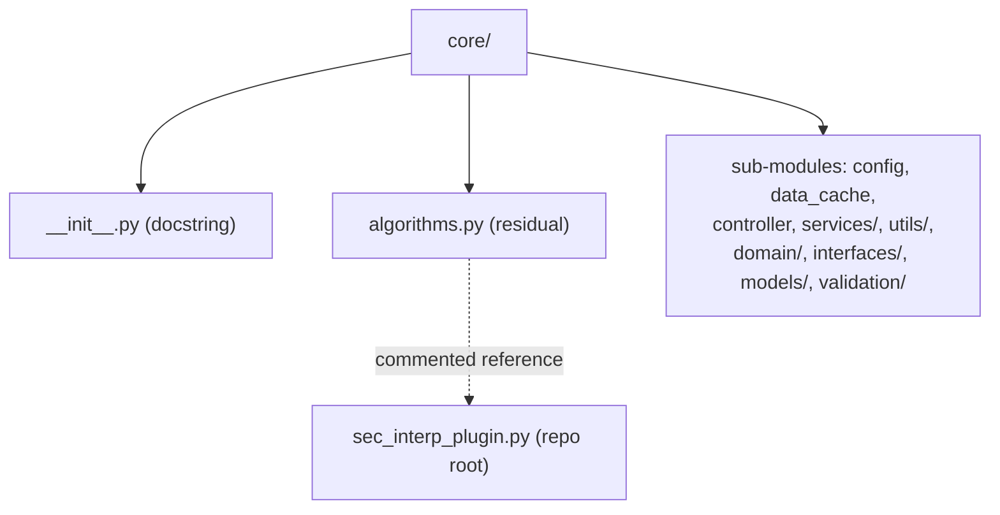

---
tags:
  - secinterp
  - code-walkthrough
  - core
  - general
aliases:
  - core/__init__.py
  - algorithms.py
  - core/
cssclass: secinterp-note
---

# `core/` — Root Package of the Core

> [!abstract] One-line summary
> Package `core/` (2 files): `__init__.py`, `algorithms.py` — SecInterp's **core root**: a docstring marking the QGIS-agnostic business layer and a reserved (residual) `algorithms.py` module for pure algorithms.

**Path**: `core/` (2 files, 20 lines)
**Main class/function**: *(none — organizational package)*
**Layer**: Core (QGIS-agnostic)
**Tags**: #secinterp #core #general

---

## 🎯 Why does this package exist?

`core/` is the **root container** of the plugin's entire business logic. Its `__init__.py`
declares the layer's purpose, and `algorithms.py` is a residual marker recalling the
historical separation between logic and UI.

| Problem | Solution |
|---------|----------|
| Declare where the business logic lives | `core/__init__.py` with a docstring |
| Separate the main plugin class from the UI | `algorithms.py` points to `sec_interp_plugin.py` |
| Mark the Core/GUI boundary | Docstring "business logic, algorithms, utilities" |
| Keep the UI from contaminating the core | QGIS-agnostic `core/` layer |

> [!important] Architectural note — root of the QGIS-agnostic layer
> `core/` is the layer that **must not** import QGIS (see `core/AGENTS.md`). Its
> `__init__.py` is deliberately minimal (docstring only): it does not re-export
> sub-modules, letting each consumer import the concrete module it needs.

---

## 🧬 Relationship diagram



> [!tip] How to read
> Solid = contains. The `core/` package contains `__init__.py`, `algorithms.py` and all the
> real sub-modules. `algorithms.py` only **references** (in a comment)
> `sec_interp_plugin.py`; it does not import it.

---

## 📦 Imports — architectural reading

```python
# core/__init__.py
from __future__ import annotations
"""Core module for SecInterp plugin.

Contains business logic, algorithms, and utilities.
"""

# core/algorithms.py
from __future__ import annotations

# The SecInterp class has been moved to sec_interp_plugin.py
# Import it from there if needed:
# from sec_interp.sec_interp_plugin import SecInterp
```

| # | Observation |
|---|-------------|
| ① | `__init__.py` imports only `annotations` (no re-exports or `__all__`). |
| ② | `algorithms.py` imports nothing functional: the `SecInterp` import is **commented out**. |
| ③ | Neither imports QGIS — the root layer is 100% agnostic. |

---

## 🏗️ Structure inventory

**Classes:** none in the two files of this note.

**Functions/Methods:** none.

**Constants:** none.

**Content:**
- `core/__init__.py` — package docstring (6 lines).
- `core/algorithms.py` — docstring + commented reference (14 lines).

---

## 📁 Files in the package

| File | Lines | Role |
|------|--:|---|
| [[#__init__.py|__init__.py]] | 6 | Root package docstring; no re-exports |
| [[#algorithms.py|algorithms.py]] | 14 | Residual marker; points to `sec_interp_plugin.py` |

> [!note] The real sub-modules have their own notes
> `config.py` ([[config]]), `data_cache.py` ([[data_cache]]), `controller.py`
> ([[controller]]), `services/` ([[core_services]]), `utils/` ([[core_utils]]), `domain/`
> ([[domain]]), `interfaces/` ([[core_interfaces]]), `models/` ([[core_models]]),
> `validation/` ([[core_validation]]). This note covers only the two root files.

---

## 📖 Walkthrough

### `__init__.py`

```python
from __future__ import annotations

"""Core module for SecInterp plugin.

Contains business logic, algorithms, and utilities.
"""
```

Documents the package's purpose in **one sentence**: it contains business logic,
algorithms and utilities. Stylistic note: the docstring appears **after** the
`from __future__ import annotations` (it is not a module docstring in the strict sense, but
a loose string literal after the import).

> [!warning] `from __future__` before the docstring
> Conventionally the module docstring must go **before** any import. Here it goes after
> `from __future__ import annotations`, so Python does not register it as the module's
> `__doc__`. It is a cosmetic detail without functional impact.

### `algorithms.py`

```python
"""Core algorithms module.

IMPORTANT: The main SecInterp plugin class has been moved to sec_interp_plugin.py
in the plugin root directory to separate UI/QGIS integration logic from core
business logic.

This module is reserved for pure business logic algorithms without UI dependencies.
"""

from __future__ import annotations

# The SecInterp class has been moved to sec_interp_plugin.py
# Import it from there if needed:
# from sec_interp.sec_interp_plugin import SecInterp
```

**Residual/marker** module: its docstring explains that the main `SecInterp` class was
moved to `sec_interp_plugin.py` (repo root) to separate UI/QGIS integration from business
logic. The real import is **commented out**, so `algorithms.py` executes and imports
nothing.

> [!important] Evidence of a historical refactor
> `algorithms.py` is a living "migration note": it reminds future developers that the
> `SecInterp` class no longer lives here. It is the result of a refactor that separated
> logic (core) from QGIS integration (plugin root).

---

## 🔄 Data flow

| Phase | Input | Transformation | Output |
|-------|-------|----------------|--------|
| (conceptual) | — | — | — |

> [!note] No data flow of its own
> The two root files process no data. The real flow lives in the sub-modules
> (`controller`, services, etc.), documented in their notes.

---

## 🏛️ Design patterns present

| Pattern | Where | Purpose |
|---------|-------|---------|
| **Package-by-layer** | `core/` | Group the entire business layer |
| **Package docstring** | `__init__.py` | Document the layer's purpose |
| **Migration marker** | `algorithms.py` | Record where the class was moved |

---

## 🧾 API summary

| Symbol | Signature / Inherits | Typical use |
|--------|----------------------|-------------|
| *(none)* | — | — |

> [!warning] No API in the root files
> `core/__init__.py` and `core/algorithms.py` **export nothing**. The core's real API is
> spread across the sub-modules (`ConfigService`, `DataCache`, services, etc.).

---

## 🛡️ Error handling

No executable code → no error handling. The only problematic scenario would be someone
uncommenting `from sec_interp.sec_interp_plugin import SecInterp` without that module
existing in the expected path, which would raise `ImportError`.

---

## 🧪 Associated tests

No specific tests for the root files. The **architectural boundary** they declare is tested:

- `tests/core/test_architecture_boundary.py` — verifies that `core/` does not import QGIS.

> [!note] The docstring as an implicit contract
> The phrase "Contains business logic, algorithms, and utilities" is the contract that the
> architecture test enforces: nothing UI/QGIS should enter this layer.

---

## 📐 Map of the core's sub-modules

Quick view of what each `core/` sub-package/module contains:

| Sub-module | Note | Main content |
|-----------|------|--------------|
| `config.py` | [[config]] | `ConfigService` (persistence) |
| `data_cache.py` | [[data_cache]] | `DataCache` (cache) |
| `controller.py` | [[controller]] | `ProfileController` (orchestrator) |
| `domain/` | [[domain]] | DTOs, entities, contexts |
| `interfaces/` | [[core_interfaces]] | Contracts (`I*Service`) |
| `models/` | [[core_models]] | `settings_model` (models) |
| `services/` | [[core_services]] | Business services |
| `utils/` | [[core_utils]] | Pure utilities |
| `validation/` | [[core_validation]] | Validators |

---

## 👀 Observations and notes

> [!success] Strengths
> - Minimal and clear root: docstring + residual marker only.
> - `algorithms.py` honestly documents the `SecInterp` refactor.
> - No re-exports in `__init__` (avoids coupling the layer).

> [!warning] Points of attention
> - `algorithms.py` is **dead code** (comments only): a candidate for removal.
> - The `__init__.py` docstring goes after `from __future__` (not registered as `__doc__`).
> - The phrase "algorithms and utilities" is somewhat vague: it does not enumerate the
>   sub-modules.

> [!question] Open questions
> - Remove `algorithms.py` (dead code) or turn it into a re-export of real algorithms?
> - Move the `__init__.py` docstring before `from __future__` to make it a valid module
>   docstring?

---

## 📐 Core layer rules (from `core/AGENTS.md`)

The `__init__.py` declares the layer; the nested `core/AGENTS.md` defines its **absolute
constraints**. This root package is the boundary where they apply:

| Rule (NEVER) | Reason |
|--------------|--------|
| `from qgis.core import *` | Keep the layer QGIS-agnostic |
| `from qgis.gui import *` | The GUI cannot enter the core |
| `QgsProject.instance()` | No QGIS global state |
| `iface.mapCanvas()` | `iface` belongs to the GUI |
| `import PyQt5 / PyQt6` | Stdlib only in the core |

> [!important] Documented exceptions
> `config.py` (`QgsSettings`) and `data_cache.py` (`QCoreApplication`) import QGIS in a
> **narrow, explicit** way (not `import *`). These are *gray areas* described in [[config]]
> and [[data_cache]]. The rest of the core must honor the rule 100%.

---

## 🧭 History of the refactor: `SecInterp` → `sec_interp_plugin.py`

`algorithms.py` is the **scar** of an important refactor:

1. **Before**: the main `SecInterp` class (mixing logic and UI) lived in `core/`.
2. **Refactor**: it was moved to `sec_interp_plugin.py` (repo root) to separate UI/QGIS
   integration from business logic.
3. **Now**: `algorithms.py` remains as a residual marker recalling the change and reserving
   the name for "pure algorithms".

> [!note] Why it was not deleted
> Removing `algorithms.py` is safe (it imports nothing), but the team left it as living
> documentation: any developer looking for the `SecInterp` class in `core/` finds the clue
> pointing to `sec_interp_plugin.py`.

---

## 📦 How `core` is imported in the real code

Consumers import concrete sub-modules of `core`, never `core` alone:

```python
from sec_interp.core.config import ConfigService
from sec_interp.core.data_cache import DataCache
from sec_interp.core.controller import ProfileController
from sec_interp.core.domain import GeologyContext
from sec_interp.core.models.settings_model import PluginSettings
```

> [!tip] `core` is not an import point
> There is no `from sec_interp.core import ConfigService` (the `__init__.py` re-exports
> nothing). The package is only a **hierarchical container**; each module is imported by its
> path.

---

## 🌐 i18n and migration notes

- **No user strings** in the root files: only English docstrings.
- **`algorithms.py` is a deletion candidate**: if removed, ensure nothing imports it (today
  nobody does).
- **`__init__.py` docstring**: because it goes after `from __future__`, it is not registered
  as `__doc__`; to expose it via `help(sec_interp.core)`, move it to the top.

---

## 📂 Core directory tree

Besides the two files of this note, the root package `core/` contains the entire business
layer. Structural view (modules, not lines):

```
core/
├── __init__.py              # package docstring (this note)
├── algorithms.py            # residual marker (this note)
├── config.py                # ConfigService
├── controller.py            # ProfileController
├── data_cache.py            # DataCache
├── exceptions.py            # error hierarchy
├── performance_metrics.py   # MetricsCollector
├── domain/                  # entities, DTOs, contexts
│   ├── __init__.py          # facade (__all__)
│   ├── dtos.py / entities.py / task_inputs.py
│   └── enums.py / spatial_meta.py
├── interfaces/              # contracts (I*Service)
├── models/                  # settings_model (namespace)
├── services/                # business services
├── utils/                   # pure utilities
└── validation/              # validators
```

> [!note] 8 root files + 6 sub-packages
> The core has 8 root modules (`__init__`, `algorithms`, `config`, `controller`,
> `data_cache`, `exceptions`, `performance_metrics`) and 6 sub-packages (`domain`,
> `interfaces`, `models`, `services`, `utils`, `validation`).

---

## 📐 How the core layer grows

A practical rule for deciding where to place a new module inside `core/`:

| If the module… | Location |
|----------------|----------|
| Defines business types (entities/DTOs/contexts) | `core/domain/` |
| Declares a contract (`I*Service`, `Protocol`, `ABC`) | `core/interfaces/` |
| Implements a business service | `core/services/` |
| Is a pure stateless utility | `core/utils/` |
| Validates inputs/layers/fields | `core/validation/` |
| Represents persistent state/models | `core/models/` |
| Is cross-cutting infrastructure (cache, config, errors) | root of `core/` |

> [!tip] The root is only for cross-cutting modules
> The root modules (`config`, `data_cache`, `exceptions`, `performance_metrics`) are
> **cross-cutting**: used by several sub-packages. The rest is grouped by responsibility into
> sub-packages. See [[project_structure]] for the full map.

---

## 🧭 Reference of the two root files

| File | Real content | Importance |
|------|--------------|------------|
| `__init__.py` | `from __future__ import annotations` + docstring | Declares the layer |
| `algorithms.py` | docstring + commented import | Migration marker |

> [!note] Both are "executable documentation"
> Neither contributes logic: `__init__` documents the layer's purpose and `algorithms.py`
> documents the `SecInterp` refactor. They are files of **intent**, not behavior.

---

## 🔗 Related notes

- [[Index]] — vault index
- [[config]] / [[data_cache]] / [[controller]] — root core modules
- [[domain]] / [[core_models]] — packages with other `__init__.py` conventions
- [[core_interfaces]] — core contracts
- [[core_services]] / [[core_utils]] / [[core_validation]] — rest of the sub-packages
- [[project_structure]] — full plugin map

---

*Note of the SecInterp Code Walkthrough v2 vault — v3.8.0*
