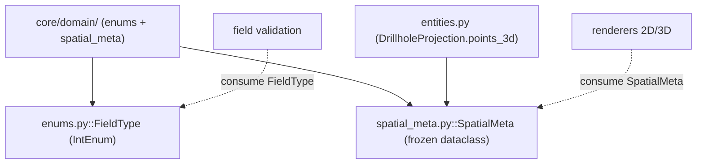

---
tags:
  - secinterp
  - code-walkthrough
  - core
  - domain
aliases:
  - core/domain/
  - enums.py
  - spatial_meta.py
  - FieldType
  - SpatialMeta
cssclass: secinterp-note
---

# `core/domain/` — Enums and Spatial Metadata

> [!abstract] One-line summary
> Package `core/domain/` (2 files): `enums`, `spatial_meta` — the domain's **auxiliary types** that are neither entities nor DTOs: `FieldType` (a PyQt-free field type enum) and `SpatialMeta` (spatial metadata bridging 2D and 3D).

**Path**: `core/domain/` (2 files, 70 lines)
**Main class/function**: `FieldType`, `SpatialMeta`
**Layer**: Core (QGIS-agnostic)
**Tags**: #secinterp #core #domain

---

## 🎯 Why does this package exist?

The `core/domain/` domain has two large groups: the **business data** (entities, DTOs,
contexts — already documented) and the **auxiliary types** that support them. This note
covers that second group:

| Problem | Solution |
|---------|----------|
| Validate field types without depending on `QVariant`/PyQt | `FieldType` (`IntEnum` mirroring `QVariant.Type`) |
| Carry 2D and 3D coordinates without QGIS objects | `SpatialMeta` (`frozen` dataclass) |
| Bridge between 2D profile and 3D engines | `SpatialMeta.to_vec3` / `to_vec2_profile` |
| Normalize orientation vectors without layers | `norm_x` / `norm_y` in `SpatialMeta` |

> [!important] Architectural note — QGIS-agnostic by design
> `FieldType` replicates the **numeric values** of `QVariant.Type` (from PyQt) as its own
> constants, to validate types without importing PyQt. `SpatialMeta` carries coordinates
> and normalized vectors as primitives. Neither imports QGIS.

---

## 🧬 Relationship diagram



> [!tip] How to read
> Solid = imports; dashed = consumes. `SpatialMeta` is imported by `entities.py`
> (`DrillholeProjection.points_3d`) and consumed by the renderers. `FieldType` is consumed
> by the field validators.

---

## 📦 Imports — architectural reading

```python
# core/domain/enums.py
from __future__ import annotations
from enum import IntEnum

# core/domain/spatial_meta.py
from __future__ import annotations
from dataclasses import dataclass
from typing import Any
```

| # | Observation |
|---|-------------|
| ① | `enums.py` uses `IntEnum` (members are `int`, comparable with `QVariant`). |
| ② | `spatial_meta.py` uses `dataclass(frozen=True)` — immutability for the DTO. |
| ③ | **Zero QGIS imports**: stdlib only (`enum`, `dataclasses`, `typing`). |

---

## 🏗️ Structure inventory

**Classes:**
- `class FieldType(IntEnum)` — 8 members
- `class SpatialMeta` — `frozen` dataclass, 2 methods

**`FieldType` members:** `NULL`, `BOOL`, `INT`, `DOUBLE`, `STRING`, `LONG_LONG`,
`DATE`, `DATE_TIME`

**`SpatialMeta` methods:** `to_vec3()`, `to_vec2_profile()`

---

## 📁 Files in the package

| File | Lines | Role |
|------|--:|---|
| [[#FieldType\|enums.py]] | 22 | `FieldType` — PyQt-free field type enum |
| [[#SpatialMeta\|spatial_meta.py]] | 48 | `SpatialMeta` — 2D/3D spatial metadata |

> [!note] Package modules with their own notes
> `dtos.py`, `entities.py`, `task_inputs.py` and `__init__.py` have individual notes:
> [[dtos]], [[entities]], [[task_inputs]], [[domain]]. This note covers only the remaining
> group (`enums` + `spatial_meta`).

---

## 📖 Class-by-class walkthrough

### FieldType

```python
class FieldType(IntEnum):
    NULL = 0
    BOOL = 1
    INT = 2
    DOUBLE = 6
    STRING = 10
    LONG_LONG = 4
    DATE = 14
    DATE_TIME = 16
```

Enum of **field types** with the same numeric values as PyQt's `QVariant.Type`, but without
importing PyQt. It lets the core validate a field's type (e.g. whether a field is `INT` or
`STRING`) while staying agnostic.

| Member | Value | `QVariant` equivalent |
|--------|------:|-----------------------|
| `NULL` | 0 | `QVariant.Invalid` |
| `BOOL` | 1 | `QVariant.Bool` |
| `INT` | 2 | `QVariant.Int` |
| `LONG_LONG` | 4 | `QVariant.LongLong` |
| `DOUBLE` | 6 | `QVariant.Double` |
| `STRING` | 10 | `QVariant.String` |
| `DATE` | 14 | `QVariant.Date` |
| `DATE_TIME` | 16 | `QVariant.DateTime` |

> [!note] Non-contiguous values
> The values jump (`2 → 4 → 6 → 10`) because they replicate **exactly** the `QVariant.Type`
> codes. They are not an arbitrary sequence: they are a core-safe mapping table to PyQt.

### SpatialMeta

```python
@dataclass(frozen=True)
class SpatialMeta:
    hole_id: str | None = None
    dist_along: float = 0.0
    offset: float = 0.0
    z: float = 0.0
    x_3d: float | None = None
    y_3d: float | None = None
    x_proj: float | None = None
    y_proj: float | None = None
    norm_x: float | None = None
    norm_y: float | None = None
    attributes: dict[str, Any] | None = None

    def to_vec3(self) -> tuple[float, float, float]:
        return (self.x_3d or 0.0, self.y_3d or 0.0, self.z)

    def to_vec2_profile(self) -> tuple[float, float]:
        return (self.dist_along, self.z)
```

**Immutable** DTO (`frozen=True`) acting as a bridge between the global 3D space and the
2D profile. It carries coordinates, normalized orientation vectors and original attributes.

| Field | Meaning |
|-------|---------|
| `hole_id` | drillhole identifier |
| `dist_along` | distance along the section line (station) |
| `offset` | orthogonal distance from the section line |
| `z` | elevation / vertical coordinate |
| `x_3d` / `y_3d` | global 3D coordinates |
| `x_proj` / `y_proj` | projection onto the section |
| `norm_x` / `norm_y` | normalized orientation vector components |
| `attributes` | original feature attributes |

> [!tip] `frozen=True` makes it hashable
> Being immutable, `SpatialMeta` can be used as a dict key or in a `set`, with no risk of
> accidental mutation in a thread.

### `SpatialMeta.to_vec3()`

```python
def to_vec3(self) -> tuple[float, float, float]:
    return (self.x_3d or 0.0, self.y_3d or 0.0, self.z)
```

Converts to a 3D vector `(X, Y, Z)`. The `or 0.0` normalizes `None` in `x_3d`/`y_3d` to
zero (a point without global coordinates falls at the XY origin, keeping its Z).

### `SpatialMeta.to_vec2_profile()`

```python
def to_vec2_profile(self) -> tuple[float, float]:
    return (self.dist_along, self.z)
```

Converts to a profile vector `(distance, elevation)`. It is the 2D view used by the profile
renderers, ignoring global coordinates and offset.

---

## 🔄 Data flow

| Phase | Input | Transformation | Output |
|-------|-------|----------------|--------|
| Field validation | a layer's field type | comparison with `FieldType` | compatibility decision |
| 3D projection | point along the drillhole | `SpatialMeta` + `to_vec3` | `(x, y, z)` |
| 2D render | `SpatialMeta` | `to_vec2_profile` | `(dist, elev)` |

---

## 🏛️ Design patterns present

| Pattern | Where | Purpose |
|---------|-------|---------|
| **Value Object** | `SpatialMeta` (`frozen`) | Immutable DTO with helpers |
| **Type Enum** | `FieldType` | Field types as constants |
| **Anti-corruption layer** | `FieldType` mirrors `QVariant` | Avoid a PyQt dependency |
| **Convenience methods** | `to_vec3` / `to_vec2_profile` | Space conversion without duplicating logic |

---

## 🧾 API summary

| Symbol | Signature / Inherits | Typical use |
|--------|----------------------|-------------|
| `FieldType` | `IntEnum` | Validate field types |
| `FieldType.STRING` / `INT` / `DOUBLE` | member (`int`) | Comparison with layer types |
| `SpatialMeta` | `frozen` dataclass | 2D/3D spatial metadata |
| `SpatialMeta.to_vec3` | `() -> (float, float, float)` | Global 3D vector |
| `SpatialMeta.to_vec2_profile` | `() -> (float, float)` | 2D profile vector |

---

## 🛡️ Error handling

No own error handling: both are data types. `SpatialMeta.to_vec3()` resolves `None` with
`or 0.0` (never raises). `FieldType` does not validate by itself; validators compare
against its members.

---

## 🧪 Associated tests

No dedicated unit tests for `enums.py`/`spatial_meta.py` as separate files; they are
covered indirectly:

- `tests/core/test_entities.py` — `DrillholeProjection.points_3d: list[SpatialMeta]`.
- `tests/core/test_field_validator.py` — uses `FieldType` (field validation).

> [!note] Implicit coverage
> Being simple types, real coverage comes from their consumers. A direct test of
> `to_vec3`/`to_vec2_profile` would be trivial and cheap, but does not exist today.

---

## 👀 Observations and notes

> [!success] Strengths
> - `FieldType` mirrors `QVariant.Type` without importing PyQt: agnostic type validation.
> - `SpatialMeta` immutable (`frozen`) with space-conversion helpers.
> - Zero QGIS dependencies.

> [!warning] Points of attention
> - `FieldType` **duplicates** `QVariant.Type` values by hand: if PyQt changes the codes,
>   they must be updated (desynchronization risk).
> - `SpatialMeta` mixes global (`x_3d`) and profile (`dist_along`) coordinates: one DTO
>   with two coordinate systems.
> - Non-contiguous `FieldType` values can look like a bug without knowing their origin.

> [!question] Open questions
> - Generate `FieldType` from `QVariant` dynamically in a GUI module and map to a core-safe
>   enum?
> - Split `SpatialMeta` into `ProfileMeta` (2D) and `WorldMeta` (3D)?

---

## 🔢 Usage example

```python
from sec_interp.core.domain import FieldType, SpatialMeta

# FieldType: validate that a field is numeric (without importing PyQt)
if field_type == FieldType.INT or field_type == FieldType.DOUBLE:
    sample_as_number(field)
elif field_type == FieldType.STRING:
    sample_as_text(field)

# SpatialMeta: a point along a drillhole, ready for 2D and 3D
meta = SpatialMeta(
    hole_id="DH-01",
    dist_along=15.5,
    offset=2.0,
    z=104.2,
    x_3d=500015.5,
    y_3d=4000002.0,
    norm_x=0.707,
    norm_y=0.707,
)

vec3d = meta.to_vec3()           # -> (500015.5, 4000002.0, 104.2)
vec2d = meta.to_vec2_profile()   # -> (15.5, 104.2)
```

> [!tip] One `SpatialMeta` serves two renderers
> A 3D renderer calls `to_vec3()`, a 2D profile renderer calls `to_vec2_profile()`. A single
> DTO decouples both engines from the original layers.

---

## 📐 Auxiliary types vs domain entities

`core/domain/` mixes three categories of types. This note covers only the **auxiliary** ones:

| Category | Files | Examples | Note |
|----------|-------|----------|------|
| Business entities | `entities.py` | `GeologySegment`, `StructureMeasurement` | [[entities]] |
| Transport DTOs | `dtos.py`, `task_inputs.py` | `PreviewParams`, `GeologyContext` | [[dtos]], [[task_inputs]] |
| **Auxiliary types** | `enums.py`, `spatial_meta.py` | `FieldType`, `SpatialMeta` | this note |

> [!note] Why auxiliary and not entities
> Neither `FieldType` nor `SpatialMeta` represents a geological result *per se*: one is a
> field-type table, the other a carrier of coordinates/vectors. They **support** entities and
> validation, hence grouped separately.

---

## 📐 `FieldType` → usage scenario

| Member | Typical scenario |
|--------|------------------|
| `NULL` | Empty / unrecognized field |
| `BOOL` | Flags (e.g. `dh_use_geom`) |
| `INT` / `LONG_LONG` | Identifiers, counters |
| `DOUBLE` | Coordinates, continuous measures |
| `STRING` | Unit names, codes |
| `DATE` / `DATE_TIME` | Measurement timestamps |

> [!tip] The core validates without knowing `QVariant`
> Thanks to this table, a core validator can say "this field must be numeric" by comparing
> against `FieldType.INT`/`DOUBLE`, without importing PyQt. The `QVariant → FieldType`
> mapping happens in the GUI layer.

---

## 🌐 i18n and migration notes

- **No user strings**: both types are data; no messages to translate.
- **Desynchronization risk**: `FieldType` manually replicates the `QVariant.Type` codes. Any
  PyQt/QGIS update that changes those codes requires updating this table by hand.
- **Immutability**: `SpatialMeta(frozen=True)` cannot be mutated after construction; if a
  flow needs to update a coordinate, it must create a new instance.

---

## 🔬 Why `IntEnum` and not `Enum`?

`FieldType` inherits from `IntEnum`, not `Enum`. The difference matters:

| Aspect | `Enum` | `IntEnum` |
|--------|--------|-----------|
| Comparison with `int` | No (`FieldType.INT != 2`) | Yes (`FieldType.INT == 2`) |
| Interchange with PyQt | No | Yes (comparable with `QVariant.Type`) |
| Serialization | Name | Integer |

> [!tip] `IntEnum` allows comparing with `QVariant.Type` without importing it
> Since `QVariant.Type` is also a PyQt `IntEnum`, both share the `int` base and are
> comparable by value. The core can do `field_type == FieldType.INT` without knowing the real
> PyQt type, because the GUI performs the `QVariant.Type.INT → FieldType.INT` mapping.

---

## 📐 Complete field reference of `SpatialMeta`

| Field | Type | Default | Role |
|-------|------|---------|------|
| `hole_id` | `str \| None` | `None` | drillhole identifier |
| `dist_along` | `float` | `0.0` | distance along the section |
| `offset` | `float` | `0.0` | orthogonal distance from the section |
| `z` | `float` | `0.0` | elevation / vertical coordinate |
| `x_3d` | `float \| None` | `None` | global X coordinate |
| `y_3d` | `float \| None` | `None` | global Y coordinate |
| `x_proj` | `float \| None` | `None` | X projection onto the section |
| `y_proj` | `float \| None` | `None` | Y projection onto the section |
| `norm_x` | `float \| None` | `None` | normalized X component |
| `norm_y` | `float \| None` | `None` | normalized Y component |
| `attributes` | `dict[str, Any] \| None` | `None` | original attributes |

> [!note] Two coordinate pairs + one vector pair
> `SpatialMeta` carries **four** related systems: global (`x_3d`/`y_3d`), projected
> (`x_proj`/`y_proj`), profile (`dist_along`/`z`) and the normalized orientation vector
> (`norm_x`/`norm_y`). That is why it bridges 2D and 3D.

---

## 🔗 Related notes

- [[Index]] — vault index
- [[entities]] — `DrillholeProjection` uses `list[SpatialMeta]`
- [[domain]] — package facade that re-exports `FieldType` and `SpatialMeta`
- [[task_inputs]] — contexts that travel alongside these metadata
- [[dtos]] — `PreviewResult`/`PreviewParams`
- [[field_validator]] — validator that uses `FieldType`

---

*Note of the SecInterp Code Walkthrough v2 vault — v3.9.0*
